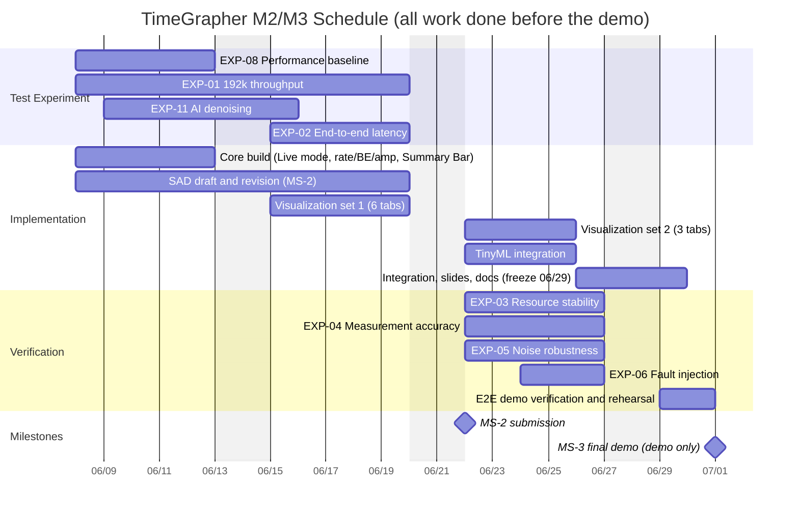

# TimeGrapher Sprint Plan 

## Sprint Calendar

| Sprint | Week | Duration | Purpose | Linked Milestone |
|---|---|---|---|---|
| Sprint 0 | Week 1 | 05/25–06/05 | Inception — requirements, risk, experiments, architecture draft | MS-1 submitted (06/09) |
| Sprint 1 | Week 2 | 06/08–06/12 | Core build — capture, detection, measurement, basic display | MS-2 preparation |
| Sprint 2 | Week 3 | 06/15–06/19 | Visualization expansion | **MS-2 submission (06/22)** |
| Sprint 3 | Week 4 | 06/22–06/26 | Visualization expansion + AI feature | MS-3 preparation |
| Sprint 4 | Week 5 | 06/29–07/01 | Integration, rehearsal, docs | **MS-3 demo (07/01)** |

## Gantt Chart

## 1. Test Experiment

Exploratory spikes that retire risk before/while building.

| Item | Duration | Sprint | Owner | Traceability (FR / QA / RISK) |
|---|---|---|---|---|
| EXP-08 Performance baseline measurement | 06/08–06/12 | S1 | Jinseok Choi, Taehoon Lee (App Eng) | QA-PERF-02 |
| EXP-01 192k throughput (48k/96k/192k capture stability) | 06/08–06/19 | S1–S2 | Jinseok Choi, Taehoon Lee (App Eng) | FR-CP-6 · QA-PERF-01 · QA-AVAIL-01 · CON-OP-01 · RISK-01 |
| EXP-11 AI denoising (auto-generated noisy–clean pairs) | 06/09–06/15 | S1–S2 | Jongjin Park (AI) | FR-AI-1 · QA-REL-02 · RISK-05 |
| EXP-02 End-to-end latency (12 tabs, peak load) | 06/15–06/19 | S2 | Jinseok Choi (App Eng), Jungchul Yoon (DSP) | FR-MSB-1 · QA-PERF-02 · RISK-02 · CON-HW-01/02 |

## 2. Implementation

Sprint backlog items.

| Item | Duration | Sprint | Owner | Traceability (FR / QA / verifying EXP) |
|---|---|---|---|---|
| Core build: Live mode, rate/BE/amplitude computation, Summary Bar | 06/08–06/12 | S1 | Jungchul Yoon, Sangjae Nam (DSP); Jinseok Choi, Taehoon Lee (App Eng) | FR-MSB-1 · FR-CP-4/6/11 · CON-RF-02 → QA-REL-01 · QA-PERF-01/02 · QA-MOD-02 (verified by EXP-04, EXP-08) |
| SAD draft → revision (MS-2 submission 06/22) | 06/08–06/19 | S1–S2 | Sangjae Nam (PO), Taehoon Lee (SM); all review | QA-MOD-01 · QA-PORT-01 · full driver→tactic mapping (MS-2: module / C&C / deployment views) |
| Visualization set 1: Trace · Vario · Sequence · Scope 1/2 · Beat Error · Long-Term | 06/15–06/19 | S2 | Jaehong Kim, Jinyoung Cho (Graph UI) | FR-TD · FR-RAS · FR-MPS · FR-BNS · FR-BED · FR-LTP → QA-MOD-01 · QA-PERF-01 (verified by EXP-02, EXP-03) |
| Visualization set 2: Waveform Compare · Sync Sweep · F0–F3 Filter | 06/22–06/25 | S3 | Jaehong Kim, Jinyoung Cho (Graph UI) | FR-WCD · FR-SMS · FR-SFM → QA-MOD-01 (verified by EXP-03) |
| TinyML integration (signal-quality improvement, anomaly detection) | 06/22–06/25 | S3 | Jongjin Park (AI) | FR-AI-1 → QA-REL-02 (enabled by EXP-10 done, EXP-11) |
| Integration, presentation slides, final docs — **code freeze 06/29** | 06/26–06/29 | S3–S4 | All (lead: Taehoon Lee, SM) | FR-SYS-1 and full integration → MS-3 deliverables |

## 3. Verification

Confirms the implemented system meets QA response measures.

| Item | Duration | Sprint | Owner | Traceability (FR / QA / RISK) |
|---|---|---|---|---|
| EXP-03 Resource stability (30-min tab cycling, memory ≤ +200 MB) | 06/22–06/26 | S3 | Jinseok Choi (App Eng) | FR-CP-11 · QA-AVAIL-01 · RISK-01/02 |
| EXP-04 Measurement accuracy (1,000 ground-truth blocks) | 06/22–06/26 | S3 | Jungchul Yoon, Sangjae Nam (DSP) | FR-MSB-1 · FR-CP-4 · QA-REL-01 · CON-RF-02 |
| EXP-05 Noise robustness | 06/22–06/26 | S3 | Jungchul Yoon (DSP), Jongjin Park (AI) | FR-SPT-5 · QA-REL-02 · RISK-04 |
| EXP-06 Fault injection (mic disconnect, signal loss) | 06/24–06/26 | S3 | Jinseok Choi, Taehoon Lee (App Eng) | FR-SYS-1 · QA-SAFE-01 · CON-OP-01 |
| E2E demo verification and rehearsal (Pi 5, done by 06/30) | 06/29–06/30 | S4 | All | MS-3 demo criteria — QA-PERF / REL / SAFE evidence |
| **MS-3 demo — demo only, no work** | **07/01** | S4 | All | — |

## Schedule Adjustments vs. M1 Document

The following items were pulled in so that nothing runs into the demo day (needs team/mentor agreement):

| Item | M1 document | Adjusted |
|---|---|---|
| Visualization set 2, TinyML integration | 06/22–06/26 | 06/22–06/25 |
| Integration & docs | 06/29–07/01 | 06/26–06/29 (code freeze 06/29) |
| EXP-06 Fault injection | 06/24–07/01 | 06/24–06/26 |
| E2E verification / rehearsal | 06/29–07/01 | 06/29–06/30 |

## Notes

- QA-REL-03 (automatic position detection): EXP-12 confirmed the hardware sends no position data over USB → fallback to **manual position selection in the GUI**, included in the visualization work (S2–S3).
- Owner assignments are proposals derived from the M1 role table; adjust after team agreement.
