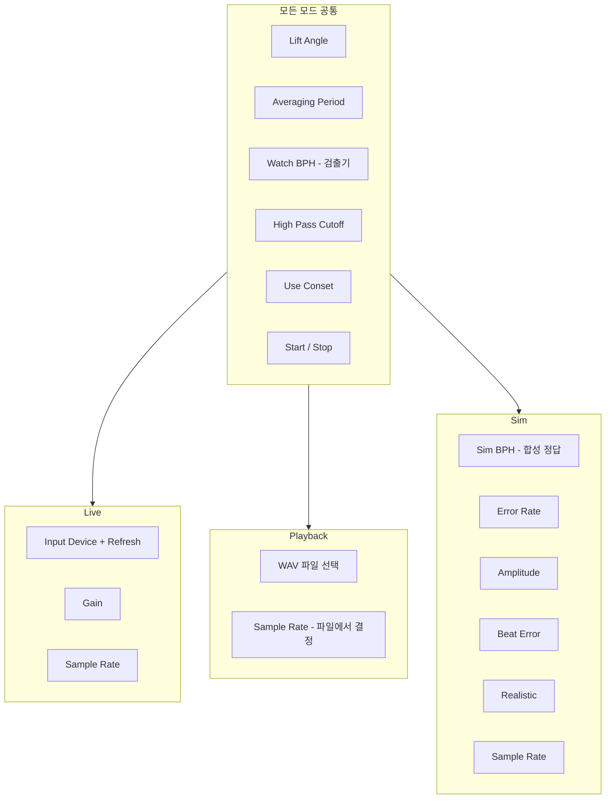

# TimeGrapher 왼쪽 패널 UX 재조합 — Draft 1

> **목적:** 앱 실행 시 화면 왼쪽에 보이는 제어 패널을 Live / Playback / Sim 모드 중심으로 재구성하기 위한 분석 및 제안  
> **대상 코드:** `src/ui/MainWindow.ui`, `src/ui/MainWindow.cpp`  
> **작성:** UX draft (구현 전 검토용)

---

## 1. 현재 왼쪽 패널 구조

`MainWindow.ui` 기준으로 왼쪽(242px)에는 **4개 프레임이 항상 세로로 쌓여** 있다.

| 프레임 | 위젯 | 실제 역할 |
|--------|------|-----------|
| **Run Parameters** | Mode, Gain, Input Device, Sample Rate, Averaging, Start/Stop | 소스 선택 + 실행 |
| **Watch Parameters** | BPH (Auto/수동), Lift Angle | **검출기/측정 엔진** 설정 |
| **Simulation Parameters** | BPH, Error Rate, Amplitude, Beat Error, Realistic | **합성기 ground truth** (Sim 전용) |
| **Misc. Parameters** | High Pass Cutoff, C Event Use Onset Amplitude | **고급 검출기** 튜닝 |

코드상 모드 분기는 `LiveStart` / `PlaybackStart` / `SimStart`로 이미 잘 나뉘어 있지만, **UI는 모드와 무관하게 전부 노출**된다. `on_ModeComboBox_currentTextChanged`에서 Sample Rate만 Playback일 때 비활성화하는 정도다.

```cpp
// MainWindow.cpp — 모드 전환 시 부분적 UI 반응만 존재
void MainWindow::on_ModeComboBox_currentTextChanged(const QString &arg1)
{
    if (arg1 != ModeStrings[LIVE])
        SetAudioDevice(PLAYBACK_OR_SIM_PCM);
    if (arg1 == ModeStrings[PLAYBACK])
        ui->SampleRatesComboBox->setEnabled(false);
    else
        ui->SampleRatesComboBox->setEnabled(true);
    // Live일 때 마이크 장치 자동 선택 ...
}
```

### 현재 레이아웃 특성

- `.ui` 파일이 **absolute geometry** (고정 좌표) 기반이라 반응형이 아님
- 패널 너비 242px, 4개 프레임 합계 높이 ~714px
- 모드별 show/hide 로직 **없음** — SimFrame이 Live/Playback에서도 항상 표시됨

---

## 2. 모드별로 실제로 쓰이는 항목

### 2.1 데이터 흐름 개요



### 2.2 모드 × 파라미터 매트릭스

| 항목 | Live | Playback | Sim | 비고 |
|------|:----:|:--------:|:---:|------|
| Input Device / Refresh | ● | ✗ | ✗ | Playback/Sim은 가상 `"Playback/Sim"` 장치 |
| Gain | ● | ✗ | ✗ | Live만 `startLive(..., gain)` |
| Sample Rate | ● | △ | ● | Playback은 WAV 헤더로 고정, UI 비활성 |
| Sim 파라미터 5개 | ✗ | ✗ | ● | `SimConfigBuilder`로 합성 |
| Watch BPH | ● | ● | ● | 검출기 힌트 (`pushCaptureConfig`) |
| Lift Angle | ● | ● | ● | Sim도 `SimConfigParams.liftAngleDeg`에 사용 |
| Averaging / Misc | ● | ● | ● | 세션 공통 |

### 2.3 BPH 이중 설정 — 혼란 포인트

BPH 컨트롤이 두 군데 있다.

| 위치 | 의미 | 사용처 |
|------|------|--------|
| **Watch BPH** (`BPHComboBox`) | 검출기가 “이 시계가 몇 bph일 것 같다”고 가정 | `pushCaptureConfig` → `setDetectorConfig` |
| **Sim BPH** (`SimBPHComboBox`) | 합성기가 실제로 만드는 tick rate (ground truth) | `SimStart` → `SimConfigBuilder::build` |

Sim 모드에서 둘을 따로 두면 **ground truth와 검출기 설정이 어긋날 수** 있다. 현재는 사용자가 수동으로 맞춰야 한다.

참고: `ManualAutoBPH`와 `SimBPH` 배열 내용이 동일하다 (`MainWindow.cpp`).

---

## 3. 제안: Live / Playback / Sim 중심 재조합

**Mode를 패널 최상단 1차 선택**으로 두고, 아래는 `QStackedWidget`(또는 탭/세그먼트 버튼)으로 **모드별 소스 설정만 바꾸는** 구조를 권장한다.

### 3.1 제안 레이아웃 (와이어프레임)

```
┌─────────────────────────┐
│  [ Live | Playback | Sim ]   ← 1차: 소스 모드 (세그먼트/탭)
├─────────────────────────┤
│  ▼ 모드별 영역 (QStackedWidget) │
│  Live:     Device, Refresh, Gain, Sample Rate
│  Playback: [Browse WAV...], 선택 파일명, 포맷 안내
│  Sim:      BPH, Rate, Amplitude, Beat Error, Realistic
├─────────────────────────┤
│  ▼ Measurement (공통)        │
│  Lift Angle, Averaging Period
│  BPH hint (Auto/수동)       ← Live/Playback; Sim은 3.2 참고
├─────────────────────────┤
│  ▼ Advanced ▸ (접힘)         │
│  High Pass Cutoff, Use Conset
├─────────────────────────┤
│  [ Start ]    [ Stop ]       ← 항상 하단 고정
└─────────────────────────┘
```

### 3.2 모드별 UX 원칙

#### Live

- 마이크·Gain·Sample Rate만 표시
- SimFrame 전체 숨김
- “실측” 워크플로에 집중

#### Playback

- 파일 선택 UI를 **Start 전에** 패널에 노출 (Browse + 경로/레이트 표시)
- Gain, Device, Sim 파라미터 숨김
- Sample Rate는 읽기 전용 표시 (예: “48 kHz — from file”)
- Start = 파일 미선택 시 Browse 먼저 (현재는 Start 클릭 시 다이얼로그)

#### Sim

- Sim 파라미터만 상단 stack에 표시
- **BPH 중복 제거 권장:** Sim BPH 하나만 두고, 검출기 BPH는 자동으로 동일 값(또는 Auto) 설정
- Lift Angle은 Sim에도 필요 → 공통 Measurement 섹션에 유지
- Gain / Device 숨김

#### 공통 (Measurement)

- Lift Angle, Averaging — 세 모드 모두 `pushCaptureConfig` / `setEngineParams`에 사용
- Watch BPH — Live/Playback에서는 라벨을 **“Detector BPH hint”** 등으로 명확화
- Sim에서는 Sim BPH와 연동하거나 Advanced로 내림

#### Advanced (접힘, 기본 collapsed)

- High Pass Cutoff, Use Conset — 초보 사용자에게는 숨기고 전문가용으로
- “Misc. Parameters”보다 **“Detector tuning”** 등 의미가 분명한 제목 권장

---

## 4. 왜 모드 중심이 맞는지

1. **코드 구조와 일치** — 시작/정지·장치 전환이 이미 모드별로 분리되어 있음
2. **인지 부하 감소** — Live 사용 시 Sim BPH/Realistic이 보이면 “지금 무엇을 설정하는가?” 혼란
3. **실수 방지** — Playback에서 Gain 조절, Sim에서 마이크 선택 등 무의미한 조작 제거
4. **패널 높이 축소** — SimFrame(~181px) + Misc(~181px)를 모드/접기로 줄이면 그래프 영역 확보

현재 mental model: **기능별 4블록** (실행 / 시계 / 시뮬 / 기타)  
목표 mental model: **“어떤 소스로 측정?” → “측정 설정” → “고급”**

---

## 5. 구현 로드맵 (우선순위)

| 우선순위 | 작업 | 난이도 | 효과 |
|----------|------|--------|------|
| **1** | `on_ModeComboBox_currentTextChanged`에서 프레임/위젯 `setVisible` + `QStackedWidget` | 낮음 | 즉시 체감 UX 개선 |
| **2** | Mode Combo → **QTabBar / QButtonGroup** (시각적 1차 선택) | 중간 | 모드 정체성 강화 |
| **3** | `.ui` absolute geometry → **QVBoxLayout + QScrollArea** | 중간 | 반응형·유지보수 |
| **4** | 왼쪽 패널을 `ControlPanelWidget` 등 별도 클래스로 분리 | 중간 | MainWindow 슬림화 |
| **5** | Sim BPH ↔ Detector BPH 자동 연동 | 낮음 | Sim 모드 설정 오류 감소 |

**Quick win:** (1) visibility만 적용해도 체감이 크다. 장기적으로는 layout 마이그레이션이 바람직하다.

---

## 6. 추가 고려 사항

### 6.1 Playback 파일 UX

- 현재: Start 클릭 시 `QFileDialog` → 파일 선택 후 재생
- 제안: 패널에 Browse + 선택 파일 경로/샘플레이트 표시 → Start는 “이미 선택된 파일로 실행”

### 6.2 Record Session 다이얼로그

- 세 모드 공통으로 Start 전 `RecordSessionCheck()` (Yes/No/Cancel)
- 패널에 “Record session” 체크박스 + 출력 경로를 두면 Start 흐름 단순화 가능 (별도 draft 검토)

### 6.3 Results readout

- 상단 `Results` 라벨 (RATE / AMPLITUDE / BEAT ERROR)은 패널과 분리되어 있음
- Sim 모드에서는 ground truth vs measured 비교 readout 추가 가치 있음 (`CaptureController` G-1 perf 비교 흐름과 연계 가능)

### 6.4 BPH 데이터 소스 통합

- `ManualAutoBPH[]`와 `SimBPH[]`가 동일 — UI 재조합 시 공통 상수/로더 하나로 통합 가능

---

## 7. 정리

| 구분 | 현재 | 제안 |
|------|------|------|
| 1차 구조 | 기능별 4 프레임 항상 표시 | **Live / Playback / Sim** 1차 선택 + stacked 소스 설정 |
| 공통 설정 | Watch + Misc에 분산 | **Measurement** + **Advanced(접힘)** 로 재그룹 |
| Sim BPH | Watch BPH와 별도 | **단일 BPH + 검출기 자동 연동** 검토 |
| 레이아웃 | Fixed geometry | Layout + (선택) scroll / 별도 widget 클래스 |

**결론:** Live / Playback / Sim을 패널의 1차 축으로 두는 방향이 코드 구조·사용자 mental model 모두에 부합한다.

---

## 8. 다음 단계 (선택)

- [ ] Draft 1 리뷰 후 와이어프레임을 Qt Designer layout 기준으로 구체화
- [ ] 1단계: 모드별 show/hide 패치 (최소 diff)
- [ ] Playback Browse UI 및 Sim BPH 연동 설계 상세화
- [ ] `ControlPanelWidget` 분리 및 `MainWindow` 리팩터링 범위 확정
