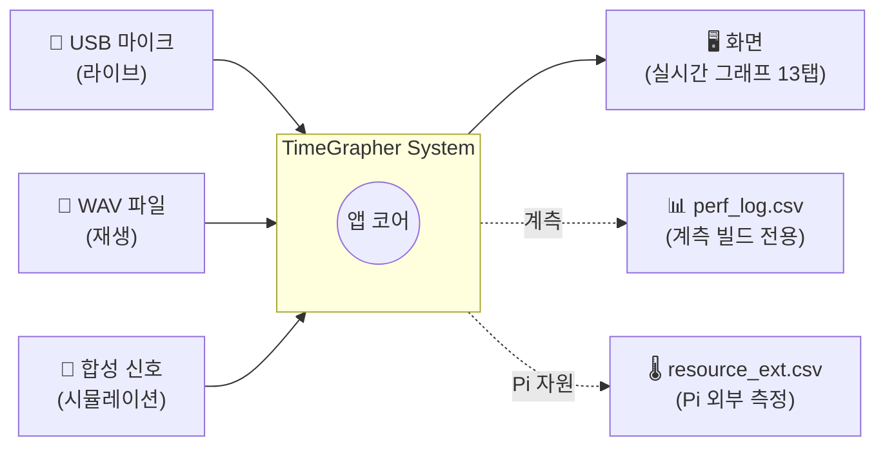
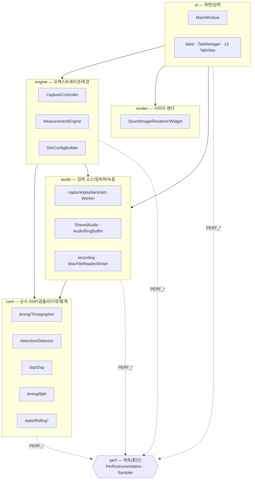
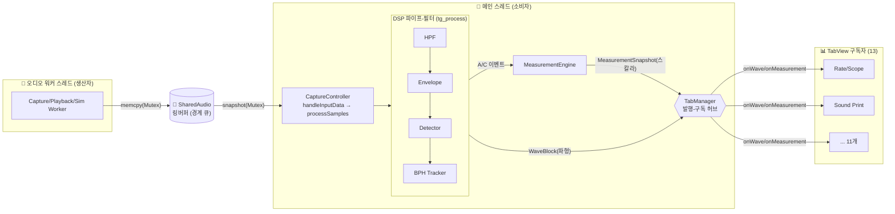

# TimeGrapher — 소프트웨어 아키텍처

> 기계식 시계의 똑딱 소리를 마이크로 듣고, 진폭·보율(rate)·비트 오차(beat error)를
> 실시간으로 측정·그래프로 보여 주는 Qt6/C++ 데스크톱 앱.
> Windows / Raspberry Pi(Linux) / macOS 에서 동작한다.

이 문서는 **무엇을 왜 재구조화했는지**와 **현재 구조(Context / Module / C&C 뷰)**,
그리고 **적용한 아키텍처 패턴·전술과 그 이유**를 설명한다.

관련 문서: [신호→그래프 흐름](SIGNAL_FLOW.md) · [성능 측정](PERFORMANCE.md) · [문서 인덱스](README.md)

---

## 1. 왜 재구조화했나 (AS-IS 문제)

재구조화 이전(`main` 브랜치)에는 `MainWindow` 한 클래스가 사실상 모든 일을 떠안고 있었다.

- UI 위젯 관리 (화면)
- 오디오 워커 스레드 생성·제어 (캡처/재생/시뮬레이션)
- 신호 처리 파이프라인 (`ProcessSamples`, `HandleInputData`)
- 측정 계산 (보율/비트오차/진폭 — `T*Events` 구조체)
- 성능 계측, WAV 파일 파싱, 시뮬레이션 설정 조립 …

그 결과 **단일 책임 원칙(SRP) 위반**, 높은 결합도, 낮은 응집도, 테스트·이식·변경의
어려움이 누적됐다. 소스 파일도 평면(`src/` 한 디렉터리)으로 흩어져 있어 "어떤 코드가
어느 관심사에 속하는지"가 코드 위치로 드러나지 않았다.

## 2. 무엇을 바꿨나 (AS-IS → TO-BE)

| 구분 | AS-IS (`main`) | TO-BE (현재) |
|---|---|---|
| 디렉터리 | 평면 `src/*` | **6 레이어** `core/audio/engine/render/ui/perf` |
| 측정 계산 | `MainWindow` 내부 `T*Events` | **`MeasurementEngine`** (engine) |
| 오디오+파이프라인 | `MainWindow::ProcessSamples/HandleInputData` | **`CaptureController`** (engine) |
| 디스플레이 탭 | `MainWindow.ui` 정적 위젯 | **`TabView` 추상화 + `TabManager`** (13개 탭) |
| WAV 파싱 | `MainWindow::OpenFile` 인라인 | **`WavFileReader`** (audio/recording) |
| 시뮬 설정 | `MainWindow::SimStart` 인라인 | **`SimConfigBuilder`** (engine) |
| UI 응답성 계측 | `MainWindow` 타이머 | **`UiResponsivenessSampler`** (perf) |
| 링버퍼 쓰기 | 3개 워커에 복붙 | **`AudioRingBuffer::writeSamplesToRing`** (DRY) |
| 성능 계측 ON/OFF | 런타임 분기(반쪽) | **`PERF_ENABLE` 컴파일 스위치**(완전 제거) |

→ `MainWindow` 는 이제 **순수 UI**(위젯 배선 + 저빈도 표시 갱신)에 가깝다.

---

## 3. Context View — 시스템 경계

시스템이 외부와 무엇을 주고받는지. 입력은 3가지 모드(라이브 마이크/녹음파일/시뮬레이션),
출력은 화면 그래프와 (계측 빌드에서) 성능 로그다.



---

## 4. Module View — 코드 구조(레이어)

의존성은 **위 → 아래 한 방향**만 허용한다(상위 레이어가 하위에 의존, 역방향 금지).
`perf` 는 모든 레이어가 계측 매크로로 참조하는 **횡단 관심사(cross-cutting)** 이며,
`PERF_ENABLE=0` 이면 그 의존성은 컴파일에서 사라진다.



### 디렉터리 트리 (책임)

```
src/
├── core/                 # 순수 도메인 — Qt·UI 의존 없음, 단위테스트 용이
│   ├── dsp/              #   HPF·엔벨로프 등 신호처리 필터
│   ├── detection/        #   온셋(A)·피크(C) 검출 상태기계
│   ├── timing/           #   Timegrapher(파이프라인) · Bph(박자 추적)
│   └── stats/            #   RollingAverage · RollingLeastSquares
├── audio/                # 입력 소스 + 공유 링버퍼 + 녹음
│   ├── capture/          #   라이브 마이크 워커(+플랫폼 오디오)
│   ├── playback/         #   WAV 재생 워커
│   ├── sim/              #   시뮬레이션 워커 + 합성기
│   ├── recording/        #   WAV 읽기(Reader)·쓰기(Writer)
│   ├── SharedAudio.h     #   스레드 공유 링버퍼 구조체
│   └── AudioRingBuffer.h #   공용 링버퍼 쓰기(3 워커 DRY)
├── engine/               # 도메인 오케스트레이션
│   ├── CaptureController #   오디오 소스 + 신호 파이프라인(핫패스)
│   ├── MeasurementEngine #   보율/비트오차/진폭 계산
│   └── SimConfigBuilder  #   시뮬 합성 설정 조립
├── render/               # 폴딩 사운드 이미지 렌더(픽셀)
├── perf/                 # 성능 계측(횡단) — PERF_ENABLE 로 컴파일 제거
│   ├── PerfInstrumentation       #   Perf::log/nowMs + CSV
│   ├── UiResponsivenessSampler   #   §A-3 UI 이벤트루프 지연
│   └── (외부 자원은 tools/resource_sample.sh 가 담당)
└── ui/                   # 화면
    ├── MainWindow        #   위젯 배선 + 저빈도 표시 갱신(순수 UI)
    └── tabs/             #   TabView 추상화 · TabManager · 13개 탭
```

---

## 5. C&C View — 런타임 구성요소와 연결

실행 시점의 컴포넌트(스레드·객체)와 그들이 통신하는 방식(커넥터)이다.
핵심은 **워커 스레드(생산자) → 링버퍼 → 메인 스레드(소비자)** 의 동시성 분리와,
메인 스레드 안의 **파이프-필터(DSP) → 발행-구독(탭)** 흐름이다.



- **경계 큐(ring buffer)**: 워커는 `Mutex` 보호 하에 쓰고, 메인 스레드는 같은 락으로
  스냅샷만 떠서 즉시 빠진다 → 락 보유 시간 최소화.
- **파이프-필터**: `tg_process()` 내부가 HPF→엔벨로프→지연→검출→박자추적의 직렬 필터.
- **발행-구독**: `TabManager` 가 `WaveBlock`/`MeasurementSnapshot` 을 모든 `TabView` 에
  브로드캐스트. 탭 추가는 코어 수정 없이 클래스 1개 + 등록 1줄.

> 데이터 흐름의 단계별 상세와 시퀀스 다이어그램은 **[SIGNAL_FLOW.md](SIGNAL_FLOW.md)** 참고.

---

## 6. 적용한 패턴 · 전술 (무엇을 / 왜)

> 전술 용어는 Bass 외 *Software Architecture in Practice* 의 분류를 따른다.

### 6.1 아키텍처 패턴

| 패턴 | 적용 위치 | 왜 |
|---|---|---|
| **Layered (계층화)** | `core/audio/engine/render/ui/perf` | 관심사 분리 + 의존성 단방향화 → 변경 파급 차단, 코어 단위테스트 가능 |
| **Pipe & Filter** | `tg_process` DSP 단계 | 신호처리를 독립 필터로 분해 → 단계별 교체·계측 용이 |
| **Producer–Consumer** | 워커 스레드 ↔ 링버퍼 ↔ 메인 | 캡처(실시간성)와 처리/표시를 분리해 서로를 막지 않음 |
| **Publish–Subscribe** | `TabManager` → `TabView` | 데이터 생산자와 13개 화면을 디커플 → OCP(탭 추가에 코어 불변) |
| **Facade** | `CaptureController` | 워커·검출기·엔진·녹음의 복잡한 조립을 단일 진입점으로 감춤 |
| **Strategy / 다형성** | `TabView` 인터페이스 | 탭마다 다른 렌더를 동일 계약(onWave/onMeasurement)으로 |

### 6.2 수정용이성(Modifiability) 전술

| 전술 | 적용 | 왜 |
|---|---|---|
| **응집도 높이기 (Increase cohesion)** | `MeasurementEngine`·`WavFileReader`·`SimConfigBuilder` 추출 | 한 모듈 = 한 책임 |
| **결합도 낮추기 — 캡슐화** | `MainWindow` 를 순수 UI 로 | UI 변경이 파이프라인에 안 번지게 |
| **결합도 낮추기 — 중개자(intermediary)** | `TabManager` | 탭과 데이터원이 서로를 직접 모름 |
| **결합도 낮추기 — 의존성 제한(restrict dependencies)** | 레이어 단방향 의존 | 순환·역의존 방지 |
| **바인딩 지연 (Defer binding)** | `PERF_ENABLE` 컴파일 스위치 | 프로덕션 빌드에서 계측을 0비용으로 제거 |

### 6.3 성능(Performance) 전술

| 전술 | 적용 | 왜 |
|---|---|---|
| **동시성 도입 (Introduce concurrency)** | 오디오 워커 스레드 | 캡처가 UI/처리에 안 막힘 |
| **경계 큐 (Bound queue / ring buffer)** | `SharedAudio` 30초 링 | 메모리 상한·드롭 추정 가능 |
| **다중 복사 유지 (Maintain multiple copies)** | 메인 스레드 로컬 스냅샷 | 락 보유 최소화로 경합↓ |
| **이벤트율 관리 (Manage event rate)** | 고샘플레이트 min/max 데시메이션 | 384kHz 에서 그리기 점수 폭증(=멈춤) 방지, 검출은 풀레이트 유지 |
| **오버헤드 감소 (Reduce overhead)** | `PERF_ENABLE=0` 시 계측 컴파일 제거 | 핫패스에서 타임스탬프·로깅 자체를 없앰 |

성능 개선의 구체적 수치·측정 방법은 **[PERFORMANCE.md](PERFORMANCE.md)** 에 정리했다.

---

## 7. 핵심 데이터 계약 (요약)

| 구조체 | 단위 | 누가 만들고 | 무엇을 담나 |
|---|---|---|---|
| `WaveBlock` | 슬라이스(≈오디오 청크)당 | `CaptureController` | 엔벨로프 파형 + A/C 마커 + 원신호 |
| `MeasurementSnapshot` | 비트(C 이벤트)당 | `MeasurementEngine` 결과 | 보율·비트오차·진폭 스칼라 + rate 시리즈 |

두 스트림은 **독립**이다(1:1 아님). 한 `WaveBlock` 에 0..N 개의 `MeasurementSnapshot`
이 대응할 수 있다. 자세한 관계는 [SIGNAL_FLOW.md](SIGNAL_FLOW.md) §3 참고.
