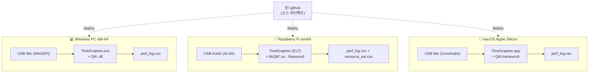

# TimeGrapher 문서 (Documentation Hub)

기계식 시계의 똑딱 소리를 듣고 **진폭·보율(rate)·비트 오차**를 실시간 측정·그래프로
보여 주는 Qt6/C++ 앱. 이 폴더는 재구조화된 아키텍처와 동작·성능을 설명하는 허브다.

---

## 📚 문서 인덱스

| 문서 | 무엇을 답하나 |
|---|---|
| **[ARCHITECTURE.md](ARCHITECTURE.md)** | 기존 대비 무엇이 어떻게 바뀌었나 · Context/Module/C&C 뷰 · 적용 패턴·전술과 그 이유 |
| **[SIGNAL_FLOW.md](SIGNAL_FLOW.md)** | 소리가 어떻게 그래프가 되나 — 신호처리부터 렌더까지 단계별 그림·시퀀스 |
| **[PERFORMANCE.md](PERFORMANCE.md)** | 무엇을 어디서 측정하나 · 지표 카탈로그 · 측정 실행/분석 방법(도구·해석) |
| [ko/REFACTORING_DESIGN.md](ko/REFACTORING_DESIGN.md) · [en/](en/REFACTORING_DESIGN.md) | (배경) 재구조화 AS-IS/TO-BE 설계 노트 |

> 처음이라면 **SIGNAL_FLOW → ARCHITECTURE → PERFORMANCE** 순서를 권한다.

---

## 🧭 30초 요약

- **입력**: 라이브 마이크 / WAV 재생 / 시뮬레이션(정답값 있음) 셋 중 하나.
- **처리**: 오디오 워커가 링버퍼를 채우고 → 메인 스레드가 DSP(HPF→엔벨로프→검출→박자추적)로
  A(언락)·C(드롭) 이벤트를 찾는다.
- **표시**: 파형(`WaveBlock`)과 측정값(`MeasurementSnapshot`)을 `TabManager` 가 13개 탭에
  발행 → 각 탭이 그래프를 그린다.
- **계측**: `PERF_ENABLE=1` 빌드는 단계별 지연·정확도를 `perf_log.csv` 로, Pi에선 CPU·메모리·
  온도를 `resource_ext.csv` 로 남긴다. `=0` 이면 계측이 컴파일에서 사라진다.

---

## 🗂️ Module View — 폴더 구조와 책임

레이어 간 의존성은 **위 → 아래 한 방향**만 허용한다. (자세히는 [ARCHITECTURE.md §4](ARCHITECTURE.md))

```
architect_cmu/
├── src/
│   ├── core/          # 순수 도메인 (Qt 무관) — DSP·검출·타이밍·통계
│   │   ├── dsp/           HPF·엔벨로프 필터
│   │   ├── detection/     A·C 온셋/피크 검출 상태기계
│   │   ├── timing/        Timegrapher(파이프라인) · Bph(박자 추적)
│   │   └── stats/         RollingAverage · RollingLeastSquares
│   ├── audio/         # 입력 소스 + 공유 링버퍼 + 녹음
│   │   ├── capture/       라이브 마이크 워커 (+플랫폼 오디오)
│   │   ├── playback/      WAV 재생 워커
│   │   ├── sim/           시뮬 워커 + 합성기(정답값)
│   │   ├── recording/     WavFileReader(읽기) · WavStreamWriter(쓰기)
│   │   ├── SharedAudio.h      스레드 공유 링버퍼
│   │   └── AudioRingBuffer.h  공용 링버퍼 쓰기(DRY)
│   ├── engine/        # 도메인 오케스트레이션
│   │   ├── CaptureController  오디오 소스 + 신호 파이프라인(핫패스)
│   │   ├── MeasurementEngine  보율·비트오차·진폭 계산
│   │   └── SimConfigBuilder   시뮬 합성 설정 조립
│   ├── render/        # 폴딩 사운드 이미지 렌더(픽셀)
│   ├── perf/          # 성능 계측(횡단) — PERF_ENABLE 로 제거 가능
│   └── ui/            # 화면
│       ├── MainWindow     위젯 배선 + 저빈도 표시(순수 UI)
│       └── tabs/          TabView 추상화 · TabManager · 13개 탭
├── tools/             # 측정·분석 도구
│   ├── resource_sample.sh   외부 자원 샘플러(Pi: CPU·PSS·온도·스로틀)
│   ├── analyze_perf.py      통계 + QA 합격/미달 + 발열 영향 리포트
│   └── perf_join.py         내부·외부 로그 시간축 정렬/상관
└── docs/              # ← 이 문서들
```

---

## 🚀 빌드 & 실행 (요약)

```bash
# Ubuntu/Pi 의존성
sudo apt install libglu1-mesa-dev libx11-xcb-dev build-essential cmake libasound2-dev

# 빌드 (Linux/Pi)
tools/../build_run.sh <소스경로>            # 빌드+실행 (Pi: Qt arm64 가정)
# 또는 표준 CMake
cmake -S . -B build -G Ninja && cmake --build build --target TimeGrapher
```
Windows(MinGW)·macOS 도 지원한다. 배포 형태는 아래 Deployment View 참고.

---

## 🖥️ Deployment View — 어디서 도나

하나의 코드베이스가 세 플랫폼에 배포된다. 각 장치는 USB 오디오로 시계 소리를 받아
화면에 그래프를 그리고, 계측 빌드에선 `perf_log.csv` 를 남긴다.



---

## 🔑 핵심 데이터 계약

| 구조체 | 빈도 | 담는 것 |
|---|---|---|
| `WaveBlock` | 슬라이스마다 | 엔벨로프 파형 + A/C 마커 + 원신호 |
| `MeasurementSnapshot` | 비트(C)마다 | 보율·비트오차·진폭 + rate 시리즈 |

두 스트림은 독립(1:N). 상세는 [SIGNAL_FLOW.md §3](SIGNAL_FLOW.md).
