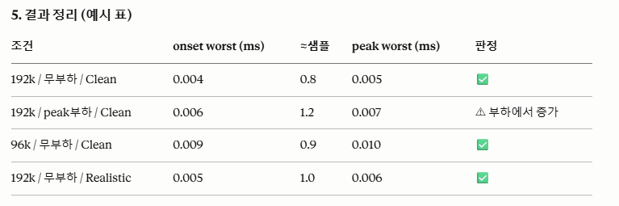
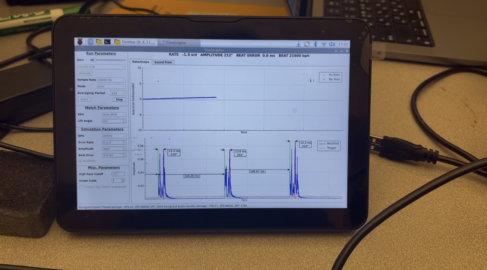

# **7. Experiments**

This section documents the technical experiments (Agile spikes) used to evaluate and validate the quality-attribute requirements. Each experiment follows the standard technical-experiment template.

## 7.1 Experiments

### EXP-01 / Experiment for \[QAS-01\]: Multi-sample-rate capture stability

### 

#### Objective

Determine whether the Pi 5 can sustain continuous capture at 48k / 96k / 192k sps with zero block drops, and judge whether 192k sps is a viable default target.

#### Status

- **\[**Planned \| In progress \| Suspended \| **Canceled** \| Concluded\]

#### Expected outcomes

- <https://github.com/jaehong179/architect_cmu/blob/exp01/scripts/arecord_test.sh>

- Drop count per 60 s at each sample rate (target: 0 drops; 192k objective ≤ 1 / 60 s)

- Average CPU and memory usage per sample rate

- Decision on whether 192k sps is adopted as the default target

#### Resources required

- Raspberry Pi 5 + Weishi-style microphone

- Audio tools (arecord, top, htop)

- AGC OFF environment (CON-OP-01)

#### Experiment description

- Run 60 s continuous capture at each sample rate (48k / 96k / 192k), 3 repetitions each

- Record drop count, CPU usage and memory usage; average the repetitions

- Compare results against the drops = 0 target

#### Duration

06/08–06/19

#### Links and references

QAS-01 · QAS-03 · FR-CP-6 · CON-OP-01

#### Results and recommendations

This experiment was not conducted because its results do not determine the direction of the SW architecture.

*(to be completed after the experiment)*

### 

### EXP-02 / Experiment for \[QAS-02\]: End-to-end latency measurement

### 

#### Objective

Measure end-to-end latency from a microphone impulse to the GUI update and verify it stays within 100 ms under peak load.

#### Status

- **\[**Planned \| **In progress** \| Suspended \| Canceled \| Concluded\]

#### Expected outcomes

- End-to-end latency distribution

- Confirmation that \< 100 ms

- Identification of the slowest pipeline stage

#### Resources required

- Source code analysis

- Raspberry Pi 5 + audio capture setup

- Timestamped logging across pipeline stages

#### Experiment description

- Source code based analysis: Analyze the computational complexity of the processing whole graph.

- Log based analysis: Measure elapsed time from microphone input to GUI update under peak load (12 tabs active)

#### Duration

06/15–06/19

#### Links and references

QAS-02 · RISK-02

#### Results and recommendations

- Source code based analysis: All required graphs use the same Tic/Toc calculations and wave signal processing as the Rate/Scope tab and Sound Print graph. Therefore, they have the same algorithmic and computational complexity, and no additional processing overhead is expected based on the provided source code.

- Log based : TBD

*(to be completed after the experiment)*

### 

### EXP-03 / Experiment for \[QAS-03\]: 30-minute sustained-operation resource & thermal stability

### 

#### Objective

Profile memory growth, CPU thermal ceilings and GUI loop stability during 30 minutes of sustained operation.

#### Status

- **\[Planned** \| In progress \| Suspended \| Canceled \| Concluded\]

#### Expected outcomes

- Memory growth ≤ 200 MB over 30 minutes

- Thermal throttling events = 0

- Stable FPS with no GUI loop degradation

#### Resources required

- Raspberry Pi 5 + monitoring scripts (top, htop, /sys/class/thermal/)

- 192k sps capture workload

#### Experiment description

- Run a script that uniformly cycles tab switching across a 30-minute block while capturing at 192k sps

- Log RSS, CPU% and FPS throughout

- Check for memory leaks and thermal throttling

#### Duration

06/22–06/26

#### Links and references

QAS-03 · RISK-01 · RISK-02

#### Results and recommendations

*(to be completed after the experiment)*

### 

### EXP-04 / Experiment for \[RISK-17\]: Measurement Accuracy & T1/T3 Detection-Rate Evaluation (vs. Sim Ground Truth)

### 

#### Objective

Against Sim-mode ground truth, evaluate whether T1/T3 detection rate and Rate/Beat-Error/Amplitude measurement accuracy fall within target bounds.

#### Status

- **\[Planned** \| In progress \| Suspended \| Canceled \| Concluded\]

#### Expected outcomes

- T1/T3 detection rate, onset/peak identification error, and (measured − configured) error distributions for Rate, Beat Error, and Amplitude; whether targets are met.

#### Resources required

- Raspberry Pi 5 / PC, Sim mode (built-in GtBeats ground truth), existing instrumentation (perf_log.csv: E-2 onset/peak_err, G-1 accuracy, G-2 detection rate), tools/analyze_perf.py.

#### Experiment description

- Configure Sim mode (BPH, Amplitude, Beat Error, Realistic; 96k/192k).

- Run ≥1,000 beats.

- Collect E-2 (onset/peak_err), G-1 (rate/beaterr/amp_err), G-2 (a_match/c_match/gt_total) from perf_log.csv.

- Compare detection rate/errors to targets.

- Combine with the Weishi cross-validation (real-watch reference) to confirm accuracy trustworthiness.

#### Duration

06/22–06/26

#### Links and references

RISK-17· FR-MSB-1 · FR-CP-4 · CON-RF-02

#### Results and recommendations

*(to be completed after the experiment)*

### 

### 

### EXP-05 / Experiment for \[QAS-05\]: Noise-environment robustness

### 

#### Objective

Quantify measurement degradation when 60 dB SPL speech noise is injected alongside the watch signal.

#### Status

- **\[Planned** \| In progress \| Suspended \| Canceled \| Concluded\]

#### Expected outcomes

- under 60 dB SPL noise

- Measurement error increase ≤ 2× the noise-free baseline

#### Resources required

- Raspberry Pi 5 + Weishi microphone + speaker

- 60 dB SPL speech-noise file

#### Experiment description

- Play back 60 dB speech noise while capturing the watch signal

- Track delta shifts versus the noise-free baseline

- Record detection rate and error degradation

#### Duration

06/22–06/26

#### Links and references

QAS-05 · RISK-04 · FR-SPT-5

#### Results and recommendations

*(to be completed after the experiment)*

### 

### EXP-06 / Experiment for \[QAS-07\]: Fault-handling & feedback verification

### 

#### Objective

Verify the system detects faults (signal loss, missed beats, out-of-range values) and gives clear feedback within 2 s while preserving the last valid value.

#### Status

- **\[Planned** \| In progress \| Suspended \| Canceled \| Concluded\]

#### Expected outcomes

- Error / warning shown ≤ 2 s after a fault

- Invalid outputs = 0 during faults

- Last valid value preserved; threshold lines always visible

#### Resources required

- Raspberry Pi 5 + Live capture setup

- Fault injection (disconnect mic, inject noise, force out-of-range)

#### Experiment description

- Inject each fault type (signal loss, missed beat)

- Observe the error / status indication and its timing

- Confirm the last valid value is preserved and no invalid output is shown

#### Duration

06/24–07/01

#### Links and references

QAS-07 · CON-OP-01

#### Results and recommendations

*(to be completed after the experiment)*

### EXP-07 / Experiment for \[QAS-10\]: Cross-platform build & deployment

### 

#### Objective

Confirm the same codebase builds and runs on the ARM Pi 5, x86 PC, and macOS (Intel / Apple Silicon)

#### Status

- \[Planned \| In progress \| Suspended \| Canceled \| **Concluded**\]

#### Expected outcomes

- Build and execution results for each platform (Windows, macOS, Linux PC, Raspberry Pi OS)

- Commits for any code changes made to enable builds on specific platforms

- Source code that can be built and executed on all of the above platforms

#### Resources required

- **Software Tools and Frameworks**

  - Qt per platform (Qt Creator 19.0.2, Qt 6.11.1)

- **Hardware**

  - 1 Windows laptop

  - 1 macOS laptop

  - 1 Linux laptop

  - 1 Raspberry Pi board

- **Documentation and Reference Materials**

  - Qt official documentation (Cross-platform build guide)

  - Current project source code

#### Experiment description

1.  **Environment Setup:** Install Qt and Qt Creator on each platform and configure the environment.

2.  **Source Code Checkout:** Clone the same source code on each platform.

3.  **Build Attempt:** Run a CMake build on each platform and record whether it succeeds or fails.

4.  **Issue Analysis and Fix:** If a build fails, analyze the root cause and resolve any platform compatibility issues.

5.  **Execution Verification:** After a successful build, run the application and verify that core functionality works as expected.

#### Duration

05/25–06/08

#### Links and references

QAS-10· RISK-16 · CON-SW-03

#### Results and recommendations

- (05/28) Confirmed that Raspberry Pi OS and Windows 11 can build and run using the source code provided at the beginning of the project.

- (05/29) Code changes required for Linux PC (Ubuntu 24.04) build: <https://github.com/jaehong179/architect_cmu/commit/b0f4b338931187cdc8b0ced1155b8c82707164e3>

- (06/07) Initial macOS (Apple Clang) build succeeded, but waveform rendering crashed at runtime.

- (06/07) Root cause: QCustomPlot::getOptimizedScatterData() — valuePixelSpan == 0 causes std::lround(infinity) → int overflow → UB crash. Latent on Linux/Windows, triggered on Mac (Apple Clang). (patch : [https://github.com/jaehong179/architect_cmu/commit/0817867d70d04d698b8ad872f4d20b20d8b5f582)](https://github.com/jaehong179/architect_cmu/commit/0817867d70d04d698b8ad872f4d20b20d8b5f582)

- (06/08) The code from the latest commit can be built and executed on all required operating systems.

### EXP-08 / Experiment for \[QAS-02\]: Measure current performance

#### Objective

Measure the current system's end-to-end performance (latency, drops, bottleneck) to understand the level achieved today, and use it to set the performance targets and the improvement plan.

#### Status

- \[Planned \| In progress \| Suspended \| **Canceled** \| Concluded\]

#### Expected outcomes

- A baseline of the current system's latency (including per-stage), drops, and processing bottleneck

- Identification of which stage is slow (the bottleneck)

- Performance targets and follow-up plan derived from the measured level

#### Resources required

- Raspberry Pi 5 (target device)

- Microphone (Live) or Sim-mode signal (measurement input)

- Performance log (perf_log.csv) collection

#### Experiment description

1.  On Live (192k sps, tab switching), collect end-to-end and per-stage latency, drops, and resource use into the log

2.  Aggregate per stage to identify the bottleneck and summarize the current level

#### Duration

06/08-06/12

#### Links and references

QAS-02

#### Results and recommendations

- (06/05) Performance log (perf_log.csv) generation implemented — metrics at each point (capture → processing → display) are now recorded to the log.

- This experiment is canceled. Because this experiment is almost similar as EXP-02

### 

### EXP-09 / Legacy Codebase Comprehension & Reverse Engineering via AI

### 

#### Objective

- Analyze and comprehend the core architecture, class relationships, and primary runtime control flows (sequences) of the legacy codebase utilizing AI-powered tools.

#### Status

- *\[Planned \| In progress \| Suspended \| Canceled \|* **Concluded***\]*

#### Expected outcomes

- Core Class Diagrams of the legacy code automatically generated by AI tools.

- Sequence Diagrams illustrating the execution flows of key functionalities (e.g., signal capture, DSP processing, and graph GUI).

- An Dependency Structure Report of legacy components compiled based on analyzed domain knowledge.

#### Resources required

- AI Tools

- Source Code: Existing legacy source code (C++)

#### Experiment description

1.  Source Code Ingestion: Load and index the target legacy source code within the context window of the AI tool.

2.  Structural Analysis (Class Diagram): Prompt the AI to analyze the static relationships among core components (AudioWorker, DSP, GUI) to derive the overall class diagram and dependency mappings.

3.  Behavioral Analysis (Sequence Diagram): Track runtime events from the initial audio input down to the GUI update to generate and validate sequence diagrams showcasing the dynamic control flow.

4.  Architectural Verification: Cross-check the AI-generated diagrams against major entry points in the actual source code to verify architectural alignment.

#### Duration

- 06/03–06/04

#### Links and references

- *N/A*

#### Results and recommendations

- (6/4)Rapid Architectural Visualization

- (6/4)Successful Derivation of Class & Sequence Diagrams

- (6/4)Architectural Recommendations

- <https://github.com/jaehong179/architect_cmu/blob/performance_test/docs/en/README.md>

### EXP-10 / Experiment for \[FR-AI-1\]: Real-time TinyML Inference Performance on Raspberry Pi

#### Objective

- Verify whether the lightweight AI model (TinyML) can perform inference in real-time on the Raspberry Pi 5 without impacting the system's core measurement performance, and validate the development team's capability to build and deploy TinyML solutions.

#### Status

- \[Planned \| In progress \| Suspended \| Canceled \| **Concluded**\]

#### Expected outcomes

- Average inference latency for the TinyML model.

- Confirmation that the inference latency is consistently below the allocated time budget per measurement cycle.

- CPU and memory usage report during real-time inference.

- Establish a working TinyML pipeline (edge deployment) to overcome the team's initial lack of experience

#### Resources required

- Dummy TinyML model

- Raspberry Pi 5 with the integrated TinyML model.

#### Experiment description

1.  Integrate the dummy TinyML model into the Timegrapher application running on the Raspberry Pi 5.

2.  Measure the inference time for each incoming data block over a sustained period (e.g., 100 inferences).

3.  Monitor the overall system's CPU and memory load to ensure that the AI model does not introduce bottlenecks or resource contention.

4.  Analyze the collected latency and resource data to determine real-time viability.

#### Duration

- 06/04–06/08

#### Links and references

- FR-AI-1, RISK-09, RISK-11

#### Results and recommendations

- The experiment was conducted using a Conv2D-based audio classification model (19,844 parameters) with MFCC (Mel-frequency cepstral coefficients) preprocessing on the Raspberry Pi 5.

- The measured inference latency was 2ms per data block.

- The 2ms inference time is well within the real-time processing budget.

- This confirms that real-time TinyML inference on the Raspberry Pi is highly viable, effectively mitigating RISK-09.

- Furthermore, successfully building and deploying this model validates the team's acquired proficiency in TinyML workflows, successfully mitigating RISK-11

### 

### EXP-11 / Experiment for \[FR-AI-1\]: AI-based Denoising Approach to Bypass Manual Labeling

*Objective*

- Verify whether pivoting the AI task to noise reduction (denoising) can effectively enhance the watch signal for legacy algorithms, while completely eliminating the need for manual data labeling by utilizing synthetic noise injection.

*Status*

- \[Planned \| In progress \| Suspended \| **Canceled** \| Concluded\]

*Expected outcomes*

- Successful automatic generation of a large-scale paired training dataset (Noisy Input 🡪 Clean Target).

- Training a lightweight TinyML denoising model (e.g., DeepFilterNet or RNNoise-style model).

- Confirmation that the denoised audio significantly improves the accuracy of the traditional peak-detection/measurement logic compared to raw noisy audio.

*Resources required*

- A small set of high-quality, clean watch ticking recordings (Ground Truth).

- A database of various environmental noises (white noise, room ambiance, human voices).

- Computing resources for generating the mixed datasets and training the model.*  
  *

*Experiment description*

- Collect or synthesize a high-quality baseline of clean watch tick sounds.

- Synthetically mix these clean sounds with various noise profiles at varying Signal-to-Noise Ratios (SNR) to auto-generate the training dataset.

- Train a lightweight denoising model using the Noisy-Clean pairs.

- Integrate the model into the pipeline as a pre-processing step before the main measurement algorithm.

- Evaluate the overall system accuracy and measurement stability with and without the AI denoising block.

*Duration*  
06/15–06/22

*Links and references  
*FR-AI-1 · RISK-05

*Results and recommendations*  
1) Testing confirmed that human speech is not captured by the TimeGrapher hardware. Therefore, it was concluded that the TimeGrapher hardware does not accept human voice as an input signal.

2\) Strong impact noise can overlap with the watch signal and may introduce audio clipping, leading to irreversible information loss. As a result, the original watch signal cannot be reliably recovered using AI-based noise suppression techniques alone.

Therefore, this experiment is canceled.

### EXP-12 / Experiment for \[FR-POS-1\]: USB Protocol Analysis for Automated Watch Position Detection

*Objective  
*Investigate the USB communication protocol of the connected Timegrapher hardware to verify if the physical position state data of the watch is transmitted alongside the audio stream, thereby determining the implementation complexity of the automated position detection feature.

*Status*

- \[Planned \| In progress \| Suspended \| Canceled \| **Concluded**\]

*Expected outcomes*

- Clear confirmation (Yes/No) of whether watch position information is embedded in the USB data stream.

- If supported, define the specific registers or byte sequences representing each position (e.g., Dial Up/Down, Crown Up/Down/Left/Right).

- If not supported, formulate an architectural alternative (e.g., manual GUI input, audio-based heuristic inference, or secondary sensor integration).

*Resources required*

- Target Timegrapher hardware (microphone stand and main unit).

- Raspberry Pi 5 with USB interface.

- Development environment for custom USB/HID communication scripts (e.g., Python with PyUSB or C-based HIDAPI).

- Standard HID peripherals (e.g., mouse, keyboard) for script validation.

*Experiment description*

- Inspect the USB descriptors of the connected Timegrapher hardware to identify available endpoints (confirming the presence of both Audio and HID interfaces)

- Develop a custom script to directly read data payloads from the identified HID endpoint.

- Validate the reliability of the custom script by connecting standard HID input devices (mouse/keyboard) and verifying that input data is correctly received and parsed.

- Connect the Timegrapher microphone hardware, execute the validated script, and manually rotate the physical position of the watch stand through various states.

- Monitor the script's output in real-time to determine if any position-related data packets are generated and transmitted by the hardware.

> .

*Duration  
*06/03–06/04

*Links and references*  
RISK-15

*Results and recommendations*

- USB packet analysis revealed the presence of a standard HID (Human Interface Device) endpoint in addition to the primary audio streaming interface.

- A custom script was developed to read data from this HID endpoint. The script's functionality was successfully validated by connecting standard HID peripherals (mouse/keyboard) and confirming stable data reception.

- However, when the target watch microphone device was connected and physically rotated through various positions, absolutely no data was transmitted via the HID endpoint.

- Conclusion: The watch microphone hardware does not transmit watch position data over the USB connection.

- Since automated position detection via hardware is confirmed to be unsupported, we must activate the fallback plan for RISK-18.

- Update the software architecture and UI/UX design to implement a manual position selection feature via the GUI, allowing users to specify the position (e.g., Dial Up, Crown Left) before initiating the measurement.

### EXP-13 / Experiment for \[QAS-04\]: Timing-Precision Verification (Using Existing E-2 Instrumentation)

### 

*Objective*

- For a Sim signal with known ground truth (GtBeats), confirm that the real-time pipeline's detection-timing error (E-2 onset/peak_err) is worst-case ≤ 1 sample, and that this precision is preserved as CPU load, sample rate, and signal realism change.

*Status*

- \[**Planned** \| In progress \| Suspended \| Canceled \| Concluded\]

*Expected outcomes*

- Per-condition mean/σ/worst-case of onset_err_ms/peak_err_ms; pass/fail against the ≤ 1 sample criterion; whether the error grows under load/config changes (indirect indicator of design precision preservation).

*Resources required*

- Raspberry Pi 5, existing TimeGrapher build, Sim mode (built-in GtBeats ground truth), existing instrumentation (perf_log.csv: E-2 onset/peak_err, G-2 detection rate), tools/analyze_perf.py. No new code.

*Experiment description*

- Configure Sim mode (BPH, Amplitude, Beat Error, Realistic, sps) and run ≥1,000 beats.

- Existing instrumentation logs per-beat E-2 onset_err_ms/peak_err_ms to perf_log.csv.

- Repeat across conditions: ① no CPU load vs peak load, ② 96k vs 192k sps, ③ Sim Clean vs Realistic.

- Use tools/analyze_perf.py to compute worst-case error per condition.

- Judge whether worst-case ≤ 1 sample and whether the error stays stable across conditions (precision preservation).

*Duration*  
06/22–06/26

*Links and references*  
QAS-04· RISK-18

*Results and recommendations*  
*(to be completed after the experiment)*

### EXP-14 / Experiment for \[RISK-19\]\[QAS-11\]: Characterize current behavior on microphone (USB) disconnect

### 

*Objective*

- Determine what the current system actually does when the measurement microphone (USB audio input) is disconnected while running in Live mode — i.e., how the GUI behaves — so the right disconnect-detection and notification tactic can be chosen.

*Status*

- \[Planned \| In progress \| Suspended \| Canceled \| **Concluded**\]

*Expected outcomes*

- A documented current-state behavior for each disconnect case: (a) how the GUI reacts (freezes, keeps last value, shows nothing, or errors), (b) measured time until any visible change, and (d) whether capture/measurement auto-recovers on reconnect. This becomes the baseline and the detection-signal basis for QAS-11 / EXP-06.

*Resources required*

- Raspberry Pi 5 + the timegrapher USB microphone; TimeGrapher GUI in Live mode; a stopwatch to time the GUI reaction. No new code (observation only).

*Experiment description*

- Run the TimeGrapher in Live mode capturing a watch signal.

- Observe the GUI: does it freeze, keep displaying the last value, show nothing, or display an error? Record the time from unplug to any visible change.

- Reconnect the microphone and observe whether capture/measurement resumes automatically or requires a restart.

*Duration*  
06/15-06/16

*Links and references*  
QAS-01 · RISK-19· EXP-06

*Results and recommendations*  
*(to be completed after the experiment)*

- The GUI froze within 0.1ms, keeping the last displayed value.

- No specific error message or indicator was shown.

- The system did not automatically recover when the microphone was reconnected.

### EXP-15 / Experiment for \[RISK-01\]\[QAS-01\]\[QAS-03\]: Buffer/Memory-Management Tactic Analysis (Static-Analysis Based) → ADR-03

### 

*Objective*

- Without writing or measuring new code, statically analyze the current capture/buffer code and compare known buffer tactics to produce the evidence for a buffer/memory-management design that satisfies both zero data loss and the memory bound — in particular, reason about whether a fixed-size ring buffer is compatible with zero-loss. The final decision, rationale, and consequences are recorded in ADR-03.

*Status*

- \[Planned \| In progress \| Suspended \| Canceled \| **Concluded\]**

*Expected outcomes*

- • Documentation of the current buffer structure (sizes, overwrite/drop policy, producer/consumer relation, where loss can occur); • a trade-off table of candidate tactics (fixed ring / back-pressure fixed / adaptive-growable) across loss, latency, memory, complexity; • analysis of contradictions/risks under the 192k · 30-min · 12-tab workload; • the design decision based on this analysis is recorded in ADR-03 (this experiment provides the evidence).

*Resources required*

- Access to the existing source (SharedAudio, AudioWorker, MainWindow capture/buffer path); 2–3 person-days of architecture analysis; a code-navigation IDE. No measurement rigs or new implementation (static analysis only).

*Experiment description*

- Trace where/how the buffer is filled and drained along the capture-to-consumer path; identify buffer size, overwrite/drop policy, and how producer–consumer speed mismatch is handled.

- Statically trace where data is overwritten or dropped under load spikes or consumer stalls (the conditions that break zero-loss).

- Compare fixed ring / back-pressure / adaptive buffer across loss, latency, memory, complexity, citing known properties.

- Under 192k sps · 30 min · 12-tab cycling, reason about each tactic's memory ceiling and zero-loss guarantee.

- **Hand the analysis to ADR-03** (the decision/rationale is finalized there).

*Duration*  
06/15-06/16

*Links and references*  
ADR-003 (buffer/memory-management tactic) ·  QAS-01 ·  QAS-03 · RISK-01· EXP-03

*Results and recommendations*  
*(to be completed after the experiment)*

Current buffer structure (static analysis): a single fixed-size 30-second ring buffer (SECONDS_OF_BUFFER 30; ~22 MB @192k); the producer (AudioWorker) overwrites the oldest samples on wrap without checking the consumer (no back-pressure); the consumer (main thread) reads TotalSamplesWritten − LastTotal with no lap/overwrite guard. There is no loss/drop instrumentation of any kind: the only output on wrap is a qInfo("MasterAudioData Samples Rollover") debug print that fires on every normal wrap, so it does not indicate data loss. If the consumer lags beyond the 30 s margin, the ring is overwritten and the loss is completely silent and unmeasured.

| Tactic                                   | Zero-loss                                                                                                                                                                                        | Memory bound                              | Live-capture viable                     | Complexity |
|------------------------------------------|--------------------------------------------------------------------------------------------------------------------------------------------------------------------------------------------------|-------------------------------------------|-----------------------------------------|------------|
| Fixed ring, overwrite-oldest (current)   | Only within the 30 s consumer-lag margin; silent loss if exceeded                                                                                                                                | Yes (bounded, ~22 MB @192k)               | Yes                                     | Low        |
| Fixed ring + lap/overwrite detection     | Same margin, but loss becomes observable (detected)                                                                                                                                              | Yes                                       | Yes                                     | Low        |
| Back-pressure (producer waits when full) | Zero-loss between producer and consumer, but not end-to-end for live capture — the loss moves to the ALSA device (xrun) (general property of real-time capture; not present in the current code) | Yes                                       | No (a live microphone cannot be paused) | Medium     |
| Adaptive / growable buffer               | Zero-loss until memory is exhausted (hypothetical candidate not in the code; general reasoning)                                                                                                  | No — unbounded growth, OOM risk on the Pi | Yes                                     | Medium     |

### EXP-16 / Experiment for \[RISK-19\]\[QAS-07\]\[QAS-11\]: Fault-Detection & Notification Tactic Analysis (Static-Analysis Based) → ADR-02

*Objective*

- Without implementing or measuring, statically analyze the available fault signals in the existing code and compare candidate tactics to produce the evidence for choosing a detection/notification tactic that guarantees a user-facing notification within the deadline (QAS-11 ≤ 1 s) on microphone disconnect / signal loss. The final decision, rationale, and consequences are recorded in ADR-02.

*Status*

- \[Planned \| In progress \| Suspended \| Canceled \| **Concluded**\]

*Expected outcomes*

- An inventory of currently available fault signals (callback halt, QAudioSource stateChanged (debug-print only), existing beat-level sync watchdog) with their meaning and latency;  
  a comparison of candidate tactics (timeout/watchdog, device error/state callback, circuit breaker, polling) by what each guarantees;  
  the tactic decision based on this analysis is recorded in ADR-02 (this experiment provides the evidence).

*Resources required*

- Access to the existing source (AudioWorker, Bph, Timegrapher); 1–2 person-days; an IDE. No measurement rigs or new implementation. Uses EXP-14's observations as input.

*Experiment description*

- Signal identification: analyze what the code can receive on disconnect — readyRead halt (callback stops), QAudioSource::stateChanged (Idle/Stopped) — currently connected but debug-print only; note that QAudioSource::error() is available via the API but is not polled in the current code.  
  Existing-pattern analysis: examine how the existing watchdogs (Bph silence timeout, Timegrapher sync-loss) bound detection of "absence of expected events" at the beat level.  
  Tactic comparison: compare tactics by whether each bounds detection latency within the deadline (≤ 1 s).  
  Circuit-breaker applicability: reason that its purpose (trip after repeated call failures) differs from "notify within 1 s."  
  Hand the analysis to ADR-02 (the decision/rationale is finalized there).

*Duration*  
06/15-06/16

*Links and references*  
ADR-02 (fault-detection & notification tactic); RISK-19; QAS-07, QAS-11; EXP-14 (current behavior) as input.

*Results and recommendations*  
*(to be completed after the experiment)*

readyRead halt (callback stops) = primary signal / QAudioSource::stateChanged = connected but handler does a qDebug() print only (no fault handling, no GUI notification); QAudioSource::error() is not polled anywhere; there is no capture-gap/drop instrumentation. The existing watchdog covers beat-level only (no beats in signal); it does not detect stream-level absence (microphone disconnect).

| Tactic                                                         | Bounds detection latency? | Detects "no data" (mic unplug)?                            | Fit for "notify ≤ 1 s"              | In current code?                                                |
|----------------------------------------------------------------|---------------------------|------------------------------------------------------------|-------------------------------------|-----------------------------------------------------------------|
| Timeout / watchdog (no expected block within deadline → fault) | Yes (= the deadline)      | Yes (callback stops → deadline trips)                      | Strong                              | Yes (Bph/Timegrapher sync watchdog)                             |
| Device error/state callback (error()/stateChanged)             | No (only when OS reports) | Sometimes (some unplugs only go silent)                    | Fast-path, but not guaranteed alone | stateChanged connected but debug-print only; error() not polled |
| Circuit breaker (trip after N call failures)                   | No                        | No (addresses repeated call failures, not absence of data) | Poor / wrong tool                   | No                                                              |
| Polling / heartbeat (periodic health check)                    | Yes (= poll interval)     | Yes                                                        | OK but coarse/redundant vs watchdog | No                                                              |

### EXP-17 / Experiment for \[RISK-05\]\[RISK-09\]\[FR-AI\]: Rule/Signal-Processing vs. TinyML Responsibility-Boundary Analysis (Static-Analysis Based) → ADR-01

### 

*Objective*

- Statically analyze the diagnosis sub-tasks to produce the evidence (task decomposition, tactic comparison) for the rule/signal-processing vs. TinyML boundary. The final decision, rationale, and consequences are recorded in ADR-01.

*Status*

- \[Planned \| In progress \| Suspended \| Canceled \| **Concluded**\]

*Expected outcomes*

- Decomposition of the diagnosis pipeline

- a per-task placement table (measurement-trust involvement, deterministic-algorithm sufficiency, ML data/sensor availability)

- the design decision based on this analysis is recorded in ADR-01 (this experiment provides the evidence).

*Resources required*

- Analysis of existing source (Detector, Bph, measurement) and Sim mode, domain knowledge, 2–3 person-days, an IDE. No model training or measurement rigs.

*Experiment description*

- Decompose the feature (detection, computation, health grading, fault hint, signal anomaly, position reading)

- For each task analyze measurement-trust involvement, deterministic-algorithm sufficiency, and ML data/sensor availability.

- Review deterministic sufficiency of the acoustic path and low-SNR options (adaptive threshold / matched filter).

- Identify the task where ML adds value with realistic labeling.

- Hand the analysis to ADR-01 (the decision/rationale is finalized there).

*Duration*  
06/15-06/17

*Links and references*  
ADR-01 (responsibility-boundary decision); RISK-05, RISK-09; FR-AI/FR-POS; external camera; follow-up EXP-18; EXP-12.

*Results and recommendations*  
*(to be completed after the experiment)*

| Sub-task                    | Affects measurement trust? | Deterministic algorithm sufficient?                 | ML data/sensor                                               | Analysis note                           |
|-----------------------------|----------------------------|-----------------------------------------------------|--------------------------------------------------------------|-----------------------------------------|
| rate/amp/BE/BPH computation | Yes (core)                 | Yes (closed-form)                                   | —                                                            | Rule suitable                           |
| tick/tock detection         | Yes (root)                 | Yes (low-SNR via adaptive threshold/matched filter) | —                                                            | Rule/signal-processing suitable         |
| health grading & score      | Yes (user-facing)          | Yes (domain thresholds)                             | —                                                            | Rule suitable                           |
| fault/cause hint            | Moderate                   | Yes (pattern→cause)                                 | —                                                            | Rule suitable                           |
| signal anomaly detection    | No (advisory)              | Partially                                           | —                                                            | Achievable with rules/signal-processing |
| watch position reading      | No (out-of-path advisory)  | No (visual orientation hard to express as rules)    | External camera + per-orientation images (labeling feasible) | Strong ML candidate                     |
| trend prediction            | No                         | —                                                   | Long history needed                                          | Deferred                                |

### EXP-18 / Camera+TinyML 9-Position Accuracy & Per-Mode Fallback Verification

### 

*Objective*

- Verify 9-position classification accuracy and that per-mode safe fallback works (Sequence Display = manual switch; other modes = no display).

*Status*

- \[Planned \| **In progress** \| Suspended \| Canceled \| Concluded\]

*Expected outcomes*

- 9-position accuracy (confusion matrix); Sequence-Display manual switch with zero mis-records under low confidence; no-display in other modes under low confidence; Pi inference latency.

*Resources required*

- Raspberry Pi 5 + external camera, per-orientation labeled image dataset, a trained TinyML model, real watches.

*Experiment description*

- Collect/label 9-position images.

- Train a lightweight classifier, deploy on Pi.

- Measure per-position accuracy (confusion matrix).

- Sequence Display mode: across positions, verify values record into the correct row, and under low confidence/occlusion/unavailability it switches to manual with zero mis-records.

- Other display modes: verify the current position shows correctly (e.g., 9H) and is hidden under low confidence/unavailability.

- Verify Pi inference latency is acceptable (RISK-09).

*Duration*  
06/12-06/26

*Links and references*  
QAS-06; RISK-20; ADR-01; follow-up to EXP-17, EXP-12.

*Results and recommendations*  
*(to be completed after the experiment)*
