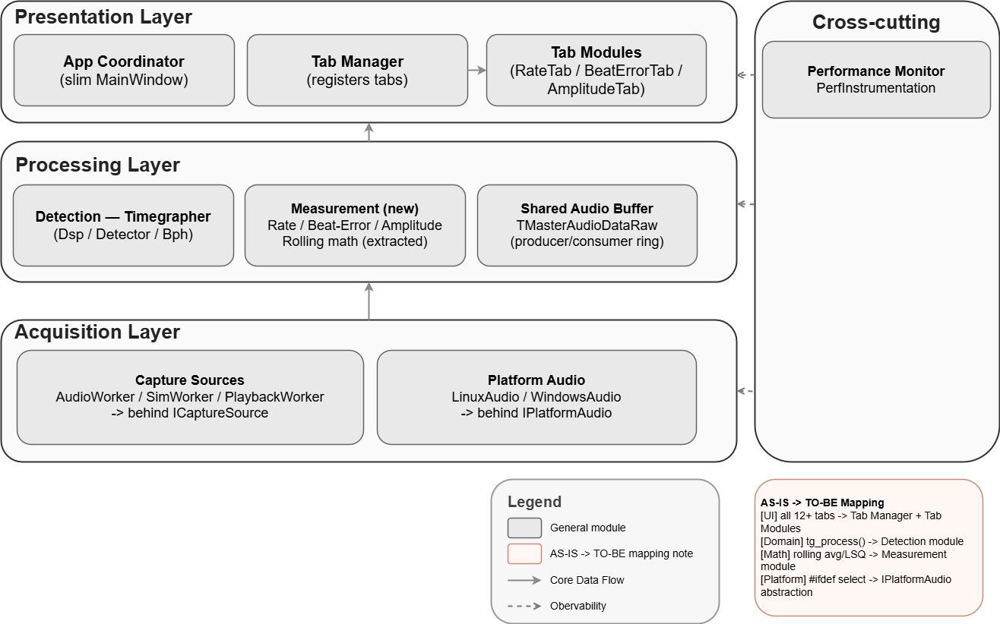

# 8. Architecture Overview

This section gives a high-level view of our target architecture. It explains how we approached the design (ADD), the module structure we propose, and the tactics we apply.

## 8.1 Design Approach (ADD)

We use Attribute-Driven Design (ADD): we start from the quality goals (drivers), pick design ideas (tactics) that satisfy them, and apply those ideas to the modules step by step. The table below maps each driver to the decision we made and the tactic we used.

| **Driver (quality goal)** | **Design decision**                                                                                             | **Tactic**                                                                                   |
|---------------------------|-----------------------------------------------------------------------------------------------------------------|----------------------------------------------------------------------------------------------|
| **QAS-01, QAS-02**        | Capture on a worker thread; process on another; connect by a shared ring buffer so the GUI never blocks capture | Introduce concurrency                                                                        |
| **QAS-01, QAS-02**        | Pull work in fixed blocks and keep per-block cost low                                                           | Manage work requests; Reduce computational overhead                                          |
| **QAS-03, QAS-07**        | Watch resources and the audio stream; detect faults within a bounded time and degrade safely                    | Monitor; Watchdog (timeout on audio-block arrival); device error/state callback as fast-path |
| **QAS-05**                | Reject bad input before it reaches measurement                                                                  | Validate input                                                                               |
| **QAS-08, QAS-09**        | Make each tab its own module; limit what a tab may depend on; one job per module                                | Split module; Restrict dependencies; Increase semantic coherence (SRP)                       |
| **QAS-10**                | Put platform audio behind one common interface                                                                  | Provide a standardized contract                                                              |

## 

## 8.2 Module View

In the target design, we keep what already works (the ring buffer and the detection core) and split the rest into clear layers. Capture sources sit behind a common ICaptureSource interface and platform audio behind an IPlatformAudio interface. MainWindow becomes a slim coordinator; each display tab becomes a self-contained module registered with a Tab Manager and depends only on a published measurement model. The performance monitor stays as a cross-cutting module.

