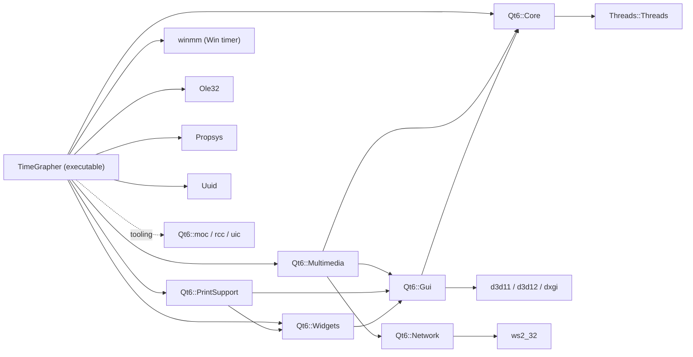

# TimeGrapher Automated Code Analysis Results (Automated Analysis)

> Unlike the hand-written [CodeAnalysis.md](CodeAnalysis.md), this document organizes analysis
> artifacts extracted directly from the code by **actually running the tools**. When the code
> changes, it can be regenerated with a single command.

Generated: 2026-06-03 · Execution environment: Windows 11, MinGW/Qt 6.11.1

---

## 1. What Was Run

| Tool | Version | Input | Output |
|------|---------|-------|--------|
| **Doxygen** | (WinLibs/MinGW) | Project `*.cpp/*.h` (excluding qcustomplot and build) | 220 pages of cross-reference HTML + **945 SVG graphs** |
| **Graphviz `dot`** | 15.0.0 | `.dot` from Doxygen/CMake | Rendering of inheritance, collaboration, call, and dependency graphs |
| **CMake `--graphviz`** | 3.30.5 | Existing build cache | Target dependency graph (`cmake_deps.dot/.svg`) |

> Why these were chosen: these three tools extract compiler/build-system-level facts (class members,
> call relationships, link dependencies) directly **even without source comments**, so they
> simultaneously solve the false positives of `grep`-based manual analysis (e.g., the `CH` inside `each`)
> and the problem of stale diagrams.

---

## 2. Location of Generated Artifacts

```
docs/
├── Doxyfile                       # Doxygen configuration (for regeneration)
└── doxygen/
    ├── html/
    │   ├── index.html             # ★ Entry point — open in a browser
    │   ├── annotated.html         # Full list of classes/structs
    │   ├── inherits.html          # Full inheritance hierarchy
    │   ├── files.html             # File/include relationships
    │   ├── class_main_window.html # MainWindow: members + collaboration graph + per-method call graphs
    │   ├── class_sound_image_renderer.html
    │   ├── class_t_audio_worker.html / class_t_playback_worker.html / class_t_sim_worker.html
    │   ├── struct_t_master_audio_data_raw.html
    │   ├── structtg__context.html / structtg__detector__t.html / structtg__sync__t.html …
    │   └── *.svg                   # 945 (inheritance/collaboration/call/caller graphs)
    ├── cmake_deps.dot              # CMake target dependencies (original)
    └── cmake_deps.svg              # Rendered version
```

### Quick View
- **Main entry point**: open `docs/doxygen/html/index.html` in a browser.
- Each class page has the following **automatically embedded**:
  - Collaboration graph — the type relationships referenced by members
  - Per-method **Call graph** (what this function calls) / **Caller graph** (who calls this function)
- Example: the `ProcessSamples` entry in `class_main_window.html` → in the call graph, the actual call
  relationships branching out to `tg_process`, `A_Event`, `C_Event`, `DisplayResults`, `PurgeHistory`
  can be explored by clicking.

---

## 3. CMake Target Dependency Graph (Auto-Extracted → Converted to Mermaid)

This is the `cmake_deps.dot` extracted by `cmake --graphviz`, converted to Mermaid for in-document viewing.
(Original SVG: `docs/doxygen/cmake_deps.svg`)



**How to Read It / Findings**
- The app depends directly on 4 Qt modules: **Core, Widgets, Multimedia, PrintSupport**.
  - `Multimedia` → microphone capture (`QAudioSource`) and WAV
  - `PrintSupport` → QCustomPlot requirement (printing/vector output)
  - `Widgets/Gui` → GUI
- **Direct Win32 linking**: `winmm` (`timeBeginPeriod` 1ms timer resolution — the real-time priority
  setting in Main.cpp), `Ole32`, `Propsys`, `Uuid` (WASAPI/COM — disabling AGC / volume control in
  WindowsAudio.cpp).
  → The **low-latency real-time** quality attribute is exposed all the way down to the build dependencies.
- Multithreading is explicitly stated via `Threads::Threads` — consistent with the collection worker's
  use of `QThread`.

---

## 4. Key Facts Confirmed by Automated Extraction

The tools cross-verified the claims of the manual analysis ([CodeAnalysis.md](CodeAnalysis.md)).

1. **Class inventory (annotated.html)** — the project's first-class types are exactly the following and
   nothing else:
   `MainWindow`, `TAudioWorker`, `TPlaybackWorker`, `TSimWorker`, `SoundImageRenderer`,
   `SoundImageWidget`, `WavStreamWriter`, `RollingAverage`, `RollingLeastSquares`,
   and the structs `tg_config_t / tg_context / tg_detector_t / tg_envelope_t / tg_hpf_t / tg_sync_t /
   tg_event_t / tg_result_t / tg_raw_event_t`, `TMasterAudioDataRaw`,
   `TRateErrorEvents / TBeatErrorEvents / TAmplitudeErrorEvents`, `TWaveHeader`,
   `WatchSynthStream*`. → "No types related to position (Test Position)" is also confirmed by the tools.
2. **Call hub = `MainWindow::ProcessSamples`** — it was visually confirmed that this function is the
   branching point of the measurement path in the caller/call graphs (the basis for recommending it as
   the starting point for analysis).
3. **DSP assembly relationship** — the collaboration graph in `structtg__context.html` shows the
   `hpf → env → det → sync` ownership exactly.

---

## 5. Regeneration Runbook (Run Only This When the Code Changes)

In PowerShell:

```powershell
# 0) First time only: install Graphviz (dot)
winget install --id Graphviz.Graphviz -e --silent --accept-package-agreements

# 1) Regenerate Doxygen + graphs
$env:PATH = "C:\Program Files\Graphviz\bin;$env:PATH"
cd d:\CMU_2026\Oversea_Cource\project_code\TimeGrapher\docs
doxygen Doxyfile          # → docs/doxygen/html/index.html

# 2) Regenerate CMake dependency graph
cd ..\build
cmake --graphviz="..\docs\doxygen\cmake_deps.dot" .
dot -Tsvg "..\docs\doxygen\cmake_deps.dot" -o "..\docs\doxygen\cmake_deps.svg"
Remove-Item "..\docs\doxygen\cmake_deps.dot.*" -Force   # clean up partial files
```

The configuration is in `docs/Doxyfile` (included in the original project). Key switches:
`EXTRACT_ALL=YES` (no comments needed), `HAVE_DOT=YES`, `CALL_GRAPH/CALLER_GRAPH=YES`,
`UML_LOOK=YES`, `DOT_IMAGE_FORMAT=svg`, `EXCLUDE=qcustomplot*`.

---

## 6. Supplementary Methods Not Yet Run (Not Installed in the Environment)

The following could not be run because they are not present on the current machine, but they would be
highly valuable if installed.

| Method | What It Provides | Installation |
|--------|------------------|--------------|
| **clang-uml** | `build/compile_commands.json` (already exists) → extract **Mermaid/PlantUML sequence and class diagrams** directly from the code. Hand-drawn sequences can also be automated | LLVM + clang-uml |
| **clangd** | Accurate definitions/references/call hierarchy without grep false positives (editor integration) | LLVM |
| **clang-tidy** | Static checks for UB, bugs, and complexity | LLVM |
| **Sim mode + qDebug** | Demonstrate the **runtime call order** with synthetic input whose correct values are known (complements the blind spots of static analysis) | Possible with just the code |

> In particular, since `compile_commands.json` already exists in the build folder, installing just the
> one tool **clang-uml** would allow even this project's sequence diagrams to be automatically generated
> and verified from the code.

---

*The artifacts (`docs/doxygen/`) are auto-generated and large in size. If you put them under version
control, it is recommended to add `docs/doxygen/` to `.gitignore` and commit only this document + the
Doxyfile + the runbook.*
