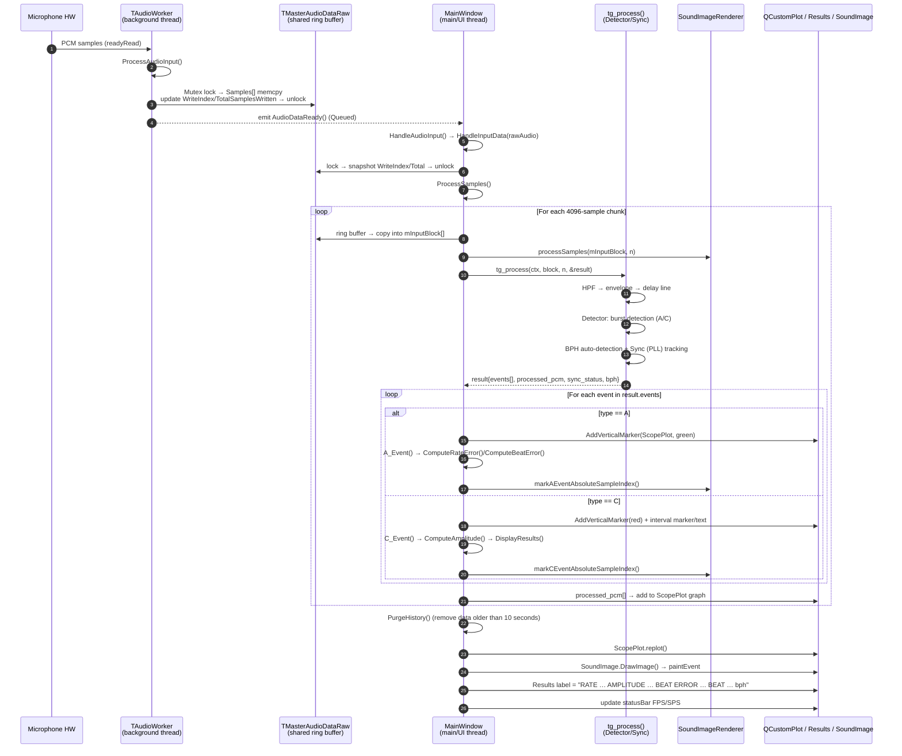
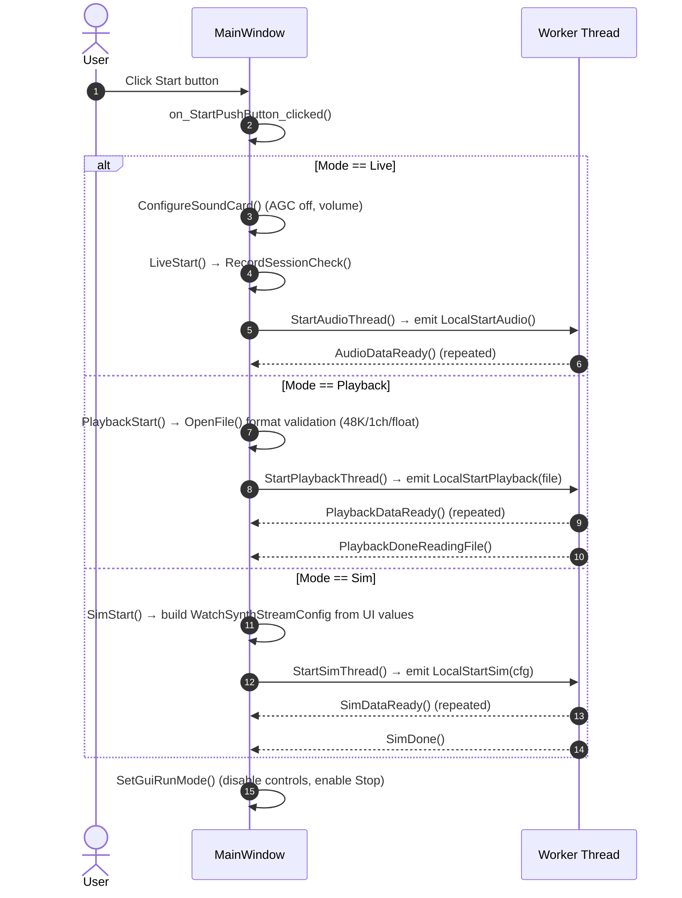

# TimeGrapher Code Analysis Document

> This document analyzes the structure and runtime behavior of the baseline TimeGrapher (Qt/C++) code.
> The diagrams are written in Mermaid, so they render directly in VS Code (Markdown Preview Mermaid extension) or on GitHub.

---

## 1. Overview

TimeGrapher is a Qt desktop application that takes the **acoustic signal (tick/tock)** of a mechanical watch as microphone input and computes and visualizes
**rate (daily error, s/d), amplitude (degrees), beat error (ms), and BPH** in real time.

The architecture is clearly organized into **three layers + a multithreaded pipeline**.

| Layer | Responsibility | Key Components |
|------|------|---------------|
| **① Signal Acquisition** | Loads audio samples into a shared ring buffer | `TAudioWorker`, `TPlaybackWorker`, `TSimWorker`, `TMasterAudioDataRaw` |
| **② Signal Processing / Measurement (DSP & Detection)** | Filtering → event detection → BPH sync → measurement | `tg_*` C API (`Timegrapher`, `Dsp`, `Detector`, `Bph`) |
| **③ Presentation / GUI** | Rendering of graphs, markers, and the summary bar; user controls | `MainWindow`, `SoundImageRenderer`, `SoundImageWidget`, QCustomPlot |

Data follows a unidirectional flow: **background thread (acquisition)** → **Qt signal/slot** → **main thread (measurement + rendering)**.
The three input modes (Live / Playback / Sim) all converge into the same `TMasterAudioDataRaw`
ring buffer, so the downstream measurement pipeline operates independently of the input source.

---

## 2. Module Map

```
TimeGrapher/
├── Main.cpp                     # Entry point: splash, real-time priority, launches MainWindow
│
├── ── Layer ③ GUI / Presentation ──
├── MainWindow.{h,cpp,ui}        # Central orchestrator (~1500 lines). Manages threads/measurement/rendering
├── SoundImageRenderer.{h,cpp}   # beat-folded sound image rendering (draws directly into QImage)
├── SoundImageWidget.{h,cpp}     # Thin QWidget wrapper that draws the QImage to the screen
├── qcustomplot.{h,cpp}          # External graphing library (RatePlot/ScopePlot)
│
├── ── Layer ② Signal Processing / Measurement ──
├── Timegrapher.{h,cpp}          # tg_* public API. context owns and assembles DSP+Detector+Sync
├── Dsp.{h,cpp}                  # tg_hpf_t (high-pass), tg_envelope_t (envelope)
├── Detector.{h,cpp}             # Silence-based burst detector → generates A/C events
├── Bph.{h,cpp}                  # Phase-score-based automatic BPH detection + tg_sync_t (PLL sync)
├── RollingAverage.{h,cpp}       # Moving average (beat error / amplitude smoothing)
├── RollingLeastSquares.{h,cpp}  # Moving least squares (rate slope estimation)
│
├── ── Layer ① Signal Acquisition ──
├── SharedAudio.h                # TMasterAudioDataRaw (mutex-protected shared ring buffer)
├── AudioWorker.{h,cpp}          # Real-time microphone capture (QAudioSource)
├── PlaybackWorker.{h,cpp}       # WAV file playback streaming
├── SimWorker.{h,cpp}            # Synthetic watch-signal generation streaming
├── WatchSynthStream.{h,cpp}     # Watch acoustic synthesis engine (C library)
├── WavStreamWriter.{h,cpp}      # Recording storage (IEEE float WAV)
├── WaveHeader.h                 # RIFF/WAVE header struct
│
└── ── Platform-dependent audio control ──
    ├── WindowsAudio.{h,cpp}     # WASAPI: volume setting, AGC off
    └── LinuxAudio.{h,cpp}       # ALSA: volume setting, AGC off
```

---

## 3. Class Diagram

```mermaid
classDiagram
    direction TB

    class MainWindow {
        <<QMainWindow>>
        -tg_config_t mCfg
        -tg_context_t* mCtx
        -TMasterAudioDataRaw* mRawAudio
        -TAudioWorker* mAudioWorker
        -TPlaybackWorker* mPlaybackWorker
        -TSimWorker* mSimWorker
        -SoundImageRenderer mSoundRenderer
        -TRateErrorEvents mRateErrorEvents
        -TBeatErrorEvents mBeatErrorEvents
        -TAmplitudeErrorEvents mAmplitudeEvents
        -WavStreamWriter* mWavWriter
        +HandleAudioInput()
        +HandlePlaybackInput()
        +HandleSimInput()
        -ProcessSamples(SharedDataPtr)
        -A_Event(t, bph)
        -C_Event(t, bph)
        -ComputeRateError()
        -ComputeBeatError()
        -ComputeAmplitude()
        -DisplayResults()
        ~signal LocalStartAudio()
        ~signal LocalStartPlayback()
        ~signal LocalStartSim()
    }

    class TAudioWorker {
        <<QObject>>
        -QAudioSource* mAudioInput
        -TMasterAudioDataRaw* mRawAudio
        +StartAudioRecording(dev, rate, vol)
        +ProcessAudioInput()
        ~signal AudioDataReady()
    }
    class TPlaybackWorker {
        <<QObject>>
        -TMasterAudioDataRaw* mRawAudio
        +StartPlayback(fileName)
        ~signal PlaybackDataReady()
        ~signal PlaybackDoneReadingFile()
    }
    class TSimWorker {
        <<QObject>>
        -TMasterAudioDataRaw* mRawAudio
        -WatchSynthStream stream
        +StartSim(cfg)
        ~signal SimDataReady()
        ~signal SimDone()
    }
    class TMasterAudioDataRaw {
        <<struct>>
        +QMutex Mutex
        +float* Samples
        +uint WriteIndex
        +uint64 TotalSamplesWritten
        +double FPS, SPF, SPS
    }

    class tg_context_t {
        <<struct>>
        +tg_hpf_t hpf
        +tg_envelope_t env
        +tg_detector_t det
        +tg_sync_t sync
        +int current_bph
        +double ev_history[256]
        +float* delay_buf
    }
    class tg_config_t {
        <<struct>>
        +double sample_rate
        +tg_bph_mode_t bph_mode
        +int manual_bph
        +double hpf_cutoff_hz
        +tg_c_placement_t c_placement
    }
    class tg_result_t {
        <<struct>>
        +tg_sync_status_t sync_status
        +int detected_bph
        +tg_event_t* events
        +float* processed_pcm
        +float noise_floor
    }
    class tg_event_t {
        <<struct>>
        +double time_seconds
        +uint64 sample_index
        +tg_event_type_t type (A/C)
        +int onset_valid
    }
    class tg_hpf_t {
        <<struct>>
        +double a, x_prev, y_prev
    }
    class tg_envelope_t {
        <<struct>>
        +double alpha, state
    }
    class tg_detector_t {
        <<struct>>
        +int in_burst
        +double noise_floor
        +double signal_ceiling
        +float* env_ring
        +tg_detector_process()
    }
    class tg_sync_t {
        <<struct>>
        +int bph, synced
        +double beat_period
        +double ac_offset
        +double next_a_time
        +tg_sync_update()
    }

    class SoundImageRenderer {
        -QImage* image
        -uint64 processed_samples
        +initialize(img, cfg)
        +processSamples(samples, n)
        +setBph(bph)
        +markAEventAbsoluteSampleIndex()
        +markCEventAbsoluteSampleIndex()
    }
    class SoundImageWidget {
        <<QWidget>>
        -QImage* image
        +CreateImage()
        +DrawImage()
        +GetImage() QImage*
        #paintEvent()
    }

    class RollingAverage {
        -deque~double~ window
        +Add(v) double
        +GetAverage() double
    }
    class RollingLeastSquares {
        -double* x_buf, y_buf
        +AddPoint(x, y)
        +GetRate(slope) bool
    }
    class WatchSynthStream {
        <<C lib>>
        +watch_synth_stream_fill_f32()
    }
    class WavStreamWriter {
        -QFile m_file
        +open(path, rate, ch)
        +write(samples, n)
        +close()
    }

    MainWindow "1" o-- "1" tg_context_t : owns (mCtx)
    MainWindow "1" *-- "1" tg_config_t : mCfg
    MainWindow "1" o-- "0..1" TAudioWorker : owns
    MainWindow "1" o-- "0..1" TPlaybackWorker : owns
    MainWindow "1" o-- "0..1" TSimWorker : owns
    MainWindow "1" o-- "1" TMasterAudioDataRaw : owns
    MainWindow "1" *-- "1" SoundImageRenderer
    MainWindow "1" *-- "3" RollingAverage : via event structs
    MainWindow "1" *-- "2" RollingLeastSquares : via mRateErrorEvents
    MainWindow ..> tg_result_t : tg_process() returns
    MainWindow "1" o-- "0..1" WavStreamWriter

    TAudioWorker --> TMasterAudioDataRaw : writes
    TPlaybackWorker --> TMasterAudioDataRaw : writes
    TSimWorker --> TMasterAudioDataRaw : writes
    TSimWorker *-- WatchSynthStream

    tg_context_t *-- tg_hpf_t
    tg_context_t *-- tg_envelope_t
    tg_context_t *-- tg_detector_t
    tg_context_t *-- tg_sync_t
    tg_result_t *-- "*" tg_event_t

    SoundImageRenderer --> SoundImageWidget : draws into GetImage()
```

> Structs (`T*`, `tg_*`) are shown together with classes. Qt objects are distinguished by the `<<QObject>>` stereotype.



### 3.1 Measurement-accumulation structs (inside MainWindow)

| Struct | Purpose | Key Members |
|--------|------|-----------|
| `TRateErrorEvents` | Accumulates tic/toc timing error → rate (s/d) | `xTic/xToc/yTic/yToc`, `RlsTicRate/RlsTocRate`, `RlsRate`, `BPH` |
| `TBeatErrorEvents` | A-A interval asymmetry → beat error (ms) | `BeatErrorTimes[3]`, `RollBeatError` |
| `TAmplitudeErrorEvents` | A→C interval → amplitude (degrees) | `Last_A_Event`, `RollAmplitude`, `Amplitude_Tic/Toc` |

---

## 4. Sequence Diagram — Live Measurement Path (Core)

> The entire process from one block of microphone samples arriving to the screen being updated. (Playback/Sim follow the same path; only the entry signal differs.)



### 4.1 Measurement Formula Summary

- **Rate (s/d)**: Applies moving least squares (`RollingLeastSquares`) to the tic/toc timing-error time series to obtain the slope → converted to a per-day value.
- **Beat error (ms)**: From the intervals `t1, t2` of three consecutive A events, `|(t1−t2)/2|` (ms), then moving average.
- **Amplitude (degrees)**: `Amplitude = LiftAngle / sin( (2π·T1) / (7200/BPH) )`, where `T1 = A→C time`. The tic/toc average is then moving-averaged.
- **BPH**: Automatically detected by sweeping the candidate list using the phase score (`tg_phase_score`) in `Bph.cpp`, then tracked by the `tg_sync_t` PLL.

---

## 5. Sequence Diagram — Mode Branching at Start



---

## 6. Key Runtime Notes

- **Threading model**: Each acquisition worker runs on its own `QThread` and protects writes with `TMasterAudioDataRaw.Mutex`.
  The main thread computes the amount of new data from the delta of `TotalSamplesWritten` (a monotonically increasing counter), reading in a near lock-free manner.
- **Input abstraction**: The three workers (Live/Playback/Sim) follow the same ring-buffer write pattern and the same `*DataReady` signal pattern.
  → The measurement pipeline (`tg_process`) has no knowledge whatsoever of the input source. (Key to extensibility/testability.)
- **Envelope delay line (~50ms)**: The processed envelope is delayed before output in order to align the event timestamps with the waveform drawn on screen.
- **C placement mode (`c_placement`)**: Allows choosing whether the C event timing uses the peak or the onset (detected via a backward walk) — directly tied to amplitude accuracy.
- **No Test Position feature**: The current code has no position selection/display logic at all (a project task item). Since the measurement summary is generated in a single place, `DisplayResults()`, position display can be started by simply appending a string there.

---

## 7. More Efficient Methods for Code Analysis (Recommended)

Documents/diagrams are merely a "snapshot of the present" and become stale as the code changes. The following are supplementary means to keep the analysis **continuous and accurate**.

### 7.1 Automatic Diagram Generation (prevents manual diagrams from going stale)
- **Doxygen + Graphviz**: Even without comments, with `EXTRACT_ALL=YES`, `HAVE_DOT=YES`, `CALL_GRAPH=YES`, and `CALLER_GRAPH=YES`,
  it automatically generates class/collaboration/call graphs as HTML. Most painless for mixed C/C++ code.
  → Keeping just a single `Doxyfile` refreshes the latest graphs on every build.
- **clang-uml**: Takes `compile_commands.json` (already present in the build folder) as input and **extracts Mermaid/PlantUML class and sequence diagrams directly from the code**.
  Ideal for replacing/validating the hand-drawn diagrams in this document.
- **CMake graphviz**: `cmake --graphviz=deps.dot` generates a target/library dependency graph.

### 7.2 Compiler-Based Static Exploration (most accurate)
- This project already generates `build/.../compile_commands.json`. Leveraging it enables accurate analysis:
  - **clangd** (an alternative to the VS Code C/C++ extension): accurate "Go to definition / Find all references / Call hierarchy".
    Far more accurate than grep — no false positives such as `CH` in `each`.
  - **clang-tidy**: static checks for bugs, undefined behavior, and complexity.
- In VS Code, simply enable the clangd extension and point it to the `compile_commands.json` path to use it immediately.

### 7.3 Runtime Behavior Tracing (compensates for the blind spots of static analysis)
- **Logging injection**: Insert temporary `qDebug()` at the entry of `tg_process()`, at event occurrences, and at `DisplayResults()` call sites,
  then run in **Sim mode (synthetic input with known BPH/amplitude/beat error)** → verify the actual call order/period.
  Because Sim mode knows the ground-truth values, it is optimal for validating the measurement pipeline (no separate hardware needed).
- **Qt signal/slot tracing**: Set breakpoints at `QObject::connect` sites in the debugger, or observe event flow via `QT_FUNCTION_TIME` / the
  `QT_LOGGING_RULES` environment variable.

### 7.4 Analysis Priority (time-saving route)
1. `MainWindow::ProcessSamples()` — the hub where everything converges. **Start reading here and the whole picture becomes clear.**
2. `Timegrapher.cpp tg_process()` — the core measurement algorithm.
3. `SharedAudio.h` + the three workers — where the data comes from.
4. `DisplayResults()` / `CreateGraphs()` — how the results are shown.

### 7.5 Recommended Tools Summary Table

| Purpose | Tool | Notes |
|------|------|------|
| Auto-generate class/call graphs | **Doxygen + Graphviz** | Works even without comments, most general-purpose |
| Code → UML (Mermaid/PlantUML) | **clang-uml** | Uses `compile_commands.json`, for validating this document |
| Accurate reference/definition lookup | **clangd** | Removes grep false positives |
| Static bug checks | **clang-tidy** | UB/complexity |
| Dependency graph | **cmake --graphviz** | Target level |
| Runtime flow verification | **Sim mode + qDebug** | No hardware needed, has ground-truth values |

---

*This document is based on static code analysis. For detailed algorithm parameters / version (V5.x) notation, please also refer to the comments in `Detector.cpp`, `Timegrapher.cpp`, and `Bph.cpp`.*
