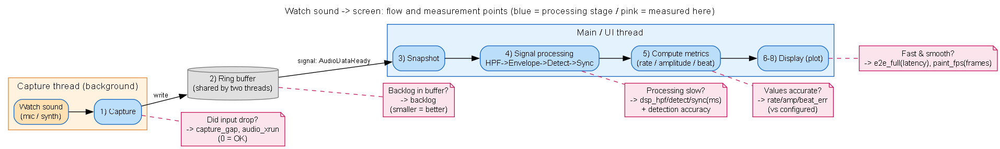
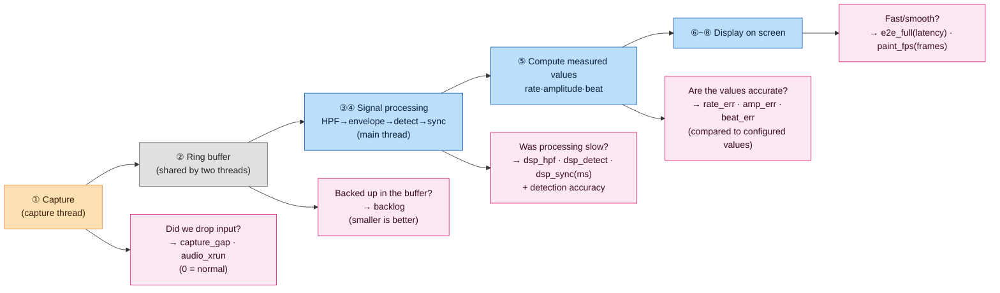
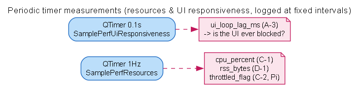
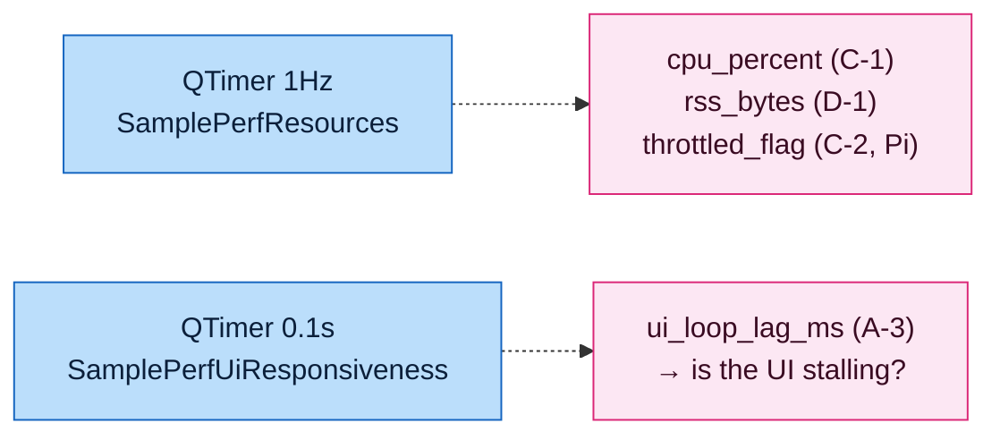

# Performance Measurement Overview — Signal Input → Processing → Computation → UI

> **With this single document**: ① the full pipeline of how a signal flows from input → processing → computation → screen, ② **what is measured** at each point, and ③ **how to analyze** the result file (`perf_log.csv`).
> For details, see [PERF_LOG_GUIDE](PERF_LOG_GUIDE.md) (metric dictionary) · [PERF_CODE_MAP](PERF_CODE_MAP.md) (code locations) · [PI_MEASUREMENT_CHECKLIST](PI_MEASUREMENT_CHECKLIST.md) (Pi procedure).

---

## 0. 5-Second Summary for First-Time Readers

- **What does this program (TimeGrapher) do?** It **listens to the 'tick–tock' sound of a mechanical watch through a microphone → analyzes it → and displays it as a graph on the screen.** (Diagnoses whether the watch runs fast/slow and whether it is accurate.)
- **What is this document?** It explains **how to measure** how fast (latency), loss-free (drops), and accurate (measured values) that "**sound → screen**" process is.
- **One-line analogy** 🏃: As the sound travels along the **journey** `[mic] → [processing] → [screen]`, we **time each segment with a stopwatch** and **count whether anything was dropped** along the way. Every measured value is accumulated **one line at a time** in the `perf_log.csv` file.

### The 5 Terms You Must Know (knowing just these is enough)
| Term | Plain meaning |
|------|---------|
| **beat · A/C** | The sound made when the watch ticks once. **A** = the start sound, **C** = the end sound (these two points are used to measure the watch) |
| **latency** | The time it takes from the moment a sound is made → until it appears on screen (ms). **Shorter is better** (target ≤50ms) |
| **drop** | **Losing data along the way.** **Should be 0 when normal** |
| **frame** | One redraw of the screen. The **more frames per second**, the smoother the display |
| **metric** | A single measured value. Recorded one line at a time in `perf_log.csv` as `name, value, unit` |

> 💡 The figure in §1 below draws that "journey" **color-coded by thread (worker)** (orange = capture, blue = main/UI), and the **pink notes mark "what is measured here."** If a term trips you up, come back to the table above.

---

## 1. Full Pipeline + Measurement Points (one figure)

> How to read it: **the top horizontal row = the journey of the sound** (left→right). The colors represent a **two-thread (worker) structure** — orange boxes = the **capture thread**, blue boxes = the **main/UI thread**, the cylinder in the middle = the **ring buffer shared by the two threads**. Below each stage, the **pink note = "what is measured here → which value (metric) is obtained → the verdict."**
>


> One-line summary of the figure above: **the sound flows from ①→⑧**, and the pink note beside/below each stage shows **"what is measured there → the resulting value (metric) → the pass criterion."**
> (Figure source: [perf_pipeline.dot](perf_pipeline.dot) — after editing, regenerate with `dot -Tpng perf_pipeline.dot -o perf_pipeline.png`)

<details>
<summary>📐 Same figure as mermaid code (for GitHub/browser — click to expand)</summary>



</details>

> 📌 **Periodic measurements** (figure below) also run on the **main thread** via timers (independent of the beat flow).

### Separate (independent of the beat flow) — Periodic Timers


<details>
<summary>📐 Same figure as mermaid code (click to expand)</summary>



</details>

---

## 1.5 In Plain Terms — "Where" Data/Frames Are Lost (drop points)

> In a pipeline, **"when the front is fast but the back can't keep up,"** data is lost at that point. Where the loss happens differs by segment.

```
 [mic] ─(write)─▶ [ring buffer] ─(read)─▶ [main processing/computation] ─(request)─▶ [screen render] ─▶ screen
     │                  │                                            │
 capture_gap          backlog                                     paint_fps
 audio_xrun                                                       (frame drop)
 "device too slow?"  "consumer too slow?"                        "render too slow?"
 = input loss        = backed up in buffer                       = missed screen refresh
```

| Segment | Who can't keep up | Symptom | metric to watch |
|------|------------------|------|-------------|
| mic → ring buffer | the **device/capture** can't keep up in real time | **permanent loss** of input data | `capture_gap_growth`↑ · `audio_xrun` |
| ring buffer → processing | the **main thread (consumer)** can't keep up with reads | **backs up and accumulates** in the buffer (latency↑) | `backlog_samples`↑ |
| processing → screen | the **render** can't keep up | the screen refreshes **intermittently** (stuttering) | `paint_fps`↓ (**frame drop**) |

### 🎞 What is a frame drop? (in particular)
- **frame drop = the screen isn't drawn in time, so a refresh is skipped** (the video looks choppy).
- Flow: when processing finishes, a **`replot request`** is sent → the actual drawing happens on the **next tick of the event loop** (deferred render). Under heavy load, drawing falls behind, so the **number of screen refreshes per second (`paint_fps`) drops** = frame drop.
- ⚠️ **The number of `replot requests` > the number of actual `paint`s is normal** — `rpQueuedReplot` **batches multiple requests into a single draw** (coalescing, efficient). **This is not a drop.**
- A **real frame drop** = when `paint_fps` **suddenly plummets** under load (e.g., adding tabs takes it from 30fps→5fps).
- Measurement: `paint_fps` (actual screen refreshes per second) + `replot_req` in `extra` (number of requests). Guide **§F-1 (QA-SC-01) "frame drop ≤10% when increasing tabs 1→12"** = judged by the `paint_fps` degradation rate as the tab count increases (after tabs are implemented).
- Check: `grep ",paint_fps," perf_log.csv`

---

## 2. Stage ↔ Thread ↔ Measurement Purpose ↔ Result-File Check (master table)

| Stage | Thread | metric | **Measurement purpose (why measure)** | **Check / verdict in the result file** |
|------|--------|--------|------------------------|------------------------------|
| ① Capture | capture | `capture_gap`·`audio_xrun`·`bg_*` | Is data received **without dropping**? | `capture_gap_growth`≈0 **and** no `audio_xrun` · `bg_sps`≈configured sps |
| ③ Snapshot→processing | main | `cap2proc`·`backlog` | **How long does the received signal wait** before processing? | `backlog` increasing = wait↑ · `cap2proc` trend |
| ④-a HPF | main | `dsp_hpf_ms` | Is the filter stage heavy? | Compare stage share (usually small) |
| ④-b Envelope | main | `dsp_env_ms` | Is the envelope stage heavy? | Compare stage share |
| ④-c Detection | main | `dsp_detect_ms` / `onset·peak_err` / detection rate | Is detection **slow** (time) / **accurate** (quality)? | If `dsp_detect` is most of the DSP it is the bottleneck · `onset≤0.5`/`peak≤0.2ms` · detection rate `≥95%` |
| ④-d Sync | main | `dsp_sync_ms` | Is the sync·BPH stage heavy? | Compare stage share (usually small) |
| ⑤ Computation | main | `rate/beat/amp_err` | Do the measured values **match the configured values** (Sim)? | `±1 s/d` · `±0.1 ms` · `±5°` |
| ⑦ replot request | main | `proc2disp`·`e2e_latency`·`fg_*` | Processing→request latency · foreground throughput (for breakdown) | `e2e_latency` = lower bound · `proc2disp` breakdown |
| ⑧ Actual pixels | main (event loop) | `disp_paint`·**`e2e_full`**·`paint_fps` | **True end-to-end latency** · **screen refresh rate (frame drop)** | ★`e2e_full` median·p95 ≤50/≤100ms · `paint_fps` degrading under load = frame drop |
| Periodic 1Hz | main | `cpu_percent`·`rss_bytes`·`throttled_flag` | Resource headroom · leaks · throttling | `cpu≤70%` · 30-min `rss↑≤200MB` · `throttle=0` |
| Periodic 0.1s | main | `ui_loop_lag_ms` | Is the UI **stalling**? | `≤200ms` |

> **Reading order**: ⑧ `e2e_full` for end-to-end pass/fail → if it fails, break it down with ④ (dsp_*)·⑦ (disp_paint) to find **which stage/thread is the bottleneck** → check the input side with ①③.

> **Latency summation relationship** (per-event): `e2e_full` = `cap2proc` + `proc2disp` + `disp_paint`
> And the pure signal-processing share within `proc2disp` = `dsp_total_ms` (= dsp_hpf+env+detect+sync).

---

## 2.5 Measurement Period (how often it's recorded) — code locations

> **Not everything is on a 1-second period.** The period differs by the nature of the measurement. Broadly, it splits into **① fixed periods (timer/window)** and **② per event (at the moment it occurs)**.
> When comparing the same metric over time (averages·trends), you need to know this period — e.g., for `dsp_*`·`paint_fps`·`cpu`, one line is "the representative value for that 1 second," whereas for `e2e_full`, one line is "a single event."

| Period | Measured item (metric) | Meaning | Code location |
|------|-------------------|------|-----------|
| **1 second** (timer) | `cpu_percent` · `rss_bytes` · `throttled_flag` | One process-resource sample every second | Timer [MainWindow.cpp:136](../../MainWindow.cpp#L136) `start(1000)` → [MainWindow.cpp:192](../../MainWindow.cpp#L192) `SamplePerfResources` |
| **1 second** (window aggregation) | `dsp_hpf/env/detect/sync/total_ms` | Accumulate per call → every second emit only a compressed **average (value) + max (`extra max=`)** | [Timegrapher.cpp:668](../../Timegrapher.cpp#L668) `if(now-lastEmit >= 1000.0)` |
| **1 second** (window aggregation) | `paint_fps` (+`extra replot_req`) | Count actual paints during 1 second to compute fps | [MainWindow.cpp:169](../../MainWindow.cpp#L169) `if (now - mPaintLastEmitMs >= 1000.0)` |
| **0.1 second** (timer) | `ui_loop_lag_ms` | Excess delay of the 100ms heartbeat = UI non-response time | Timer [MainWindow.cpp:144](../../MainWindow.cpp#L144) `start(100)` → [MainWindow.cpp:179](../../MainWindow.cpp#L179) `SamplePerfUiResponsiveness` |
| **2 seconds** (block) | `capture_gap_samples/growth` · `audio_xrun` · `bg_*` | Drop estimation·throughput per 2-second capture block | AudioWorker.cpp `ProcessAudioInput` |
| **per event** | `cap2proc` · `proc2disp` · `e2e_latency` · `backlog` · `fg_*` | One line each time an audio block is processed | [MainWindow.cpp](../../MainWindow.cpp) `ProcessSamples` |
| **per event** | `disp_paint_ms` · **`e2e_full_ms`** | One line each time the screen is actually drawn (afterReplot) | [MainWindow.cpp:155](../../MainWindow.cpp#L155) `OnScopeReplotted` |
| **per event** | `onset_err_ms` · `peak_err_ms` · `rate/beat/amp_err` · `a_match`/`c_match` | Each time detection/computation occurs (Sim) | MainWindow.cpp `ProcessSamples` · `DisplayResults` |
| **on fault injection** | `fault_sync_lost` · `detector_reset` | Only when a sync loss / detector reset is detected | MainWindow.cpp `ProcessSamples` (right after tg_process) |

> **Why bundle into 1 second?** `dsp_*`·`paint_fps` occur hundreds to thousands of times per second, so logging each one would flood the log. Therefore only the **average + max of a 1-second window** is kept ([Timegrapher.cpp:657-658](../../Timegrapher.cpp#L657) comment). Conversely, **the core pass/fail values like `e2e_full`·`onset_err`** matter as a distribution (median·p95), so the raw values are kept per event.

---

## 3. How to Analyze the Result File (perf_log.csv)

### 3-0. File structure
- Location: `perf_log.csv` in the app's run directory (rewritten fresh on each run)
- Columns: `t_ms, section, qa, metric, value, unit, extra` (first 2 lines are `#` comments)
- `section`/`qa` link back to this document and the guide. For detailed column meanings, see [PERF_LOG_GUIDE](PERF_LOG_GUIDE.md).

### 3-1. 4-Step Analysis (recommended order)

**STEP 1 — Does end-to-end latency meet the target? (`e2e_full`)**
```bash
grep ",e2e_full_ms," perf_log.csv | awk -F, '{print $5}' | sort -n | \
 awk '{a[NR]=$1} END{print "n="NR," median="a[int(NR/2)]," p95="a[int(NR*0.95)]," max="a[NR]}'
```
→ Compare median·p95 against **≤50ms / ≤100ms**. (⚠️ if there are dialogs/mode switches during measurement, huge outliers result → prefer the median)

**STEP 2 — If slow, which stage is the bottleneck? (breakdown)**
```bash
# breakdown between stages
for m in cap2proc_latency_ms proc2disp_latency_ms disp_paint_ms; do
 echo -n "$m avg: "; grep ",$m," perf_log.csv | awk -F, '{s+=$5;n++} END{print s/n" ms"}'; done
# the 'signal processing (DSP)' share within proc2disp — per stage
grep ",B-4," perf_log.csv      # dsp_hpf/env/detect/sync/total (1-second average, extra=max)
```
→ If `disp_paint` is large, **render bottleneck**; if `dsp_detect` is large, **detection bottleneck**; if `cap2proc` is large, **input/buffer bottleneck**.

**STEP 3 — Drops·resources·throttling? (sustainability)**
```bash
# ── audio capture drops (Live only, 2 methods) ──
grep ",capture_gap_growth," perf_log.csv   # ① estimate: sustained positive = drop (near 0 = normal)
grep ",audio_xrun," perf_log.csv           # ② direct device report: if a line 'exists', an actual xrun occurred (errcode 3=Underrun, etc.)
grep ",audio_state," perf_log.csv          #   capture state transitions (unexpected Idle = capture stopped)
# ── resources ──
grep ",rss_bytes," perf_log.csv | awk -F, '{print $1/1000" s "$5/1048576" MB"}' | tail   # memory trend
grep ",throttled_flag," perf_log.csv       # (Pi) non-0 = thermal/undervoltage
grep ",cpu_percent," perf_log.csv | awk -F, '{s+=$5;n++;if($5>m)m=$5}END{print "cpu avg="s/n" max="m}'
```
> **Audio drop verdict**: if `capture_gap_growth`≈0 **and** there are **no** `audio_xrun` rows, there are no drops. If either signal appears, a drop/error has occurred. (In Sim/Playback modes it is normal for neither to appear — since it is not real capture.)

**STEP 4 — Are the measured values accurate? (Sim, algorithm)**
```bash
for m in onset_err_ms peak_err_ms rate_err_s_per_d beaterr_err_ms amp_err_deg; do
 echo -n "$m avg: "; grep ",$m," perf_log.csv | awk -F, '{s+=$5;n++}END{print s/n}'; done
echo "detection rate = $(grep -c ',a_match,' perf_log.csv) / $(grep ',gt_total,' perf_log.csv|tail -1|awk -F, '{print $5}')"
```

### 3-2. Verdict Table (against targets)
| metric | Target | Meaning |
|--------|------|------|
| `e2e_full_ms` | avg≤50·worst≤100 | end-to-end latency |
| `dsp_total_ms` / per stage | (identify bottleneck) | signal-processing cost |
| `capture_gap_growth` | ≈0 | drops |
| `cpu_percent` | ≤70% | CPU headroom |
| `throttled_flag` | 0 | no throttling |
| `rss_bytes` | 30-min ↑≤200MB | memory/leaks |
| `onset/peak_err` | ≤0.5/≤0.2ms | identification precision |
| `rate/beat/amp_err` | ±1·±0.1·±5 | measurement accuracy |
| detection rate | ≥95%·FP≤2% | detection reliability |
| `ui_loop_lag_ms` | ≤200ms | UI response |

### 3-3. Worked Example (PC · prior measurement — refer to the *interpretation method* only)
- **End-to-end**: `e2e_full` averaged ~20ms·median 14ms in the normal range (however, the overall average including outliers was 43ms·p95 203ms ← **dialog/mode-switch spikes** during measurement). → Filter outliers **with the median**, and re-measure without dialogs.
- **Breakdown**: `disp_paint` averaging ~31ms was far larger than `proc2disp` ~10ms → **the render/event loop is the main part of the latency**.
  (The per-stage `dsp_*` did not exist in the previous run — the instrumentation was added afterward — so it will be **recorded from the next run onward**, enabling separation of which of HPF/detect/sync is heavy.)
- **Accuracy**: onset 0.08ms·peak 0.03ms·rate ±0.3 s/d·amp **+3.5° (systematic bias)**·detection rate 93.6% (short run → with a longer run, 97%+).
- ⚠️ All figures are **for PC reference only**. **The final verdict is on the Pi** ([PI_MEASUREMENT_CHECKLIST](PI_MEASUREMENT_CHECKLIST.md)).

---

## 3.5 Turning Logging On and Off (per-group ON/OFF)

> Measurement items **can be turned on and off per group.** Turning a group off means it leaves nothing in `perf_log.csv`·the console, and **even the string formatting and disk-flush overhead for those lines disappears** (= less observer effect). Used in load/Pi measurements to **enable only the metrics you must see** and increase measurement precision.
> ⚠️ Turning off affects **only 'recording'** — product behavior·computation are unchanged. **It is a compile-time switch, so changing a value requires a rebuild** to take effect.

### Where to change it
In [PerfInstrumentation.h](../../PerfInstrumentation.h), change the macros in the "logging ON/OFF settings" block at the top to `1` (record) / `0` (off) and **rebuild**:

```cpp
#define PERF_MASTER_ENABLE   1   // 0 = all logging OFF (ignores everything below)

#define PERF_GRP_LATENCY     1   // §A-1/A-2  latency (end-to-end·stage breakdown·backlog)
#define PERF_GRP_UI          1   // §A-3      UI responsiveness
#define PERF_GRP_FAULT       1   // §A-4      fault awareness
#define PERF_GRP_CAPTURE     1   // §B-1      capture drop/error/state
#define PERF_GRP_THROUGHPUT  1   // §B-3      effective throughput (bg/fg)
#define PERF_GRP_DSP         1   // §B-4      per-stage signal-processing time
#define PERF_GRP_RESOURCES   1   // §C-1/C-2  CPU%·throttling
#define PERF_GRP_MEMORY      1   // §D-1      memory (RSS)
#define PERF_GRP_PRECISION   1   // §E-2      onset/peak precision
#define PERF_GRP_FRAME       1   // §F-1      screen refresh rate (frame drop)
#define PERF_GRP_ACCURACY    1   // §G-1/G-2  measurement accuracy·detection rate
```

### Group ↔ metrics that disappear when turned off
| Macro | §Section | metrics that disappear when off |
|--------|-------|----------------------|
| `PERF_GRP_LATENCY` | A-1/A-2 | `e2e_full_ms`·`e2e_latency_ms`·`cap2proc`·`proc2disp`·`disp_paint`·`backlog_samples` |
| `PERF_GRP_UI` | A-3 | `ui_loop_lag_ms` |
| `PERF_GRP_FAULT` | A-4 | `fault_sync_lost`·`detector_reset` |
| `PERF_GRP_CAPTURE` | B-1 | `capture_gap_samples/growth`·`audio_xrun`·`audio_state` |
| `PERF_GRP_THROUGHPUT` | B-3 | `bg_sps/fps/spf`·`fg_sps/fps/spf` |
| `PERF_GRP_DSP` | B-4 | `dsp_hpf/env/detect/sync/total_ms` |
| `PERF_GRP_RESOURCES` | C-1/C-2 | `cpu_percent`·`throttled_flag` |
| `PERF_GRP_MEMORY` | D-1 | `rss_bytes` |
| `PERF_GRP_PRECISION` | E-2 | `onset_err_ms`·`peak_err_ms` |
| `PERF_GRP_FRAME` | F-1 | `paint_fps` |
| `PERF_GRP_ACCURACY` | G-1/G-2 | `rate_err`·`amp_err`·`beat_err`·`a_match`·`c_match`·`gt_total` |

### How it works (one line)
At the entry of `Perf::log(section, …)`, the `section` ("A-1", etc.) is mapped to a group, and if that group is `0` it **returns immediately** ([PerfInstrumentation.cpp](../../PerfInstrumentation.cpp) `sectionEnabled()` → `log()`). A disabled group incurs no recording, formatting, or flush cost. The call-site code is not touched at all.

### Common combinations (examples)
- **End-to-end latency only, cleanly** (minimize load/observer effect): set only `LATENCY`·`FRAME` to 1, the rest to 0.
- **Accuracy/detection rate only** (Sim): set only `PRECISION`·`ACCURACY` to 1.
- **Resources/leaks only** (30-min long run): set only `RESOURCES`·`MEMORY` to 1.
- **Turn everything off** (pure performance baseline comparison): `PERF_MASTER_ENABLE 0`.

---

## 4. Related Documents
- [PERF_LOG_GUIDE.md](PERF_LOG_GUIDE.md) — metric dictionary (columns·sections·pass criteria)
- [PERF_CODE_MAP.md](PERF_CODE_MAP.md) — code location of each measurement (file·line)
- [INSTRUMENTATION_PLAN.md](INSTRUMENTATION_PLAN.md) — instrumentation status·measurement procedure
- [PERF_VERIFICATION_GUIDE.md](PERF_VERIFICATION_GUIDE.md) — verification item definitions (what·why)
- [PI_MEASUREMENT_CHECKLIST.md](PI_MEASUREMENT_CHECKLIST.md) — Pi final measurement procedure
