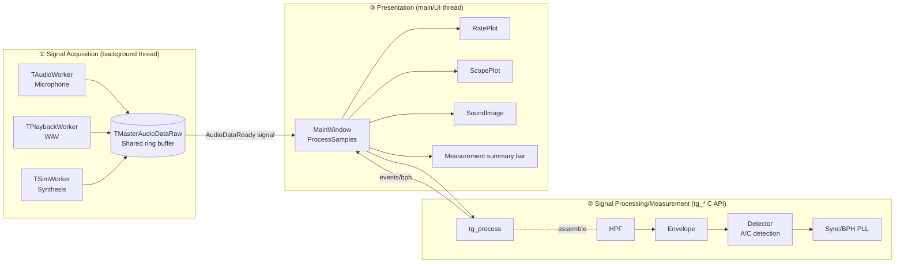
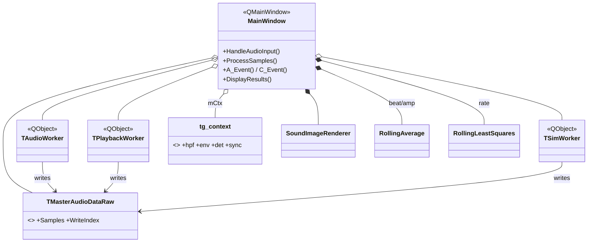
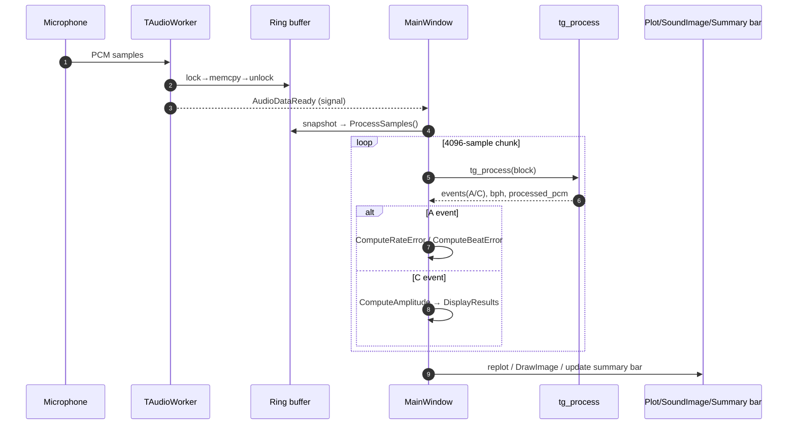
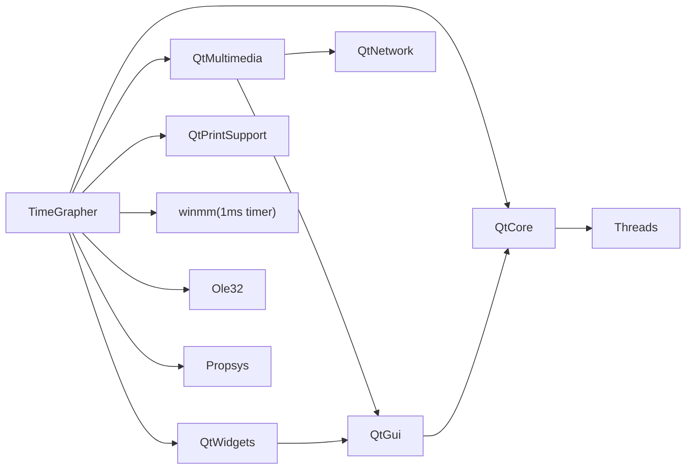
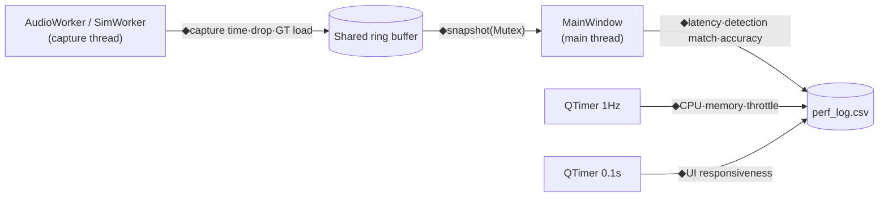
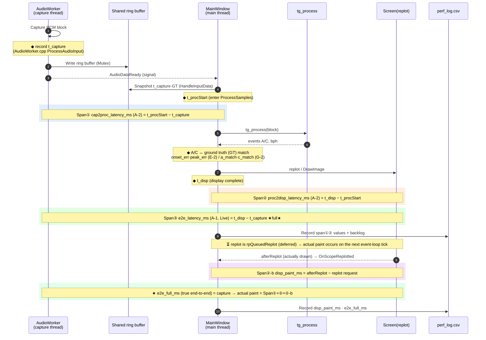
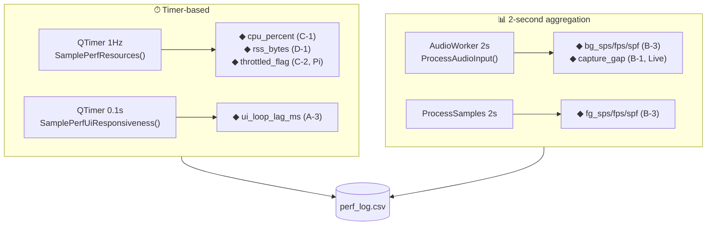

# TimeGrapher Code Analysis — Unified Index

> **See everything from this one file.** Open it with `Ctrl+Shift+V` (preview) to render the diagrams below as images,
> and jump straight to the detailed docs and auto-generated graphs via the links in the tables.

A Qt/C++ app that receives the acoustic signal of a mechanical watch and measures and visualizes **rate, amplitude, beat error, and BPH** in real time.

---

## 0. Document Map (start here)

| What you want to see | File | How to open |
|--------------|------|---------|
| **Overall overview + key diagrams** | 📍 This file | `Ctrl+Shift+V` |
| Hand-written comprehensive analysis (structure, formulas, methods) | [CodeAnalysis.md](CodeAnalysis.md) | `Ctrl+Shift+V` |
| Doxygen+CMake automated analysis results | [AutomatedAnalysis.md](AutomatedAnalysis.md) | `Ctrl+Shift+V` |
| clang-uml automated sequence diagrams | [SequenceDiagrams.md](SequenceDiagrams.md) | `Ctrl+Shift+V` |
| **Click-to-navigate full reference** (945 graphs) | `doxygen/html/index.html` | Browser |
| Build dependency graph | `doxygen/cmake_deps.svg` | Browser |
| clang-uml source diagrams | `clang-uml/*.mmd` | Mermaid preview |
| ★**Performance measurement full overview** (input→processing→computation→UI + methods) | [PERF_MEASUREMENT_OVERVIEW.md](PERF_MEASUREMENT_OVERVIEW.md) | `Ctrl+Shift+V` |
| Performance verification — what, why, pass criteria | [PERF_VERIFICATION_GUIDE.md](PERF_VERIFICATION_GUIDE.md) | `Ctrl+Shift+V` |
| **Performance log (perf_log.csv) decoding dictionary** | [PERF_LOG_GUIDE.md](PERF_LOG_GUIDE.md) | `Ctrl+Shift+V` |
| **Performance instrumentation — where in the code is it measured?** | [PERF_CODE_MAP.md](PERF_CODE_MAP.md) | `Ctrl+Shift+V` |
| Performance instrumentation status and measurement procedure | [INSTRUMENTATION_PLAN.md](INSTRUMENTATION_PLAN.md) | `Ctrl+Shift+V` |
| **Pi measurement checklist (for final verdict)** | [PI_MEASUREMENT_CHECKLIST.md](PI_MEASUREMENT_CHECKLIST.md) | `Ctrl+Shift+V` |

Regeneration settings/scripts are included in the original project: `docs/Doxyfile` · `.clang-uml` · `docs/clang-uml/gen_cdb.ps1` · `docs/gen_site.py` (not included in this shared copy)

---

## 1. Architecture at a Glance (3 layers + multithreaded)

---

## 2. Class Relationships at a Glance (core only)

> To see all members, refer to [CodeAnalysis.md §3](CodeAnalysis.md) or Doxygen `class_main_window.html`.

---

## 3. Measurement Flow at a Glance (refined clang-uml extraction)

> For the complete internal calls, see [SequenceDiagrams.md](SequenceDiagrams.md) and the source [seq_process_samples.mmd](clang-uml/seq_process_samples.mmd).

---

## 4. Build Dependencies at a Glance

> Source: `doxygen/cmake_deps.svg`. Interpretation in [AutomatedAnalysis.md §3](AutomatedAnalysis.md).

---

## 5. At a Glance — Usage Tips

- **This README + preview (`Ctrl+Shift+V`)** = view all four diagrams (structure/class/flow/dependencies) on one screen by scrolling.
- **If you need click-to-navigate** → `doxygen/html/index.html` (browser). Includes per-function caller/callee graphs.
- **Regeneration**: After code changes, run the runbook in [AutomatedAnalysis.md §5](AutomatedAnalysis.md) / [SequenceDiagrams.md §5](SequenceDiagrams.md).

---

## 6. Performance Verification — Log (perf_log.csv) ↔ Code Location (at a glance)

> When you run it, a **`perf_log.csv`** is created in the working directory. CSV columns: `t_ms,section,qa,metric,value,unit,extra`.
> They are linked to [PERF_VERIFICATION_GUIDE.md](PERF_VERIFICATION_GUIDE.md) and M1 via `section` (e.g. `A-1`) and `qa` (e.g. `QA-LT-01`).
> The table below = an index to immediately find **"where in the code does this measurement come from."** (Line numbers are as of writing; for the latest, search the source for `Perf::log(`)

### Where instrumentation hooks in

### Measurement spans at a glance — "from where to where" is latency measured
> The **timestamps (◆)** from when a beat is captured until it appears on screen, and which metric each **span (shaded)** between them corresponds to.

> ✅ End-to-end is **split into two spans and both are measured**: `e2e_latency_ms` (lower bound = up to the request) + `disp_paint_ms` (the deferred paint) = **`e2e_full_ms` (true end-to-end)**.
> **The QA-LT-01 (≤50ms) verdict is made using `e2e_full_ms`.** (afterReplot = the signal that ScopePlot has actually finished drawing)

### Periodic measurement (independent of beat flow · timer/aggregation)

### Measurement value → code location index
| Log metric | section·qa | Measured code location (file · function) | What is measured |
|-------------|-----------|--------------------------------|-------------|
| `e2e_latency_ms` | A-1·QA-LT-01 | `MainWindow.cpp` `ProcessSamples` (right after replot request) ← capture `AudioWorker.cpp` `ProcessAudioInput` | End-to-end **lower bound** (up to request, Live) |
| `e2e_full_ms` | A-1·QA-LT-01 | `MainWindow.cpp` `OnScopeReplotted` (afterReplot) | ★**true end-to-end**: capture→actual pixels (Live) |
| `cap2proc_latency_ms` | A-2·QA-LT-01 | `MainWindow.cpp` `ProcessSamples` (processing start) | Span①: capture→processing (Live) |
| `proc2disp_latency_ms` | A-2·QA-LT-01 | `MainWindow.cpp` `ProcessSamples` (replot request) | Span②: processing→request |
| `disp_paint_ms` | A-2·QA-LT-01 | `MainWindow.cpp` `OnScopeReplotted` (afterReplot) | Span②-b: request→actual paint |
| `paint_fps` | F-1·QA-SC-01 | `MainWindow.cpp` `OnScopeReplotted` (1s aggregation) | Actual screen refresh rate (**frame drop**) |
| `backlog_samples` | A-2·QA-LT-01 | `MainWindow.cpp` `ProcessSamples` (entry) | Amount of unprocessed backlog |
| `ui_loop_lag_ms` | A-3·QA-RT-01 | `MainWindow.cpp` `SamplePerfUiResponsiveness` (0.1s timer) | UI responsiveness |
| `fault_sync_lost`·`detector_reset` | A-4·QA-US-01 | `MainWindow.cpp` `ProcessSamples` (right after tg_process) | Fault event timestamps |
| `capture_gap_samples`·`_growth` | B-1·QA-RT-02 | `AudioWorker.cpp` `ProcessAudioInput` (2s) | Estimated capture drops (Live) |
| `audio_xrun`·`audio_state` | B-1·QA-RT-02 | `AudioWorker.cpp` `ProcessAudioInput`/`stateChangeAudioInput` | Capture errors reported directly by the device (Live) |
| `bg_sps/fps/spf` | B-3·QA-RT-02 | `AudioWorker.cpp` `ProcessAudioInput` (2s) | Capture throughput (Live) |
| `fg_sps/fps/spf` | B-3·QA-RT-01 | `MainWindow.cpp` `ProcessSamples` (2s) | Foreground throughput |
| `dsp_hpf/env/detect/sync/total_ms` | B-4·QA-RT-01 | `Timegrapher.cpp` `tg_process` (per stage, 1s aggregation) | ★Per-stage signal processing time |
| `cpu_percent` | C-1·QA-EE-01 | `MainWindow.cpp` `SamplePerfResources` (1Hz) | CPU% |
| `throttled_flag` | C-2·QA-EE-01 | `MainWindow.cpp` `SamplePerfResources` → `PerfInstrumentation` `readThrottled` | Pi throttle |
| `rss_bytes` | D-1·QA-RT-03 | `MainWindow.cpp` `SamplePerfResources` (1Hz) | Memory |
| `onset_err_ms` | E-2·QA-AC-02 | `MainWindow.cpp` `ProcessSamples` (A event, GT match) | A onset precision (Sim) |
| `peak_err_ms` | E-2·QA-AC-02 | `MainWindow.cpp` `ProcessSamples` (C event, GT match) | C peak precision (Sim) |
| `rate_err_s_per_d`·`beaterr_err_ms`·`amp_err_deg` | G-1·QA-CO-01 | `MainWindow.cpp` `DisplayResults` | Measured value − configured value (Sim) |
| `a_match`·`c_match`·`gt_total` | G-2·QA-AC-01 | `MainWindow.cpp` `ProcessSamples`+`DisplayResults` | Detection rate (Sim) |

> The ground truth (GT) is loaded in `SimWorker.cpp` `StartSim` → `SharedAudio.h` `GtBeats[]` → snapshotted in `MainWindow.cpp` `HandleInputData`.
> Common instrumentation infrastructure (clock·CPU·RSS·throttle·CSV, **Win/Pi branching**): `PerfInstrumentation.{h,cpp}`.
> For **exact line-level tracing** → [PERF_CODE_MAP.md](PERF_CODE_MAP.md). For **log line interpretation** → [PERF_LOG_GUIDE.md](PERF_LOG_GUIDE.md).

### What gets populated per mode
| Mode | Populated | Empty (normal) |
|------|--------|----------|
| **Sim** | A-2(`backlog`·`proc2disp`)·A-3·A-4·B-3(`fg_*`)·C·D·**E·G** | A-1(`e2e`)·A-2(`cap2proc`)·B-1·B-3(`bg_*`) — all Live-only |
| **Live** | A-1·A-2(all)·A-3·A-4·B(all: `bg_*`·`fg_*`·`capture_gap`)·C·D | E·G (no ground truth) |

> Reason: `cap2proc`·`e2e` are wrapped in `if(perfIsLive)` in the code and are only recorded in Live, and `bg_*`·`capture_gap` exist only in `AudioWorker` (Live capture). (In actual Sim logs, `cap2proc`·`e2e`·`bg_*`·`capture_gap` are also empty = normal)

---

### (Optional) If you really need a "single-screen HTML"
If you want to merge all `.md` files (including Mermaid) into a **single HTML** and view them at once in a browser, let me know.
I will create `docs/index.html` that bundles README·CodeAnalysis·Automated·Sequence into one tab/scroll.
