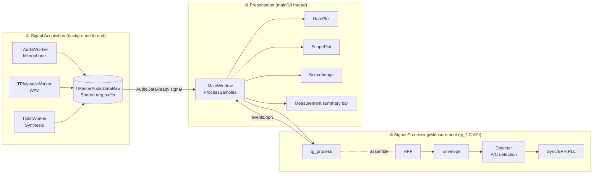
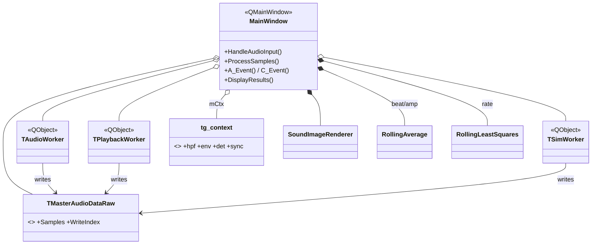
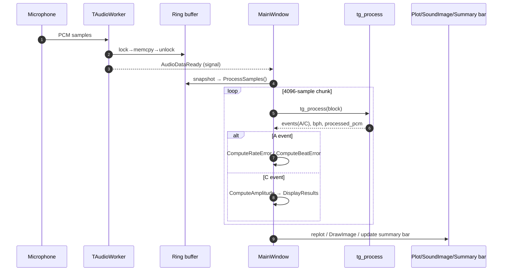
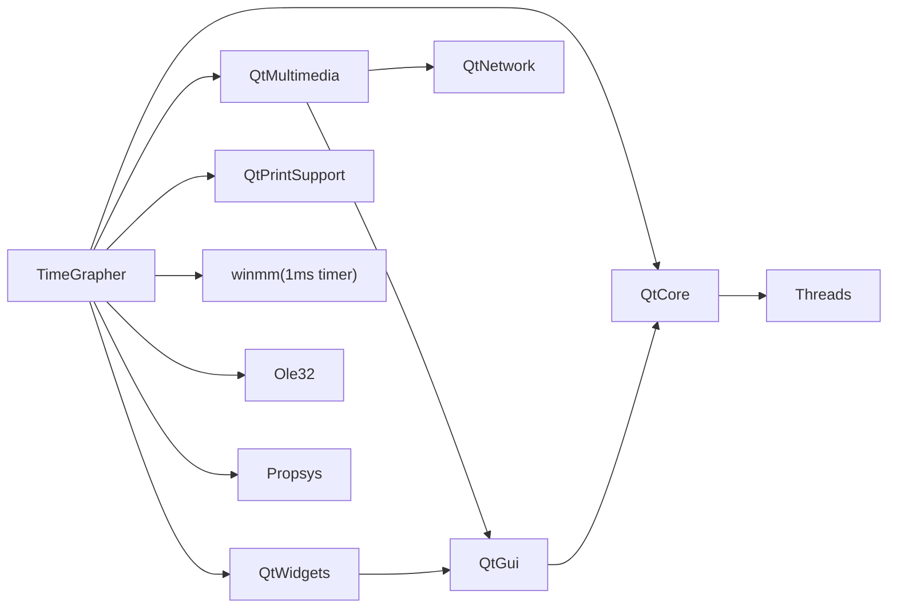

# TimeGrapher Code Analysis — Unified Index

> **See the whole code structure from this one file.** Open it with `Ctrl+Shift+V` (preview) to render the diagrams below as images,
> and jump straight to the detailed docs and auto-generated graphs via the links in the tables.
> **Performance (perf) measurement analysis has a separate index** → [PERF_ANALYSIS.md](PERF_ANALYSIS.md).

A Qt/C++ app that receives the acoustic signal of a mechanical watch and measures and visualizes **rate, amplitude, beat error, and BPH** in real time.

---

## 0. Document Map (start here)

| What you want to see | File | How to open |
|--------------|------|---------|
| **Overall overview + key diagrams** | 📍 This file | `Ctrl+Shift+V` |
| Hand-written comprehensive analysis (structure, formulas, methods) | [CodeAnalysis.md](CodeAnalysis.md) | `Ctrl+Shift+V` |
| Doxygen+CMake automated analysis results | [AutomatedAnalysis.md](AutomatedAnalysis.md) | `Ctrl+Shift+V` |
| clang-uml automated sequence diagrams | [SequenceDiagrams.md](SequenceDiagrams.md) | `Ctrl+Shift+V` |
| **Click-to-navigate full reference** (945 graphs) | `doxygen/html/index.html` | Browser |
| Build dependency graph | `doxygen/cmake_deps.svg` | Browser |
| clang-uml source diagrams | `clang-uml/*.mmd` | Mermaid preview |
| ★**Performance (perf) measurement analysis** (separate index) | [PERF_ANALYSIS.md](PERF_ANALYSIS.md) | `Ctrl+Shift+V` |

Regeneration settings/scripts are included in the original project: `docs/Doxyfile` · `.clang-uml` · `docs/clang-uml/gen_cdb.ps1` · `docs/gen_site.py` (not included in this shared copy)

---

## 1. Architecture at a Glance (3 layers + multithreaded)

---

## 2. Class Relationships at a Glance (core only)

> To see all members, refer to [CodeAnalysis.md §3](CodeAnalysis.md) or Doxygen `class_main_window.html`.

---

## 3. Measurement Flow at a Glance (refined clang-uml extraction)

> For the complete internal calls, see [SequenceDiagrams.md](SequenceDiagrams.md) and the source [seq_process_samples.mmd](clang-uml/seq_process_samples.mmd).

---

## 4. Build Dependencies at a Glance

> Source: `doxygen/cmake_deps.svg`. Interpretation in [AutomatedAnalysis.md §3](AutomatedAnalysis.md).

---

## 5. At a Glance — Usage Tips

- **This README + preview (`Ctrl+Shift+V`)** = view all four diagrams (structure/class/flow/dependencies) on one screen by scrolling.
- **If you need click-to-navigate** → `doxygen/html/index.html` (browser). Includes per-function caller/callee graphs.
- **If you need performance measurement analysis** → [PERF_ANALYSIS.md](PERF_ANALYSIS.md) (perf_log.csv ↔ code location, measurement spans).
- **Regeneration**: After code changes, run the runbook in [AutomatedAnalysis.md §5](AutomatedAnalysis.md) / [SequenceDiagrams.md §5](SequenceDiagrams.md).

---

### (Optional) If you really need a "single-screen HTML"
If you want to merge all `.md` files (including Mermaid) into a **single HTML** and view them at once in a browser, let me know.
I will create `docs/index.html` that bundles README·CodeAnalysis·Automated·Sequence into one tab/scroll.
