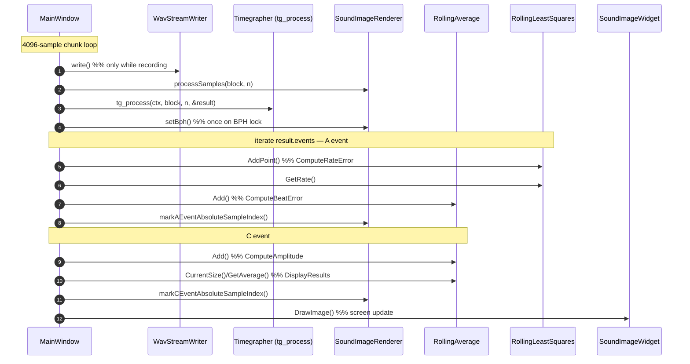
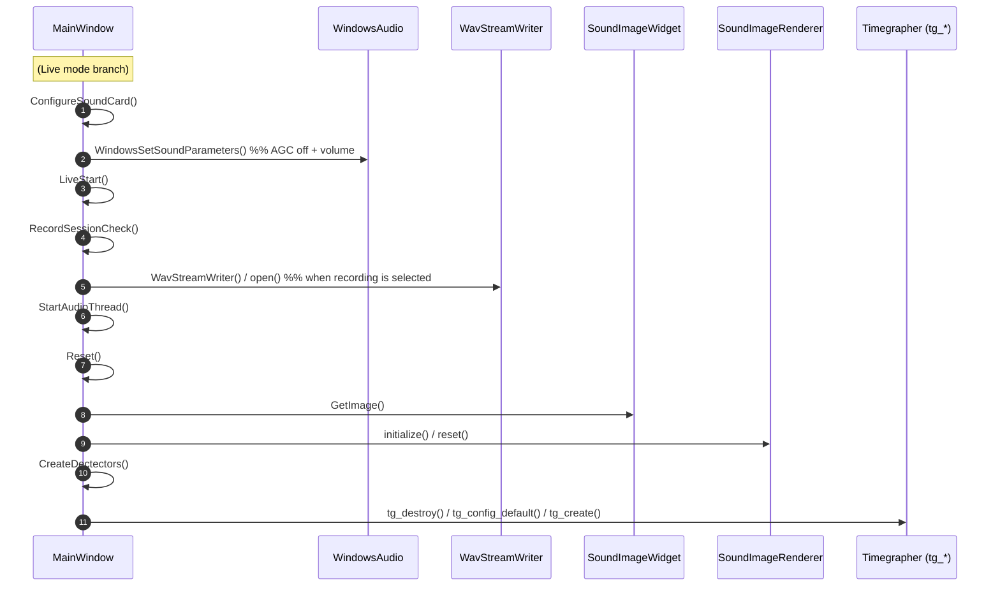

# TimeGrapher Sequence Diagrams (auto-extracted with clang-uml)

> The diagrams in this document are call sequences **automatically extracted** from the source by
> **clang-uml 0.6.2** (libclang 20.1.7), using `compile_commands.json` as input. They are the result of
> cross-validating and refining the hand-drawn sequence diagrams in [CodeAnalysis.md](CodeAnalysis.md)
> at the compiler level.

Generated by: clang-uml 0.6.2 · Input: Qt Creator clangd compilation database (with shim applied)

---

## 1. What Was Run & Which Problems Were Solved

```
clang-uml --generator mermaid     # Based on the .clang-uml configuration, generates 3 diagrams
```

### Toolchain Version Conflict and Resolution (recorded for reproducibility and regeneration)
- **Problem**: The project's `compile_commands.json` (generated by Qt Creator clangd) forces
  **Qt Creator's clang 21 intrinsic headers** together with `-nostdinc`. However, clang-uml's built-in
  parser is **clang 20**, so it could not interpret the clang21-only builtins in the
  `avx10_2*` / `*transpose*` / `vp2intersect` headers that clang21's `immintrin.h` **unconditionally includes**,
  which caused the AST build of `MainWindow.cpp` (which includes Qt) to fail.
- **Resolution**: Since the TimeGrapher code **does not use these SIMD intrinsics at all**, we inserted
  `-isystem <shim>` into a copy of `compile_commands.json` (`cdb/`) **ahead of** the clang21 path,
  so that the 23 affected headers are intercepted by **empty shim headers**. The original SDK is left untouched.
  Automation script: `docs/clang-uml/gen_cdb.ps1` (included in the original project)

---

## 2. Generated Artifacts (raw automated output)

| File | Lines | Contents |
|------|-------|----------|
| [clang-uml/class_gui.mmd](clang-uml/class_gui.mmd) | 849 | Class diagram of named classes such as GUI / worker / renderer |
| [clang-uml/seq_process_samples.mmd](clang-uml/seq_process_samples.mmd) | 1599 | Full internal call tree of `ProcessSamples()` (including everything inside the renderer) |
| [clang-uml/seq_start_button.mmd](clang-uml/seq_start_button.mmd) | 436 | `on_StartPushButton_clicked()` startup flow |

> The raw `.mmd` files are very detailed, capturing every internal helper and lambda (= accurate but large).
> §3 and §4 below present versions that have been **refined to only the high-level calls** from those extraction
> results to improve readability (the content matches the tool output).

---

## 3. Measurement Path Sequence — `ProcessSamples()` (refined version)

This is the ordered list of only the `MainWindow` outgoing calls extracted by clang-uml.
(The dozens of self-calls inside the original `SoundImageRenderer` are omitted — see the [original mmd](clang-uml/seq_process_samples.mmd))



**Facts confirmed by the tool**
- `ProcessSamples` is the single hub of measurement, and it flows in the above call order: `tg_process → (A:Rate/BeatError) → (C:Amplitude/DisplayResults) → rendering`.
- `RollingLeastSquares` is used for rate (slope), and `RollingAverage` is used to smooth beat error / amplitude — consistent with the hand-drawn analysis.
- `setBph()` is called only at the moment of BPH lock, activating `SoundImageRenderer` rendering.

---

## 4. Startup Flow Sequence — `on_StartPushButton_clicked()` (refined version)



The full branching (including Playback/Sim) and all helper calls are in the [original seq_start_button.mmd](clang-uml/seq_start_button.mmd).

---

## 5. Regeneration Runbook

```powershell
# 0) First time only: install clang-uml (GitHub release, NSIS)
#    https://github.com/bkryza/clang-uml/releases → clang-uml-0.6.2-win64.exe (/S silent install)
$env:PATH = "C:\Program Files\clang-uml\bin;$env:PATH"

cd d:\CMU_2026\Oversea_Cource\project_code\TimeGrapher

# 1) Regenerate the shim-applied compile DB (avoids clang21 ↔ libclang20 conflict)
pwsh docs\clang-uml\gen_cdb.ps1

# 2) Generate the diagrams (using the .clang-uml configuration)
clang-uml --generator mermaid          # → docs/clang-uml/*.mmd
# (if you want PlantUML)  clang-uml --generator plantuml
```

Configuration: `.clang-uml` (included in the original project) — `compilation_database_dir: docs/clang-uml/cdb`,
`class_gui` (class) / `seq_process_samples` / `seq_start_button` (sequence, with `start_from` specified).

> When the clock code changes and you rebuild, Qt Creator updates `.qtc_clangd/compile_commands.json`.
> After that, just re-run steps 1) → 2) above to bring the diagrams up to date.

---

## 6. Limitations / Caveats

- **Anonymous typedef structs** (such as `tg_config_t`, i.e. `typedef struct {…} X;`) cannot have their names
  recovered by clang-uml and are shown as `(anonymous_NNNN)`. For clean relationships of the `tg_*` types, refer to
  the hand-drawn [CodeAnalysis.md](CodeAnalysis.md) §3.
  (Named `struct tg_context {…}` and the enums are shown correctly.)
- The original sequence `.mmd` files are very long, including lambdas and inline helpers. Large diagrams can be
  heavy in the Mermaid renderer, so use the refined versions in §3 and §4 of this document for an overview, and
  the original files for precise tracing.
- The shim only emptied **unused SIMD intrinsic headers**, so it has no effect on the analysis of the clock
  signal-processing / measurement / GUI code.
