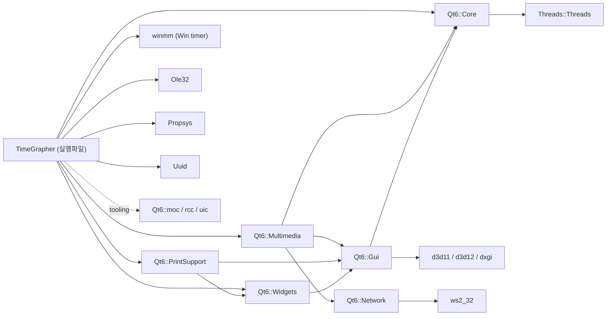

# TimeGrapher 자동 코드 분석 결과 (Automated Analysis)

> 이 문서는 손으로 작성한 [CodeAnalysis.md](CodeAnalysis.md) 와 달리, **도구를 실제로 실행**해서
> 코드로부터 직접 추출한 분석 산출물을 정리한 것입니다. 코드가 바뀌면 명령 한 줄로 다시 생성됩니다.

생성 일자: 2026-06-03 · 실행 환경: Windows 11, MinGW/Qt 6.11.1

---

## 1. 무엇을 실행했나

| 도구 | 버전 | 입력 | 산출물 |
|------|------|------|--------|
| **Doxygen** | (WinLibs/MinGW) | 프로젝트 `*.cpp/*.h` (qcustomplot·build 제외) | 크로스레퍼런스 HTML 220페이지 + **SVG 그래프 945개** |
| **Graphviz `dot`** | 15.0.0 | Doxygen/CMake의 `.dot` | 상속도·협력도·호출그래프·의존성그래프 렌더링 |
| **CMake `--graphviz`** | 3.30.5 | 기존 빌드 캐시 | 타깃 의존성 그래프 (`cmake_deps.dot/.svg`) |

> 선택 이유: 이 세 도구는 **소스 주석이 없어도** 컴파일러/빌드시스템 수준의 사실(클래스 멤버, 호출 관계,
> 링크 의존성)을 그대로 뽑아내므로, `grep` 기반 수작업 분석의 오탐(예: `each` 안의 `CH`)과
> 다이어그램 노후화 문제를 동시에 해결한다.

---

## 2. 생성된 산출물 위치

```
docs/
├── Doxyfile                       # Doxygen 설정 (재생성용)
└── doxygen/
    ├── html/
    │   ├── index.html             # ★ 진입점 — 브라우저로 열기
    │   ├── annotated.html         # 전체 클래스/구조체 목록
    │   ├── inherits.html          # 전체 상속 계층도
    │   ├── files.html             # 파일/include 관계
    │   ├── class_main_window.html # MainWindow: 멤버 + 협력도 + 메서드별 호출그래프
    │   ├── class_sound_image_renderer.html
    │   ├── class_t_audio_worker.html / class_t_playback_worker.html / class_t_sim_worker.html
    │   ├── struct_t_master_audio_data_raw.html
    │   ├── structtg__context.html / structtg__detector__t.html / structtg__sync__t.html …
    │   └── *.svg                   # 945개 (상속/협력/호출/피호출 그래프)
    ├── cmake_deps.dot              # CMake 타깃 의존성 (원본)
    └── cmake_deps.svg              # 렌더링본
```

### 바로 보기
- **메인 진입점**: `docs/doxygen/html/index.html` 을 브라우저로 연다.
- 각 클래스 페이지에는 다음이 **자동 임베드**되어 있다:
  - 협력 다이어그램(Collaboration graph) — 멤버가 참조하는 타입 관계
  - 메서드별 **Call graph**(이 함수가 무엇을 호출하는지) / **Caller graph**(누가 이 함수를 호출하는지)
- 예: `class_main_window.html` 의 `ProcessSamples` 항목 → 호출그래프에서
  `tg_process`, `A_Event`, `C_Event`, `DisplayResults`, `PurgeHistory` 로 뻗는 실제 호출 관계를 클릭으로 탐색.

---

## 3. CMake 타깃 의존성 그래프 (자동 추출 → Mermaid 변환)

`cmake --graphviz` 가 추출한 `cmake_deps.dot` 을 문서 내 열람용으로 Mermaid로 변환한 것이다.
(원본 SVG: `docs/doxygen/cmake_deps.svg`)



**읽는 법 / 발견 사항**
- 앱은 Qt **Core·Widgets·Multimedia·PrintSupport** 4개 모듈에 직접 의존한다.
  - `Multimedia` → 마이크 캡처(`QAudioSource`) · WAV
  - `PrintSupport` → QCustomPlot 요구사항(인쇄/벡터 출력)
  - `Widgets/Gui` → GUI
- **Win32 직접 링크**: `winmm`(`timeBeginPeriod` 1ms 타이머 해상도 — Main.cpp의 실시간 우선순위 설정),
  `Ole32`·`Propsys`·`Uuid`(WASAPI/COM — WindowsAudio.cpp의 AGC 끄기/볼륨).
  → **저지연 실시간** 품질속성이 빌드 의존성에까지 드러난다.
- 멀티스레딩이 `Threads::Threads` 로 명시 — 수집 워커 `QThread` 사용과 일치.

---

## 4. 자동 추출이 확인해 준 핵심 사실

수작업 분석([CodeAnalysis.md](CodeAnalysis.md))의 주장을 도구가 교차검증했다.

1. **클래스 인벤토리 (annotated.html)** — 프로젝트 1급 타입은 정확히 다음뿐:
   `MainWindow`, `TAudioWorker`, `TPlaybackWorker`, `TSimWorker`, `SoundImageRenderer`,
   `SoundImageWidget`, `WavStreamWriter`, `RollingAverage`, `RollingLeastSquares`,
   그리고 구조체 `tg_config_t / tg_context / tg_detector_t / tg_envelope_t / tg_hpf_t / tg_sync_t /
   tg_event_t / tg_result_t / tg_raw_event_t`, `TMasterAudioDataRaw`,
   `TRateErrorEvents / TBeatErrorEvents / TAmplitudeErrorEvents`, `TWaveHeader`,
   `WatchSynthStream*`. → "위치(Test Position) 관련 타입 없음"이 도구로도 확정.
2. **호출 허브 = `MainWindow::ProcessSamples`** — caller/call 그래프상 측정 경로의 분기점이
   이 함수임이 시각적으로 확인됨(분석 착수 지점으로 권장한 근거).
3. **DSP 조립 관계** — `structtg__context.html` 협력도가 `hpf → env → det → sync` 소유를 그대로 표시.

---

## 5. 재생성 런북 (코드가 바뀌면 이것만 실행)

PowerShell에서:

```powershell
# 0) 최초 1회: Graphviz 설치 (dot)
winget install --id Graphviz.Graphviz -e --silent --accept-package-agreements

# 1) Doxygen + 그래프 재생성
$env:PATH = "C:\Program Files\Graphviz\bin;$env:PATH"
cd d:\CMU_2026\Oversea_Cource\project_code\TimeGrapher\docs
doxygen Doxyfile          # → docs/doxygen/html/index.html

# 2) CMake 의존성 그래프 재생성
cd ..\build
cmake --graphviz="..\docs\doxygen\cmake_deps.dot" .
dot -Tsvg "..\docs\doxygen\cmake_deps.dot" -o "..\docs\doxygen\cmake_deps.svg"
Remove-Item "..\docs\doxygen\cmake_deps.dot.*" -Force   # 부분파일 정리
```

설정은 `docs/Doxyfile`(원본 프로젝트에 포함) 에 있다. 주요 스위치:
`EXTRACT_ALL=YES`(주석 불필요), `HAVE_DOT=YES`, `CALL_GRAPH/CALLER_GRAPH=YES`,
`UML_LOOK=YES`, `DOT_IMAGE_FORMAT=svg`, `EXCLUDE=qcustomplot*`.

---

## 6. 아직 실행하지 못한(환경 미설치) 보강 방법

다음은 현재 머신에 없어 실행하지 못했으나, 설치하면 가치가 큰 방법이다.

| 방법 | 무엇을 주는가 | 설치 |
|------|---------------|------|
| **clang-uml** | `build/compile_commands.json`(이미 존재) → **Mermaid/PlantUML 시퀀스·클래스 다이어그램**을 코드에서 직접 추출. 손그림 시퀀스도 자동화 가능 | LLVM + clang-uml |
| **clangd** | grep 오탐 없는 정확한 정의/참조/호출계층(에디터 연동) | LLVM |
| **clang-tidy** | UB·버그·복잡도 정적 점검 | LLVM |
| **Sim 모드 + qDebug** | 정답값을 아는 합성 입력으로 **런타임 호출 순서** 실증(정적분석 사각지대 보완) | 코드만 있으면 가능 |

> 특히 `compile_commands.json` 이 이미 빌드 폴더에 있으므로, **clang-uml** 한 가지만 추가 설치하면
> 본 프로젝트의 시퀀스 다이어그램까지 코드에서 자동 생성·검증할 수 있다.

---

*산출물(`docs/doxygen/`)은 자동 생성물이라 용량이 큽니다. 버전관리에 올린다면 `docs/doxygen/` 을
`.gitignore` 에 넣고 본 문서 + Doxyfile + 런북만 커밋하는 것을 권장합니다.*
