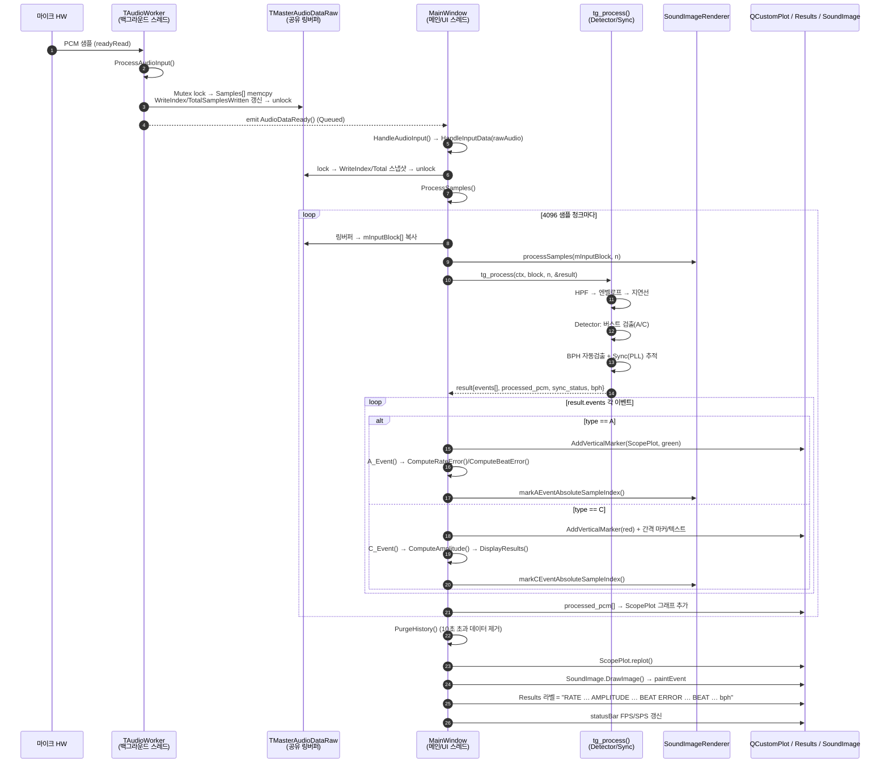
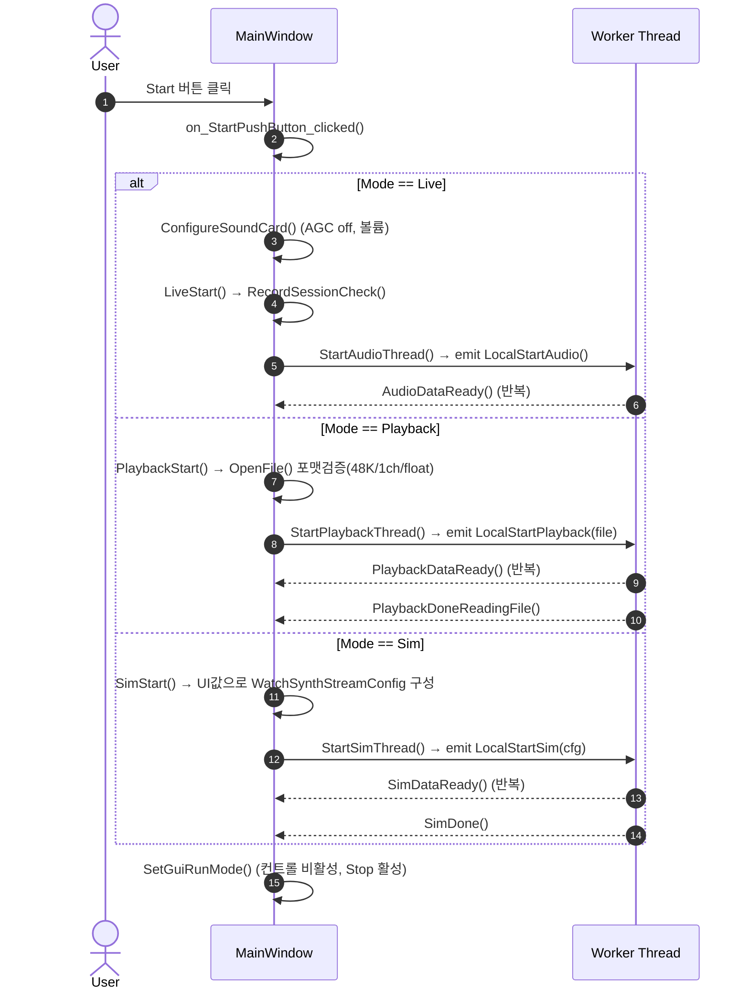

# TimeGrapher 코드 분석 문서

> 베이스라인 TimeGrapher(Qt/C++) 코드의 구조·런타임 동작을 분석한 문서입니다.
> 다이어그램은 Mermaid로 작성되어 있어 VS Code(Markdown Preview Mermaid 확장) 또는 GitHub에서 바로 렌더링됩니다.

---

## 1. 개요 (Overview)

TimeGrapher는 기계식 시계의 **음향 신호(틱/톡)** 를 마이크로 입력받아 실시간으로
**rate(일오차 s/d), amplitude(진폭°), beat error(ms), BPH** 를 계산·시각화하는 Qt 데스크톱 애플리케이션이다.

아키텍처는 명확하게 **3개 계층 + 멀티스레드 파이프라인**으로 구성된다.

| 계층 | 책임 | 핵심 구성요소 |
|------|------|---------------|
| **① 신호 수집 (Acquisition)** | 오디오 샘플을 공유 링버퍼에 적재 | `TAudioWorker`, `TPlaybackWorker`, `TSimWorker`, `TMasterAudioDataRaw` |
| **② 신호 처리/측정 (DSP & Detection)** | 필터링→이벤트 검출→BPH 동기→측정 | `tg_*` C API (`Timegrapher`, `Dsp`, `Detector`, `Bph`) |
| **③ 표현 (Presentation/GUI)** | 그래프·마커·요약바 렌더링, 사용자 제어 | `MainWindow`, `SoundImageRenderer`, `SoundImageWidget`, QCustomPlot |

데이터는 **백그라운드 스레드(수집)** → **Qt signal/slot** → **메인 스레드(측정+렌더)** 의
단방향 흐름을 따른다. 세 입력 모드(Live / Playback / Sim)는 모두 동일한 `TMasterAudioDataRaw`
링버퍼로 수렴하므로 하위 측정 파이프라인은 입력 소스에 무관하게 동작한다.

---

## 2. 파일 맵 (Module Map)

```
TimeGrapher/
├── Main.cpp                     # 진입점: 스플래시, 실시간 우선순위, MainWindow 기동
│
├── ── 계층 ③ GUI / 표현 ──
├── MainWindow.{h,cpp,ui}        # 중심 오케스트레이터(~1500줄). 스레드/측정/렌더 총괄
├── SoundImageRenderer.{h,cpp}   # beat-folded 사운드 이미지 렌더링 (QImage에 직접 그림)
├── SoundImageWidget.{h,cpp}     # QImage를 화면에 그리는 얇은 QWidget 래퍼
├── qcustomplot.{h,cpp}          # 외부 그래프 라이브러리(RatePlot/ScopePlot)
│
├── ── 계층 ② 신호처리 / 측정 ──
├── Timegrapher.{h,cpp}          # tg_* 공개 API. context가 DSP+Detector+Sync를 소유·조립
├── Dsp.{h,cpp}                  # tg_hpf_t(고역통과), tg_envelope_t(엔벨로프)
├── Detector.{h,cpp}             # 침묵기반 버스트 검출기 → A/C 이벤트 생성
├── Bph.{h,cpp}                  # 위상 점수 기반 BPH 자동검출 + tg_sync_t(PLL 동기)
├── RollingAverage.{h,cpp}       # 이동평균 (beat error / amplitude 평활)
├── RollingLeastSquares.{h,cpp}  # 이동 최소제곱 (rate 기울기 추정)
│
├── ── 계층 ① 신호 수집 ──
├── SharedAudio.h                # TMasterAudioDataRaw (뮤텍스 보호 공유 링버퍼)
├── AudioWorker.{h,cpp}          # 실시간 마이크 캡처 (QAudioSource)
├── PlaybackWorker.{h,cpp}       # WAV 파일 재생 스트리밍
├── SimWorker.{h,cpp}            # 합성 시계신호 생성 스트리밍
├── WatchSynthStream.{h,cpp}     # 시계 음향 합성 엔진 (C 라이브러리)
├── WavStreamWriter.{h,cpp}      # 녹음 저장 (IEEE float WAV)
├── WaveHeader.h                 # RIFF/WAVE 헤더 구조체
│
└── ── 플랫폼 의존 오디오 제어 ──
    ├── WindowsAudio.{h,cpp}     # WASAPI: 볼륨 설정, AGC 끄기
    └── LinuxAudio.{h,cpp}       # ALSA: 볼륨 설정, AGC 끄기
```

---

## 3. 클래스 다이어그램 (Class Diagram)

```mermaid
classDiagram
    direction TB

    class MainWindow {
        <<QMainWindow>>
        -tg_config_t mCfg
        -tg_context_t* mCtx
        -TMasterAudioDataRaw* mRawAudio
        -TAudioWorker* mAudioWorker
        -TPlaybackWorker* mPlaybackWorker
        -TSimWorker* mSimWorker
        -SoundImageRenderer mSoundRenderer
        -TRateErrorEvents mRateErrorEvents
        -TBeatErrorEvents mBeatErrorEvents
        -TAmplitudeErrorEvents mAmplitudeEvents
        -WavStreamWriter* mWavWriter
        +HandleAudioInput()
        +HandlePlaybackInput()
        +HandleSimInput()
        -ProcessSamples(SharedDataPtr)
        -A_Event(t, bph)
        -C_Event(t, bph)
        -ComputeRateError()
        -ComputeBeatError()
        -ComputeAmplitude()
        -DisplayResults()
        ~signal LocalStartAudio()
        ~signal LocalStartPlayback()
        ~signal LocalStartSim()
    }

    class TAudioWorker {
        <<QObject>>
        -QAudioSource* mAudioInput
        -TMasterAudioDataRaw* mRawAudio
        +StartAudioRecording(dev, rate, vol)
        +ProcessAudioInput()
        ~signal AudioDataReady()
    }
    class TPlaybackWorker {
        <<QObject>>
        -TMasterAudioDataRaw* mRawAudio
        +StartPlayback(fileName)
        ~signal PlaybackDataReady()
        ~signal PlaybackDoneReadingFile()
    }
    class TSimWorker {
        <<QObject>>
        -TMasterAudioDataRaw* mRawAudio
        -WatchSynthStream stream
        +StartSim(cfg)
        ~signal SimDataReady()
        ~signal SimDone()
    }
    class TMasterAudioDataRaw {
        <<struct>>
        +QMutex Mutex
        +float* Samples
        +uint WriteIndex
        +uint64 TotalSamplesWritten
        +double FPS, SPF, SPS
    }

    class tg_context_t {
        <<struct>>
        +tg_hpf_t hpf
        +tg_envelope_t env
        +tg_detector_t det
        +tg_sync_t sync
        +int current_bph
        +double ev_history[256]
        +float* delay_buf
    }
    class tg_config_t {
        <<struct>>
        +double sample_rate
        +tg_bph_mode_t bph_mode
        +int manual_bph
        +double hpf_cutoff_hz
        +tg_c_placement_t c_placement
    }
    class tg_result_t {
        <<struct>>
        +tg_sync_status_t sync_status
        +int detected_bph
        +tg_event_t* events
        +float* processed_pcm
        +float noise_floor
    }
    class tg_event_t {
        <<struct>>
        +double time_seconds
        +uint64 sample_index
        +tg_event_type_t type (A/C)
        +int onset_valid
    }
    class tg_hpf_t {
        <<struct>>
        +double a, x_prev, y_prev
    }
    class tg_envelope_t {
        <<struct>>
        +double alpha, state
    }
    class tg_detector_t {
        <<struct>>
        +int in_burst
        +double noise_floor
        +double signal_ceiling
        +float* env_ring
        +tg_detector_process()
    }
    class tg_sync_t {
        <<struct>>
        +int bph, synced
        +double beat_period
        +double ac_offset
        +double next_a_time
        +tg_sync_update()
    }

    class SoundImageRenderer {
        -QImage* image
        -uint64 processed_samples
        +initialize(img, cfg)
        +processSamples(samples, n)
        +setBph(bph)
        +markAEventAbsoluteSampleIndex()
        +markCEventAbsoluteSampleIndex()
    }
    class SoundImageWidget {
        <<QWidget>>
        -QImage* image
        +CreateImage()
        +DrawImage()
        +GetImage() QImage*
        #paintEvent()
    }

    class RollingAverage {
        -deque~double~ window
        +Add(v) double
        +GetAverage() double
    }
    class RollingLeastSquares {
        -double* x_buf, y_buf
        +AddPoint(x, y)
        +GetRate(slope) bool
    }
    class WatchSynthStream {
        <<C lib>>
        +watch_synth_stream_fill_f32()
    }
    class WavStreamWriter {
        -QFile m_file
        +open(path, rate, ch)
        +write(samples, n)
        +close()
    }

    MainWindow "1" o-- "1" tg_context_t : owns (mCtx)
    MainWindow "1" *-- "1" tg_config_t : mCfg
    MainWindow "1" o-- "0..1" TAudioWorker : owns
    MainWindow "1" o-- "0..1" TPlaybackWorker : owns
    MainWindow "1" o-- "0..1" TSimWorker : owns
    MainWindow "1" o-- "1" TMasterAudioDataRaw : owns
    MainWindow "1" *-- "1" SoundImageRenderer
    MainWindow "1" *-- "3" RollingAverage : via event structs
    MainWindow "1" *-- "2" RollingLeastSquares : via mRateErrorEvents
    MainWindow ..> tg_result_t : tg_process() returns
    MainWindow "1" o-- "0..1" WavStreamWriter

    TAudioWorker --> TMasterAudioDataRaw : writes
    TPlaybackWorker --> TMasterAudioDataRaw : writes
    TSimWorker --> TMasterAudioDataRaw : writes
    TSimWorker *-- WatchSynthStream

    tg_context_t *-- tg_hpf_t
    tg_context_t *-- tg_envelope_t
    tg_context_t *-- tg_detector_t
    tg_context_t *-- tg_sync_t
    tg_result_t *-- "*" tg_event_t

    SoundImageRenderer --> SoundImageWidget : draws into GetImage()
```

> 구조체(`T*`, `tg_*`)와 클래스를 함께 표기했다. Qt 객체는 `<<QObject>>` 스테레오타입으로 구분.



### 3.1 측정값 누적 구조체 (MainWindow 내부)

| 구조체 | 목적 | 핵심 멤버 |
|--------|------|-----------|
| `TRateErrorEvents` | tic/toc 타이밍 오차 누적 → rate(s/d) | `xTic/xToc/yTic/yToc`, `RlsTicRate/RlsTocRate`, `RlsRate`, `BPH` |
| `TBeatErrorEvents` | A-A 간격 비대칭 → beat error(ms) | `BeatErrorTimes[3]`, `RollBeatError` |
| `TAmplitudeErrorEvents` | A→C 간격 → amplitude(°) | `Last_A_Event`, `RollAmplitude`, `Amplitude_Tic/Toc` |

---

## 4. 시퀀스 다이어그램 — 라이브 측정 경로 (핵심)

> 마이크 샘플 한 블록이 들어와 화면 갱신까지 이르는 전 과정. (Playback/Sim도 동일 경로, 진입 signal만 다름)



### 4.1 측정 산식 요약

- **Rate(s/d)**: tic/toc 타이밍 오차 시계열에 이동 최소제곱(`RollingLeastSquares`)을 적용해 기울기 → 하루 환산.
- **Beat error(ms)**: 연속 3개의 A 이벤트 간격 `t1,t2`로 `|(t1−t2)/2|` (ms), 이동평균.
- **Amplitude(°)**: `Amplitude = LiftAngle / sin( (2π·T1) / (7200/BPH) )`, 여기서 `T1 = A→C 시간`. tic/toc 평균을 이동평균.
- **BPH**: `Bph.cpp`의 위상 점수(`tg_phase_score`)로 후보 목록을 스윕해 자동 검출, 이후 `tg_sync_t` PLL로 추적.

---

## 5. 시퀀스 다이어그램 — 시작(Start) 시 모드 분기



---

## 6. 핵심 런타임 메모

- **스레딩 모델**: 수집 워커는 각자 `QThread`에서 동작하며 `TMasterAudioDataRaw.Mutex`로 쓰기를 보호한다.
  메인 스레드는 `TotalSamplesWritten`(단조 증가 카운터) 델타로 새 데이터 양을 계산해 락-프리에 가깝게 읽는다.
- **입력 추상화**: Live/Playback/Sim 세 워커가 동일한 링버퍼 쓰기 패턴 + 동일한 `*DataReady` signal 패턴을 따른다.
  → 측정 파이프라인(`tg_process`)은 입력 소스를 전혀 모른다. (확장성/테스트 용이성의 핵심)
- **엔벨로프 지연선(~50ms)**: 이벤트 타임스탬프와 화면에 그릴 파형을 정렬하기 위해 처리 엔벨로프를 지연시켜 출력한다.
- **C 배치 모드(`c_placement`)**: C 이벤트 타이밍을 peak로 쓸지 onset(역방향 워크로 검출)으로 쓸지 선택 가능 — amplitude 정확도와 직결.
- **시계 위치(Test Position) 기능 없음**: 현재 코드에는 위치 선택/표시 로직이 전혀 없다(프로젝트 과제 항목). 측정 요약은 `DisplayResults()` 한 곳에서 생성되므로, 위치 표시는 여기에 문자열을 덧붙이는 것으로 시작할 수 있다.

---

## 7. 코드 분석을 위한 더 효율적인 방법 (권장)

문서/다이어그램은 "현재 스냅샷"일 뿐이며, 코드가 바뀌면 낡는다. 아래는 분석을 **지속적·정확하게** 유지하기 위한 보강 수단이다.

### 7.1 다이어그램 자동 생성 (수작업 다이어그램의 노후화 방지)
- **Doxygen + Graphviz**: 주석 없이도 `EXTRACT_ALL=YES`, `HAVE_DOT=YES`, `CALL_GRAPH=YES`, `CALLER_GRAPH=YES` 로
  클래스/협력/호출 그래프를 HTML로 자동 생성. C/C++ 혼재 코드에 가장 무난.
  → `Doxyfile` 한 개만 두면 빌드할 때마다 최신 그래프가 갱신됨.
- **clang-uml**: `compile_commands.json`(이미 build 폴더에 존재)을 입력으로 **Mermaid/PlantUML 클래스·시퀀스 다이어그램을 코드에서 직접 추출**.
  본 문서의 손그림 다이어그램을 대체/검증하는 용도로 이상적.
- **CMake graphviz**: `cmake --graphviz=deps.dot` 로 타깃/라이브러리 의존성 그래프 생성.

### 7.2 컴파일러 기반 정적 탐색 (가장 정확)
- 이 프로젝트는 이미 `build/.../compile_commands.json` 을 생성한다. 이를 활용하면 정확한 분석이 가능:
  - **clangd**(VS Code C/C++ 대안): 정확한 "Go to definition / Find all references / Call hierarchy".
    grep보다 훨씬 정확 — `each`의 `CH` 같은 오탐이 없다.
  - **clang-tidy**: 버그·미정의동작·복잡도 정적 점검.
- VS Code에서 clangd 확장을 켜고 `compile_commands.json` 경로만 지정하면 즉시 사용 가능.

### 7.3 런타임 동작 추적 (정적 분석의 사각지대 보완)
- **로깅 주입**: `tg_process()` 진입/이벤트 발생/`DisplayResults()` 호출 지점에 임시 `qDebug()`를 넣고
  **Sim 모드(BPH/amplitude/beat error를 알고 있는 합성 입력)** 로 실행 → 실제 호출 순서/주기 확인.
  Sim 모드는 정답값을 알기에 측정 파이프라인 검증에 최적(별도 하드웨어 불필요).
- **Qt 시그널/슬롯 추적**: 디버거에서 `QObject::connect` 지점에 중단점, 혹은 `QT_FUNCTION_TIME` / 환경변수
  `QT_LOGGING_RULES` 로 이벤트 흐름 관찰.

### 7.4 분석 우선순위(시간 절약 루트)
1. `MainWindow::ProcessSamples()` — 모든 것이 모이는 허브. **여기부터 읽으면 전체가 보인다.**
2. `Timegrapher.cpp tg_process()` — 측정 핵심 알고리즘.
3. `SharedAudio.h` + 3개 워커 — 데이터가 어디서 오는지.
4. `DisplayResults()` / `CreateGraphs()` — 결과가 어떻게 보이는지.

### 7.5 권장 도구 요약표

| 목적 | 도구 | 비고 |
|------|------|------|
| 클래스/호출 그래프 자동 생성 | **Doxygen + Graphviz** | 주석 없어도 동작, 가장 범용 |
| 코드→UML(Mermaid/PlantUML) | **clang-uml** | `compile_commands.json` 활용, 본 문서 검증용 |
| 정확한 참조/정의 탐색 | **clangd** | grep 오탐 제거 |
| 정적 버그 점검 | **clang-tidy** | UB/복잡도 |
| 의존성 그래프 | **cmake --graphviz** | 타깃 수준 |
| 런타임 흐름 검증 | **Sim 모드 + qDebug** | 하드웨어 불필요, 정답값 보유 |

---

*이 문서는 코드 정적 분석을 기반으로 작성되었습니다. 알고리즘 상세 파라미터/버전(V5.x) 표기는 `Detector.cpp`·`Timegrapher.cpp`·`Bph.cpp`의 주석을 함께 참고하세요.*
