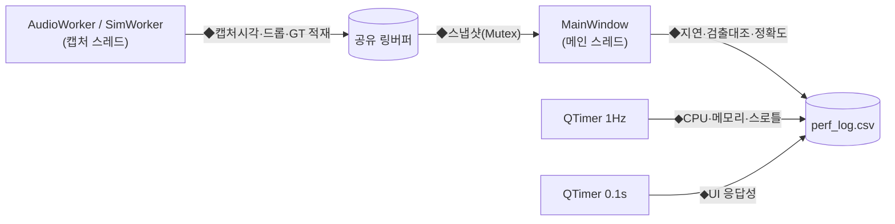
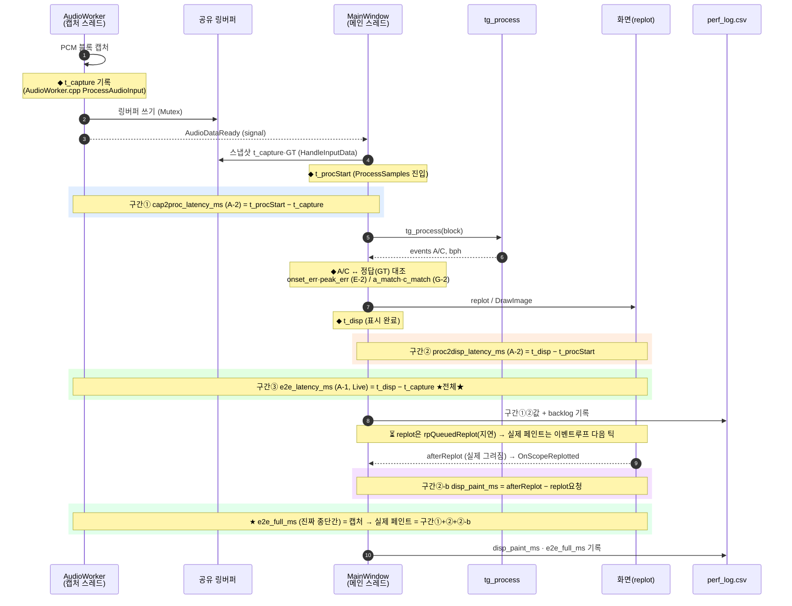
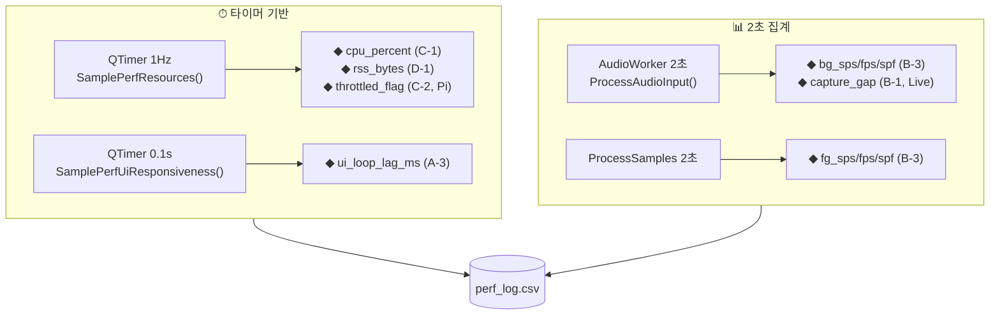

# TimeGrapher 성능 분석 — 통합 인덱스

> **성능(perf) 측정 전용 인덱스.** 코드 구조 분석은 → [README.md](README.md).
> 실행하면 작업 디렉터리에 **`perf_log.csv`** 가 생성된다. CSV 컬럼: `t_ms,section,qa,metric,value,unit,extra`.
> `section`(예 `A-1`)·`qa`(예 `QA-LT-01`)로 [PERF_VERIFICATION_GUIDE.md](PERF_VERIFICATION_GUIDE.md)·M1과 연결된다.

---

## 0. 성능 문서 지도 (여기서 출발)

| 보고 싶은 것 | 파일 | 여는 법 |
|--------------|------|---------|
| ★**성능 측정 전체 개요**(입력→처리→연산→UI + 분석법) | [PERF_MEASUREMENT_OVERVIEW.md](PERF_MEASUREMENT_OVERVIEW.md) | `Ctrl+Shift+V` |
| 성능 검증 — 무엇을·왜·합격기준 | [PERF_VERIFICATION_GUIDE.md](PERF_VERIFICATION_GUIDE.md) | `Ctrl+Shift+V` |
| **성능 로그(perf_log.csv) 해독 사전** | [PERF_LOG_GUIDE.md](PERF_LOG_GUIDE.md) | `Ctrl+Shift+V` |
| **성능 계측 — 코드 어디서 측정?** | [PERF_CODE_MAP.md](PERF_CODE_MAP.md) | `Ctrl+Shift+V` |
| 성능 계측 현황·측정 절차 | [INSTRUMENTATION_PLAN.md](INSTRUMENTATION_PLAN.md) | `Ctrl+Shift+V` |
| **Pi 측정 체크리스트(최종 판정용)** | [PI_MEASUREMENT_CHECKLIST.md](PI_MEASUREMENT_CHECKLIST.md) | `Ctrl+Shift+V` |

---

## 1. 성능 검증 — 로그(perf_log.csv) ↔ 코드 위치 (한눈에)

> 실행하면 작업 디렉터리에 **`perf_log.csv`** 가 생성된다. CSV 컬럼: `t_ms,section,qa,metric,value,unit,extra`.
> `section`(예 `A-1`)·`qa`(예 `QA-LT-01`)로 [PERF_VERIFICATION_GUIDE.md](PERF_VERIFICATION_GUIDE.md)·M1과 연결된다.
> 아래 표 = **"이 측정값은 코드 어디서 나오나"** 를 바로 찾는 색인. (라인은 작성 시점; 최신은 소스에서 `Perf::log(` 검색)

### 계측이 끼어드는 지점

### 측정 구간(span) 한눈에 — 지연은 "어디부터 어디까지"인가
> 한 비트가 캡처되어 화면에 뜨기까지의 **시각 도장(◆)** 과, 그 사이 **구간(색칠)** 이 각각 어떤 metric인지.

> ✅ 종단간을 **두 구간으로 나눠 둘 다 측정**한다: `e2e_latency_ms`(하한=요청까지) + `disp_paint_ms`(미뤄진 페인트) = **`e2e_full_ms`(진짜 종단간)**.
> **QA-LT-01(≤50ms) 판정은 `e2e_full_ms` 로** 한다. (afterReplot = ScopePlot 실제 그리기 완료 신호)

### 주기적 측정 (비트 흐름과 무관 · 타이머/집계)

### 측정값 → 코드 위치 색인
| 로그 metric | section·qa | 측정되는 코드 위치(파일 · 함수) | 무엇을 측정 |
|-------------|-----------|--------------------------------|-------------|
| `e2e_latency_ms` | A-1·QA-LT-01 | `MainWindow.cpp` `ProcessSamples`(replot 요청 직후) ← 캡처 `AudioWorker.cpp` `ProcessAudioInput` | 종단간 **하한**(요청까지, Live) |
| `e2e_full_ms` | A-1·QA-LT-01 | `MainWindow.cpp` `OnScopeReplotted`(afterReplot) | ★**진짜 종단간**: 캡처→실제 픽셀(Live) |
| `cap2proc_latency_ms` | A-2·QA-LT-01 | `MainWindow.cpp` `ProcessSamples`(처리 시작) | 구간①: 캡처→처리(Live) |
| `proc2disp_latency_ms` | A-2·QA-LT-01 | `MainWindow.cpp` `ProcessSamples`(replot 요청) | 구간②: 처리→요청 |
| `disp_paint_ms` | A-2·QA-LT-01 | `MainWindow.cpp` `OnScopeReplotted`(afterReplot) | 구간②-b: 요청→실제 페인트 |
| `paint_fps` | F-1·QA-SC-01 | `MainWindow.cpp` `OnScopeReplotted`(1초 집계) | 실제 화면 갱신율 (**frame drop**) |
| `backlog_samples` | A-2·QA-LT-01 | `MainWindow.cpp` `ProcessSamples`(진입) | 미처리 대기량 |
| `ui_loop_lag_ms` | A-3·QA-RT-01 | `MainWindow.cpp` `SamplePerfUiResponsiveness`(0.1s 타이머) | UI 응답성 |
| `fault_sync_lost`·`detector_reset` | A-4·QA-US-01 | `MainWindow.cpp` `ProcessSamples`(tg_process 직후) | 결함 이벤트 시각 |
| `capture_gap_samples`·`_growth` | B-1·QA-RT-02 | `AudioWorker.cpp` `ProcessAudioInput`(2s) | 캡처 드롭 추정(Live) |
| `audio_xrun`·`audio_state` | B-1·QA-RT-02 | `AudioWorker.cpp` `ProcessAudioInput`/`stateChangeAudioInput` | 장치 직접보고 캡처오류(Live) |
| `bg_sps/fps/spf` | B-3·QA-RT-02 | `AudioWorker.cpp` `ProcessAudioInput`(2s) | 캡처 처리량(Live) |
| `fg_sps/fps/spf` | B-3·QA-RT-01 | `MainWindow.cpp` `ProcessSamples`(2s) | 전경 처리량 |
| `dsp_hpf/env/detect/sync/total_ms` | B-4·QA-RT-01 | `Timegrapher.cpp` `tg_process`(단계별, 1s 집계) | ★신호처리 단계별 시간 |
| `cpu_percent` | C-1·QA-EE-01 | `MainWindow.cpp` `SamplePerfResources`(1Hz) | CPU% |
| `throttled_flag` | C-2·QA-EE-01 | `MainWindow.cpp` `SamplePerfResources` → `PerfInstrumentation` `readThrottled` | Pi 스로틀 |
| `rss_bytes` | D-1·QA-RT-03 | `MainWindow.cpp` `SamplePerfResources`(1Hz) | 메모리 |
| `onset_err_ms` | E-2·QA-AC-02 | `MainWindow.cpp` `ProcessSamples`(A 이벤트, GT 대조) | A onset 정밀도(Sim) |
| `peak_err_ms` | E-2·QA-AC-02 | `MainWindow.cpp` `ProcessSamples`(C 이벤트, GT 대조) | C peak 정밀도(Sim) |
| `rate_err_s_per_d`·`beaterr_err_ms`·`amp_err_deg` | G-1·QA-CO-01 | `MainWindow.cpp` `DisplayResults` | 측정값−설정값(Sim) |
| `a_match`·`c_match`·`gt_total` | G-2·QA-AC-01 | `MainWindow.cpp` `ProcessSamples`+`DisplayResults` | 검출률(Sim) |

> 정답값(GT)은 `SimWorker.cpp` `StartSim` 에서 적재 → `SharedAudio.h` `GtBeats[]` → `MainWindow.cpp` `HandleInputData` 에서 스냅샷.
> 계측 공통 인프라(시계·CPU·RSS·스로틀·CSV, **Win/Pi 분기**): `PerfInstrumentation.{h,cpp}`.
> **정확한 라인 단위 추적**은 → [PERF_CODE_MAP.md](PERF_CODE_MAP.md). **로그 줄 해석**은 → [PERF_LOG_GUIDE.md](PERF_LOG_GUIDE.md).

### 모드별로 채워지는 것
| 모드 | 채워짐 | 빔(정상) |
|------|--------|----------|
| **Sim** | A-2(`backlog`·`proc2disp`)·A-3·A-4·B-3(`fg_*`)·C·D·**E·G** | A-1(`e2e`)·A-2(`cap2proc`)·B-1·B-3(`bg_*`) — 모두 Live 전용 |
| **Live** | A-1·A-2(전체)·A-3·A-4·B(전체: `bg_*`·`fg_*`·`capture_gap`)·C·D | E·G (정답값 없음) |

> 이유: `cap2proc`·`e2e` 는 코드에서 `if(perfIsLive)` 로 묶여 Live에서만 기록되고, `bg_*`·`capture_gap` 는 `AudioWorker`(Live 캡처)에만 있다. (실측 Sim 로그에서도 `cap2proc`·`e2e`·`bg_*`·`capture_gap` 는 비어 있음 = 정상)
