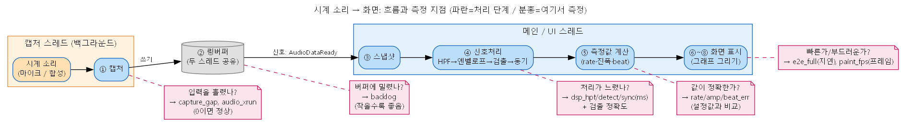
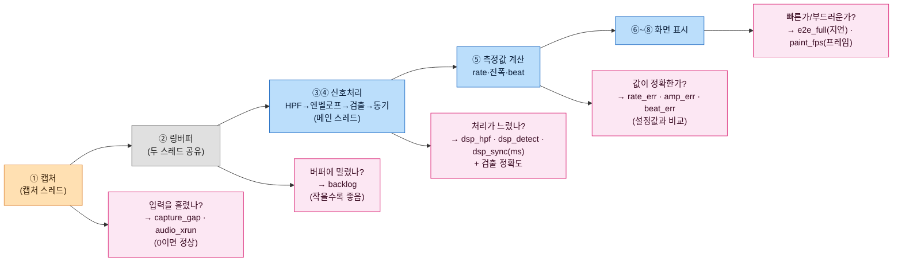
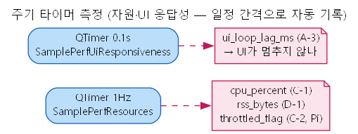
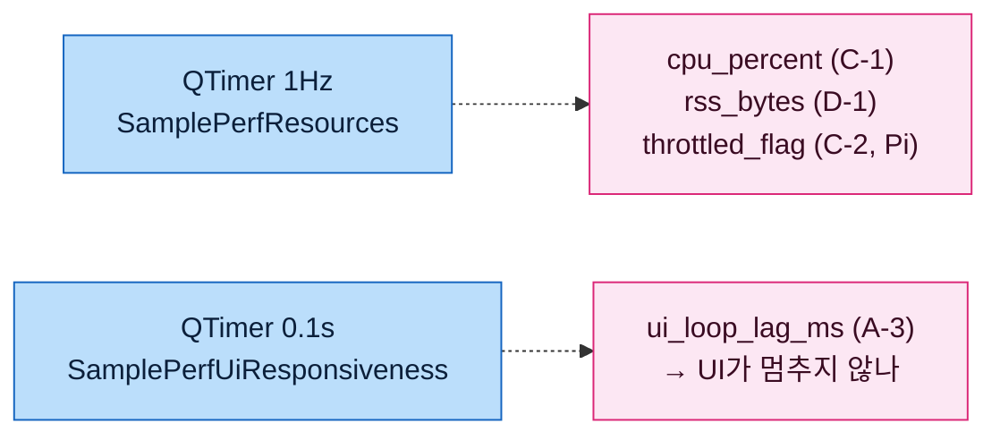

# 성능 측정 전체 개요 — 신호 입력 → 처리 → 연산 → UI

> **이 문서 하나로**: ① 신호가 입력→처리→연산→화면까지 흐르는 전체 파이프라인, ② 각 지점에서
> **무엇을 측정하는지**, ③ 결과 파일(`perf_log.csv`)을 **어떻게 분석**하는지 까지 정리한다.
> 세부는 [PERF_LOG_GUIDE](PERF_LOG_GUIDE.md)(지표 사전) · [PERF_CODE_MAP](PERF_CODE_MAP.md)(코드 위치) · [PI_MEASUREMENT_CHECKLIST](PI_MEASUREMENT_CHECKLIST.md)(Pi 절차).

---

## 0. 처음 보는 사람을 위한 5초 요약

- **이 프로그램(TimeGrapher)이 뭐 하나요?** 기계식 시계의 **'똑–딱' 소리를 마이크로 듣고 → 분석해서 → 화면에 그래프로** 보여줍니다. (시계가 빠른지/느린지, 정확한지 진단)
- **이 문서는 뭔가요?** 그 "**소리 → 화면**" 과정이 **얼마나 빠르고(지연)·안 흘리고(드롭)·정확한지(측정값)** 를 **어떻게 재는지** 정리한 것입니다.
- **한 줄 비유** 🏃: 소리가 `[마이크] → [처리] → [화면]` 으로 가는 **여정**에서, **각 구간을 스톱워치로 재고**, 중간에 **빠뜨린 게 없는지 세는** 겁니다. 잰 값은 전부 `perf_log.csv` 파일에 **한 줄씩** 쌓입니다.

### 꼭 알아야 할 용어 5개 (이것만 알면 됨)
| 용어 | 쉬운 뜻 |
|------|---------|
| **비트 · A/C** | 시계가 한 번 '똑딱'할 때 나는 소리. **A** = 시작 소리, **C** = 끝 소리 (이 두 점으로 시계를 측정) |
| **지연(latency)** | 소리 난 순간 → 화면에 뜰 때까지 걸린 시간(ms). **짧을수록 좋음** (목표 ≤50ms) |
| **드롭(drop)** | 데이터를 중간에 **흘려서 잃는 것**. **0이어야 정상** |
| **프레임(frame)** | 화면이 한 번 새로 그려지는 것. **초당 많이** 그려질수록 화면이 부드러움 |
| **metric** | 측정값 하나. `perf_log.csv`에 `이름, 값, 단위` 로 한 줄씩 기록됨 |

> 💡 아래 §1 그림은 그 "여정"을 **스레드(작업 일꾼)별 색**으로 그린 것이고(주황=캡처, 파랑=메인/UI), **분홍 메모가 "여기서 무엇을 잰다"** 는 지점입니다. 용어가 막히면 위 표로 돌아오세요.

---

## 1. 전체 파이프라인 + 측정 지점 (한 그림)

> 읽는 법: **위쪽 가로줄 = 소리의 여정**(왼→오른쪽). 색이 **두 개의 스레드(작업 일꾼) 구조**다 — 주황 박스 = **캡처 스레드**, 파란 박스 = **메인/UI 스레드**, 가운데 원통 = **두 스레드가 공유하는 링버퍼**. 각 단계 아래 **분홍 메모 = "여기서 무엇을 측정 → 무슨 값(metric)을 얻나 → 판정"**.
>


> 위 그림 한 줄 요약: **소리가 ①→⑧ 로 흐르고**, 각 단계 옆/아래 분홍 메모가 **"거기서 재는 것 → 나오는 값(metric) → 합격 기준"** 입니다.
> (그림 원본: [perf_pipeline.dot](perf_pipeline.dot) — 수정 후 `dot -Tpng perf_pipeline.dot -o perf_pipeline.png` 로 재생성)

<details>
<summary>📐 같은 그림 mermaid 코드 (GitHub/브라우저용 — 클릭해 펼치기)</summary>



</details>

> 📌 **주기 측정**(아래 그림)도 **메인 스레드**에서 타이머로 돈다(비트 흐름과 무관).

### 별도(비트 흐름과 무관) — 주기 타이머


<details>
<summary>📐 같은 그림 mermaid 코드 (클릭해 펼치기)</summary>



</details>

---

## 1.5 쉽게 — 데이터/프레임을 "어디서" 잃나 (드롭 지점)

> 파이프라인은 **"앞은 빠른데 뒤가 못 따라가면"** 그 지점에서 데이터를 잃는다. 어디서 잃는지가 구간마다 다르다.

```
 [마이크] ─(쓰기)─▶ [링버퍼] ─(읽기)─▶ [메인 처리/연산] ─(요청)─▶ [화면 렌더] ─▶ 화면
     │                  │                                            │
 capture_gap          backlog                                     paint_fps
 audio_xrun                                                       (frame drop)
 "장치가 느림?"      "소비자가 느림?"                            "렌더가 느림?"
 = 입력 손실         = 버퍼에 밀림                                = 화면 갱신 누락
```

| 구간 | 누가 못 따라가나 | 증상 | 보는 metric |
|------|------------------|------|-------------|
| 마이크 → 링버퍼 | **장치/캡처**가 실시간 못 따라감 | 입력 데이터 **영구 손실** | `capture_gap_growth`↑ · `audio_xrun` |
| 링버퍼 → 처리 | **메인 스레드(소비자)** 가 읽기 못 따라감 | 버퍼에 **밀려 쌓임**(지연↑) | `backlog_samples`↑ |
| 처리 → 화면 | **렌더**가 못 따라감 | 화면이 **띄엄띄엄** 갱신(끊김) | `paint_fps`↓ (**frame drop**) |

### 🎞 frame drop 이란? (특히)
- **frame drop = 화면을 제때 못 그려 갱신을 건너뛰는 것** (영상이 끊겨 보임).
- 흐름: 처리가 끝나면 **`replot 요청`** 을 보냄 → 실제 그리기는 **이벤트 루프 다음 틱**(지연 렌더). 부하가 크면 그리기가 밀려 **초당 화면 갱신 횟수(`paint_fps`)가 떨어짐** = frame drop.
- ⚠️ **`replot 요청` 수 > 실제 `paint` 수 는 정상**입니다 — `rpQueuedReplot`이 여러 요청을 **한 번에 묶어 그림**(coalescing, 효율적). **이건 드롭이 아님.**
- **진짜 frame drop** = 부하로 `paint_fps`가 **뚝 떨어질 때** (예: 탭 늘리니 30fps→5fps).
- 측정: `paint_fps`(초당 실제 화면 갱신) + `extra`의 `replot_req`(요청 수). 가이드 **§F-1(QA-SC-01) "탭 1→12 증가 시 프레임 드롭 ≤10%"** = 탭 수 늘리며 `paint_fps` 저하율로 판정(탭 구현 후).
- 확인: `grep ",paint_fps," perf_log.csv`

---

## 2. 단계 ↔ 스레드 ↔ 측정 목적 ↔ 결과파일 확인 (마스터 표)

| 단계 | 스레드 | metric | **측정 목적 (왜 재나)** | **결과파일에서 확인 / 판정** |
|------|--------|--------|------------------------|------------------------------|
| ① 캡처 | 캡처 | `capture_gap`·`audio_xrun`·`bg_*` | 데이터를 **흘리지 않고**(드롭) 받는가 | `capture_gap_growth`≈0 **및** `audio_xrun` 없음 · `bg_sps`≈설정sps |
| ③ 스냅샷→처리 | 메인 | `cap2proc`·`backlog` | 받은 신호가 **처리까지 얼마나 대기**하나 | `backlog` 증가=대기↑ · `cap2proc` 추세 |
| ④-a HPF | 메인 | `dsp_hpf_ms` | 필터 단계가 무거운가 | 단계 비중 비교(대개 작음) |
| ④-b 엔벨로프 | 메인 | `dsp_env_ms` | 엔벨로프 단계가 무거운가 | 단계 비중 비교 |
| ④-c 검출 | 메인 | `dsp_detect_ms` / `onset·peak_err` / 검출률 | 검출이 **느린가**(시간) / **정확한가**(품질) | `dsp_detect`가 DSP 대부분이면 병목 · `onset≤0.5`/`peak≤0.2ms` · 검출률 `≥95%` |
| ④-d 동기 | 메인 | `dsp_sync_ms` | 동기·BPH 단계가 무거운가 | 단계 비중 비교(대개 작음) |
| ⑤ 연산 | 메인 | `rate/beat/amp_err` | 측정값이 **설정값과 맞나**(Sim) | `±1 s/d` · `±0.1 ms` · `±5°` |
| ⑦ replot 요청 | 메인 | `proc2disp`·`e2e_latency`·`fg_*` | 처리→요청 지연·전경 처리량(분해용) | `e2e_latency`=하한 · `proc2disp` 분해 |
| ⑧ 실제 픽셀 | 메인(이벤트루프) | `disp_paint`·**`e2e_full`**·`paint_fps` | **진짜 종단간 지연** · **화면 갱신율(frame drop)** | ★`e2e_full` 중앙값·p95 ≤50/≤100ms · `paint_fps` 부하 시 저하=frame drop |
| 주기 1Hz | 메인 | `cpu_percent`·`rss_bytes`·`throttled_flag` | 자원 여유·누수·스로틀 | `cpu≤70%` · 30분 `rss↑≤200MB` · `throttle=0` |
| 주기 0.1s | 메인 | `ui_loop_lag_ms` | UI가 **멈추지 않나** | `≤200ms` |

> **읽는 순서**: ⑧ `e2e_full`로 종단간 합격 여부 → 안 되면 ④(dsp_*)·⑦(disp_paint)로 **어느 단계/스레드가 병목**인지 분해 → ①③로 입력측 확인.

> **지연 합산 관계**(per-event): `e2e_full` = `cap2proc` + `proc2disp` + `disp_paint`
> 그리고 `proc2disp` 안의 순수 신호처리 몫 = `dsp_total_ms`(= dsp_hpf+env+detect+sync).

---

## 2.5 측정 주기 (얼마나 자주 기록되나) — 코드 위치

> **전부 1초 주기가 아니다.** 측정 성격에 따라 주기가 다르다. 크게 **① 일정 주기(타이머/윈도우)** 와 **② 이벤트마다(발생 시점)** 로 나뉜다.
> 같은 metric을 시간축으로 비교(평균·추세)할 땐 이 주기를 알아야 한다 — 예: `dsp_*`·`paint_fps`·`cpu`는 한 줄이 "그 1초의 대푯값"이고, `e2e_full`은 한 줄이 "한 번의 이벤트"다.

| 주기 | 측정 항목(metric) | 의미 | 코드 위치 |
|------|-------------------|------|-----------|
| **1초** (타이머) | `cpu_percent` · `rss_bytes` · `throttled_flag` | 1초마다 프로세스 자원 1회 표본 | 타이머 [MainWindow.cpp:136](../../MainWindow.cpp#L136) `start(1000)` → [MainWindow.cpp:192](../../MainWindow.cpp#L192) `SamplePerfResources` |
| **1초** (윈도우 집계) | `dsp_hpf/env/detect/sync/total_ms` | 매 호출 누적 → 1초마다 **평균(value)+최대(`extra max=`)** 만 압축 emit | [Timegrapher.cpp:668](../../Timegrapher.cpp#L668) `if(now-lastEmit >= 1000.0)` |
| **1초** (윈도우 집계) | `paint_fps` (+`extra replot_req`) | 1초 동안 실제 paint 수를 세어 fps 계산 | [MainWindow.cpp:169](../../MainWindow.cpp#L169) `if (now - mPaintLastEmitMs >= 1000.0)` |
| **0.1초** (타이머) | `ui_loop_lag_ms` | 100ms 하트비트의 초과 지연 = UI 비응답 시간 | 타이머 [MainWindow.cpp:144](../../MainWindow.cpp#L144) `start(100)` → [MainWindow.cpp:179](../../MainWindow.cpp#L179) `SamplePerfUiResponsiveness` |
| **2초** (블록) | `capture_gap_samples/growth` · `audio_xrun` · `bg_*` | 2초 캡처 블록마다 드롭 추정·처리량 | AudioWorker.cpp `ProcessAudioInput` |
| **이벤트마다** | `cap2proc` · `proc2disp` · `e2e_latency` · `backlog` · `fg_*` | 오디오 블록을 처리할 때마다 1줄 | [MainWindow.cpp](../../MainWindow.cpp) `ProcessSamples` |
| **이벤트마다** | `disp_paint_ms` · **`e2e_full_ms`** | 실제 화면이 그려질(afterReplot) 때마다 1줄 | [MainWindow.cpp:155](../../MainWindow.cpp#L155) `OnScopeReplotted` |
| **이벤트마다** | `onset_err_ms` · `peak_err_ms` · `rate/beat/amp_err` · `a_match`/`c_match` | 검출/연산이 일어날 때마다(Sim) | MainWindow.cpp `ProcessSamples` · `DisplayResults` |
| **결함 주입 시** | `fault_sync_lost` · `detector_reset` | 동기 상실/검출기 리셋이 감지될 때만 | MainWindow.cpp `ProcessSamples` (tg_process 직후) |

> **왜 1초로 묶나?** `dsp_*`·`paint_fps`는 초당 수백~수천 번 일어나 매번 남기면 로그가 폭주한다. 그래서 **1초 윈도우의 평균+최대만** 남긴다([Timegrapher.cpp:657-658](../../Timegrapher.cpp#L657) 주석). 반대로 `e2e_full`·`onset_err` 같은 **합격 판정의 핵심값은 분포(중앙값·p95)가 중요**하므로 이벤트마다 원본을 남긴다.

---

## 3. 결과 파일(perf_log.csv) 분석 방법

### 3-0. 파일 구조
- 위치: 앱 실행 디렉터리 `perf_log.csv` (매 실행 새로 씀)
- 컬럼: `t_ms, section, qa, metric, value, unit, extra` (앞 2줄 `#` 주석)
- `section`/`qa` 로 본 문서·가이드와 연결. 자세한 컬럼 의미는 [PERF_LOG_GUIDE](PERF_LOG_GUIDE.md).

### 3-1. 분석 4단계 (권장 순서)

**STEP 1 — 종단간 지연이 목표를 만족하나? (`e2e_full`)**
```bash
grep ",e2e_full_ms," perf_log.csv | awk -F, '{print $5}' | sort -n | \
 awk '{a[NR]=$1} END{print "n="NR," 중앙값="a[int(NR/2)]," p95="a[int(NR*0.95)]," 최대="a[NR]}'
```
→ 중앙값·p95 를 **≤50ms / ≤100ms** 와 비교. (⚠️ 측정 중 대화상자/모드전환이 있으면 거대 이상치 → 중앙값 우선)

**STEP 2 — 느리면 어느 단계가 병목인가? (분해)**
```bash
# 단계간 분해
for m in cap2proc_latency_ms proc2disp_latency_ms disp_paint_ms; do
 echo -n "$m avg: "; grep ",$m," perf_log.csv | awk -F, '{s+=$5;n++} END{print s/n" ms"}'; done
# proc2disp 안의 '신호처리(DSP)' 몫 — 단계별
grep ",B-4," perf_log.csv      # dsp_hpf/env/detect/sync/total (1초 평균, extra=max)
```
→ `disp_paint` 이 크면 **렌더 병목**, `dsp_detect` 이 크면 **검출 병목**, `cap2proc` 크면 **입력/버퍼 병목**.

**STEP 3 — 드롭·자원·스로틀은? (지속성)**
```bash
# ── 오디오 캡처 드롭 (Live 전용, 2가지 방식) ──
grep ",capture_gap_growth," perf_log.csv   # ① 추정: 지속 양수 = 드롭 (0 부근=정상)
grep ",audio_xrun," perf_log.csv           # ② 장치 직접보고: 줄이 '있으면' 실제 xrun 발생 (errcode 3=Underrun 등)
grep ",audio_state," perf_log.csv          #   캡처 상태 전이(예기치 않은 Idle = 캡처 중단)
# ── 자원 ──
grep ",rss_bytes," perf_log.csv | awk -F, '{print $1/1000" s "$5/1048576" MB"}' | tail   # 메모리 추세
grep ",throttled_flag," perf_log.csv       # (Pi) 0 이외 = 서멀/저전압
grep ",cpu_percent," perf_log.csv | awk -F, '{s+=$5;n++;if($5>m)m=$5}END{print "cpu avg="s/n" max="m}'
```
> **오디오 드롭 판정**: `capture_gap_growth`≈0 **그리고** `audio_xrun` 행이 **없으면** 드롭 없음. 둘 중 하나라도 신호가 뜨면 드롭/오류 발생. (Sim/Playback 모드엔 둘 다 안 나오는 게 정상 — 실제 캡처가 아니므로)

**STEP 4 — 측정값은 정확한가? (Sim, 알고리즘)**
```bash
for m in onset_err_ms peak_err_ms rate_err_s_per_d beaterr_err_ms amp_err_deg; do
 echo -n "$m avg: "; grep ",$m," perf_log.csv | awk -F, '{s+=$5;n++}END{print s/n}'; done
echo "검출률 = $(grep -c ',a_match,' perf_log.csv) / $(grep ',gt_total,' perf_log.csv|tail -1|awk -F, '{print $5}')"
```

### 3-2. 판정표 (목표 대조)
| metric | 목표 | 의미 |
|--------|------|------|
| `e2e_full_ms` | 평균≤50·최악≤100 | 종단간 지연 |
| `dsp_total_ms` / 단계별 | (병목 식별) | 신호처리 비용 |
| `capture_gap_growth` | ≈0 | 드롭 |
| `cpu_percent` | ≤70% | CPU 여유 |
| `throttled_flag` | 0 | 스로틀 없음 |
| `rss_bytes` | 30분 ↑≤200MB | 메모리/누수 |
| `onset/peak_err` | ≤0.5/≤0.2ms | 식별 정밀도 |
| `rate/beat/amp_err` | ±1·±0.1·±5 | 측정 정확도 |
| 검출률 | ≥95%·FP≤2% | 검출 신뢰도 |
| `ui_loop_lag_ms` | ≤200ms | UI 응답 |

### 3-3. 워크드 예 (PC·이전 측정 — *해석 방식*만 참고)
- **종단간**: `e2e_full` 정상구간 평균 ~20ms·중앙 14ms (단, 이상치 포함 전체평균 43ms·p95 203ms ← 측정 중 **대화상자/모드전환 스파이크**). → 이상치는 **중앙값으로 거르고**, 대화상자 없이 다시 측정.
- **분해**: `disp_paint` 평균 ~31ms 가 `proc2disp` ~10ms 보다 훨씬 큼 → **렌더/이벤트루프가 지연의 주된 부분**.
  (DSP 단계별 `dsp_*` 는 이전 런엔 없었고 — 계측을 그 뒤 추가 — **다음 런부터 기록**되어 HPF/검출/동기 중 어디가 무거운지까지 분리 가능.)
- **정확도**: onset 0.08ms·peak 0.03ms·rate ±0.3 s/d·amp **+3.5°(계통 편향)**·검출률 93.6%(짧은 런 → 긴 런이면 97%+).
- ⚠️ 모든 수치는 **PC 참고용**. **최종 판정은 Pi** ([PI_MEASUREMENT_CHECKLIST](PI_MEASUREMENT_CHECKLIST.md)).

---

## 3.5 로그 켜고 끄기 (그룹별 ON/OFF)

> 측정 항목을 **그룹 단위로 켜고 끌 수 있다.** 끄면 해당 그룹은 `perf_log.csv`·콘솔에 남지 않고, **그 줄의 문자열 포맷·디스크 flush 오버헤드까지 사라진다**(= 관측자 효과↓). 부하/Pi 측정에서 **꼭 볼 지표만 켜서** 측정 정밀도를 높이는 용도.
> ⚠️ 끄는 것은 **'기록'만**이다 — 제품 동작·연산은 그대로다. **컴파일타임 스위치라 값을 바꾸면 다시 빌드**해야 적용된다.

### 어디서 바꾸나
[PerfInstrumentation.h](../../PerfInstrumentation.h) 상단 "로그 ON/OFF 설정" 블록의 매크로를 `1`(기록) / `0`(끔)로 바꾸고 **리빌드**:

```cpp
#define PERF_MASTER_ENABLE   1   // 0 = 전체 로그 OFF (아래 전부 무시)

#define PERF_GRP_LATENCY     1   // §A-1/A-2  지연(종단간·단계분해·백로그)
#define PERF_GRP_UI          1   // §A-3      UI 응답성
#define PERF_GRP_FAULT       1   // §A-4      결함 인지
#define PERF_GRP_CAPTURE     1   // §B-1      캡처 드롭/오류/상태
#define PERF_GRP_THROUGHPUT  1   // §B-3      실효 처리량(bg/fg)
#define PERF_GRP_DSP         1   // §B-4      신호처리 단계별 시간
#define PERF_GRP_RESOURCES   1   // §C-1/C-2  CPU%·스로틀
#define PERF_GRP_MEMORY      1   // §D-1      메모리(RSS)
#define PERF_GRP_PRECISION   1   // §E-2      onset/peak 정밀도
#define PERF_GRP_FRAME       1   // §F-1      화면 갱신율(frame drop)
#define PERF_GRP_ACCURACY    1   // §G-1/G-2  측정 정확도·검출률
```

### 그룹 ↔ 끄면 사라지는 metric
| 매크로 | §섹션 | 끄면 사라지는 metric |
|--------|-------|----------------------|
| `PERF_GRP_LATENCY` | A-1/A-2 | `e2e_full_ms`·`e2e_latency_ms`·`cap2proc`·`proc2disp`·`disp_paint`·`backlog_samples` |
| `PERF_GRP_UI` | A-3 | `ui_loop_lag_ms` |
| `PERF_GRP_FAULT` | A-4 | `fault_sync_lost`·`detector_reset` |
| `PERF_GRP_CAPTURE` | B-1 | `capture_gap_samples/growth`·`audio_xrun`·`audio_state` |
| `PERF_GRP_THROUGHPUT` | B-3 | `bg_sps/fps/spf`·`fg_sps/fps/spf` |
| `PERF_GRP_DSP` | B-4 | `dsp_hpf/env/detect/sync/total_ms` |
| `PERF_GRP_RESOURCES` | C-1/C-2 | `cpu_percent`·`throttled_flag` |
| `PERF_GRP_MEMORY` | D-1 | `rss_bytes` |
| `PERF_GRP_PRECISION` | E-2 | `onset_err_ms`·`peak_err_ms` |
| `PERF_GRP_FRAME` | F-1 | `paint_fps` |
| `PERF_GRP_ACCURACY` | G-1/G-2 | `rate_err`·`amp_err`·`beat_err`·`a_match`·`c_match`·`gt_total` |

### 작동 원리 (한 줄)
`Perf::log(section, …)` 진입부에서 `section`("A-1" 등)을 그룹으로 매핑해, 그 그룹이 `0`이면 **즉시 반환**한다([PerfInstrumentation.cpp](../../PerfInstrumentation.cpp) `sectionEnabled()` → `log()`). 끈 그룹은 기록도, 포맷·flush 비용도 없다. 호출부 코드는 전혀 손대지 않는다.

### 자주 쓰는 조합 (예)
- **종단간 지연만 깨끗하게**(부하/관측자효과 최소): `LATENCY`·`FRAME`만 1, 나머지 0.
- **정확도/검출률만**(Sim): `PRECISION`·`ACCURACY`만 1.
- **자원·누수만**(30분 장기): `RESOURCES`·`MEMORY`만 1.
- **전부 끄기**(순수 성능 베이스라인 대조): `PERF_MASTER_ENABLE 0`.

---

## 4. 관련 문서
- [PERF_LOG_GUIDE.md](PERF_LOG_GUIDE.md) — metric 사전(컬럼·섹션·합격기준)
- [PERF_CODE_MAP.md](PERF_CODE_MAP.md) — 각 측정의 코드 위치(파일·라인)
- [INSTRUMENTATION_PLAN.md](INSTRUMENTATION_PLAN.md) — 계측 현황·측정 절차
- [PERF_VERIFICATION_GUIDE.md](PERF_VERIFICATION_GUIDE.md) — 검증 항목 정의(무엇을·왜)
- [PI_MEASUREMENT_CHECKLIST.md](PI_MEASUREMENT_CHECKLIST.md) — Pi 최종 측정 절차
