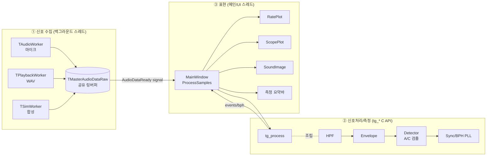
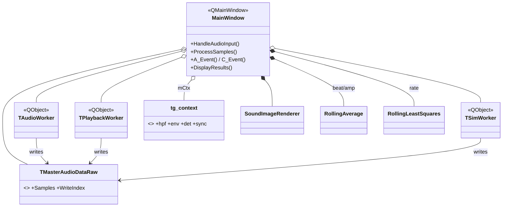
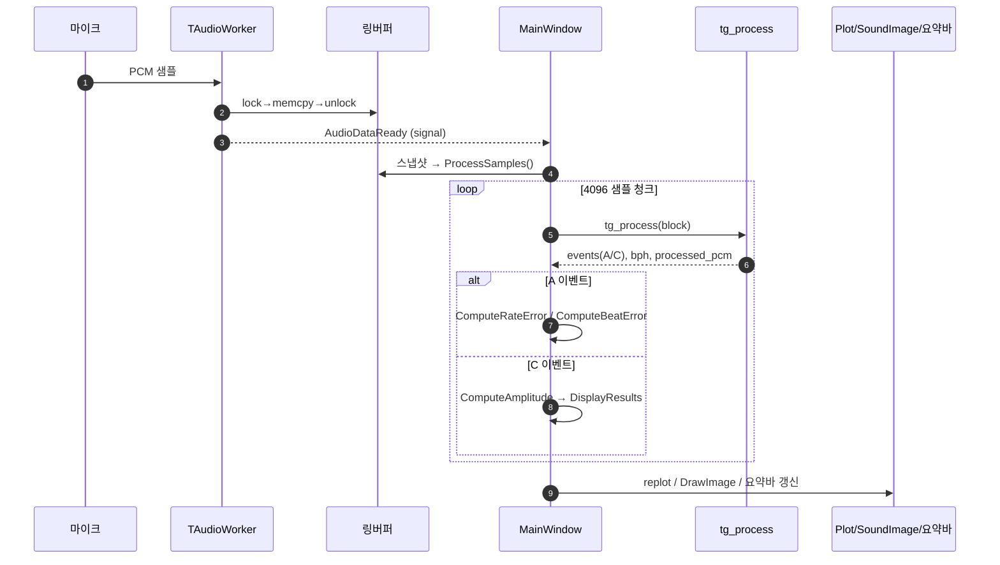
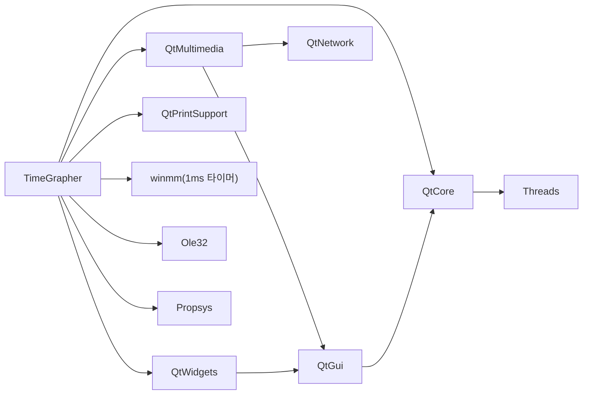

# TimeGrapher 코드 분석 — 통합 인덱스

> **이 파일 하나로 코드 구조 전체를 본다.** `Ctrl+Shift+V`(미리보기)로 열면 아래 다이어그램이 그림으로 렌더링되고,
> 표의 링크로 상세 문서·자동생성 그래프로 바로 이동할 수 있다.
> **성능(perf) 측정 분석은 별도 인덱스** → [PERF_ANALYSIS.md](PERF_ANALYSIS.md).

기계식 시계의 음향 신호를 받아 **rate·amplitude·beat error·BPH** 를 실시간 측정·시각화하는 Qt/C++ 앱.

---

## 0. 문서 지도 (여기서 출발)

| 보고 싶은 것 | 파일 | 여는 법 |
|--------------|------|---------|
| **전체 개요 + 핵심 다이어그램** | 📍 이 파일 | `Ctrl+Shift+V` |
| 손작업 종합 분석(구조·산식·분석법) | [CodeAnalysis.md](CodeAnalysis.md) | `Ctrl+Shift+V` |
| Doxygen+CMake 자동분석 결과 | [AutomatedAnalysis.md](AutomatedAnalysis.md) | `Ctrl+Shift+V` |
| clang-uml 자동 시퀀스 다이어그램 | [SequenceDiagrams.md](SequenceDiagrams.md) | `Ctrl+Shift+V` |
| **클릭 탐색형 전체 레퍼런스** (945 그래프) | `doxygen/html/index.html` | 브라우저 |
| 빌드 의존성 그래프 | `doxygen/cmake_deps.svg` | 브라우저 |
| clang-uml 원본 다이어그램 | `clang-uml/*.mmd` | Mermaid 미리보기 |
| ★**성능(perf) 측정 분석 전체** (별도 인덱스) | [PERF_ANALYSIS.md](PERF_ANALYSIS.md) | `Ctrl+Shift+V` |

재생성 설정/스크립트는 원본 프로젝트에 포함: `docs/Doxyfile` · `.clang-uml` · `docs/clang-uml/gen_cdb.ps1` · `docs/gen_site.py` (이 공유본에는 미포함)

---

## 1. 아키텍처 한눈에 (3계층 + 멀티스레드)

---

## 2. 클래스 관계 한눈에 (핵심만)

> 전체 멤버까지 보려면 [CodeAnalysis.md §3](CodeAnalysis.md) 또는 Doxygen `class_main_window.html`.

---

## 3. 측정 흐름 한눈에 (clang-uml 추출 정제판)

> 전체 내부 호출은 [SequenceDiagrams.md](SequenceDiagrams.md) 와 원본 [seq_process_samples.mmd](clang-uml/seq_process_samples.mmd).

---

## 4. 빌드 의존성 한눈에

> 원본: `doxygen/cmake_deps.svg`. 해석은 [AutomatedAnalysis.md §3](AutomatedAnalysis.md).

---

## 5. 한눈에 보기 — 실행 팁

- **이 README + 미리보기(`Ctrl+Shift+V`)** = 구조/클래스/흐름/의존성 4개 다이어그램을 한 화면에서 스크롤로 확인.
- **클릭 탐색이 필요하면** → `doxygen/html/index.html`(브라우저). 함수별 호출/피호출 그래프까지.
- **성능 측정 분석**이 필요하면 → [PERF_ANALYSIS.md](PERF_ANALYSIS.md) (perf_log.csv ↔ 코드 위치, 측정 구간).
- **재생성**: 코드 변경 후 [AutomatedAnalysis.md §5](AutomatedAnalysis.md) / [SequenceDiagrams.md §5](SequenceDiagrams.md) 런북 실행.

---

### (선택) 진짜로 "한 화면 HTML"이 필요하면
모든 `.md`(Mermaid 포함)를 **단일 HTML** 로 합쳐 브라우저에서 한 번에 보고 싶다면 알려주세요.
`docs/index.html` 을 만들어 README·CodeAnalysis·Automated·Sequence를 탭/스크롤 하나로 묶어 드립니다.
