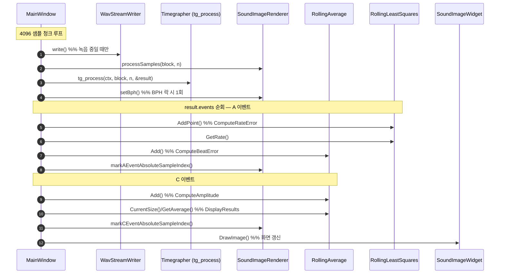
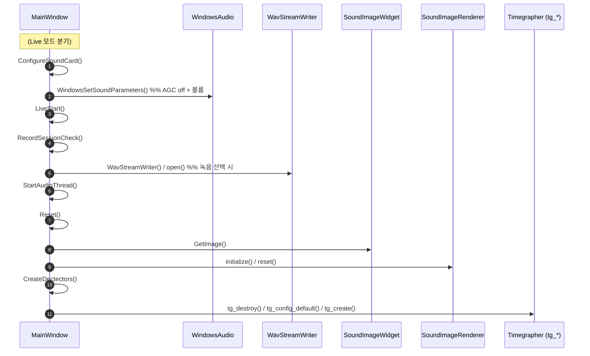

# TimeGrapher 시퀀스 다이어그램 (clang-uml 자동 추출)

> 이 문서의 다이어그램은 **clang-uml 0.6.2** (libclang 20.1.7) 가 `compile_commands.json` 을 입력으로
> 소스에서 **자동 추출**한 호출 시퀀스입니다. 손으로 그린 [CodeAnalysis.md](CodeAnalysis.md) 의
> 시퀀스 다이어그램을 컴파일러 수준에서 교차검증·정밀화한 결과입니다.

생성: clang-uml 0.6.2 · 입력: Qt Creator clangd compilation database (shim 적용)

---

## 1. 무엇을 실행했나 & 어떤 문제를 풀었나

```
clang-uml --generator mermaid     # .clang-uml 설정 기반, 3개 다이어그램 생성
```

### 툴체인 버전 충돌과 해결 (재현·재생성을 위해 기록)
- **문제**: 프로젝트의 `compile_commands.json`(Qt Creator clangd 생성)은 `-nostdinc` 와 함께
  **Qt Creator의 clang 21 인트린식 헤더**를 강제한다. 그런데 clang-uml 내장 파서는 **clang 20**이라,
  clang21 `immintrin.h` 가 **무조건 include** 하는 `avx10_2*`·`*transpose*`·`vp2intersect` 헤더의
  clang21 전용 빌트인을 해석하지 못해 `MainWindow.cpp`(Qt 포함) AST 빌드가 실패했다.
- **해결**: TimeGrapher 코드는 이 SIMD 인트린식을 **전혀 사용하지 않으므로**, 해당 헤더 23개를
  **빈 shim 헤더**로 가로채도록 `compile_commands.json` 사본(`cdb/`)에 `-isystem <shim>` 을
  clang21 경로보다 **먼저** 삽입했다. SDK 원본은 건드리지 않는다.
  자동화 스크립트: `docs/clang-uml/gen_cdb.ps1` (원본 프로젝트에 포함)

---

## 2. 생성된 산출물 (원본 자동 출력)

| 파일 | 줄수 | 내용 |
|------|------|------|
| [clang-uml/class_gui.mmd](clang-uml/class_gui.mmd) | 849 | GUI/워커/렌더러 등 이름 있는 클래스 다이어그램 |
| [clang-uml/seq_process_samples.mmd](clang-uml/seq_process_samples.mmd) | 1599 | `ProcessSamples()` 전체 내부 호출 트리(렌더러 내부까지 전부) |
| [clang-uml/seq_start_button.mmd](clang-uml/seq_start_button.mmd) | 436 | `on_StartPushButton_clicked()` 시작 흐름 |

> 원본 `.mmd` 는 내부 헬퍼·람다까지 모두 담아 매우 상세하다(=정확하지만 큼).
> 아래 §3·§4는 그 추출 결과에서 **상위 수준 호출만 정제**해 가독성을 높인 버전이다(내용은 도구 출력과 일치).

---

## 3. 측정 경로 시퀀스 — `ProcessSamples()` (정제판)

clang-uml이 추출한 `MainWindow` 발신 호출만 순서대로 정리한 것이다.
(원본의 `SoundImageRenderer` 내부 자기호출 수십 개는 생략 — [원본 mmd](clang-uml/seq_process_samples.mmd) 참조)



**도구가 확인해 준 사실**
- `ProcessSamples` 는 측정의 단일 허브이며, 위 호출 순서대로 `tg_process → (A:Rate/BeatError) → (C:Amplitude/DisplayResults) → 렌더링` 으로 흐른다.
- `RollingLeastSquares` 는 rate(기울기), `RollingAverage` 는 beat error/amplitude 평활에 쓰인다 — 손그림 분석과 일치.
- `setBph()` 는 BPH 락 시점에만 호출되어 `SoundImageRenderer` 렌더링을 활성화.

---

## 4. 시작 흐름 시퀀스 — `on_StartPushButton_clicked()` (정제판)



전체 분기(Playback/Sim 포함)와 모든 헬퍼 호출은 [원본 seq_start_button.mmd](clang-uml/seq_start_button.mmd) 에 있다.

---

## 5. 재생성 런북

```powershell
# 0) 최초 1회: clang-uml 설치 (GitHub 릴리스, NSIS)
#    https://github.com/bkryza/clang-uml/releases → clang-uml-0.6.2-win64.exe (/S 무인설치)
$env:PATH = "C:\Program Files\clang-uml\bin;$env:PATH"

cd d:\CMU_2026\Oversea_Cource\project_code\TimeGrapher

# 1) shim 적용된 compile DB 재생성 (clang21↔libclang20 충돌 회피)
pwsh docs\clang-uml\gen_cdb.ps1

# 2) 다이어그램 생성 (.clang-uml 설정 사용)
clang-uml --generator mermaid          # → docs/clang-uml/*.mmd
# (PlantUML 원하면)  clang-uml --generator plantuml
```

설정: `.clang-uml`(원본 프로젝트에 포함) — `compilation_database_dir: docs/clang-uml/cdb`,
`class_gui`(클래스) / `seq_process_samples` / `seq_start_button`(시퀀스, `start_from` 지정).

> 시계 코드가 바뀌고 빌드를 다시 하면, Qt Creator가 `.qtc_clangd/compile_commands.json` 을 갱신한다.
> 그 후 위 1)→2) 만 다시 실행하면 다이어그램이 최신화된다.

---

## 6. 한계 / 주의

- **익명 typedef 구조체**(`tg_config_t` 등 `typedef struct {…} X;`)는 clang-uml이 이름을 못 살리고
  `(anonymous_NNNN)` 로 표기한다. `tg_*` 타입의 깔끔한 관계는 손그림 [CodeAnalysis.md](CodeAnalysis.md) §3 을 참고.
  (이름이 살아있는 `struct tg_context {…}` 와 enum 들은 정상 표기됨)
- 원본 시퀀스 `.mmd` 는 람다·인라인 헬퍼까지 포함해 매우 길다. 큰 다이어그램은 Mermaid 렌더러에서
  무거울 수 있으므로, 개요는 본 문서 §3·§4 정제판을, 정밀 추적은 원본 파일을 사용하라.
- shim은 **미사용 SIMD 인트린식 헤더만** 비웠으므로 시계 신호처리/측정/GUI 코드 분석에는 영향이 없다.
