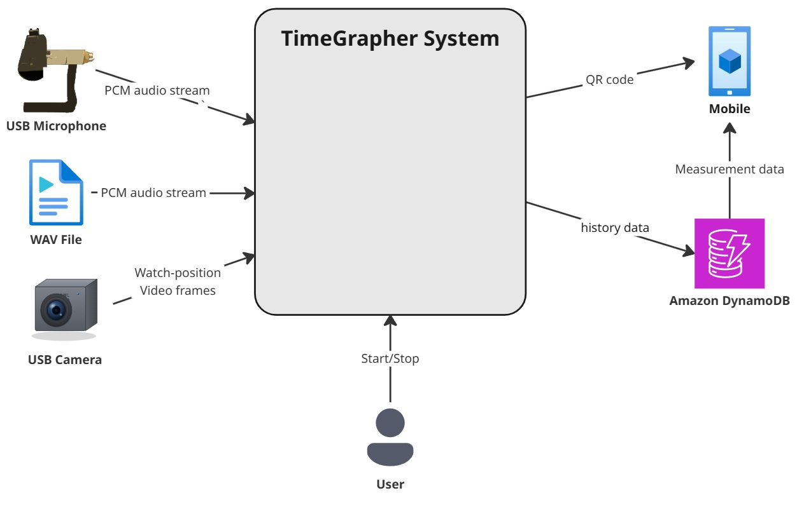

# Context Diagram

The goal of this context diagram is to show the **scope** of the TimeGrapher system (shown in the middle) and indicate what **external entities** the system interacts with.

In the architecture views we find a description of the external entities in the diagram, along with an explanation of their interaction with the system.

## Element Catalog

#### USB Microphone
- External USB microphone that picks up the mechanical watch's tick and sends it to the system as a **PCM audio stream** (the primary input for all timing measurements).
#### WAV File
- A previously recorded capture, replayed into the system as a **PCM audio stream** for playback/debugging instead of live audio.
#### USB Camera
- External USB camera that sends **watch-position video frames** (images of the watch dial in its current orientation) used to detect the measurement position.
#### User
- The person operating the system. Issues **Start/Stop** control and reads the displayed results.
#### Mobile
- A phone that scans the **QR code** produced after a measurement; the QR opens a page showing that watch's results.
#### Amazon DynamoDB
- Cloud datastore the system writes **measurement history** to, and that the mobile page reads **measurement data** from.

## Behavior
- N/A

## Related ADRs
- N/A

## Related Views
- [AV-006: Deployment View](./AV-006-Deployment-view.md) 
- [AV-003: Live Microphone to Graph Runtime View](./AV-003-MicToGraph-SeqenceDiagram.md) 
- [AV-004: Position-Detection Runtime View](./AV-004-Position_Detection_Runtime_View.md) 
