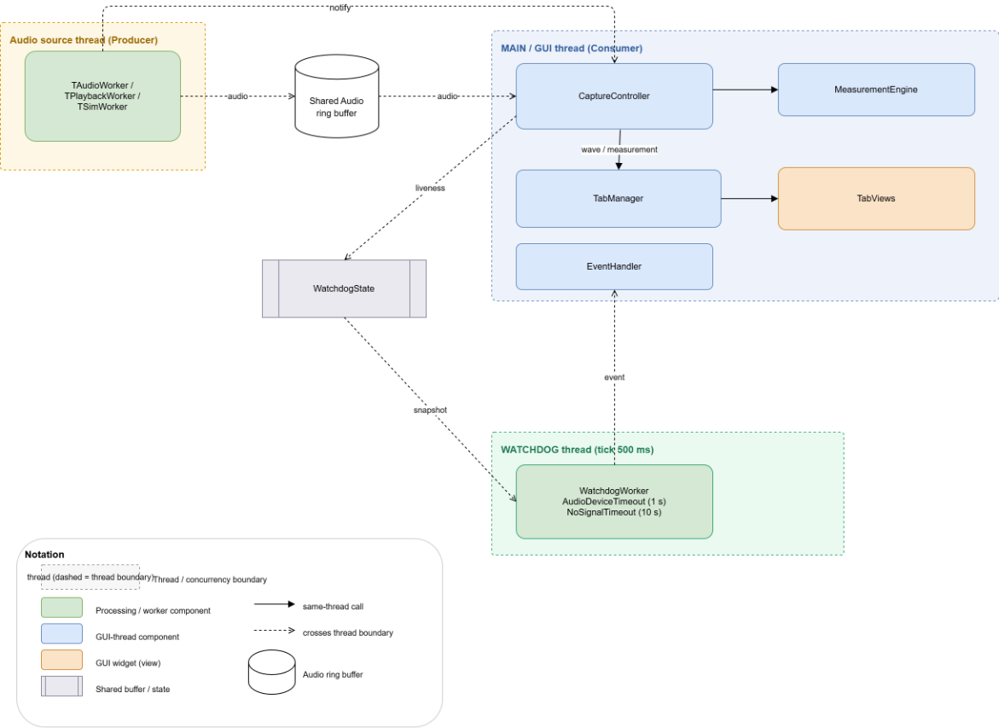

# Live Microphone to Graph Runtime View

This diagram shows the process of displaying the audio signal captured from the microphone as a graph.
Through this diagram, you can identify the parts needed to verify whether the process from audio signal to graph display satisfies the condition ([QAS-01](../Requirements/quality-attribute-requirements.md#qas-01--real-time-streaming-throughput)) of completing within 125ms per T1~T3 cycle (based on 28800 BPH).

## Element Catalog

### Threads

- **Audio source thread (Producer)** — captures audio and writes it to the shared buffer.
- **MAIN / GUI thread (Consumer)** — reads audio, runs measurement, and updates the graphs.
- **WATCHDOG thread** — wakes every 500 ms to check liveness and raise fault events.

### Components

- **TAudioWorker / TPlaybackWorker / TSimWorker** — the active audio source (live / playback / sim). Writes audio into SharedAudio and signals AudioDataReady.
- **SharedAudio** — ring buffer that decouples capture from processing so the two threads run asynchronously.
- **CaptureController** — the Consumer. Reads SharedAudio, runs tg_process(), drives the displays, and publishes liveness to WatchdogState.
- **MeasurementEngine** — computes rate, beat error, and amplitude.
- **TabManager** — broadcasts results to every graph tab (fan-out 1:N).
- **TabViews**  — the graph widgets that render the signal (onWave / onMeasurement).
- **WatchdogState** — shared state holding liveness timestamps; published by the Consumer, read by the watchdog.
- **WatchdogWorker** — runs the checks (AudioDeviceTimeout 1 s, NoSignalTimeout 10 s) and raises an event on fault.
- **EventHandler** — shows the user alert on a watchdog event.

## Behavior

- A UML Sequence Diagram representing the call process from the audio signal to its display on the TimeGrapher's graph.
- This diagram allows you to identify the components required for the [EXP-02](../Experiments/EXP-02-end-to-end-latency-measurement.md) experiment.

## Related ADRs
- [ADR-002: Adopt a watchdog (timeout) for microphone-disconnect detection](../ADRs/ADR-002-Adopt%20a%20watchdog%20(timeout)%20for%20microphone-disconnect%20detection.md)

## Related Views
- [AV-002: Top-Level Module Uses View](./AV-002-TimeGrapher-module-view.md) — the modules that host these runtime components.
- [AV-005: Graph Tab Hierarchy](./AV-005-RegiseterTab-Diagram.md) — how `TabManager` broadcasts to the `TabViews` shown here (shared `onWave` path).
