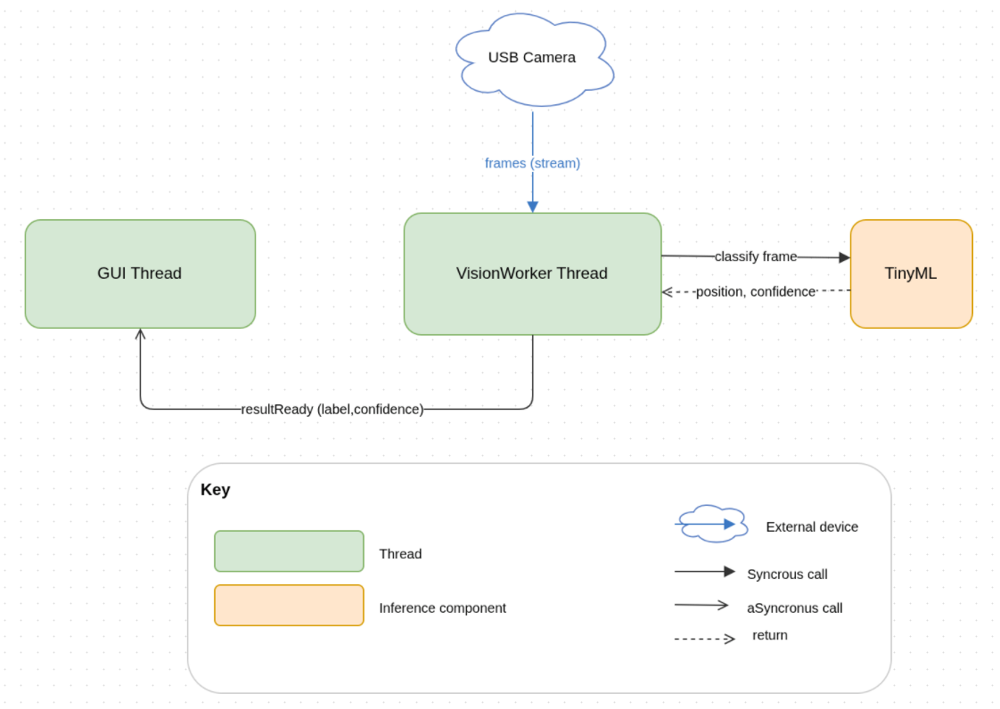
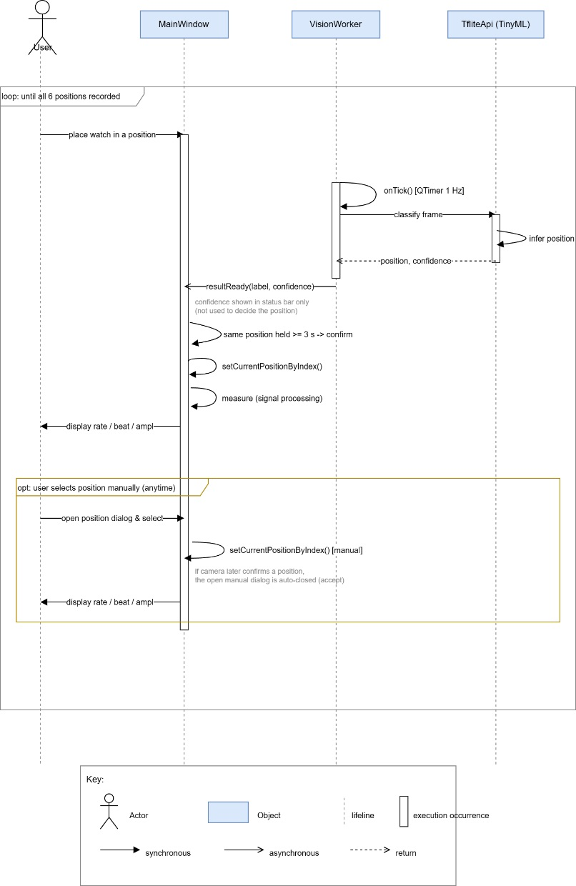

# Position-Detection Runtime View

The system reads the watch's position with a USB camera and an on-device TFLite classifier. Detection runs in a dedicated VisionWorker thread, separate from the acoustic measurement path, so a misclassified position can never corrupt a measured value (ADR-001). The camera streams frames continuously, but the worker classifies once per second and pushes the result to the GUI thread asynchronously.

##  Element catalog

### USB Camera
External USB webcam («external device»). Streams frames of the watch to VisionWorker. Used only to read the position; falls back to manual selection when unavailable.

### GUI Thread
Coordinator on the GUI (main) thread. Starts the VisionWorker thread (moveToThread) and receives results via a queued connection (resultReady). It consumes results as they arrive — it does not poll the camera. Measured values (Rate/Beat-Error/Amplitude) come only from the deterministic measurement path, never the classifier.

### VisionWorker Thread
vision::VisionWorker on a dedicated worker thread. Owns the camera pipeline (QCamera/QVideoSink), keeps only the newest frame, and runs a 1 Hz QTimer. Each tick: preprocess the latest frame, classify, then emit resultReady(label, confidence). Results below kConfThresh are flagged uncertain.

### TfliteApi (TinyML)
vision::TfliteApi, a member of VisionWorker (same thread). Runs an embedded TFLite model via invoke(...). Outputs 12 classes — six positions (DU, DD, CD, CL, CR, CU) × W_ (watch present) / N_ (no watch). Reads position only; the model is finalized by EXP-18.

### Connectors
frames (stream): USB Camera → VisionWorker (videoFrameChanged).
classify frame / position, confidence: VisionWorker ↔ TfliteApi, synchronous invoke(...), same thread.
resultReady(label, confidence): VisionWorker → MainWindow, asynchronous queued connection (worker → GUI thread).

##  Behavior
One detection cycle: VisionWorker wakes on its 1 Hz timer, asks TfliteApi to classify the latest frame, gets back position + confidence, and emits resultReady to MainWindow. MainWindow then displays/records the result (confidence above threshold) or prompts for manual selection (low confidence / camera not used).

##  Related ADRs

[ADR-001: Limit AI (TinyML) to camera-based watch-position detection](../ADRs/ADR-001-watch-position-detection-solution.md)

##  Related views

N/A
