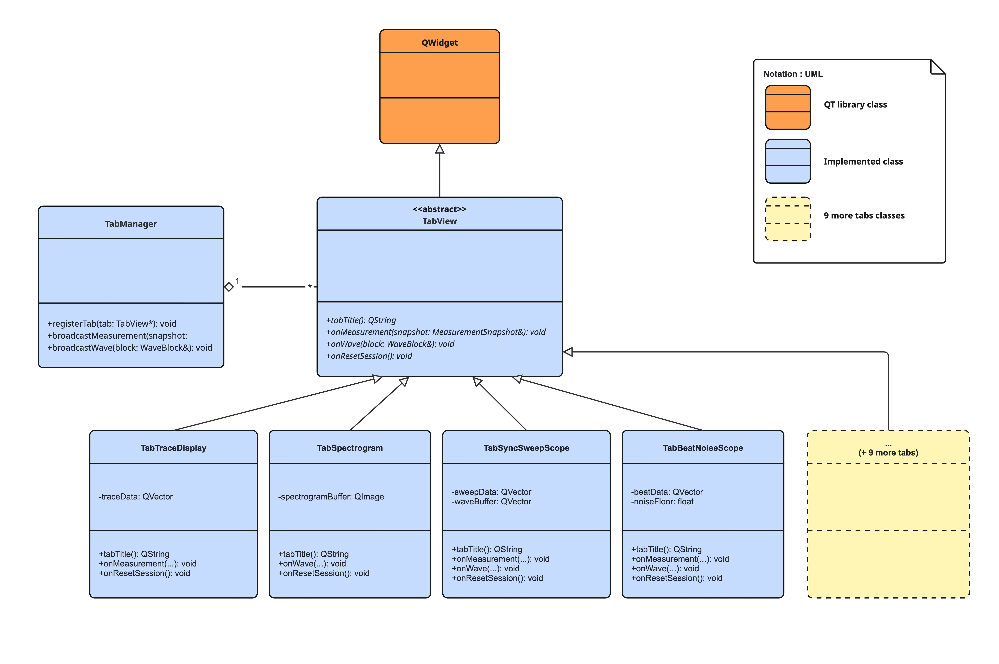
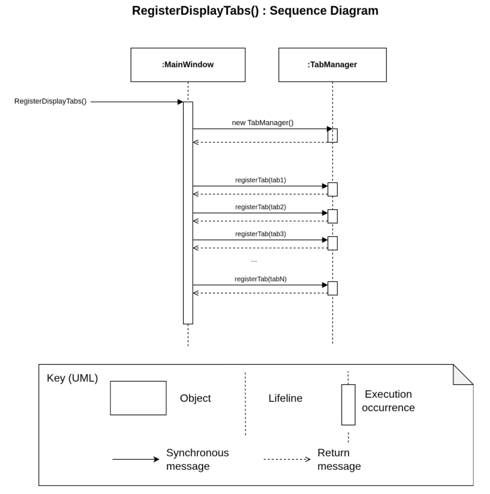

# Register Tab Diagram

This diagram shows the design that makes it easy to add graph tabs to TimeGrapher.
It satisfies [QAS-08](../README.md#qas-08-new-tab-extensibility), which specifies that code unrelated to the tab must not be modified when adding a graph tab.
When a developer wants to add a new tab, they only need to implement a new class that inherits from the TabView class.

## Element Catalog

#### TabManager
- A class that registers the graphs to be displayed in TimeGrapher and shows the registered graphs.

#### TabView
- An interface for implementing a graph.
- Only classes that inherit the TabView interface can be registered with TabManager.
- Implement the graph you want to display in the onWave() function.

## Behavior
The diagram below shows the process of applying the observer pattern to register all tabs to be displayed, and drawing the graph on every registered tab once the TimeGrapher data has been calculated.

- This UML Sequence Diagram shows that a graph to be displayed can be registered with just a call to TabManager::registerTab() when adding a tab.

- The bottom part of this UML Sequence Diagram shows TimeGrapher data being presented simultaneously on all registered tabs. TabManager::broadcaseWave() calls onWave() on every registered tab to draw the graph.

## Related ADRs
[ADR-003: Register display tabs through a Tab Manager](../ADRs/ADR-003-register-display-tabs.md)

## Related Views
- N/A
