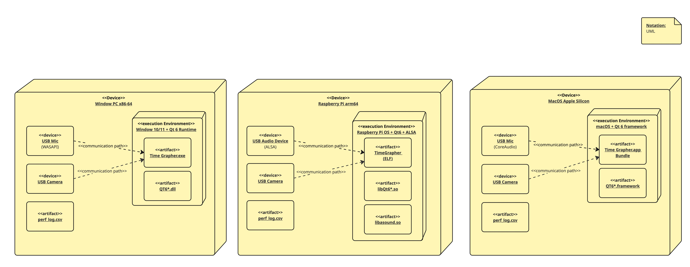

# Deployment View

The scope is the physical deployment of the TimeGrapher application across three target platforms.
The diagram shows the hardware devices, execution environments, deployed artifacts, and communication paths for each platform.

TimeGrapher is a standalone desktop application with no network dependencies. The same codebase compiles to platform-specific artifacts, with platform-specific audio and camera drivers abstracted behind common interfaces in the `audio/capture` and (planned) `vision` packages.

## Element Catalog
 Notation: UML. Based on the deployment view (Client Machine → AWS Cloud → Mobile Browser / Vercel).

### Windows PC x86-64

* Target platform for primary development and end-user deployment. Runs Windows 10/11 with Qt 6 Runtime. Audio input via WASAPI, camera input via DirectShow.

### Raspberry Pi arm64

* Lightweight embedded deployment target. Runs Raspberry Pi OS with Qt6 and ALSA. Audio input via ALSA (`libasound.so`), camera input via V4L2.

### macOS Apple Silicon

* Additional desktop deployment target. Runs macOS with Qt 6 Framework. Audio input via CoreAudio, camera input via AVFoundation.

### USB Mic Device

* External USB microphone that captures the mechanical watch's tick sound as a PCM audio stream. Platform-specific audio driver (WASAPI / ALSA / CoreAudio) provides the communication path to the application.

### USB Camera

* External USB camera that captures video frames of the watch for position detection.

### TimeGrapher.exe / TimeGrapher (ELF) / TimeGrapher.app Bundle

* The main application artifact. Same codebase compiled for each platform's architecture (x86-64, arm64) and packaging format (.exe, ELF binary, .app bundle). After a measurement it generates a QR code embedding the Vercel URL plus the watch serial number, and uploads the measurement session to the cloud.

### Qt6*.dll / libQt6*.so / Qt6*.framework

* Qt 6 runtime libraries. Packaging format differs per platform (DLL, shared object, framework).

### libasound.so

* ALSA audio library, present only on the Raspberry Pi deployment. Windows and macOS use OS-native audio APIs that do not require a separate shared library.

### API Gateway + Lambda

* Serverless request-handling environment. API Gateway exposes the public REST endpoint (`GET /watch/{serial}`, CORS enabled) and routes requests to the Lambda function. No always-on server to manage.

### timegrapher_api

* The API Gateway REST API definition — resources, methods, and the Lambda integration that fronts the backend.

### getWatchHistory

* Node.js 20.x Lambda function (`getWatchHistory.mjs`). Looks up a watch by serial via the GSI and returns its measurement sessions. Holds IAM permissions limited to `dynamodb:Query` / `GetItem` on the relevant tables.

### DynamoDB

* Managed NoSQL datastore (on-demand billing) holding watch and session records.

### timegrapher_measurements

* The DynamoDB table(s) storing measurement records — rate, amplitude, beat error, positions, tags, and memos per session.

### PK: watch_id / SK: measured_at

* Primary key design of the measurements table: partition key `watch_id` groups all sessions for one watch, sort key (`measured_at` / `session_id`) orders them chronologically. A GSI on `serial_number` (`serial-index`) lets the API resolve a scanned serial number to a `watch_id`.

### Camera

* Phone camera used to scan the QR code generated by the desktop app. Decoding the QR opens the embedded Vercel URL (with the watch serial) in the mobile browser.

### Web Browser

* Mobile browser runtime that loads and executes the single-page application and renders the results.

### React App

* The React single-page application running in the browser. Reads the `serial` query parameter, calls the cloud API for that watch's history, and renders the measurement charts. Falls back to mock data if no API base URL is configured.

### Static Hosting (execution environment)

* Vercel's static file serving + edge environment. Delivers the pre-built front-end bundle; performs no per-request server rendering.

### index.html (artifact)

* The single HTML entry point of the SPA. All client-side routes resolve to this file via the rewrite rule.

### JS bundle (artifact)

* The compiled React build output (JavaScript/CSS) produced by `vite build`. Contains the application logic that runs in the mobile browser.

## Behavior
- N/A

## Related ADRs
- N/A

## Related Views
- N/A
