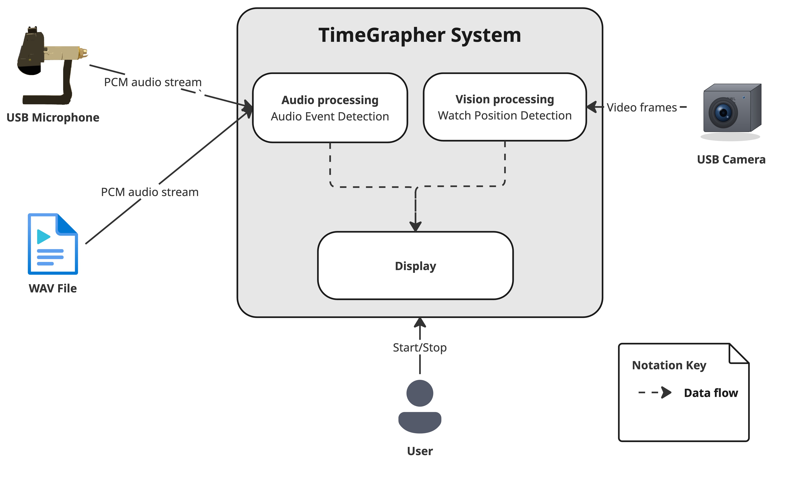

# Context Diagram

The goal of this context diagram is to show the **scope** of the TimeGrapher system (shown in the middle) and indicate what **external entities** the system interacts with.

In the architecture views we find a description of the external entities in the diagram, along with an explanation of their interaction with the system.

## Element Catalog

#### Audio Processing
- Receives PCM audio and detects A/C timing events from the watch's tick sound via a DSP pipeline.

#### Vision Processing
- Analyzes video frames to classify the watch's current position (DU, DD, CU, CD, CR, CL).

#### Display
- Renders real-time waveforms, timing measurements, and position indicator across 13+ tabs.
