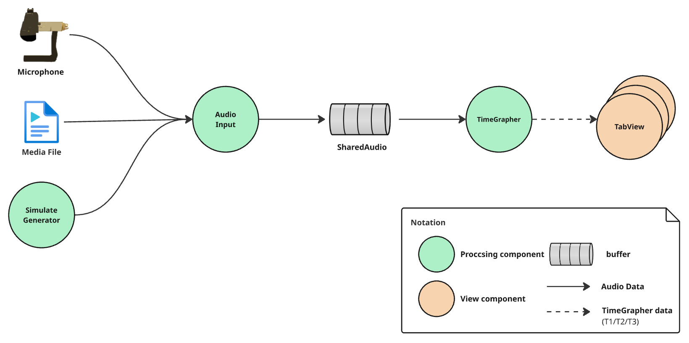
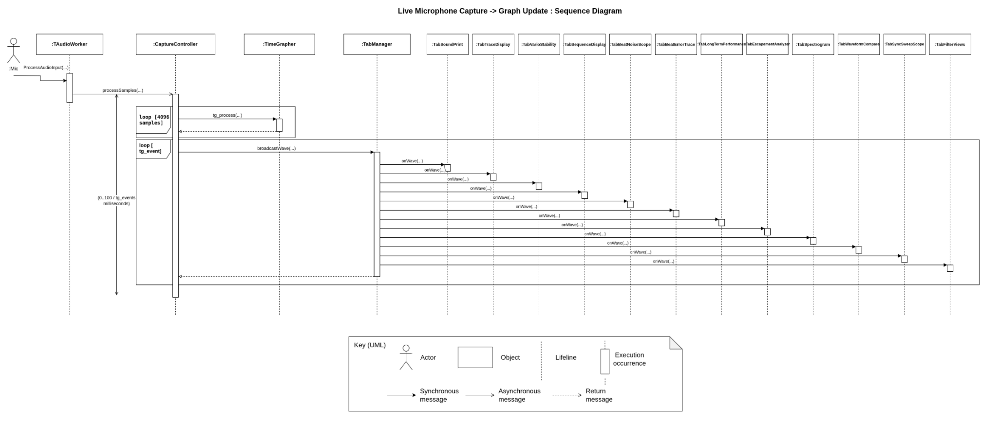

# Live Microphone to Graph Behavior Diagram

This diagram shows the process of displaying the audio signal captured from the microphone as a graph.
Through this diagram, you can identify the parts needed to verify whether the process from audio signal to graph display satisfies the condition (QAS-01) of completing within 125ms per T1~T3 cycle (based on 28800 BPH).

## Element Catalog

#### SharedAudio
- A ring buffer used to process the audio input and processing asynchronously. (Not changed from the existing source code.)

#### AudioInput
- Responsible for storing the watch's audio data into the ring buffer.

#### TimeGrapher
- Responsible for calculating the watch's audio data into data (T1/T2/T3) that can be displayed by the TimeGrapher.

#### TabView
- The graph displayed by the TimeGrapher.

## Behavior

- A UML Sequence Diagram representing the call process from the audio signal to its display on the TimeGrapher's graph.
- This diagram allows you to identify the components required for the EXP-02 experiment.

## Related ADRs
- N/A

## Related Views
- N/A
