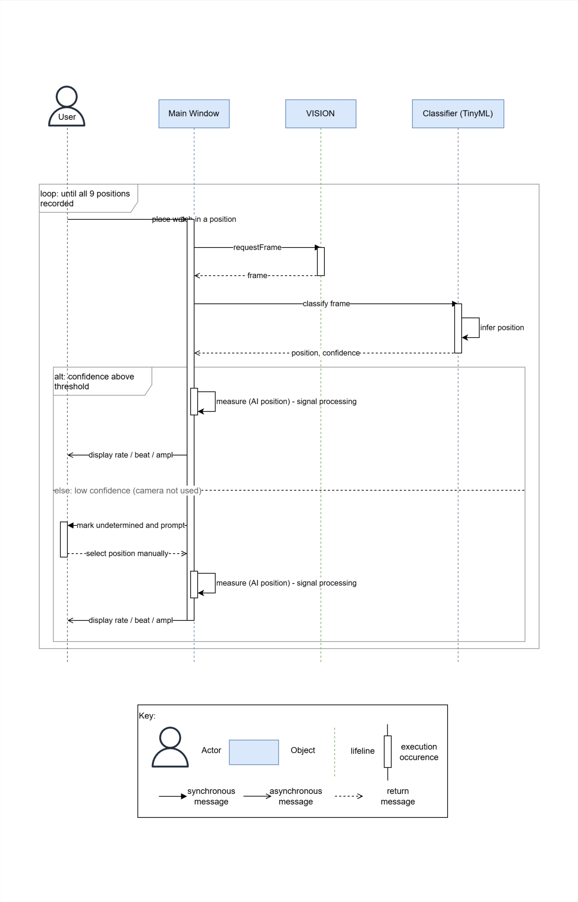

# Position-Detection Runtime View

##  Behavior

##  Element catalog

The architecture is composed of five categories of elements:
the user, the main UI thread, an external camera, an on-device AI classifier (TinyML), and the deterministic measurement path inside the Main UI.

### User
The User operates the timegrapher in Live mode. The user places the watch in each of the nine standard measurement positions (CR, CU(R), CU, CU(L), CL, CD(L), CD, CD(R), DU/DD) and, only when the system requests it, selects the position manually. The user otherwise relies on automatic position detection and reads the measured Rate/Beat-Error/Amplitude on the screen.

### Main UI
The Main UI is the central element that the user sees and interacts with. It coordinates the whole flow: it requests a frame from the camera, asks the classifier to read the current position, and — independently of the classifier — performs the actual signal-processing measurement and renders the results on screen. The measurement of Rate/Beat-Error/Amplitude is always computed here by deterministic signal processing; the AI classifier never computes a measured value. This separation guarantees that a misclassified position cannot corrupt the measured values.

### Vision
The Camera is an external device connected to the Raspberry Pi. On request from the Main UI, it captures a frame of the watch in its current orientation and returns it. The camera is used only to read which position the watch is in; it has no role in the acoustic measurement. When the camera is unavailable (disconnected or the view is occluded), the system falls back to manual position selection.

### Classifier (TinyML)
The Classifier is a lightweight on-device image classification model (TinyML). Given a camera frame, it infers which of the nine standard positions the watch is in and returns that position together with a confidence value. It performs only position reading — labeling which position a measurement belongs to — and never computes Rate/Beat-Error/Amplitude. The specific model is an implementation detail to be finalized and validated by experiment (EXP-18); the model is chosen to be small enough for real-time inference on the Raspberry Pi.

### Measurement path (signal processing)
The Measurement path is the deterministic, rule/signal-processing logic inside the Main UI that computes Rate, Beat Error, and Amplitude from the acoustic signal. It is explainable and verifiable, and it is the only source of measured values. It runs the same way regardless of whether the position came from the AI classifier or from manual selection, so the trustworthiness of the measurement does not depend on the AI.

### Position usage by mode
The detected position is used differently depending on the display mode. In the Multi-Position Sequence Display mode, the measured values are recorded into the detected position's row of the sequence table; if confidence is below threshold or the camera is unavailable, the system withholds auto-recording and asks the user to select the position manually. In other display modes, the current position is shown for display only (e.g., 9H) and is not used to record measurements; when confidence is low or the camera is unavailable, the position is simply not shown.

##  Variability guide

The source of the measurement position is variable at runtime:
- **AI auto-detection (default):** the camera and TinyML classifier determine the position automatically.
- **Manual selection (fallback):** used when classification confidence is below threshold or the camera is unavailable.

Binding time: runtime, decided per measurement based on the classifier confidence and camera availability.

##  Related ADRs

[ADR-001: Limit AI (TinyML) to camera-based watch-position detection](../ADRs/ADR001-watch-position-detection-solution.md)

##  Related views

N/A
