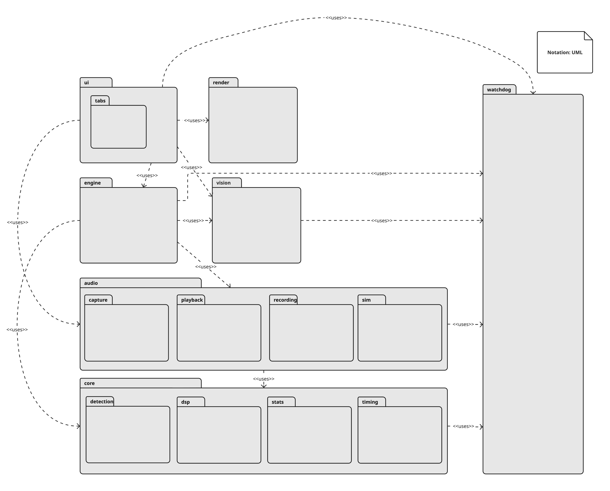

# TimeGrapher Module View (Package Diagram)

The scope is the static code structure of the TimeGrapher desktop application.
The diagram shows six top-level packages and their `«uses»` dependencies.
Key patterns applied at the module level:
- Layered (unidirectional dependency: ui → engine → core)

https://miro.com/app/board/uXjVHFAyRbM=/?moveToWidget=3458764676043638482&cot=14

## Element Catalog

#### ui
- User interface layer. Contains MainWindow (thin coordinator for widget wiring and low-frequency display updates) and TabManager (Publish–Subscribe hub that broadcasts data to display tabs without them knowing the data source).

#### ui/tabs
- TabView abstract interface and 13 concrete subclasses (RateScope, SoundPrint, TraceDisplay, Spectrogram, etc.). Adding a new tab requires only 1 subclass + 1 registration line — no changes to existing code (OCP).

#### engine
- Domain orchestration. CaptureController acts as a Facade over audio sources, DSP pipeline, and measurement calculation. MeasurementEngine computes rate, beat error, and amplitude from detected events.

#### render
- Folding sound image pixel rendering, separated from the Qt widget display layer.

#### audio
- Audio input sources and thread-shared ring buffer. Each Worker runs on a dedicated thread (Producer–Consumer pattern with the ring buffer).

#### audio/capture
- Live microphone capture worker with platform-specific backends (LinuxAudio, WindowsAudio).

#### audio/playback
- WAV file replay worker.

#### audio/recording
- WAV file reader and writer. Extracted from MainWindow for cohesion.

#### audio/sim
- Synthetic watch signal generator for testing and demonstration.

#### core
- Pure domain logic with no Qt/UI dependency. Contains the signal processing pipeline arranged as a Pipe-and-Filter (HPF → Envelope → Detector → BPH Tracker). Independently unit-testable.

#### core/detection
- FSM-based onset/peak detector that classifies A (unlock) and C (drop) events from the envelope signal.

#### core/dsp
- Independent signal processing filters (HPF, Envelope). Each filter is individually replaceable.

#### core/stats
- Rolling statistical utilities (RollingAverage, RollingLeastSquares) for stable trend calculation.

#### core/timing
- Timegrapher C library that drives the signal detection pipeline, and BPH tracker for beat-rate estimation.

#### perf
- Cross-cutting performance instrumentation. Controlled by `PERF_ENABLE` compile switch — when disabled, all macros compile to nothing (zero overhead in production).

## Behavior
- TBD

## Related ADRs
- TBD

## Related Views
- TBD
