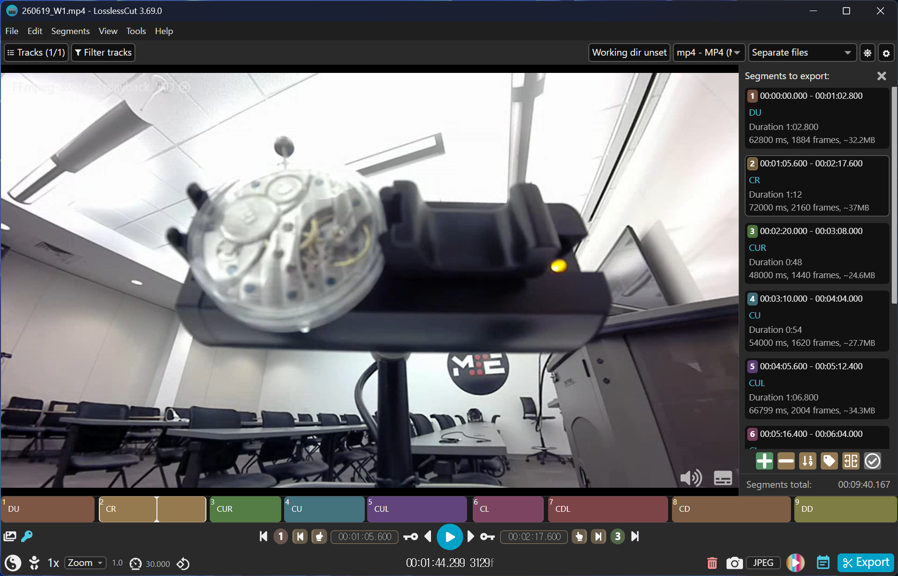
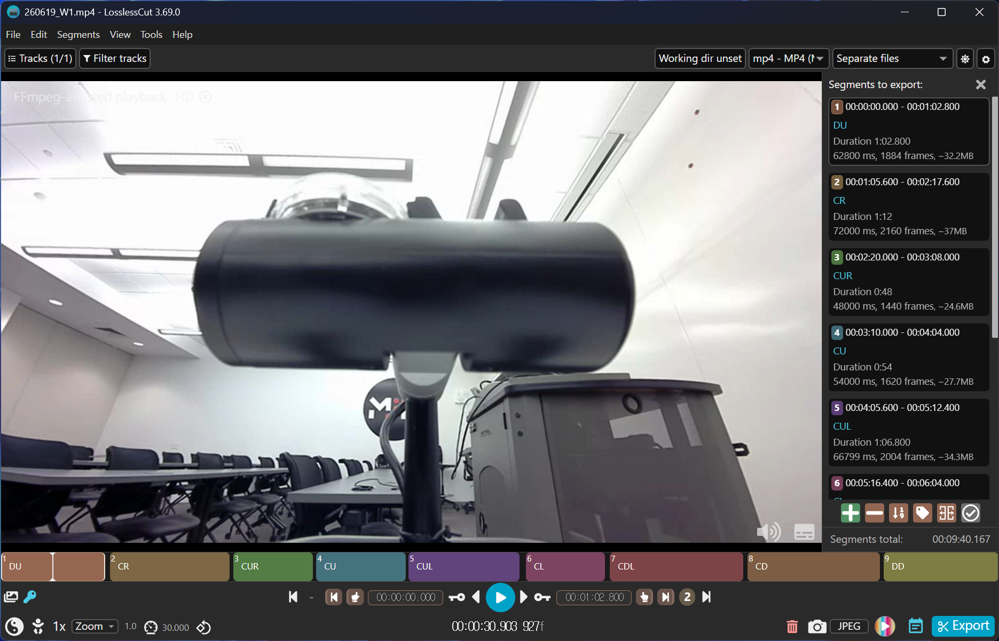
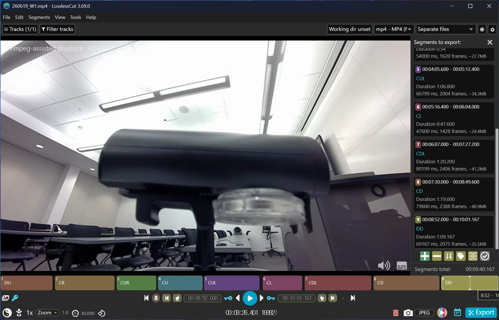
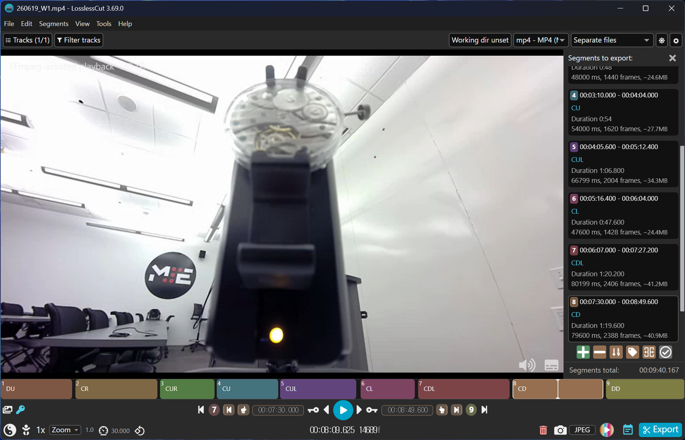
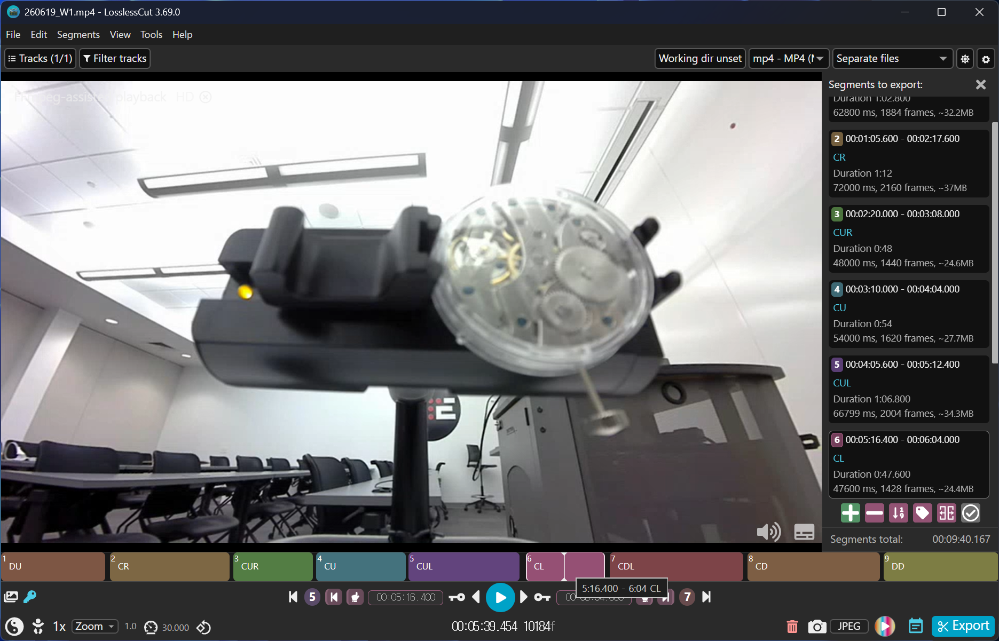
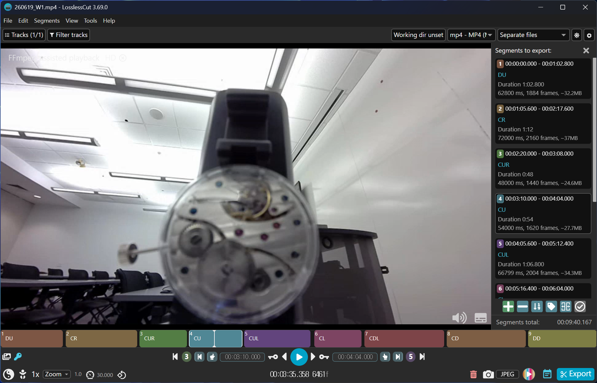
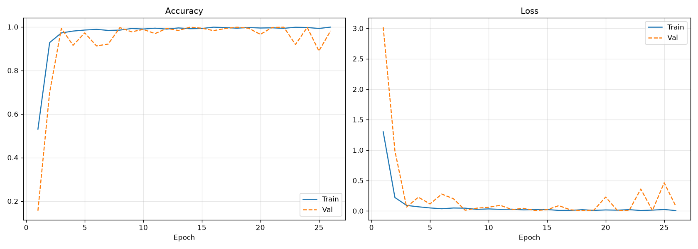
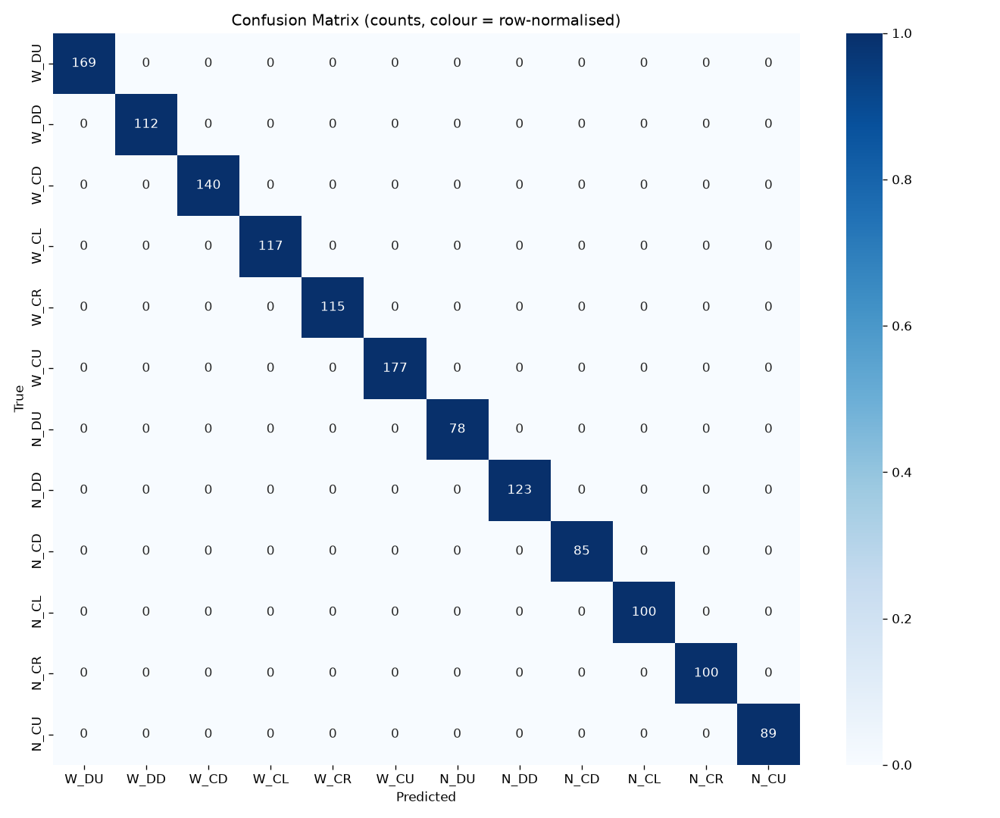
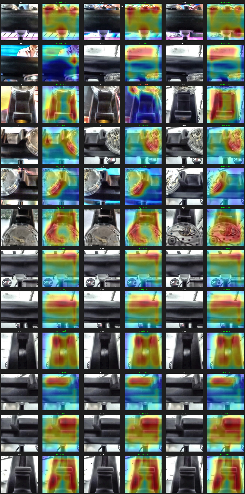

# EXP-18 / Camera+TinyML 6-Position Accuracy

## Objective

- Verify 6-position classification accuracy.

## Status

- [Planned | In progress | Suspended | Canceled | **Concluded**]

## Expected outcomes

- 6-position accuracy (confusion matrix).

## Resources required

- Raspberry Pi 5 + external camera, per-orientation labeled image dataset, a trained TinyML model, real watches.

## Experiment description

- Collect/label 6-position images.

- Train a lightweight classifier, deploy on Pi.

- Measure per-position accuracy (confusion matrix).

- Verify Pi inference latency is acceptable ([RISK-09](../README.md#risk-09)).

## Duration

06/12-06/26

## Links and references

[QAS-06](../Requirements/quality-attribute-requirements.md#qas-06--position-detection-safe-fallback) ; [RISK-20](../README.md#risk-20); [ADR-01](../ADRs/ADR-001-watch-position-detection-solution.md); follow-up to [EXP-17](EXP-17-rule-signal-processing-vs-tinyml-boundary.md), [EXP-12](EXP-12-usb-protocol-watch-position-detection.md).

## Results and recommendations

Labeling of camera positions was performed correctly, and 6-position classification was confirmed to work accurately.

### Labeling

All collected images were correctly labeled across the 6 positions.

| | | |
|---|---|---|
|  |  |  |
|  |  |  |

### Training

The model converged stably during training.

| Training history |
|---|
|  |

### Accuracy

High classification accuracy was achieved across all 9 positions.

| Confusion matrix |
|---|
|  |

### Summary

### Performance
- One inference <= 2ms