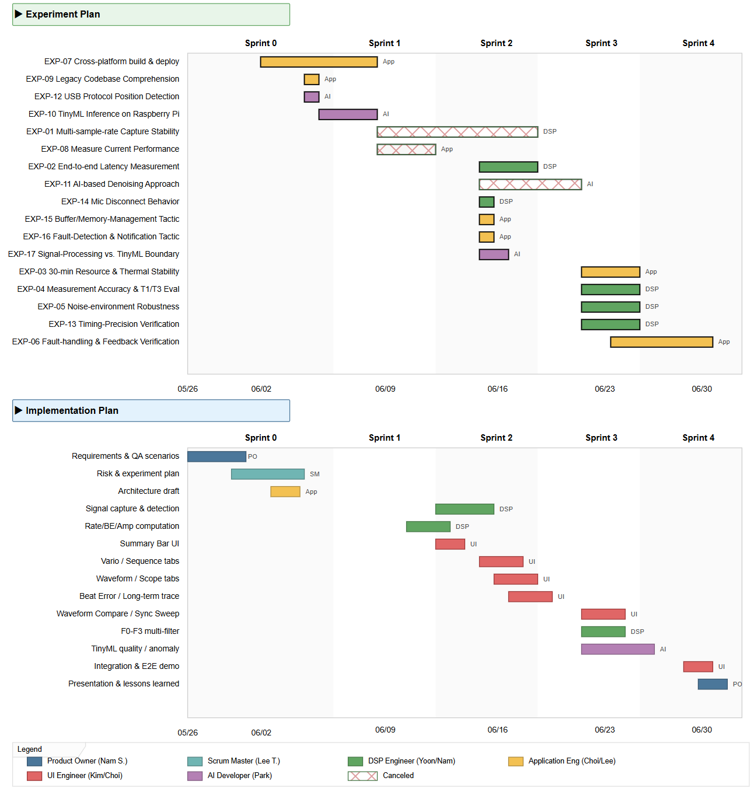
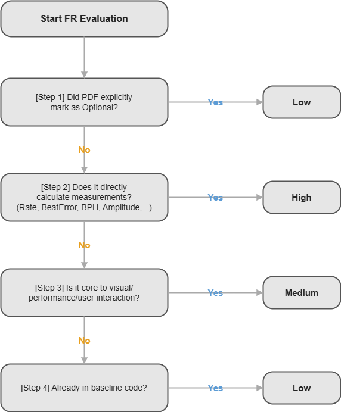

# LG 2026 SW Architecture Studio Project — Time Grapher Project (Team 1)

**Milestone 2** — Project Plan · Requirements · Quality Attribute Scenarios

Status: **In Progress**

*— In collaboration with Carnegie Mellon University —*

## Table of Contents

1. [Overview](#1-overview)
2. [Milestones and Plan](#2-milestones-and-plan)
3. [Requirements Analysis](#3-requirements-analysis)
4. [Quality Attribute Requirements (Scenarios)](#4-quality-attribute-requirements-scenarios)
5. [Design Constraints](#5-design-constraints)
6. [Risk Management](#6-risk-management)
7. [Experiments](#7-experiments)
8. [Architecture Overview](#8-architecture-overview)
9. [ADRs](#9-adrs)
10. [References](#10-references)

# **1. Overview**

## **1.1 Introduction**

### **Purpose**

This document is the deliverable of the Time Grapher Project for the LG 2026 SW Architecture Studio. It covers a five-week time-boxed project that extends the baseline Qt/C++ TimeGrapher GUI on the Raspberry Pi 5 to strengthen the acoustic diagnosis and visualization of a mechanical watch. This document includes (i) an Agile/Scrum-based project plan, (ii) 12display tabs, (iii) quality attribute scenarios, (iv) technical Test Experiments logically linked to each quality attribute, and (v) design constraints and risk assessment.

Section 4 specifies the quality-attribute requirements as concrete quality-attribute scenarios using the standard six-part scenario format.

## **1.2 Objectives**

### **Goals**

- **GUI Integration & Refinement :** Consolidating and finalizing the user interface for the Raspberry Pi 5-based real-time clock diagnostic GUI.

- **Data Reliability Verification :** Ensuring quantitative accuracy, consistency, and data integrity of clock measurements (BPH, beat error, amplitude).

- **Real-Time Performance Optimization :** Achieving ultra-low latency and high-throughput real-time processing under multi-sample-rate environments.

- **Architectural Extensibility :** Designing a modular and clean architecture to ensure easy integration of new features and components.

- **On-Device AI Exploration :** Researching secure, cloud-independent On-Device AI (TinyML) for signal quality classification.

- **Usability & Deployability :** Providing a readily reproducible demo and ensuring portability via a dedicated Raspberry Pi OS image.

### **Development Strategy: Attribute-Driven Design (ADD) & Risk-Mitigated Incremental Evolution**

Given the constrained 5-week schedule and a 7-person team, attempting a big-bang implementation of all system components introduces severe architectural risks. Therefore, this project adopts the SEI Attribute-Driven Design (ADD) process to drive an incremental and risk-mitigated development strategy:

\- Addressing Primary Architectural Drivers First

\- Incremental Expansion of Architectural Tactics

\- Early Evaluation via Test Experiments

# **2. Milestones and Plan**

## 2.1 Plan

Based on the Agile/Scrum framework. The 5 weeks are divided into 5 Sprints (Sprint 0 + Sprints 1~4).

<table>
<colgroup>
<col style="width: 9%" />
<col style="width: 10%" />
<col style="width: 9%" />
<col style="width: 29%" />
<col style="width: 33%" />
<col style="width: 7%" />
</colgroup>
<thead>
<tr class="header">
<th><strong>Sprint</strong></th>
<th colspan="2"><strong>Duration</strong></th>
<th><strong>Purpose</strong></th>
<th><strong>Key Deliverables</strong></th>
<th><strong>Linked Milestone</strong></th>
</tr>
</thead>
<tbody>
<tr class="odd">
<td>Sprint 0</td>
<td>Week 1</td>
<td>05/25-06/05</td>
<td>Inception — Requirements·Risk·Experiment·Architecture draft</td>
<td>
Project Plan 
Requirements Analysis 
Risk Management 
Architecture overview

Experiment Plan
</td>
<td>MS-1 submission</td>
</tr>
<tr class="even">
<td>Sprint 1</td>
<td>Week 2</td>
<td>06/08-06/12</td>
<td>Architecture finalization &amp; experiment execution — design decisions and baseline/feasibility experiments</td>
<td>Software Architecture Document / Experiment results (baseline·feasibility: EXP-08/09/10/12/14) / Validated design decisions</td>
<td>MS-2 preparation</td>
</tr>
<tr class="odd">
<td>Sprint 2</td>
<td>Week 3</td>
<td>06/15-06/19</td>
<td>Core build &amp; initial visualization — signal capture·detection·measurement·basic display</td>
<td>Design-decision ADRs (EXP-15/16/17) / Revised Software Architecture Document / Live Mode operation · rate/BE/amp computation / Summary Bar / Vario·Sequence / Single-Beat Waveform / Scope/2·Beat Error / Long-Term Trace Display</td>
<td>MS-2 submission</td>
</tr>
<tr class="even">
<td>Sprint 3</td>
<td>Week 4</td>
<td>06/22-06/26</td>
<td>Visualization expansion and AI feature implementation</td>
<td>Waveform Compare 
Sync Sweep 
F0~F3 Filter 
TinyML signal quality improvement and anomaly detection</td>
<td>MS-3 preparation</td>
</tr>
<tr class="odd">
<td>Sprint 4</td>
<td>Week 5</td>
<td>06/29-07/01</td>
<td>Integration·demo preparation·document finalization</td>
<td>
End-to-end demo

Presentation materials

Lessons Learned
</td>
<td>MS-3 submission</td>
</tr>
</tbody>
</table>

The task-level schedule below breaks each sprint into concrete tasks with an assigned owner (by role) and start/end dates, and includes the technical experiments (spikes) as scheduled tasks. Day-to-day progress is tracked on the team Kanban board, where each backlog card carries an assignee: <u>https://miro.com/app/board/uXjVHFnTVy0=/?share_link_id=685489384283</u>

*Figure 2-1. Project plan — task schedule by owner, with technical experiments included as spikes.*

## **2.2 Roles**

|                      |                              |                                            |                                                                                  |
|----------------------|------------------------------|--------------------------------------------|----------------------------------------------------------------------------------|
| **Role**             | **Owner**                    | **Key Items**                              | **R&R**                                                                          |
| Product Owner        | Nam Sangjae                  | Project management                         | Backlog prioritization·stakeholder handling·approval                             |
| Scrum Master         | Lee Tae-hoon                 | Process + system-wide                      | Daily Standup·Planning·Review·Retro·blocker removal·metrics management           |
| DSP Engineer         | Yoon Joongcheol, Nam Sangjae | SignalProcessing · Detection · Measurement | Signal-processing pipeline·filters·envelope·T1/T3 detection·measurement formulas |
| Application Engineer | Choi Jinsuk, Lee Tae-hoon    | Timegrapher · Workers · Domain model       | DSP↔UI domain flow·Worker Thread·event dispatch·Mode abstraction                 |
| UI Engineer          | Kim Jae-hong, Cho Jin-young  | Visualization Layer · MainWindow           | Rendering·interaction·UX consistency of 12 display tabs                          |
| AI Developer         | Park Jongjin                 | AI Feature                                 | TinyML model evaluation·POC integration·Raspberry Pi inference                   |

# **3. Requirements Analysis**
This section identifies and prioritizes functional requirements extracted from the source PDF.

## **3.1 Priority Decision Tree**

The Priority column of each FR is determined by the following 4-step decision tree.

## 

## **3.2 Functional Requirements**

#### **▸ Measurement Summary Bar \[MSB\]**

| **ID**       | **Requirements**                                                                                                                                                        | **Source**                                       | **Pri** |
|--------------|-------------------------------------------------------------------------------------------------------------------------------------------------------------------------|--------------------------------------------------|---------|
| **FR-MSB-1** | The system shall compute and display, the rate (s/d), amplitude (deg), beat error (ms), and beat rate (BPH) through a measurement summary bar at the top of the screen. | p.6 *Current Features / Measurement Summary Bar* | Low     |

#### **▸ Rate/Scope Tab \[RST\]**

| **ID**         | **Requirements**                                                                                                                                                                                                      | **Source**                                            | **Pri** |
|----------------|-----------------------------------------------------------------------------------------------------------------------------------------------------------------------------------------------------------------------|-------------------------------------------------------|---------|
| **FR-RST-1**   | The system shall provide a Tabbed Graph Panel as the primary visual-analysis area of the GUI. New graphs shall be implemented as new tabs.                                                                            | p.6 *Current Features / Tabbed Graph Panel*           | Low     |
| **FR-RST-2 ▼** | The system shall display, at the top of the Rate/Scope tab, the Rate Error graph (tic·tac lines) together with the Amplitude graph.                                                                                   | p.6 *Current Features / Rate/Scope Tab*               | Low     |
| **FR-RST-2.1** | The system shall visualize, in the Rate Error graph, the watch running fast/slow from the slope of the two tic·tac lines, and the beat-error trend from the gap between the two lines.                                | p.6 *Current Features / Rate/Scope Tab*               | Low     |
| **FR-RST-2.2** | The system shall mark the A-event onset with a green dotted line and the C-event peak with a red dotted line in the Amplitude graph and display the A-onset-to-C-peak interval in milliseconds (ms) above the C peak. | p.6 *Current Features / Rate/Scope Tab*               | Low     |
| **FR-RST-2.3** | The system shall display the interval between consecutive A events in the Amplitude graph as a double-ended arrow between green dotted lines.                                                                         | p.6 *Current Features / Rate/Scope Tab*               | Low     |
| **FR-RST-3**   | The system shall provide zoom in/out of the waveform, backward/forward movement in time over the captured signal and pause/resume in the Amplitude graph.                                                             | p.7 *Current Features / Rate/Scope Tab*               | Low     |
| **FR-RST-4**   | The system shall be able to display the raw watch sound waveform in the Rate graph and the Sound Print tab.                                                                                                           | p.12 *Expected Enhancements / Rate/Scope Enhancement* | Medium  |

#### **▸ Sound Print Tab \[SPT\]**

| **ID**       | **Requirements**                                                                                                                                                                                  | **Source**                                             | **Pri** |
|--------------|---------------------------------------------------------------------------------------------------------------------------------------------------------------------------------------------------|--------------------------------------------------------|---------|
| **FR-SPT-1** | The system shall display the signal in a sample-based vertically aligned view in the Sound Print tab, marking detected A events with green dots and C events with blue dots.                      | p.7 *Current Features / Sound Print Tab*               | Low     |
| **FR-SPT-2** | The system shall determine the full vertical range of the Sound Print display according to the selected sample rate. (e.g., 48,000 sps → about 8,000 samples, 192,000 sps → about 32,000 samples) | p.7 *Current Features / Sound Print Tab*               | Low     |
| **FR-SPT-3** | The system shall provide visualization of timing variation in the Sound Print display.                                                                                                            | p.11 *Expected Enhancements / Sound Print Enhancement* | Medium  |
| **FR-SPT-4** | The system shall provide optional averaging over a user-selectable period in the Sound Print display.                                                                                             | p.11 *Expected Enhancements / Sound Print Enhancement* | Medium  |
| **FR-SPT-5** | The system shall provide filtering in the Sound Print display that reduces ambient noise while preserving the watch sounds needed for analysis.                                                   | p.11 *Expected Enhancements / Sound Print Enhancement* | Medium  |
| **FR-SPT-6** | The system shall provide an oscilloscope-like (scope-like) view of the acoustic waveform to support detailed inspection of watch faults.                                                          | p.11 *Expected Enhancements / Sound Print Enhancement* | Medium  |
| **FR-SPT-7** | The system shall provide, in the Sound Print display, user-selectable threshold/reference-line display and pause-and-review behavior to examine prior traces by position and condition.           | p.11 *Expected Enhancements / Sound Print Enhancement* | Medium  |

#### **▸ Control Panel \[CP\]**

| **ID**       | **Requirements**                                                                                                                                                                                     | **Source**                                                                             | **Pri** |
|--------------|------------------------------------------------------------------------------------------------------------------------------------------------------------------------------------------------------|----------------------------------------------------------------------------------------|---------|
| **FR-CP-1**  | The system shall provide a Gain control so the user can adjust the input signal level used for analysis.                                                                                             | p.7 *Current Features / Control Panel - Run Parameters / Gain*                         | Medium  |
| **FR-CP-2**  | The system shall provide a Live Mode to capture and analyze signal data from the microphone in real time.                                                                                            | p.7 *Current Features / Control Panel - Run Parameters / Live Mode*                    | High    |
| **FR-CP-3**  | The system shall provide a Playback Mode to use a previously recorded signal instead of live microphone input.                                                                                       | p.7 *Current Features / Control Panel - Run Parameters / Playback Mode*                | Medium  |
| **FR-CP-4**  | The system shall provide a Sim Mode to generate a synthetic watch signal for testing·development.                                                                                                    | p.8 *Current Features / Control Panel - Run Parameters / Sim Mode*                     | Medium  |
| **FR-CP-5**  | The system shall provide a Refresh control to restore the Run Parameters to their initial values.                                                                                                    | p.8 *Current Features / Control Panel - Run Parameters / Refresh*                      | Low     |
| **FR-CP-6**  | The system shall provide a Sample Rate control to select the sampling frequency (Hz) used for signal acquisition·processing.                                                                         | p.8 *Current Features / Control Panel - Run Parameters / Sample Rate*                  | High    |
| **FR-CP-7**  | The system shall provide an Averaging Period control to define the time window over which measurements are averaged before being displayed.                                                          | p.8 *Current Features / Control Panel - Run Parameters / Averaging Period*             | Medium  |
| **FR-CP-8**  | The system shall provide a Start control to begin signal acquisition·analysis with the currently selected settings.                                                                                  | p.8 *Current Features / Control Panel - Run Parameters / Start*                        | High    |
| **FR-CP-9**  | The system shall provide a Stop control to stop acquisition·analysis while preserving the current display state for review.                                                                          | p.8 *Current Features / Control Panel - Run Parameters / Stop*                         | High    |
| **FR-CP-10** | The system shall provide a Save control to store the current recording·measurements·display data for later review·debugging·comparison.                                                              | p.8 *Current Features / Control Panel - Run Parameters / Save*                         | Medium  |
| **FR-CP-11** | The system shall provide a Watch Parameters - BPH drop-down to select the nominal beat rate of the watch movement, and shall provide an automatic-detection option where possible.                   | p.8 *Current Features / Control Panel - Watch Parameters / BPH*                        | High    |
| **FR-CP-12** | The system shall provide a Watch Parameters - Lift Angle input/drop-down so the user can select or modify the lift angle used in the amplitude calculation.                                          | p.8 *Current Features / Control Panel - Watch Parameters / Lift Angle*                 | High    |
| **FR-CP-13** | The system shall provide a Simulation Parameters - BPH control to set the nominal beat rate of the simulated watch signal.                                                                           | p.9 *Current Features / Control Panel - Simulation Parameters / BPH*                   | Medium  |
| **FR-CP-14** | The system shall provide a Simulation Parameters - Error Rate control to set the simulated rate deviation from ideal timekeeping.                                                                    | p.9 *Current Features / Control Panel - Simulation Parameters / Error Rate*            | Medium  |
| **FR-CP-15** | The system shall provide a Simulation Parameters - Amplitude control to set the simulated balance amplitude of the generated signal.                                                                 | p.9 *Current Features / Control Panel - Simulation Parameters / Amplitude*             | Medium  |
| **FR-CP-16** | The system shall provide a Simulation Parameters - Beat Error control to set the simulated asymmetry between the tick·tock intervals.                                                                | p.9 *Current Features / Control Panel - Simulation Parameters / Beat Error*            | Medium  |
| **FR-CP-17** | The system shall provide a Simulation Parameters - Realistic option to enable a realistic simulation that introduces variability·noise·non-ideal signal characteristics.                             | p.9 *Current Features / Control Panel - Simulation Parameters / Realistic*             | Medium  |
| **FR-CP-18** | The system shall provide a Misc. Parameters - Low Pass control to set the low-pass filter that removes high-frequency noise from the signal.                                                         | p.9 *Current Features / Control Panel - Misc Parameters / Low Pass*                    | High    |
| **FR-CP-19** | The system shall provide a Misc. Parameters - High Pass control to set the high-pass filter that removes low-frequency components such as background hum, handling vibration, and slow signal drift. | p.9 *Current Features / Control Panel - Misc Parameters / High Pass*                   | High    |
| **FR-CP-20** | The system shall provide a Misc. Parameters - C Event Use Onset Amplitude control to set the amplitude threshold and sensitivity used to identify the onset of the C event.                          | p.9 *Current Features / Control Panel - Misc Parameters / C Event Use Onset Amplitude* | High    |

### 

#### **▸ Watch-Position Testing \[WPT\]**

| **ID**         | **Requirements**                                                                                                                                                                                                 | **Source**                                    | **Pri** |
|----------------|------------------------------------------------------------------------------------------------------------------------------------------------------------------------------------------------------------------|-----------------------------------------------|---------|
| **FR-WPT-1 ▼** | The system shall automatically detect the watch’s current measurement position and display it in the GUI during measurement, and shall support testing a mechanical watch in all standard measurement positions. | p.13 *Expected Enhancements / Test Positions* | Medium  |
| **FR-WPT-1.1** | The system shall follow the position convention of the Witschi Chronoscope X1 (G3) manual (horizontal CH·CB, vertical 6H·9H·3H·12H, intermediate positions) and shall allow custom positions.                    | p.13 *Expected Enhancements / Test Positions* | Medium  |

#### **▸ Trace Display \[TD\]**

| **ID**      | **Requirements**                                                                                                                                                                                                                                                                                                                      | **Source**                                     | **Pri** |
|-------------|---------------------------------------------------------------------------------------------------------------------------------------------------------------------------------------------------------------------------------------------------------------------------------------------------------------------------------------|------------------------------------------------|---------|
| **FR-TD-1** | The system shall provide a Trace Display that continuously records·displays rate deviation and amplitude over time in real time. The two measurements may be presented as stacked or separate graphs.                                                                                                                                 | p.14 *Expected Enhancements / Trace Display*   | Medium  |
| **FR-TD-2** | The system shall include a smoothing function on the s/d measurement of the Trace Display so that short-term fluctuations do not make it hard to interpret.                                                                                                                                                                           | p.14 *Expected Enhancements / Trace Display*   | Medium  |
| **FR-TD-3** | The system shall alert the user when the rate indicates the watch is running late.                                                                                                                                                                                                                                                    | p.14 *Expected Enhancements / Trace Display*   | Medium  |
| **FR-TD-4** | The system shall alert the user when the amplitude falls outside the normal operating range of 270°~300°.                                                                                                                                                                                                                             | p.14 *Expected Enhancements / Trace Display*   | Medium  |
| **FR-TD-5** | The system shall include short explanatory text·labels in the GUI so the user can interpret the graph outputs.                                                                                                                                                                                                                        | p.14 *Expected Enhancements / Trace Display*   | Low     |
| **FR-TD-6** | The system shall support a long-period summary such as a daily average for the two measurements (rate·amplitude), and a rolling average that updates over time.                                                                                                                                                                       | p.14 *Expected Enhancements / Trace Display*   | Medium  |
| **FR-TD-7** | The system shall be able to compute·display derived timing measures — DiffTicTac (difference in duration between tick·tock), DiffPeriod (e.g., average difference between measured and expected beat duration over a fixed 4-second interval), and Avg Period (average difference accumulated since measurement start or last reset). | p.10 *Expected Enhancements (Chour reference)* | Medium  |

#### **▸ Rate and Amplitude Stability Over Time \[RAS\]**

| **ID**         | **Requirements**                                                                                                                                                                                                                       | **Source**                                                            | **Pri** |
|----------------|----------------------------------------------------------------------------------------------------------------------------------------------------------------------------------------------------------------------------------------|-----------------------------------------------------------------------|---------|
| **FR-RAS-1 ▼** | The system shall provide a Vario Display that shows the long-term stability of rate·amplitude, and shall continuously update the minimum·maximum·average·standard deviation·elapsed measurement time·current value during measurement. | p.15 *Expected Enhancements / Rate and Amplitude Stability Over Time* | Medium  |
| **FR-RAS-1.1** | The system shall display, in the Vario Display, the acceptable min/max range as a green region, the measured min/max values as blue arrows, and the average value as a red arrow.                                                      | p.15 *Expected Enhancements / Rate and Amplitude Stability Over Time* | Medium  |

#### **▸ Multi-Position Sequence Display \[MPS\]**

| **ID**         | **Requirements**                                                                                                                                                                                 | **Source**                                                     | **Pri** |
|----------------|--------------------------------------------------------------------------------------------------------------------------------------------------------------------------------------------------|----------------------------------------------------------------|---------|
| **FR-MPS-1 ▼** | The system shall provide a Sequence Display Mode that can capture·review the results of up to 10 test positions in a single sequence.                                                            | p.16 *Expected Enhancements / Multi-Position Sequence Display* | Medium  |
| **FR-MPS-1.1** | The system shall compute·display rate·amplitude·beat-error results for each position, and shall display the mean X across the sequence and the difference D between the largest·smallest values. | p.16 *Expected Enhancements / Multi-Position Sequence Display* | Medium  |
| **FR-MPS-1.2** | The system shall support comparison between vertical and horizontal positions and, where applicable, include an indicator of possible balance-wheel imbalance.                                   | p.16 *Expected Enhancements / Multi-Position Sequence Display* | Medium  |

#### **▸ Beat-Noise Scope Display \[BNS\]**

| **ID**         | **Requirements**                                                                                                                                                                                                                        | **Source**                                              | **Pri** |
|----------------|-----------------------------------------------------------------------------------------------------------------------------------------------------------------------------------------------------------------------------------------|---------------------------------------------------------|---------|
| **FR-BNS-1 ▼** | The system shall graphically display the watch's alternating tick·tock beat noises in the Single-Beat Waveform Scope of the Scope Display Mode, supporting selectable time ranges of 20 ms·200 ms·400 ms.                               | p.17 *Expected Enhancements / Beat-Noise Scope Display* | Medium  |
| **FR-BNS-1.1** | The system shall display recent beat noises as small strips beneath the current waveform after sufficient measurement time in the Single-Beat Waveform Scope, and allow the user to select one of the prior beats for enlarged viewing. | p.17 *Expected Enhancements / Beat-Noise Scope Display* | Medium  |
| **FR-BNS-1.2** | The system shall be able to display the signal as its absolute value in the Single-Beat Waveform Scope when improved readability is needed.                                                                                             | p.17 *Expected Enhancements / Beat-Noise Scope Display* | Medium  |
| **FR-BNS-1.3** | The system shall identify the A·C beats in the Single-Beat Waveform Scope, include a visual marker for the C beat, and present the lift angle associated with the displayed beat pattern.                                               | p.17 *Expected Enhancements / Beat-Noise Scope Display* | Medium  |
| **FR-BNS-2 ▼** | The system shall display tick·tock beat noises on two horizontal axes with a fixed 20 ms time range in the Averaged Dual-Trace Scope, and provide averaging ON/OFF via a Σ control.                                                     | p.17 *Expected Enhancements / Beat-Noise Scope Display* | Medium  |
| **FR-BNS-2.1** | The system shall complete the Averaged Dual-Trace Scope measurement cycle after 50 ticks·50 tocks, and display the average amplitude on each horizontal axis at the end of the cycle.                                                   | p.17 *Expected Enhancements / Beat-Noise Scope Display* | Medium  |
| **FR-BNS-2.2** | The system shall be able to display intermediate averaging results such as after 10·20 cycles in the Averaged Dual-Trace Scope.                                                                                                         | p.17 *Expected Enhancements / Beat-Noise Scope Display* | Low     |

#### **▸ Beat Error Display and Diagnostic Trace \[BED\]**

| **ID**       | **Requirements**                                                                                                       | **Source**                                                             | **Pri** |
|--------------|------------------------------------------------------------------------------------------------------------------------|------------------------------------------------------------------------|---------|
| **FR-BED-1** | The system shall display the rate·amplitude·beat error·BPH values together with trace lines in the Beat Error Display. | p.18 *Expected Enhancements / Beat Error Display and Diagnostic Trace* | Medium  |

#### **▸ Long-Term Performance Graph \[LTP\]**

| **ID**       | **Requirements**                                                                                                                  | **Source**                                                 | **Pri** |
|--------------|-----------------------------------------------------------------------------------------------------------------------------------|------------------------------------------------------------|---------|
| **FR-LTP-1** | The system shall record·display long-term changes in the watch's rate·amplitude·beat error through a Long-Term Performance Graph. | p.19 *Expected Enhancements / Long-Term Performance Graph* | Medium  |

#### **▸ Escapement Analyzer and Marker-Line Display \[EAM\]**

| **ID**       | **Requirements**                                                                                                                                      | **Source**                                                                 | **Pri** |
|--------------|-------------------------------------------------------------------------------------------------------------------------------------------------------|----------------------------------------------------------------------------|---------|
| **FR-EAM-1** | The system shall allow inspection of the detailed timing relationships within each watch beat through an Escapement Analyzer and Marker-Line Display. | p.20 *Expected Enhancements / Escapement Analyzer and Marker-Line Display* | Medium  |

#### **▸ Time-Frequency Spectrogram Display \[TFS\]**

| **ID**       | **Requirements**                                                                                                                                                                                           | **Source**                                                        | **Pri** |
|--------------|------------------------------------------------------------------------------------------------------------------------------------------------------------------------------------------------------------|-------------------------------------------------------------------|---------|
| **FR-TFS-1** | The system shall provide a time-frequency spectrogram display that shows the watch's acoustic energy distribution over time·frequency with horizontal axis=time, vertical axis=frequency, color=intensity. | p.21 *Expected Enhancements / Time-Frequency Spectrogram Display* | Medium  |

#### **▸ Waveform Comparison Display with Timing Markers \[WCD\]**

| **ID**       | **Requirements**                                                                                                                                                                                                                                                                                                                                                                                | **Source**                                                                     | **Pri** |
|--------------|-------------------------------------------------------------------------------------------------------------------------------------------------------------------------------------------------------------------------------------------------------------------------------------------------------------------------------------------------------------------------------------------------|--------------------------------------------------------------------------------|---------|
| **FR-WCD-1** | The system shall support, through a waveform-comparison display that shows multiple beat waveforms in aligned lanes with vertical guide markers·envelope curves·rate/beat-error/BPH values, the user performing successive-beat comparison·landmark identification·inspection of waveform-structure change between beats. (optional) It may include degree (°) or time-based reference markers. | p.22 *Expected Enhancements / Waveform Comparison Display with Timing Markers* | Medium  |

#### **▸ Scope Mode with Synchronized Sweep Display \[SMS\]**

| **ID**         | **Requirements**                                                                                                                                                                                                                 | **Source**                                                                | **Pri** |
|----------------|----------------------------------------------------------------------------------------------------------------------------------------------------------------------------------------------------------------------------------|---------------------------------------------------------------------------|---------|
| **FR-SMS-1 ▼** | The system shall provide a Scope Mode with synchronized sweep that displays the watch's acoustic signal in real time within a fixed sweep window, using a processed signal that combines the upper·lower halves of the waveform. | p.23 *Expected Enhancements / Scope Mode with Synchronized Sweep Display* | Medium  |
| **FR-SMS-1.1** | The system shall make the Scope sweep time configurable as a multiple of the watch's tick interval, so that the beat pattern is visually stable when the watch is near its nominal rate and drifts when fast·slow.               | p.23 *Expected Enhancements / Scope Mode with Synchronized Sweep Display* | Medium  |
| **FR-SMS-1.2** | The system may also display the daily rate·amplitude·beat error·nominal beat rate from the most recent timing test in the synchronized Scope.                                                                                    | p.23 *Expected Enhancements / Scope Mode with Synchronized Sweep Display* | Low     |

#### **▸ Scope Function with Multiple Filter Views \[SFM\]**

| **ID**         | **Requirements**                                                                                                                                                                                                                    | **Source**                                                                    | **Pri** |
|----------------|-------------------------------------------------------------------------------------------------------------------------------------------------------------------------------------------------------------------------------------|-------------------------------------------------------------------------------|---------|
| **FR-SFM-1 ▼** | The system shall provide a Scope Function with multiple filter views, supporting four filter views F0, F1, F2, F3.                                                                                                                  | p.23 *Expected Enhancements / Scope Function with Multiple Filter Views*      | Medium  |
| **FR-SFM-1.1** | The system shall display the signal as captured in the F0 view, formatted to fit the screen and mirrored around its average value.                                                                                                  | p.23 *Expected Enhancements / Scope Function with Multiple Filter Views / F0* | Medium  |
| **FR-SFM-1.2** | The system shall apply a moving-average filter to the F0 signal in the F1 view to smooth the waveform envelope and reduce background noise.                                                                                         | p.23 *Expected Enhancements / Scope Function with Multiple Filter Views / F1* | Medium  |
| **FR-SFM-1.3** | The system shall apply, in the F2 view, rising-slope emphasis·falling-slope attenuation based on F1 so that T3 and T2 stand out.                                                                                                    | p.23 *Expected Enhancements / Scope Function with Multiple Filter Views / F2* | Medium  |
| **FR-SFM-1.4** | The system shall display, in the F3 view, only the upper portion of the signal relative to its average, bring the lower portion up, and emphasize rising edges·attenuate their falling portions to aid identification of T1 and T3. | p.23 *Expected Enhancements / Scope Function with Multiple Filter Views / F3* | Medium  |

#### **▸ AI Feature \[AI\]**

|             |                                                                                                                                                                |                                           |         |
|-------------|----------------------------------------------------------------------------------------------------------------------------------------------------------------|-------------------------------------------|---------|
| **ID**      | **Requirements**                                                                                                                                               | **Source**                                | **Pri** |
| **FR-AI-1** | The system shall improve measurement quality (rate · beat error · amplitude) through a lightweight AI (recommended: TinyML) model running on the Raspberry Pi. | p.12 *Expected Enhancements / AI Feature* | Medium  |

#### **▸ System-Wide \[SYS\]**

|              |                                                                                                                                                                                                                                                                                                                |                                                 |         |
|--------------|----------------------------------------------------------------------------------------------------------------------------------------------------------------------------------------------------------------------------------------------------------------------------------------------------------------|-------------------------------------------------|---------|
| **ID**       | **Requirements**                                                                                                                                                                                                                                                                                               | **Source**                                      | **Pri** |
| **FR-SYS-1** | The system shall provide status·error feedback when measurement continuity is broken — signal loss·missed beats·excessive ambient noise·out-of-range measurement — preserve the last valid measurement, and guide recovery such as watch repositioning·noise reduction·measurement restart·setting adjustment. | p.5 *Project Plan / Usability and User Purpose* | Medium  |

### 

# **4. Quality Attribute Requirements (Scenarios)**
This section identifies and specifies concrete quality attribute scenarios developed to satisfy the system's non-functional requirements.

## **4.1 Quality Attribute Scenarios**

Based on the requirements and the project goals, we identified and prioritized the quality-attribute scenarios below. Each scenario is specified using the standard six-part scenario format.

### QAS-01 / Real-Time Streaming Throughput

#### Performance → Throughput

While a continuous 192,000 sps audio stream from the microphone front-end is being captured and the GUI is simultaneously switching tabs, the audio-capture buffer and DSP pipeline capture every audio block without loss, with zero dropped blocks over any 60-second window.

| **Type**               | **Description**                                            |
|------------------------|------------------------------------------------------------|
| **Stimulus**           | Continuous audio stream at 192,000 sps                     |
| **Source of stimulus** | Audio capture front-end (microphone)                       |
| **Artifact**           | Audio capture buffer → DSP pipeline                        |
| **Environment**        | 192k sps active + GUI tab-switching running simultaneously |
| **Response**           | Every audio block captured without loss                    |
| **Response measure**   | Drops = 0 / 60 s                                           |

#### Priority

Importance: High Difficulty: High

#### Risk

- [RISK-01](#risk-01) (Audio block drops during continuous 192k sps capture on Pi 5)

#### Experiment

- N/A

### QAS-02 / End-to-End Latency

#### Performance → Latency

When a single acoustic impulse (a tic/tac event) arrives from the timegrapher microphone, with the full pipeline (acquisition → signal processing → presentation) running on the Raspberry Pi 5 at 192,000 sps and 36,000 BPH under peak CPU load, the pipeline updates the corresponding measurement value on the GUI within 100 ms even in the worst case.

| **Type**               | **Description**                                                                       |
|------------------------|---------------------------------------------------------------------------------------|
| **Stimulus**           | A single acoustic impulse occurring within one tic cycle at 36000 BPH (100 ms period) |
| **Source of stimulus** | Timegrapher microphone                                                                |
| **Artifact**           | Full pipeline: Acquisition → Signal processing → Presentation                         |
| **Environment**        | Raspberry Pi 5, 192000 sps, 36000 BPH operating condition, under peak CPU load        |
| **Response**           | Measurement value updated on GUI                                                      |
| **Response measure**   | \< 100 ms                                                                             |

#### Priority

Importance: High Difficulty: Medium

#### Risk

- [RISK-02](#risk-02) (End-to-end processing latency)

#### Experiment

- [EXP-02](Experiments/EXP-02-end-to-end-latency-measurement.md) (End-to-end latency measurement)

### QAS-03 / Long-Run Resource Stability

#### Dependability → Availability

While the system runs on the Raspberry Pi with the 12 GUI tabs cycling at 30-second intervals, when a sustained high-rate 192,000 sps audio stream **from the microphone front-end** drives the processing load, the full pipeline (acquisition → signal processing → presentation) maintains a stable memory footprint with no OOM or CPU throttling, keeping the memory increase ≤ 200 MB over 30 minutes..

| **Type**               | **Description**                                                                                                      |
|------------------------|----------------------------------------------------------------------------------------------------------------------|
| **Stimulus**           | Input and processing load of high-rate 192k sps audio data                                                           |
| **Source of stimulus** | Audio capture front-end (microphone)                                                                                 |
| **Artifact**           | Full pipeline: Acquisition → Signal processing → Presentation                                                        |
| **Environment**        | Normal operating state while running on a Raspberry Pi, with 12 GUI tabs continuously cycling at 30-second intervals |
| **Response**           | Stable memory footprint; no OOM or CPU throttling                                                                    |
| **Response measure**   | Memory increase ≤ 200 MB over 30 minutes                                                                             |

#### Priority

Importance: High Difficulty: Medium

#### Risk

- [RISK-01](#risk-01) (Audio block drops), [RISK-02](#risk-02) (CPU heat, memory leaks due to continuous rendering)

#### Experiment

- [EXP-03](Experiments/EXP-03-sustained-operation-resource-thermal-stability.md) (30-minute sustained-operation resource)

### QAS-04 / Measurement Timing-Precision Preservation

#### Performance / Dependability → Timing Precision

When the existing Sim Mode generates a signal whose true beat indices are known and that signal is processed through the real-time pipeline (acquisition → filtering → event detection → measurement), block buffering, worker threads, and resampling preserve event-timing precision so that the detection-timing error against the Sim ground truth is worst-case ≤ 1 sample (≈ ±5 µs at 192,000 sps) and stays within bound as CPU load, sample rate, and signal realism change.

| **Type**               | **Description**                                                                                                                                     |
|------------------------|-----------------------------------------------------------------------------------------------------------------------------------------------------|
| **Stimulus**           | A Sim-generated signal of 1,000 watch beats whose true sample positions (ground-truth indices) are logged                                           |
| **Source of stimulus** | Existing Sim Mode signal generator that records each beat's ground-truth sample position (GtBeats)                                                  |
| **Artifact**           | Real-time processing pipeline: Acquisition → Filtering → Event detection → Measurement                                                              |
| **Environment**        | Raspberry Pi 5, 192,000 sps, block buffering and worker threads active, under normal operation                                                      |
| **Response**           | Buffering, threading, and resampling preserve event-timestamp precision end-to-end without distortion                                               |
| **Response measure**   | Detection-timing error vs. Sim ground truth, worst-case ≤ 1 sample (≈ ±5 µs @192k); stays within bound across CPU-load / sps / Realistic conditions |

#### Priority

Importance: High Difficulty: High

#### Risk

- [RISK-18](#risk-18) (Real-time processing degrades event-timing precision)

#### Experiment

- [EXP-13](Experiments/EXP-13-timing-precision-verification.md) (Timing-precision verification using existing E-2 instrumentation)

### QAS-05 / Noise-Environment Robustness

#### Dependability → Reliability (Robustness)

While the watch is measured in Live Mode at 96,000 sps and 60 dB SPL (Sound Pressure Level) speech noise reaches the microphone alongside the watch signal, the DSP filter chain and T1/T3 detection still produce valid measurements, with the error increase held to ≤ 2× the noise-free baseline.

| **Type**               | **Description**                                        |
|------------------------|--------------------------------------------------------|
| **Stimulus**           | 60 dB SPL speech noise injected alongside watch signal |
| **Source of stimulus** | Microphone under workshop noise (60 dB SPL speech)     |
| **Artifact**           | DSP filter chain + T1/T3 detection                     |
| **Environment**        | Live Mode, 96k sps, ambient noise                      |
| **Response**           | Valid measurements despite degraded SNR                |
| **Response measure**   | error increase ≤ 2× noise-free baseline                |

#### Priority

Importance: Medium Difficulty: High

#### Risk

- [RISK-04](#risk-04) (Failure to detect watch beats under typical workshop noise)

#### Experiment

- [EXP-05](Experiments/EXP-05-noise-environment-robustness.md) (Noise-environment robustness)

#### QAS- 06/ Position-Detection Safe Fallback

####  *Usability/Dependability -\> Reliability*

#### In Live mode, when the AI position-classification confidence falls below the threshold or the camera becomes unavailable, the system avoids committing an uncertain position. In Multi-Position Sequence Display mode it withholds auto-recording, marks the position as undetermined, and prompts the user to select it manually; in other display modes it simply hides the current position. As a result, no measurement is ever recorded into a wrong position row, and no incorrect position is displayed.

#### 

| **Type**               | **Description**                                                                                                                                                                                                                                                                                                   |
|------------------------|-------------------------------------------------------------------------------------------------------------------------------------------------------------------------------------------------------------------------------------------------------------------------------------------------------------------|
| **Stimulus**           | Camera input and the AI (TinyML) position-classification inference                                                                                                                                                                                                                                                |
| **Source of stimulus** | AI position-classification confidence below threshold, or camera unavailable (disconnected / occluded)                                                                                                                                                                                                            |
| **Artifact**           | Position-detection module, measurement-to-position mapping, GUI (per-mode display)                                                                                                                                                                                                                                |
| **Environment**        | Live (measurement) mode, Raspberry Pi 5 + external camera                                                                                                                                                                                                                                                         |
| **Response**           | Sequence Display: withhold auto-record → mark "undetermined" → prompt manual selection. Other modes: do not display the position                                                                                                                                                                                  |
| **Response measure**   | In Sequence Display, among items auto-recorded at confidence ≥ threshold, mis-records from wrong-position classification = 0; under low confidence/unavailability switch to manual prompt (zero wrong-row updates). Other modes: position not displayed under low confidence/unavailability (zero wrong displays) |

#### 

#### Priority

Importance: High Difficulty: Medium

#### Risk

- Risk that AI misclassifies the position. In Sequence Display mode it can record measured values into the wrong position row (high impact); in other modes it is display-only (low impact). Depends on camera environment (lighting, angle, occlusion).

#### Experiment

- [RISK-20](#risk-20) · [EXP-18](Experiments/EXP-18-camera-tinyml-9-position-accuracy.md) · FR-POS · ADR-01

### QAS-07 / Graceful Degradation and Fault Feedback

#### Dependability → Safety + Usability

While the system runs in Live Mode under normal capture load on the Raspberry Pi 5, when a measurement-continuity break or processing anomaly occurs at the audio input or signal-processing stage (microphone disconnect, stream loss, missed beats, or out-of-range amplitude), the Signal Validation Gate and GUI halt invalid output, preserve the last valid value, and show an error/status alert within 2 s, with zero invalid outputs displayed. (The user-facing notification timing for microphone disconnect is specified separately in [QAS-11](#qas-11-microphone-disconnect-user-notification).)

<table>
<colgroup>
<col style="width: 30%" />
<col style="width: 69%" />
</colgroup>
<thead>
<tr class="header">
<th><strong>Type</strong></th>
<th><strong>Description</strong></th>
</tr>
</thead>
<tbody>
<tr class="odd">
<td><strong>Stimulus</strong></td>
<td>Measurement continuity break / Data processing anomaly (Stream loss, missed beats, out-of-range amplitude, microphone disconnect)</td>
</tr>
<tr class="even">
<td><strong>Source of stimulus</strong></td>
<td>Audio input or Signal-processing stage</td>
</tr>
<tr class="odd">
<td><strong>Artifact</strong></td>
<td>Signal Validation Gate and GUI</td>
</tr>
<tr class="even">
<td><strong>Environment</strong></td>
<td>Live Mode under normal capture load on the Raspberry Pi 5</td>
</tr>
<tr class="odd">
<td><strong>Response</strong></td>
<td>Halts invalid output, preserves the last valid value, and provides error status/feedback</td>
</tr>
<tr class="even">
<td><strong>Response measure</strong></td>
<td>
(1) Time Delay ≤ 2 s (based on <a href="Experiments/EXP-06-fault-handling-feedback-verification.md">EXP-06</a>)

(2) Output Accuracy: Invalid output count = 0 (Preserve last valid value)
</td>
</tr>
</tbody>
</table>

#### Priority

Importance: High Difficulty: Medium

#### Risk

- UI freeze or missing fault feedback on signal loss

#### Experiment

- [EXP-06](Experiments/EXP-06-fault-handling-feedback-verification.md) (Usability·feedback)

### QAS-08 / New Tab Extensibility

#### Modifiability → Extensibility

When a developer adds a new watch-visualization tab to the Qt project at development time, the new tab integrates into the GUI Layout and Tab Manager without any change to the core DSP modules or existing tab source files, producing zero regressions.

| **Type**               | **Description**                                                                             |
|------------------------|---------------------------------------------------------------------------------------------|
| **Stimulus**           | Developer adds a new watch visualization tab                                                |
| **Source of stimulus** | Developer adding a new visualization tab                                                    |
| **Artifact**           | GUI Layout + Tab Manager                                                                    |
| **Environment**        | Development time (adding code to Qt Project)                                                |
| **Response**           | Developer integrates tab without editing core DSP or other tab codes                        |
| **Response measure**   | No modifications required to core DSP modules or existing tab source files; regressions = 0 |

#### Priority

Importance: Medium Difficulty: Medium

#### Risk

- [RISK-06 (Code module change explosion when inserting new tabs)](#risk-06)

#### Experiment

- N/A

### QAS-09 / Testability

#### Modifiability → Testability

When the CI pipeline runs the automated verification suite at build time on the CI server, the unit tests exercise the core calculation logic and return reproducible results, achieving ≥ 70% coverage with 100% deterministic outcomes.

| **Type**               | **Description**                                                               |
|------------------------|-------------------------------------------------------------------------------|
| **Stimulus**           | CI pipeline runs automated verification suite                                 |
| **Source of stimulus** | CI pipeline                                                                   |
| **Artifact**           | Unit tests                                                                    |
| **Environment**        | Development/Build time (CI server execution)                                  |
| **Response**           | Automated tests cover core calculation logic, returning reproducible outcomes |
| **Response measure**   | Unit test coverage ≥ 70%; 100% deterministic                                  |

#### Priority

Importance: Medium Difficulty: Medium

#### Risk

- N/A

#### Experiment

- N/A

### QAS-10 / PC ↔ Pi Platform Separation

#### Portability → Platform Separation

When a developer ports the application between platforms (Raspberry Pi 5 ↔ x86 PC) or adds a new platform backend at build time, the change is confined to the platform-audio backend layer while the measurement/detection core compiles unchanged; both builds pass from the same core source, and for the same input the two platforms' results agree within Rate ≤ 0.5 s/d and Beat Error ≤ 0.05 ms.

| **Type**               | **Description**                                                                                                                                                                                                                                                                        |
|------------------------|----------------------------------------------------------------------------------------------------------------------------------------------------------------------------------------------------------------------------------------------------------------------------------------|
| **Stimulus**           | Port the application to a different platform (Raspberry Pi 5 ↔ x86 PC) or add a new platform backend                                                                                                                                                                                   |
| **Source of stimulus** | Developer                                                                                                                                                                                                                                                                              |
| **Artifact**           | Codebase — measurement/detection core and platform-audio abstraction layer                                                                                                                                                                                                             |
| **Environment**        | Development / Build time                                                                                                                                                                                                                                                               |
| **Response**           | Changes are confined to the platform-audio backend layer; the measurement/detection core compiles unchanged and behaves identically on both platforms                                                                                                                                  |
| **Response measure**   | \(1\) On porting/platform swap, changes occur only in the platform-audio backend layer and the measurement/detection core is unchanged. (2) From the same core source both builds pass, and for the same input the two platforms agree within Rate ≤ 0.5 s/d and Beat Error ≤ 0.05 ms. |

#### Priority

Importance: Medium Difficulty: Medium

#### Risk

- [RISK-16](#risk-16) (Platform compatibility risk)

#### Experiment

- [EXP-07](Experiments/EXP-07-cross-platform-build-deployment.md) (Cross-platform build·deployment)

#### QAS-11 / Microphone-Disconnect User Notification

*Usability*

While the system is running with the GUI in Live mode, when the Raspberry Pi loses its connection to the measurement microphone (USB audio input), the GUI shall display a dedicated "microphone disconnected" notification within 1 s. (Complements [QAS-07](#qas-07-graceful-degradation-and-fault-feedback), which covers the safety-side handling of the same fault.)

| **Type**               | **Description**                                                                  |
|------------------------|----------------------------------------------------------------------------------|
| **Stimulus**           | The measurement microphone (USB audio input) is disconnected from the Pi         |
| **Source of stimulus** | Audio capture layer — microphone/USB connection loss                             |
| **Artifact**           | GUI (status/notification area)                                                   |
| **Environment**        | System running, GUI in Live mode on Raspberry Pi 5                               |
| **Response**           | A dedicated "microphone disconnected" notification is shown on the GUI           |
| **Response measure**   | The disconnect notification appears on the GUI within 1 s of the connection loss |

#### Priority

Importance: High Difficulty: Medium

#### Risk

- [RISK-19](#risk-19) (No reliable signal to detect microphone disconnect, or too complex to implement within the deadline)

#### Experiment

- [EXP-07](Experiments/EXP-07-cross-platform-build-deployment.md) (Cross-platform build·deployment)

# **5. Design Constraints**

The following constraints apply to the whole project. All members shall be aware of and comply with them.

|           |                                                                                                                                                                           |                        |
|-----------|---------------------------------------------------------------------------------------------------------------------------------------------------------------------------|------------------------|
| **ID**    | **Constraint**                                                                                                                                                            | **Source**             |
| CON-HW-01 | Runs on the CanaKit Raspberry Pi 5 Starter Kit (Pi 5, 8 GB RAM, 128 GB microSD)                                                                                           | p.26 / Raspberry Pi    |
| CON-HW-02 | 1280×800 5-inch capacitive touchscreen (HDMI + USB) environment                                                                                                           | p.27 / Touchscreen     |
| CON-HW-03 | Uses a Weishi-style timegrapher microphone input                                                                                                                          | p.28 / Time Grapher    |
| CON-SW-03 | Runs on the supplied Raspberry Pi 5 system image                                                                                                                          | p.29 / Raspberry Pi OS |
| CON-OP-01 | For consistent signal analysis and measurement, the AGC (Automatic Gain Control) of both the platform (OS) and the hardware must be turned OFF.                           | p.30 / AGC warning     |
| CON-OP-02 | Lift Angle is a user-configurable parameter                                                                                                                               | p.10 / Lift Angle note |
| CON-RF-01 | The system interface and user workflow shall be designed using the functional specification of the Witschi Chronoscope X1 G3 instruction manual as the primary reference. | p.33 / Witschi Manual  |
| CON-RF-02 | The core audio signal-processing and measurement modules shall be implemented in strict compliance with the measurement formulas defined in TimeGrapher Equations_v0.pdf. | p.33 / Equations       |

# **6. Risk Management**

Identified technical/non-technical risks with probability·impact (High-Medium-Low) assessment. Mitigation actions are absorbed into the Sprint Backlog or a Spike (EXP).

- Impact: H = milestone deliverable not possible, M = deliverable delay·quality drop, L = avoidable

- Mitigation priority: H×H → immediate Spike, H×M or M×H → next Sprint, L×H or H×L → backlog, otherwise → monitor

| **ID**      | **Description**                                                                                                                                                                                                                                        | **Probability** | **Impact** | **Related QA**         | **Notes** | **Type**      |
|-------------|--------------------------------------------------------------------------------------------------------------------------------------------------------------------------------------------------------------------------------------------------------|-----------------|------------|------------------------|-----------|---------------|
| **RISK-01** | Audio block drops during continuous 192k sps capture on the Raspberry Pi 5                                                                                                                                                                             | Medium          | High       | [QAS-01](#qas-01-real-time-streaming-throughput), [QAS-03](#qas-03-long-run-resource-stability)         | [EXP-01](Experiments/EXP-01-multi-sample-rate-capture-stability.md)    | Technical     |
| **RISK-02** | End-to-end processing latency exceeds the target                                                                                                                                                                                                       | Medium          | High       | [QAS-02](#qas-02-end-to-end-latency)                 | [EXP-02](Experiments/EXP-02-end-to-end-latency-measurement.md)    | Technical     |
| **RISK-03** | Render performance may not meet requirements as the number of graphs/tabs grows                                                                                                                                                                        | High            | Medium     | [QAS-01](#qas-01-real-time-streaming-throughput), [QAS-03](#qas-03-long-run-resource-stability), [QAS-08](#qas-08-new-tab-extensibility) | [EXP-02](Experiments/EXP-02-end-to-end-latency-measurement.md)    | Technical     |
| **RISK-04** | Insufficient T1/T3 detection accuracy in noisy environments                                                                                                                                                                                            | Medium          | High       | [QAS-05](#qas-05-noise-environment-robustness)                 | [EXP-05](Experiments/EXP-05-noise-environment-robustness.md)    | Technical     |
| **RISK-05** | Lack of labeled dataset / time to train a TinyML model                                                                                                                                                                                                 | High            | High       | FR-AI                  | [EXP-11](Experiments/EXP-11-ai-denoising-bypass-manual-labeling.md)    | Technical     |
| **RISK-06** | New display tab causes a large module-change ripple                                                                                                                                                                                                    | Medium          | Medium     | [QAS-08](#qas-08-new-tab-extensibility)                 |           | Technical     |
| **RISK-07** | Difficulty understanding the current baseline code structure                                                                                                                                                                                           | Medium          | Medium     | [QAS-09](#qas-09-testability)                 | [EXP-09](Experiments/EXP-09-legacy-codebase-comprehension-reverse-engineering.md)    | Non-technical |
| **RISK-08** | Peak load level is not yet specified; wrong assumptions cause abnormal behavior (mentor feedback)                                                                                                                                                      | Medium          | High       | [QAS-02](#qas-02-end-to-end-latency), [QAS-03](#qas-03-long-run-resource-stability)         |           | Technical     |
| **RISK-09** | Cannot do real-time TinyML inference on the Pi                                                                                                                                                                                                         | High            | Low        | FR-AI                  | [EXP-10](Experiments/EXP-10-realtime-tinyml-inference-performance.md)    | Technical     |
| **RISK-10** | No prior team experience with Qt / Qt graphing library (QCustomPlot)                                                                                                                                                                                   | Medium          | Medium     | [QAS-08](#qas-08-new-tab-extensibility)                 |           | Non-technical |
| **RISK-11** | No prior team experience with TinyML                                                                                                                                                                                                                   | Medium          | Medium     | FR-AI                  | [EXP-10](Experiments/EXP-10-realtime-tinyml-inference-performance.md)    | Non-technical |
| **RISK-12** | Limited timegrapher domain knowledge                                                                                                                                                                                                                   | Medium          | Medium     | All                    |           | Non-technical |
| **RISK-13** | Within the 5-week schedule, not all tabs + AI can be implemented                                                                                                                                                                                       | High            | Medium     | [QAS-08](#qas-08-new-tab-extensibility)                 |           | Non-technical |
| **RISK-14** | Late distribution of the grading rubric (Week 2~3)                                                                                                                                                                                                     | High            | Medium     | —                      |           | Non-technical |
| **RISK-15** | Uncertainty in the automatic watch-position detection feature — it is not yet certain how reliably the current measurement position can be detected and shown automatically.                                                                           | Medium          | High       | FR-WPT                 | [EXP-12](Experiments/EXP-12-usb-protocol-watch-position-detection.md)    | Technical     |
| **RISK-16** | The same codebase may not build and run successfully across the ARM Raspberry Pi 5, x86 PC, and macOS environments.                                                                                                                                    | Medium          | Medium     | [QAS-10](#qas-10-pc-pi-platform-separation)                 | [EXP-07](Experiments/EXP-07-cross-platform-build-deployment.md)    | Technical     |
| RISK-17     | Measurement accuracy / detection rate of the T1/T3 detection and Rate/Beat-Error/Amplitude computation algorithms may fall below target (against Sim ground truth)                                                                                     | Medium          | High       |                        | [EXP-04](Experiments/EXP-04-measurement-accuracy-t1-t3-detection-rate.md)    | Technical     |
| RISK-18     | Real-time processing (buffering / threading / resampling) may degrade event-timing precision                                                                                                                                                           | Medium          | High       | [QAS-04](#qas-04-measurement-timing-precision-preservation)                 | [EXP-13](Experiments/EXP-13-timing-precision-verification.md)    | Technical     |
| RISK-19     | No reliable signal to detect microphone disconnect, or it is too complex to implement reliably within the deadline                                                                                                                                     | Medium          | High       | [QAS-11](#qas-11-microphone-disconnect-user-notification)                 | [EXP-06](Experiments/EXP-06-fault-handling-feedback-verification.md)    | Technical     |
| RISK-20     | Risk that AI misclassifies the position. In Sequence Display mode it can record measured values into the wrong position row (high impact); in other modes it is display-only (low impact). Depends on camera environment (lighting, angle, occlusion). | Medium          | High       | [QAS-06](#qas-06)                 | [EXP-18](Experiments/EXP-18-camera-tinyml-9-position-accuracy.md)    | Technical     |

# **7. Experiments**

This section documents the technical experiments (Agile spikes) used to evaluate and validate the quality-attribute requirements. Each experiment follows the standard technical-experiment template. Full details for each experiment are in [Experiments/](Experiments/).

## 7.1 Experiments Summary

| EXP | Title | Status | Duration |
|-----|-------|--------|----------|
| [EXP-02](Experiments/EXP-02-end-to-end-latency-measurement.md) | Experiment for [[QAS-02](#qas-02-end-to-end-latency)]: End-to-end latency measurement | In progress | 06/15–06/26 |
| [EXP-18](Experiments/EXP-18-camera-tinyml-9-position-accuracy.md) | Camera+TinyML 9-Position Accuracy & Per-Mode Fallback Verification | In progress | 06/12–06/26 |
| [EXP-07](Experiments/EXP-07-cross-platform-build-deployment.md) | Experiment for [[QAS-10](#qas-10-pc-pi-platform-separation)]: Cross-platform build & deployment | Concluded | 05/25–06/08 |
| [EXP-09](Experiments/EXP-09-legacy-codebase-comprehension-reverse-engineering.md) | Legacy Codebase Comprehension & Reverse Engineering via AI | Concluded | 06/03–06/04 |
| [EXP-10](Experiments/EXP-10-realtime-tinyml-inference-performance.md) | Experiment for [FR-AI-1]: Real-time TinyML Inference Performance on Raspberry Pi | Concluded | 06/04–06/08 |
| [EXP-12](Experiments/EXP-12-usb-protocol-watch-position-detection.md) | Experiment for [FR-POS-1]: USB Protocol Analysis for Automated Watch Position Detection | Concluded | 06/03–06/04 |
| [EXP-14](Experiments/EXP-14-microphone-disconnect-behavior.md) | Experiment for [[RISK-19](#risk-19)][[QAS-11](#qas-11-microphone-disconnect-user-notification)]: Characterize current behavior on microphone (USB) disconnect | Concluded | 06/15–06/16 |
| [EXP-16](Experiments/EXP-16-fault-detection-notification-tactic-analysis.md) | Experiment for [[RISK-19](#risk-19)][[QAS-07](#qas-07-graceful-degradation-and-fault-feedback)][[QAS-11](#qas-11-microphone-disconnect-user-notification)]: Fault-Detection & Notification Tactic Analysis (Static-Analysis Based) → [ADR-02](ADRs/ADR-002-Adopt%20a%20watchdog%20(timeout)%20for%20microphone-disconnect%20detection.md) | Concluded | 06/15–06/16 |
| [EXP-17](Experiments/EXP-17-rule-signal-processing-vs-tinyml-boundary.md) | Experiment for [[RISK-05](#risk-05)][[RISK-09](#risk-09)][FR-AI]: Rule/Signal-Processing vs. TinyML Responsibility-Boundary Analysis (Static-Analysis Based) → [ADR-001](ADRs/ADR-001-watch-position-detection-solution.md) | Concluded | 06/15–06/17 |
| [EXP-01](Experiments/EXP-01-multi-sample-rate-capture-stability.md) | Experiment for [[QAS-01](#qas-01-real-time-streaming-throughput)]: Multi-sample-rate capture stability | Canceled | 06/08–06/19 |
| [EXP-03](Experiments/EXP-03-sustained-operation-resource-thermal-stability.md) | Experiment for [[QAS-03](#qas-03-long-run-resource-stability)]: 30-minute sustained-operation resource & thermal stability | Canceled | 06/22–06/26 |
| [EXP-04](Experiments/EXP-04-measurement-accuracy-t1-t3-detection-rate.md) | Experiment for [[RISK-17](#risk-17)]: Measurement Accuracy & T1/T3 Detection-Rate Evaluation (vs. Sim Ground Truth) | Canceled | 06/22–06/26 |
| [EXP-05](Experiments/EXP-05-noise-environment-robustness.md) | Experiment for [[QAS-05](#qas-05-noise-environment-robustness)]: Noise-environment robustness | Canceled | 06/22–06/26 |
| [EXP-06](Experiments/EXP-06-fault-handling-feedback-verification.md) | Experiment for [[QAS-07](#qas-07-graceful-degradation-and-fault-feedback)]: Fault-handling & feedback verification | Canceled | 06/24–07/01 |
| [EXP-08](Experiments/EXP-08-measure-current-performance.md) | Experiment for [[QAS-02](#qas-02-end-to-end-latency)]: Measure current performance | Canceled | 06/08–06/12 |
| [EXP-11](Experiments/EXP-11-ai-denoising-bypass-manual-labeling.md) | Experiment for [FR-AI-1]: AI-based Denoising Approach to Bypass Manual Labeling | Canceled | 06/15–06/22 |
| [EXP-13](Experiments/EXP-13-timing-precision-verification.md) | Experiment for [[QAS-04](#qas-04-measurement-timing-precision-preservation)]: Timing-Precision Verification (Using Existing E-2 Instrumentation) | Canceled | 06/22–06/26 |
| [EXP-15](Experiments/EXP-15-buffer-memory-management-tactic-analysis.md) | Experiment for [[RISK-01](#risk-01)][[QAS-01](#qas-01-real-time-streaming-throughput)][[QAS-03](#qas-03-long-run-resource-stability)]: Buffer/Memory-Management Tactic Analysis (Static-Analysis Based) | Canceled | 06/15–06/16 |

# 8. Architecture Overview

- [AV-001: Context Diagram](ArchitectureViews/AV-001-Context-view.md)
- [AV-002: TimeGrapher Module View (Package Diagram)](ArchitectureViews/AV-002-TimeGrapher-module-view.md)
- [AV-003: Live Microphone to Graph Behavior Diagram](ArchitectureViews/AV-003-MicToGraph-SeqenceDiagram.md)
- [AV-004: Position-Detection Runtime View](ArchitectureViews/AV-004-Position_Detection_Runtime_View.md)
- [AV-005: Register Tab Diagram](ArchitectureViews/AV-005-RegiseterTab-Diagram.md)
- [AV-006: Deployment View](ArchitectureViews/AV-006-Deployment-view.md)

# 9. ADRs

- [ADR-001: Limit AI (TinyML) to camera-based watch-position detection](ADRs/ADR-001-watch-position-detection-solution.md)
- [ADR-002: Adopt a watchdog (timeout) for microphone-disconnect detection](ADRs/ADR-002-Adopt%20a%20watchdog%20(timeout)%20for%20microphone-disconnect%20detection.md)
- [ADR-003: Register display tabs through a Tab Manager](ADRs/ADR-003-register-display-tabs.md)
- [ADR-004: Share a single WaveLodHistory instance across all display tabs](ADRs/ADR-004-shared-waveform-history-buffer.md)

# 10. References

- Time Grapher Project Plan (Draft).pdf — 34 pages, PLAKOSH·POPOWSKI·BECK 2026

- TimeGrapher Equations_v0.docx.pdf — 11 pages (measurement-formula definitions)

- Witschi Chronoscope X1 G3 Instruction Manual — position convention · display-mode reference

- Witschi Electronic Ltd Training Course: Measuring Technology and Troubleshooting for Watches

- TimeGrapher_v10.4_Student.zip — baseline Qt Creator project

