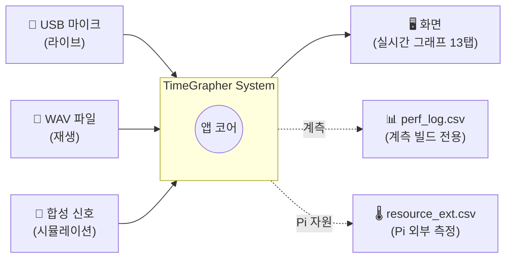
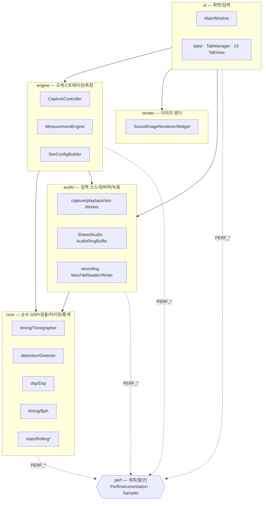
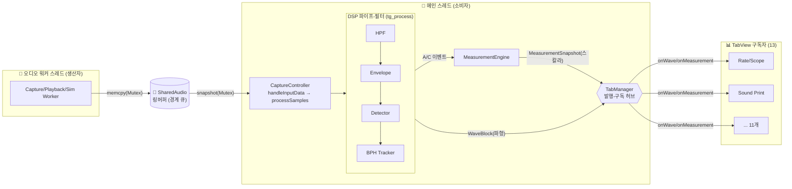
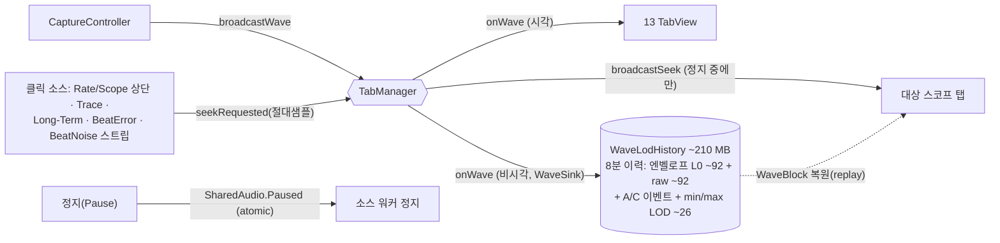

# TimeGrapher — 소프트웨어 아키텍처

> 기계식 시계의 똑딱 소리를 마이크로 듣고, 진폭·보율(rate)·비트 오차(beat error)를
> 실시간으로 측정·그래프로 보여 주는 Qt6/C++ 데스크톱 앱.
> Windows / Raspberry Pi(Linux) / macOS 에서 동작한다.

이 문서는 **무엇을 왜 재구조화했는지**와 **현재 구조(Context / Module / C&C 뷰)**,
그리고 **적용한 아키텍처 패턴·전술과 그 이유**를 설명한다.

관련 문서: [신호→그래프 흐름](SIGNAL_FLOW.md) · [성능 측정](PERFORMANCE.md) · [문서 인덱스](README.md)

---

## 1. 왜 재구조화했나 (AS-IS 문제)

재구조화 이전(`main` 브랜치)에는 `MainWindow` 한 클래스가 사실상 모든 일을 떠안고 있었다.

- UI 위젯 관리 (화면)
- 오디오 워커 스레드 생성·제어 (캡처/재생/시뮬레이션)
- 신호 처리 파이프라인 (`ProcessSamples`, `HandleInputData`)
- 측정 계산 (보율/비트오차/진폭 — `T*Events` 구조체)
- 성능 계측, WAV 파일 파싱, 시뮬레이션 설정 조립 …

그 결과 **단일 책임 원칙(SRP) 위반**, 높은 결합도, 낮은 응집도, 테스트·이식·변경의
어려움이 누적됐다. 소스 파일도 평면(`src/` 한 디렉터리)으로 흩어져 있어 "어떤 코드가
어느 관심사에 속하는지"가 코드 위치로 드러나지 않았다.

## 2. 무엇을 바꿨나 (AS-IS → TO-BE)

| 구분 | AS-IS (`main`) | TO-BE (현재) |
|---|---|---|
| 디렉터리 | 평면 `src/*` | **6 레이어** `core/audio/engine/render/ui/perf` |
| 측정 계산 | `MainWindow` 내부 `T*Events` | **`MeasurementEngine`** (engine) |
| 오디오+파이프라인 | `MainWindow::ProcessSamples/HandleInputData` | **`CaptureController`** (engine) |
| 디스플레이 탭 | `MainWindow.ui` 정적 위젯 | **`TabView` 추상화 + `TabManager`** (13개 탭) |
| WAV 파싱 | `MainWindow::OpenFile` 인라인 | **`WavFileReader`** (audio/recording) |
| 시뮬 설정 | `MainWindow::SimStart` 인라인 | **`SimConfigBuilder`** (engine) |
| UI 응답성 계측 | `MainWindow` 타이머 | **`UiResponsivenessSampler`** (perf) |
| 링버퍼 쓰기 | 3개 워커에 복붙 | **`AudioRingBuffer::writeSamplesToRing`** (DRY) |
| 성능 계측 ON/OFF | 런타임 분기(반쪽) | **`PERF_ENABLE` 컴파일 스위치**(완전 제거) |
| 8분 정지·스크롤백·seek | (없음) | **`WaveLodHistory`(WaveSink 구독자) + 전체정지(full-stop) + 교차탭 seek** |

→ `MainWindow` 는 이제 **순수 UI**(위젯 배선 + 저빈도 표시 갱신)에 가깝다.

---

## 3. Context View — 시스템 경계

시스템이 외부와 무엇을 주고받는지. 입력은 3가지 모드(라이브 마이크/녹음파일/시뮬레이션),
출력은 화면 그래프와 (계측 빌드에서) 성능 로그다.



---

## 4. Module View — 코드 구조(레이어)

의존성은 **위 → 아래 한 방향**만 허용한다(상위 레이어가 하위에 의존, 역방향 금지).
`perf` 는 모든 레이어가 계측 매크로로 참조하는 **횡단 관심사(cross-cutting)** 이며,
`PERF_ENABLE=0` 이면 그 의존성은 컴파일에서 사라진다.



### 디렉터리 트리 (책임)

```
src/
├── core/                 # 순수 도메인 — Qt·UI 의존 없음, 단위테스트 용이
│   ├── dsp/              #   HPF·엔벨로프 등 신호처리 필터
│   ├── detection/        #   온셋(A)·피크(C) 검출 상태기계
│   ├── timing/           #   Timegrapher(파이프라인) · Bph(박자 추적)
│   └── stats/            #   RollingAverage · RollingLeastSquares
├── audio/                # 입력 소스 + 공유 링버퍼 + 녹음
│   ├── capture/          #   라이브 마이크 워커(+플랫폼 오디오)
│   ├── playback/         #   WAV 재생 워커
│   ├── sim/              #   시뮬레이션 워커 + 합성기
│   ├── recording/        #   WAV 읽기(Reader)·쓰기(Writer)
│   ├── SharedAudio.h     #   스레드 공유 링버퍼 구조체
│   └── AudioRingBuffer.h #   공용 링버퍼 쓰기(3 워커 DRY)
├── engine/               # 도메인 오케스트레이션
│   ├── CaptureController #   오디오 소스 + 신호 파이프라인(핫패스)
│   ├── MeasurementEngine #   보율/비트오차/진폭 계산
│   └── SimConfigBuilder  #   시뮬 합성 설정 조립
├── render/               # 폴딩 사운드 이미지 렌더(픽셀)
├── perf/                 # 성능 계측(횡단) — PERF_ENABLE 로 컴파일 제거
│   ├── PerfInstrumentation       #   Perf::log/nowMs + CSV
│   ├── UiResponsivenessSampler   #   §A-3 UI 이벤트루프 지연
│   └── (외부 자원은 tools/resource_sample.sh 가 담당)
└── ui/                   # 화면
    ├── MainWindow        #   위젯 배선 + 저빈도 표시 갱신(순수 UI)
    └── tabs/             #   TabView 추상화 · TabManager · 13개 탭
```

---

## 5. C&C View — 런타임 구성요소와 연결

실행 시점의 컴포넌트(스레드·객체)와 그들이 통신하는 방식(커넥터)이다.
핵심은 **워커 스레드(생산자) → 링버퍼 → 메인 스레드(소비자)** 의 동시성 분리와,
메인 스레드 안의 **파이프-필터(DSP) → 발행-구독(탭)** 흐름이다.



- **경계 큐(ring buffer)**: 워커는 `Mutex` 보호 하에 쓰고, 메인 스레드는 같은 락으로
  스냅샷만 떠서 즉시 빠진다 → 락 보유 시간 최소화.
- **파이프-필터**: `tg_process()` 내부가 HPF→엔벨로프→지연→검출→박자추적의 직렬 필터.
- **발행-구독**: `TabManager` 가 `WaveBlock`/`MeasurementSnapshot` 을 모든 `TabView` 에
  브로드캐스트. 탭 추가는 코어 수정 없이 클래스 1개 + 등록 1줄.

> 데이터 흐름의 단계별 상세와 시퀀스 다이어그램은 **[SIGNAL_FLOW.md](SIGNAL_FLOW.md)** 참고.

### 5.1 정지(Pause) · 8분 스크롤백 · 교차탭 Seek

라이브 팬아웃(위)에 더해 **일시정지 후 과거 8분을 되짚어 보는** 기능을 무침습(non-invasive)
으로 얹었다. 핵심은 **중앙 이력 버퍼를 별도 구독자로 추가**하고, 표시를 동결한 채 그 이력을
다시 그리는 것이다. 기존 파이프라인(`CaptureController`·탭)은 거의 손대지 않았다(OCP).



- **중앙 이력 = WaveSink 구독자** — `WaveLodHistory` 는 `TabView` 가 아니라 좁은
  `WaveSink`(`onWave` 1개) 인터페이스로 `TabManager` 에 등록된다(ISP). 정지와 무관하게
  매 슬라이스 **엔벨로프 · 원신호(raw) · A/C 이벤트**를 절대 샘플 좌표로 8분간 누적하고,
  빠른 줌아웃 렌더를 위해 min/max **LOD 피라미드**를 함께 유지한다.
- **전체 정지(full-stop Pause)** — 정지 시 `SharedAudio.Paused`(atomic)를 세워 **소스 워커
  자체를 멈춘다**(playback/sim = 위치 보존, live = 캡처 폐기). 시간·인덱스가 안 흘러 resume 시
  정확히 이어지고 비트 번호·트렌드에 갭이 없다("비디오 일시정지").
- **교차탭 Seek = 절대 샘플 좌표** — 모든 시계열(트렌드) 탭이 클릭 소스다. 클릭하면 그 시점의
  **절대 입력 샘플 인덱스**를 emit → `TabManager.broadcastSeek`(정지 중에만) 가 전 탭에 전파.
  순간을 보여 주는 스코프 탭은 이력에서 그 구간 `WaveBlock` 을 **복원(replay)** 해 자기 버퍼에
  넣고 평소 `render()` 만 호출한다(누적 상태 불변). 트렌드 탭은 커서선만 그 시점으로 동기화.
- **좌표 통일** — `totalSamples`(측정) · 이벤트 `sample_index` · `processed_pcm_start_sample`
  이 모두 같은 절대 입력샘플 도메인이라 탭 간 커서·replay 가 정렬된다.
- **재사용 헬퍼** — 클릭→seek + 자홍 커서선은 `TrendSeek`(헤더온리, Q_OBJECT 없이
  `std::function` 콜백)로 공통화해 여러 트렌드 탭이 동일하게 쓴다(DRY).

> 단계별 흐름은 **[SIGNAL_FLOW.md §7](SIGNAL_FLOW.md)**, 런타임 연결자 속성은
> **[CC_VIEW.md](CC_VIEW.md)** 의 정지·seek 절 참고.

---

## 6. 적용한 패턴 · 전술 (무엇을 / 왜)

> 전술 용어는 Bass 외 *Software Architecture in Practice* 의 분류를 따른다.

### 6.1 아키텍처 패턴

| 패턴 | 적용 위치 | 왜 |
|---|---|---|
| **Layered (계층화)** | `core/audio/engine/render/ui/perf` | 관심사 분리 + 의존성 단방향화 → 변경 파급 차단, 코어 단위테스트 가능 |
| **Pipe & Filter** | `tg_process` DSP 단계 | 신호처리를 독립 필터로 분해 → 단계별 교체·계측 용이 |
| **Producer–Consumer** | 워커 스레드 ↔ 링버퍼 ↔ 메인 | 캡처(실시간성)와 처리/표시를 분리해 서로를 막지 않음 |
| **Publish–Subscribe** | `TabManager` → `TabView` | 데이터 생산자와 13개 화면을 디커플 → OCP(탭 추가에 코어 불변) |
| **Facade** | `CaptureController` · `Timegrapher`(`tg_process`) | 워커·검출기·엔진·녹음(또는 HPF·엔벨로프·검출·BPH)의 복잡한 조립을 단일 진입점으로 감춤 |
| **Strategy / 다형성** | `TabView` 인터페이스 · `ScopeFilters`(F0~F3) · Spectrogram 윈도 선택 | 동일 계약(onWave/onMeasurement)으로 렌더 전략을 런타임 교체 |
| **Builder** | `SimConfigBuilder` | 시뮬 합성 설정(`WatchSynthStreamConfig`) 조립 규칙을 호출측에서 분리 |
| **Template Method** | `TabView::showEvent → onShown()` | 베이스가 생명주기 골격, 파생 탭이 훅만 채움 |
| **Handle/Body (Opaque pointer)** | `tg_context_t` (C-API) | 내부 struct 를 헤더에서 숨겨 ABI 안정 + 컴파일 의존 차단 |
| **State Machine** | Detector(Silence↔Burst) · Bph(Sync NOT_SYNCED↔SYNCED) | 검출·동기 로직을 명시적 상태/전이로 분해 → 추적·검증 용이 |
| **Feedback Control (PLL)** | `Bph` period/ac 게인 보정 | 클록 드리프트를 재검출 없이 추종(비트 주기·오프셋 적응) |

### 6.2 수정용이성(Modifiability) 전술

| 전술 | 적용 | 왜 |
|---|---|---|
| **응집도 높이기 (Increase cohesion)** | `MeasurementEngine`·`WavFileReader`·`SimConfigBuilder` 추출 | 한 모듈 = 한 책임 |
| **결합도 낮추기 — 캡슐화** | `MainWindow` 를 순수 UI 로 | UI 변경이 파이프라인에 안 번지게 |
| **결합도 낮추기 — 중개자(intermediary)** | `TabManager` | 탭과 데이터원이 서로를 직접 모름 |
| **결합도 낮추기 — 의존성 제한(restrict dependencies)** | 레이어 단방향 의존 | 순환·역의존 방지 |
| **인터페이스 분리 (ISP)** | `WaveSink`(onWave 1개) vs `TabView`(6개 계약) | 비시각 청취자(이력 버퍼)가 무거운 QWidget 계약을 안 떠안음 |
| **계산/IO 분리** | `Dsp`·`Detector`·`WatchSynthStream` 는 float 배열만 | 하드웨어 없이 호출·테스트 가능 |
| **렌더 해상도/표시 분리** | `SoundImageWidget` 고정 캔버스 ↔ 위젯 resize 독립 | 렌더러 포인터 안정(use-after-free 방지) + 누적 이미지 보존 |
| **상태 보존형 설정 변경** | `SoundImageRenderer::clearRenderStateKeepingSampleCounter()` | BPH/레이트 변경 시 렌더만 리셋, 절대 샘플 시계는 보존 |
| **DRY (공통 추출)** | `AudioRingBuffer::writeSamplesToRing<>` · `PlotHelpers`·`TabScaffold`·`ReadoutBar` | 3 워커/다수 탭의 중복 제거 |
| **바인딩 지연 (Defer binding)** | `PERF_ENABLE` 컴파일 스위치 | 프로덕션 빌드에서 계측을 0비용으로 제거 |

### 6.3 성능(Performance) 전술

| 전술 | 적용 | 왜 |
|---|---|---|
| **동시성 도입 (Introduce concurrency)** | 오디오 워커 스레드(TimeCritical) | 캡처가 UI/처리에 안 막힘 |
| **경계 큐 (Bound queue / ring buffer)** | `SharedAudio` 30초 링 | 메모리 상한·드롭 추정 가능 |
| **다중 복사 유지 (Maintain multiple copies)** | 메인 스레드 로컬 스냅샷 | 락 보유 최소화로 경합↓ |
| **이벤트율 관리 (Manage event rate)** | 고샘플레이트 min/max 데시메이션 · 노이즈 샘플 1/ms | 384kHz 에서 그리기 점수 폭증(=멈춤) 방지, 검출은 풀레이트 유지 |
| **LOD (Level-of-detail)** | `WaveLodHistory` 피라미드(raw/즉석버킷/사전빌드 자동선택) | 8분 스크롤백을 출력 점수 상한 내에서 렌더 |
| **계산 오버헤드 감소 — 가시성 가드** | 각 탭 `if (isVisible()) replot()` + `onShown()` 지연 재그림 | 숨은 탭은 데이터만 누적, 보일 때만 무거운 렌더 |
| **캐싱/누산 (Maintain cached copy)** | 탭별 ring/EMA 누산(`mTicAvg`·`mTr1Sum` 등) · 마커/라벨 객체 풀 | 매 프레임 재계산·재할당 회피 |
| **증분 통계 (O(1))** | `RollingAverage`(running sum)·`RollingLeastSquares`(Σ 증분) | 윈도 전체 재계산 회피 |
| **사전 계산 (Precompute)** | `SoundImageRenderer::recomputeDerived()` DC 계수 등 | 핫패스 밖에서 1회 계산 |
| **오버헤드 감소 (Reduce overhead)** | `PERF_ENABLE=0` 시 계측 컴파일 제거 · 핫패스 직접 호출(시그널 X) · CSV 1초 주기 flush | 핫패스에서 타임스탬프·로깅·디스패치 자체를 없앰 |

성능 개선의 구체적 수치·측정 방법은 **[PERFORMANCE.md](PERFORMANCE.md)** 에 정리했다.

### 6.4 가용성·견고성(Availability) 전술

| 전술 | 적용 | 왜 |
|---|---|---|
| **재동기 방어 (Fault detection)** | `processSamples` 의 total 되감김 감지 → 블록 스킵 | uint64 언더플로로 인한 쓰레기 슬라이스 방지(소스 재시작 등) |
| **워밍업/앵커 버퍼링** | Detector 200ms 워밍업 스킵 · renderer warmup+anchor | 적응 임계 안정 전 오검출/표시 점프 방지 |
| **레짐 변화 복구 + 쿨다운(debounce)** | 진폭 10배 점프 감지 → 적응상태 flush, 1초 쿨다운 | 마이크에 시계 도착 등 음향 급변에서 회복하되 thrashing 방지 |
| **워치독 (Watchdog)** | Sync FSM: miss 누적/시간초과 시 lock 해제 | 신호 끊김을 자동 감지해 재검출로 전환 |
| **메모리 상한 유지** | `pruneOldMarkers` · `TrendSeek::setPurgeWindow` · 히스토리 링 | 장시간 스트림에서 무한 증가 차단 |
| **방어적 가드/클램핑** | null 체크 · 파라미터 `[min,max]` 클램프 · 인덱스 경계 검사 | 비정상 입력에서 조기 탈출 |
| **자원 수명 = 객체 수명 (RAII)** | `Rolling*`·`SoundImageWidget`·`CaptureController` 소멸자 정리(스레드 join 포함) | 누수·use-after-free 방지 |
| **전체 정지 = 소스 동결** | 정지 시 `SharedAudio.Paused` 로 워커를 멈춰 시간·위치 불변 | resume 시 갭/리셋 없이 정확히 이어짐(§5.1) |
| **세션 경계 상태 리셋** | 새 세션·되감김에서 이력/커서/seek 라벨 비움(`broadcastReset`·`onResumeLive`) | 이전 세션 좌표·표시 잔존 방지 |

### 6.5 테스트용이성·관찰가능성(Testability / Observability) 전술

| 전술 | 적용 | 왜 |
|---|---|---|
| **순수 코어 분리** | `core/*` (Qt·하드웨어 무관) | 단위 테스트·이식 용이 |
| **Ground-Truth 검증 하니스** | Sim 정답 이벤트 링(`GtBeats`) vs 검출 결과 대조(`matchGroundTruth`, G-1) | 검출/측정 정확도를 정량 측정(계측 빌드 전용) |
| **결정론적 합성기** | SplitMix64 시드 RNG(`WatchSynthStream`) | 재현 가능한 테스트 신호 |
| **계측 분류 체계 + 게이팅** | 섹션코드(A-1…G-2)+QA태그 · `PERF_GRP_*` 비트마스크 | `grep` 으로 지표 추출, 그룹별 on/off |
| **단조 시계 + epoch 동기화** | `steady_clock` 기준 · CSV `epoch_ms_t0` | NTP 보정 영향 차단 + 외부 자원 로그와 정렬 |
| **UI 응답성 샘플링** | `UiResponsivenessSampler`(이벤트루프 지연) | 메인 스레드 블로킹을 정량화(§A-3) |
| **디바이스 오류 관찰** | `QAudioSource::error()` xrun · 실효 throughput(SPS/FPS) 2초 샘플 | 캡처 드롭/언더런 조기 발견 |

### 6.6 이식성·빌드(Portability / Build) 전술

| 전술 | 적용 | 왜 |
|---|---|---|
| **플랫폼 추상화** | `Windows/LinuxAudio` · `#ifdef Q_OS_*` · `__uint128_t` 폴백 | OS별 차이를 경계에 격리, 코어는 공통 |
| **컴파일 타임 토글 (Aspect)** | `PERF_ENABLE` / `PERF_GRP_*` | 횡단 계측을 빌드에서 완전 제거/선택 |
| **빌드 자원 관리** | CMake `JOB_POOLS compile_pool=4` · 레이어별 include 경로 · C++17 | 거대 TU OOM 방지 · 물리 배치 은닉 |

> **문서 동기화 메모**: §6.3~6.6 의 다수 항목(LOD·가시성 가드·캐싱·서브샘플 보간·PLL·FSM·플랫폼 추상화 등)은
> 초기 설계 문서에 빠져 있었으나 **현재 코드에 실제 구현**되어 있어 본 개정에서 반영했다.
> (`TabManager.h` 의 "가시성 가드는 추후" 주석은 이미 구현된 현실과 어긋나므로 정정 대상.)

---

## 7. 핵심 데이터 계약 (요약)

| 구조체 | 단위 | 누가 만들고 | 무엇을 담나 |
|---|---|---|---|
| `WaveBlock` | 슬라이스(≈오디오 청크)당 | `CaptureController` | 엔벨로프 파형 + A/C 마커 + 원신호 |
| `MeasurementSnapshot` | 비트(C 이벤트)당 | `MeasurementEngine` 결과 | 보율·비트오차·진폭 스칼라 + rate 시리즈 |

두 스트림은 **독립**이다(1:1 아님). 한 `WaveBlock` 에 0..N 개의 `MeasurementSnapshot`
이 대응할 수 있다. 자세한 관계는 [SIGNAL_FLOW.md](SIGNAL_FLOW.md) §3 참고.

`WaveBlock` 은 시각 탭뿐 아니라 **`WaveLodHistory`(WaveSink)** 도 같이 소비한다(§5.1) — 8분
이력 누적·seek replay 의 원천이며, 정지와 무관하게 항상 공급된다.
