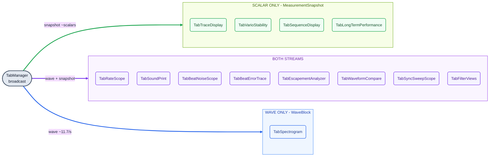
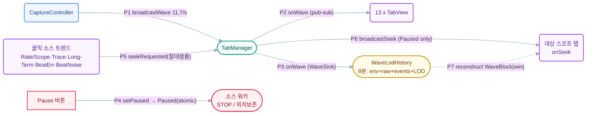

# C&C View — Runtime Components & Connectors

> **대상 독자:** 원래 시스템(DSP·탭·캡처 흐름)을 이미 아는 사람.
> 그래서 이 문서는 *모듈이 무엇인지*(→ [ARCHITECTURE.md](ARCHITECTURE.md)의 Module View)가 아니라
> **런타임에 무엇이 동시 실행되며, 컴포넌트들이 *어떤 연결자로, 어떤 속성으로* 이어지는지**를 다룬다.

C&C(Component-and-Connector) View가 "분석 가능"하려면 박스·화살표만으로는 부족하다.
**각 연결자에 정량 속성**(데이터율·페이로드·크기·blocking·스레드 교차 여부)이 붙어야 지연·처리량·병목을
추론할 수 있다. 아래의 모든 수치는 코드에서 직접 추출했다(예시 샘플레이트 `fs = 48 kHz` 기준).

**핵심 상수 (출처)**

| 상수 | 값 | 출처 | 유도값 (fs=48 kHz) |
|---|---|---|---|
| `SAMPLE_FORMAT` / `CHANNELS` | float32 / mono | `SharedAudio.h` | 4 B/sample |
| `SECONDS_OF_BUFFER` | 30 s | `SharedAudio.h` | 링 = 30×48k×4B = **5.76 MB** |
| `DETECTOR_NUMBER_OF_SAMPLES` | 4096 | `CaptureController.cpp:18` | 슬라이스 = 4096/48k = **85.3 ms → 11.7 slice/s** |
| HPF cutoff / env LPF | 200 Hz / 0.15 ms | `Timegrapher.h:80‑81` | DSP 1·2단 |
| refractory / auto-detect | 2 ms / 1.5 s | `Timegrapher.h:82,84` | 이벤트 최소간격 / BPH 확정시간 |
| 전형 무브먼트 | 28 800 BPH | (도메인) | 8 beat/s → A+C = **16 event/s** |

---

## 연결자 범례 (Connector legend)

| 색 | 연결자 타입 | 코드상 실체 |
|---|---|---|
| 🟧 주황 | **Shared-data** (비동기, Mutex) | `SharedAudio` 링버퍼 R/W |
| 🟪 보라 | **Qt signal/slot** (스레드 경계 ↯) | `AudioDataReady`, `measurementReady` |
| ⬛ 검정 굵게 | **Call-return** (pipe & filter) | `tg_process()` |
| 🟦 파랑 | **WaveBlock 스트림** | `broadcastWave()` |
| 🟩 초록 | **MeasurementSnapshot 스트림** | `broadcastMeasurement()` |
| 🟦 청록 | **Publish-subscribe** (1:N) | `TabManager` → 13×`TabView` |
| 🟥 빨강 | **Back-pressure** (feedback) | `onScopeReplotted` |

---

## 그림 1 — C&C 런타임 뷰 (스레드 레인 + 타입별 연결자)

```mermaid
%%{init: {'theme':'base','themeVariables':{'fontFamily':'Segoe UI, Helvetica, Arial, sans-serif','fontSize':'13px','lineColor':'#94a3b8','primaryTextColor':'#1e293b'},'flowchart':{'curve':'basis','nodeSpacing':46,'rankSpacing':78,'padding':14}}}%%
flowchart LR
  subgraph WT["AUDIO WORKER THREAD  --  I/O bound"]
    direction TB
    AW("AudioWorker /<br/>PlaybackWorker /<br/>SimWorker<br/>writes float32 mono PCM")
  end

  RING(["SharedAudio RING<br/>float32 mono, 30 s<br/>= 5.76 MB @ 48 kHz<br/>Mutex, lock-min"])

  subgraph MT["MAIN (GUI) THREAD  --  CPU bound"]
    direction TB
    CC("CaptureController<br/>pull + DSP drive<br/>mInputBlock 4096")
    TG[["Timegrapher tg_process()<br/>6-stage pipe, O(n)/slice"]]
    MW("MainWindow<br/>DisplayResults<br/>fills Snapshot")
    TM("TabManager<br/>fan-out + per-tab timing")
    TABS("13 x TabView<br/>파형계열: WaveBuffer 링 0.5~2s<br/>isVisible() render guard")
  end

  AW -- "L0 PCM write<br/>shared-data<br/>device cadence, non-block" --> RING
  RING -- "L2 read new samples<br/>shared-data<br/>per batch, brief lock" --> CC
  AW -. "L1 AudioDataReady<br/>Qt queued, CROSS-THREAD<br/>async notify" .-> CC
  CC == "L3 tg_process(4096)<br/>call-return, SYNC<br/>85.3 ms slice, 11.7/s" ==> TG
  CC -- "L4 WaveBlock<br/>11.7/s, env+raw 4096<br/>up to ~32 KB ptrs" --> TM
  CC -. "L5 measurementReady<br/>Qt signal, same-thread" .-> MW
  MW -- "L6 Snapshot<br/>per update<br/>~30 scalars + tic/toc" --> TM
  TM -. "L7 pub-sub 1:N<br/>13 subscribers<br/>isVisible guarded" .-> TABS
  TABS -. "L8 onScopeReplotted<br/>back-pressure<br/>(only feedback edge)" .-> CC

  classDef worker fill:#fff7ed,stroke:#fb923c,stroke-width:1.5px,color:#7c2d12
  classDef shared fill:#fefce8,stroke:#ca8a04,stroke-width:1.5px,color:#713f12
  classDef ctrl fill:#eff6ff,stroke:#3b82f6,stroke-width:1.5px,color:#1e3a8a
  classDef dsp fill:#f1f5f9,stroke:#334155,stroke-width:2px,color:#0f172a
  classDef pub fill:#f0fdfa,stroke:#0d9488,stroke-width:1.5px,color:#134e4a
  classDef view fill:#faf5ff,stroke:#9333ea,stroke-width:1.5px,color:#581c87

  class AW worker
  class RING shared
  class CC,MW ctrl
  class TG dsp
  class TM pub
  class TABS view

  style WT fill:#fffbeb,stroke:#f59e0b,stroke-width:1px,color:#92400e
  style MT fill:#f8fafc,stroke:#cbd5e1,stroke-width:1px,color:#334155

  linkStyle 0,1 stroke:#ea8b0c,stroke-width:2.5px
  linkStyle 2,5 stroke:#8b5cf6,stroke-width:2.5px
  linkStyle 3 stroke:#1e293b,stroke-width:3.5px
  linkStyle 4 stroke:#2563eb,stroke-width:2.5px
  linkStyle 6 stroke:#16a34a,stroke-width:2.5px
  linkStyle 7 stroke:#0d9488,stroke-width:2.5px
  linkStyle 8 stroke:#dc2626,stroke-width:2.5px
```

**지연 구간 매핑 (그림의 L 번호 → 측정 지표)** — `cap2proc = L0~L2`(스레드 경계, 드롭/backlog 발생 지점) ·
`proc2disp = L3~L7`(DSP+게시, CPU 바운드) · `disp_paint = L8 이후`(실제 paint). 셋의 합 = `e2e_full`.
빨강 **L8 하나만 역방향**이고 나머지는 단방향 하향이다.

### 연결자 카탈로그 (이 뷰의 분석 근간)

| # | 연결자 | 타입 | From → To | 페이로드 | 데이터율 | 크기 | Blocking | ↯스레드 |
|---|---|---|---|---|---|---|---|:---:|
| **L0** | ring write | shared-data (Mutex) | Worker → Ring | float32 mono PCM | 디바이스 콜백 주기 | 콜백 chunk | 비차단(lock 최소) | **예** |
| **L1** | `AudioDataReady` | Qt signal (queued) | Worker → CC | 샘플 수(int) | 콜백마다 | ~0 | 비동기 | **예** |
| **L2** | ring read | shared-data (Mutex) | Ring → CC | 신규 PCM(ΔWriteIndex) | 배치마다 | 가변 | 짧은 lock | **예** |
| **L3** | `tg_process()` | call-return (pipe&filter) | CC → Timegrapher | 슬라이스 ≤4096 float | 슬라이스마다 **≈11.7/s** | ≤16 KB | **동기** | 아니오 |
| **L4** | `broadcastWave` | 직접 호출(발행) | CC → TabManager | `WaveBlock`(env+raw ≤4096 + events) | 슬라이스마다 **≈11.7/s** | ≤~32 KB(포인터) | 동기, `isVisible()` 가드 | 아니오 |
| **L5** | `measurementReady` | Qt signal (direct) | CC → MainWindow | (없음) | 측정 갱신마다 | ~0 | 동기 | 아니오 |
| **L6** | `broadcastMeasurement` | 직접 호출(발행) | MainWindow → TabManager | `MeasurementSnapshot`(~30 스칼라 + tic/toc 배열) | 측정 갱신마다 | 수백 B | 동기 | 아니오 |
| **L7** | `onMeasurement`/`onWave` | **publish-subscribe 1:N** | TabManager → 13×TabView | 상동(두 스트림) | 상동 | — | 동기, 탭별 `tab_update_ms` 계측 | 아니오 |
| **L8** | `onScopeReplotted` | back-pressure(feedback) | TabView → CC | replot 완료 통지 | replot마다 | ~0 | 비동기 | 아니오 |

> **분석 포인트** — 스레드 경계(↯)를 넘는 연결자는 **L0·L1·L2 단 3개**이며 전부 워커↔메인 사이다.
> 동기화·xrun·backlog·`cap2proc_latency`는 오직 여기서 발생한다(L3 이후는 전부 메인 스레드 동기 실행).

---

## 그림 2 — DSP 파이프 & 필터 (`tg_process()` 내부, L3의 펼침)

그림 1에서 한 박스로 압축한 `tg_process()`의 내부. 각 필터의 파라미터는 `Timegrapher.h`에서 발췌.

```mermaid
%%{init: {'theme':'base','themeVariables':{'fontFamily':'Segoe UI, Helvetica, Arial, sans-serif','fontSize':'13px','lineColor':'#94a3b8','primaryTextColor':'#1e293b'},'flowchart':{'curve':'linear','nodeSpacing':28,'rankSpacing':36,'padding':12}}}%%
flowchart LR
  IN(["PCM in<br/>float32 mono, slice up to 4096"])
  F1["DC blocker<br/>200 Hz HPF"]
  F2["Envelope<br/>full-wave rectify<br/>+ 0.15 ms LPF"]
  F3["Onset detector<br/>silence-based<br/>refractory 2 ms"]
  F4["A / C events<br/>sub-sample +/-0.5<br/>onset frac 0.03 / peak 0.20"]
  F5["BPH detect<br/>Rayleigh phase-score<br/>auto 1.5 s"]
  F6["PLL sync tracker<br/>period g=0.01, ac g=0.05<br/>sync-loss 12 misses"]
  OUT(["tg_result_t<br/>events + delayed envelope<br/>+ sync_status / detected_bph"])

  IN --> F1 --> F2 --> F3 --> F4 --> F5 --> F6 --> OUT

  classDef io fill:#ecfeff,stroke:#0891b2,stroke-width:1.5px,color:#155e75
  classDef filt fill:#f8fafc,stroke:#475569,stroke-width:1.3px,color:#0f172a
  class IN,OUT io
  class F1,F2,F3,F4,F5,F6 filt
```

> 엔벨로프(`processed_pcm`)는 이벤트와 **동일 절대 좌표로 지연 정렬**되어 출력된다(`processed_pcm_start_sample`).
> 그래서 L4의 `WaveBlock.env`는 마커(A/C)와 픽셀 단위로 맞물려 스코프 탭이 그대로 그릴 수 있다.

---

## 그림 3 — 발행-구독 팬아웃 (스트림별 구독)

`TabManager`가 13개 `TabView`로 브로드캐스트할 때 **어느 탭이 어느 스트림을 받는지**.
(코드 실측: `onWave`/`onMeasurement` override 기준 — scalar-only 4 · both 8 · wave-only 1)

---

## 그림 4 — 정지 · 8분 이력 · 교차탭 Seek (런타임 확장)

라이브 팬아웃과 **동시에** 도는 비시각 경로(이력)와, 정지 중에만 활성화되는 seek 경로다.
같은 `broadcastWave` 가 13개 시각 탭과 1개 `WaveLodHistory`(WaveSink)를 함께 먹인다.

### 정지·seek 연결자 카탈로그

| # | 연결자 | 타입 | From → To | 페이로드 | 활성 조건 | ↯스레드 |
|---|---|---|---|---|---|:---:|
| **P3** | `WaveSink::onWave` | 직접 호출(발행, 비시각) | TabManager → WaveLodHistory | `WaveBlock`(env+raw+events) | **항상**(정지 무관) | 아니오 |
| **P4** | `setPaused` → `Paused` | shared-flag (atomic) | MainWindow → 워커 | bool | 정지 토글 | **예** |
| **P5** | `seekRequested` | Qt signal | 트렌드 탭 → MainWindow→TabManager | 절대 샘플(double) | 정지 중 클릭 | 아니오 |
| **P6** | `broadcastSeek` | **publish-subscribe 1:N** | TabManager → onSeek(전 탭) | 절대 샘플 | `mPaused==true` 게이트 | 아니오 |
| **P7** | `reconstruct`/`replayInto` | call-return | WaveLodHistory → 대상 탭 버퍼 | 복원 `WaveBlock`(win 샘플) | onSeek 시 | 아니오 |

> **분석 포인트** — 이력 경로(P3)는 라이브와 병행하므로 추가 비용은 슬라이스당 1회 링 쓰기뿐
> (LOD 갱신 포함, 시각 탭 render 보다 훨씬 가볍다). seek 경로(P5~P7)는 **정지 중에만** 도므로
> 라이브 핫패스에 0 영향이다. 좌표는 전부 **절대 입력샘플**이라 탭 간 커서·replay 가 정렬된다.

---

## 컴포넌트 카탈로그

| 컴포넌트 | 스레드 | 역할 | 주요 보유 상태 | 비용 특성 |
|---|---|---|---|---|
| `AudioWorker`/`PlaybackWorker`/`SimWorker` | worker | 캡처·파일·합성 → 링 write + 알림 | 디바이스 핸들, 쓰기 인덱스 | I/O 바운드, 콜백 주기 |
| `SharedAudio` 링 | (공유) | 30 s 원형버퍼, Mutex 경계 | `Samples[fs×30]`, `WriteIndex`, GT 이벤트 링(Sim) | 5.76 MB 상주 |
| `CaptureController` | main | 링 pull → `tg_process` → 게시 | `mCtx`, `mInputBlock[4096]`, 절대 샘플 카운터 | **DSP CPU 바운드 핵심** |
| `Timegrapher` (`tg_*`) | main | 검출 파이프&필터(그림 2) | HPF/env 상태, PLL, noise floor | 슬라이스당 O(n) |
| `MainWindow` | main | `DisplayResults` → 스냅샷 채워 게시 | 위젯, readout 상태 | 경량(스칼라) |
| `TabManager` | main | 발행자(1:N), 탭별 `tab_update_ms` 계측 | 탭 리스트 | 순회 비용 = Σ 탭 |
| `TabView` ×13 | main | 구독자(그래프), 자기 버퍼 보관 | `WaveBuffer`(탭별 0.5~2 s), 플롯 데이터 | `isVisible()`로 숨은 탭 render 생략 |
| `WaveLodHistory` ×1 | main | **비시각** 구독자(`WaveSink`) — 8분 이력 + seek replay 원천 | 엔벨로프 L0 링 · raw PCM 링 · A/C 이벤트 · LOD 피라미드 | 엔벨로프 ~92 + raw ~92 + LOD ~26 ≈ **210 MB** 상주(48 kHz·8분) |

---

## 분석 노트 (이 뷰로 답할 수 있는 것)

- **지연 사슬(telescoping)** — `e2e_full = cap2proc(L0~L2) + proc2disp(L3~L7) + disp_paint(L8 이후)`.
  계측 지점은 [PERFORMANCE.md](PERFORMANCE.md)의 §A-1/A-2와 1:1로 대응한다.
- **병목 후보** — CPU 바운드 구간은 L3(`tg_process`, 슬라이스당 O(n))와 L7(가시 탭들의 replot). 후자는
  `isVisible()` 가드로 숨은 탭을 생략해 팬아웃 13개라도 실제 비용은 가시 탭에 한정된다.
- **backlog 안전여유** — 슬라이스 처리(L3~L7)가 85.3 ms를 넘기면 `backlog_samples`가 쌓이고, Live에서는
  링(30 s) 한도 내에서 흡수하다 초과 시 `DroppedSampleEstimate`로 드러난다(`A-2`/`B-1` 계측).
- **유일한 역방향 결합** — L8 `onScopeReplotted` back-pressure 하나뿐. 그 외 모든 흐름은 단방향 하향이라
  새 탭 추가가 코어에 영향을 주지 않는다(OCP, `TabView` 인터페이스 1점 결합).

### 관련 문서
- [ARCHITECTURE.md](ARCHITECTURE.md) — Context / **Module** / 패턴·택틱 (정적 구조)
- [SIGNAL_FLOW.md](SIGNAL_FLOW.md) — 신호→그래프 전체 흐름, 두 스트림 시퀀스
- [PERFORMANCE.md](PERFORMANCE.md) — 위 L0~L8 연결자별 계측 지점(cap2proc·proc2disp·disp_paint)
