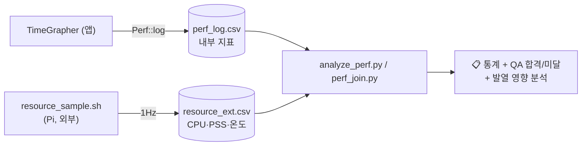
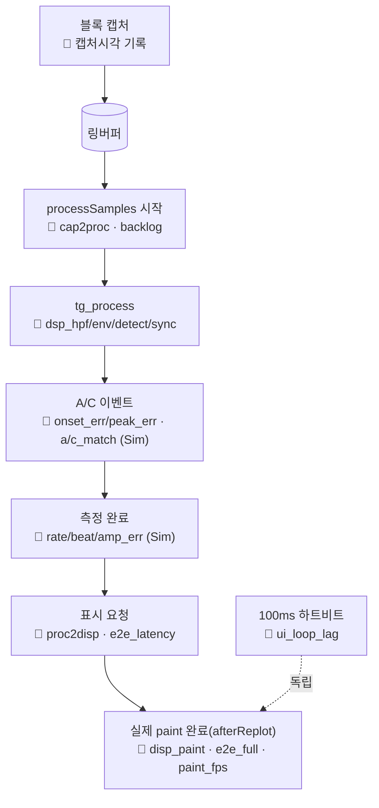
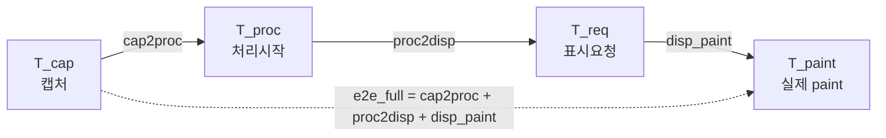

# 성능 측정 — 무엇을, 어디서, 어떻게

> 이 앱은 "느려졌나?"를 감이 아니라 **숫자**로 본다.
> 파이프라인의 각 단계가 얼마나 걸리는지, 정확도는 목표를 만족하는지를 CSV로 남기고 분석한다.

관련: [아키텍처](ARCHITECTURE.md) · [신호 흐름](SIGNAL_FLOW.md) · [문서 인덱스](README.md)

---

## 1. 큰 그림 — 두 종류의 로그

| 종류 | 누가 남기나 | 무엇을 | 파일 |
|---|---|---|---|
| **내부 계측** | 앱 자신 (`Perf::log`) | 지연·정확도·FPS·백로그 등 *"밖에서 못 보는"* 의미론적 지표 | `perf_log.csv` |
| **외부 자원** | `resource_sample.sh` (Pi) | CPU%·메모리(PSS)·온도·스로틀 | `resource_ext.csv` |

두 로그는 `perf_log.csv` 헤더의 **`epoch_ms_t0`** 로 시간 정렬된다
(`절대시각 = epoch_ms_t0 + t_ms`). 자원은 외부에서 재서 **관측자 효과**(측정이 측정대상을
오염)를 피한다.



---

## 2. 측정 지점 — 파이프라인 어디서 무엇이 찍히나

각 지표가 [신호 흐름](SIGNAL_FLOW.md)의 어느 단계에서 나오는지 겹쳐 본 그림이다.



### 지연 체인 — 단계들이 정확히 합쳐진다

캡처(T_cap) → 처리시작(T_proc) → 표시요청(T_req) → 실제 페인트(T_paint) 의 네 시점으로
**종단간 지연을 분해**한다. 분해된 단계의 합이 전체와 일치한다(텔레스코프).



> 캡처 기준 지표(cap2proc·e2e)는 **라이브 모드 전용**(재생/시뮬은 캡처시각이 없음).
> 정확도 지표(onset/peak/rate/beat/amp·검출률)는 **시뮬 모드 전용**(정답값 대조).

---

## 3. 지표 카탈로그

`section`(예 `A-1`)과 `metric` 으로 코드·문서를 바로 찾을 수 있다
(`grep A-2 perf_log.csv` → 단계별 지연만 추출). 정의는 [`PerfInstrumentation.h`](../src/perf/PerfInstrumentation.h).

| § | metric | 의미 | 목표(참고) | 모드 |
|---|---|---|---|---|
| A-1 | `e2e_full_ms` | **진짜 종단간**(캡처→실제 페인트) | 평균≤50 · 최악≤100ms | Live |
| A-1 | `e2e_latency_ms` | 종단 하한(캡처→표시요청) | — | Live |
| A-2 | `cap2proc_latency_ms` | 캡처→처리 시작 | — | Live |
| A-2 | `proc2disp_latency_ms` | 처리→표시요청 | — | 전체 |
| A-2 | `disp_paint_ms` | 표시요청→실제 페인트 | — | 전체 |
| A-2 | `backlog_samples` | 미처리 누적 샘플(백로그) | — | 전체 |
| A-3 | `ui_loop_lag_ms` | UI 이벤트루프 지연(응답성) | 최악≤200ms | 전체 |
| A-4 | `fault_sync_lost`/`detector_reset` | 동기상실·검출기 리셋 발생 | — | 전체 |
| B-1 | `capture_gap_samples`/`audio_xrun` | 캡처 드롭 추정·장치 오류 | — | Live |
| B-3 | `bg_*`/`fg_*` (sps/fps/spf) | 백그라운드·전경 실효 처리량 | — | 전체 |
| B-4 | `dsp_hpf/env/detect/sync/total_ms` | **DSP 단계별 시간**(1초 평균+최대) | — | 전체 |
| F-1 | `paint_fps`/`tab_update_ms` | 실제 화면 갱신율·탭별 갱신시간 | — | 전체 |
| E-2 | `onset_err_ms`/`peak_err_ms` | 검출 A/C vs 정답 오차 | ≤0.5 / ≤0.2ms | Sim |
| G-1 | `rate_err_s_per_d`/`beaterr_err_ms`/`amp_err_deg` | 측정값−설정값 오차 | ≤1 s/d · ≤0.1ms · ≤5° | Sim |
| G-2 | `a_match`/`c_match`/`gt_total` | 검출 성공/총 정답 → 검출률 | ≥95% | Sim |
| C-1 | `cpu_percent` | 프로세스 CPU%(전 코어) | ≤70% | 외부 |
| C-2 | `temp_c`/`throttled` | SoC 온도·스로틀 | — | 외부(Pi) |
| D-1 | `pss_mb` | 실점유 메모리(PSS) | — | 외부 |

> **PSS** 를 쓰는 이유: RSS는 공유 라이브러리(Qt)를 통째로 세어 부풀려진다. PSS는 공유
> 페이지를 공유 프로세스 수로 나눠 배분해 앱이 *진짜* 차지하는 몫을 본다.

---

## 4. ON/OFF — `PERF_ENABLE` 컴파일 스위치

[`src/perf/PerfInstrumentation.h`](../src/perf/PerfInstrumentation.h) 의 매크로 하나로 제어한다.

| 값 | 효과 |
|---|---|
| `PERF_ENABLE 1` (기본) | 인앱 계측 전부 ON. Pi에선 `resource_sample.sh` 도 자동 실행(짝 운용) |
| `PERF_ENABLE 0` | `PERF_*` 매크로가 no-op + 계측 블록이 `#if` 로 제거 → **타임스탬프 캡처·로깅이 컴파일에서 사라짐**(핫패스 0비용) |

`=0` 이면 `perf_log.csv` 자체가 생성되지 않는다(프로덕션 빌드). 단, **하단 상태바 FPS** 는
원래 제품 기능이라 스위치와 무관하게 항상 동작한다(그 값의 CSV 기록만 off).

---

## 5. 실행 방법 (측정하기)

### 5-1. 빌드 (계측 ON)
```bash
# PerfInstrumentation.h 의 PERF_ENABLE 가 1 인지 확인 후
bash build.sh                 # 또는: cmake --build <build_dir> --target TimeGrapher
```

### 5-2. 실행 → 로그 수집
- 앱을 켜고 측정 시나리오(라이브/재생/시뮬)를 돌린다.
- 종료(또는 1초 주기 flush) 시 **실행파일 옆**에 `perf_log.csv` 가 쌓인다.
- **Raspberry Pi** 에서는 `resource_sample.sh` 가 자동 실행되어
  `resource_ext.csv`(CPU·PSS·온도·스로틀)를 함께 남긴다. (앱 종료 시 자동 종료)
- 수동으로 외부 측정만 돌리려면:
  ```bash
  tools/resource_sample.sh -p $(pidof TimeGrapher) -o resource_ext.csv
  ```

### 5-3. 분석
```bash
# 내부 지표만: 통계 + QA 목표 합격/미달
python tools/analyze_perf.py build_cli/perf_log.csv

# 내부 + 외부 자원(메모리/발열) 요약 + 발열 영향(클럭버킷)
python tools/analyze_perf.py build_cli/perf_log.csv --resource build_cli/resource_ext.csv

# 특정 지표를 시각별 온도/메모리와 최근접 정렬(상관 분석)
python tools/perf_join.py build_cli/perf_log.csv --mem resource_ext.csv \
       --correlate e2e_full_ms --tolerance 1500 -o corr.csv
```

---

## 6. 결과 읽는 법 (분석 도구)

### `analyze_perf.py` 가 출력하는 것
1. **지표별 통계** — n · 평균 · 중앙 · p95 · p99 · 최악 (각 지표 첫 2샘플은 워밍업 제외).
2. **QA 목표 대비** — `e2e_full`·`ui_loop_lag`·`onset/peak_err`·`rate/beat/amp_err` 를
   목표와 비교해 ✅/❌. (참고용; 최종 판정은 가이드 기준)
3. **검출률** — `a_match / gt_total` (시뮬, 목표 ≥95%).
4. **외부 자원 요약** — PSS 증감(누수 단서), CPU 평균/최고, 최고 온도·클럭 범위, 스로틀 비율.
5. **발열 영향(클럭버킷)** — 한 지연 지표를 ARM 클럭대(2400/2000–2349/<2000MHz)로 쪼개
   평균 비교. **클럭대별로 값이 거의 같으면** 그 지연은 CPU클럭 바운드가 아니다
   (GPU/디스플레이/큐렌더 바운드) → 발열 스로틀과 무관하다는 증거.

### 해석 가이드 (예)
- `e2e_full` 평균이 목표 이내인데 `disp_paint` 가 대부분을 차지 → 병목은 **그리기**(렌더).
- `backlog_samples` 가 계속 증가 → 처리가 캡처를 못 따라감(과부하/스로틀).
- `ui_loop_lag` 최악이 큼 → 메인 스레드가 길게 막힌 구간 존재(무거운 replot 등).
- Sim에서 `onset/peak_err` 가 작고 검출률 100% → 검출 정확도 양호.

---

## 7. 무엇이 빨라졌나 (성능 개선 내역)

| 개선 | 무엇을 / 왜 | 적용 전술 |
|---|---|---|
| **384kHz 멈춤 해소** | 스코프 점 수가 레이트×시간으로 폭증(384만 점)해 렌더가 멈추던 것을, min/max 데시메이션으로 점 수만 줄이고 검출은 풀레이트 유지 | 이벤트율 관리 |
| **락 경합 감소** | 메인 스레드가 링버퍼를 직접 오래 잡지 않고 인덱스/시각만 스냅샷 후 즉시 해제 | 다중 복사 유지 |
| **캡처-처리 분리** | 오디오 워커 스레드가 UI/처리에 막히지 않게 | 동시성 도입 + 경계 큐 |
| **계측 0비용화** | 프로덕션(`PERF_ENABLE=0`)에서 타임스탬프·로깅 자체를 컴파일 제거 | 오버헤드 감소 + 바인딩 지연 |
| **8분 스크롤백 렌더 바운드** | 8분 이력(`WaveLodHistory`)을 min/max **LOD 피라미드**로 보관해, 어느 줌 레벨이든 출력 점 수를 화면 폭 상한 내로 추림(raw 1:1 / 즉석버킷 / 사전빌드 자동선택) | LOD · 이벤트율 관리 |
| **정지 핫패스 0영향** | seek/스크롤 경로는 **정지 중에만** 동작 → 라이브 처리에 비용 0. 이력 누적은 슬라이스당 링 쓰기 1회로 경량 | (런타임 분리) |

> **메모리 비용**: 8분 이력은 **풀해상도 링 2개**(엔벨로프 L0 + 원신호 raw)가 지배적이다 —
> 48 kHz mono float 기준 각 `8분×60×48 000×4 B ≈ 92 MB`, 여기에 min/max LOD 피라미드(~26 MB)·
> 이벤트(희소)를 더해 **≈ 210 MB @48 kHz**. "메모리보다 정확도/속도 우선"이라 raw·엔벨로프를
> 데시메이션 없이 들고, 렌더만 LOD 로 추린다(A안).

### 견고성 보강 (정지·재생 경계)

| 보강 | 무엇을 / 왜 | 적용 전술 |
|---|---|---|
| **total 되감김 가드** | `processSamples` 에서 `total < 직전` 감지 시 재동기 후 블록 스킵 — uint64 언더플로로 인한 쓰레기 슬라이스(소스 재시작/잔류 시그널) 차단 | 재동기 방어(fault detection) |
| **워커 안전 종료** | `CaptureController` 소멸자가 워커 stop+join 후 버퍼 해제 + 종료 시그널 끊기 → use-after-free/크래시 방지 | RAII |
| **렌더러 누수 차단** | `SoundImageWidget` 소멸자가 캔버스 해제 | RAII |

→ 이 개선들이 어떤 아키텍처 전술인지는 [ARCHITECTURE.md §6](ARCHITECTURE.md) 참고.
