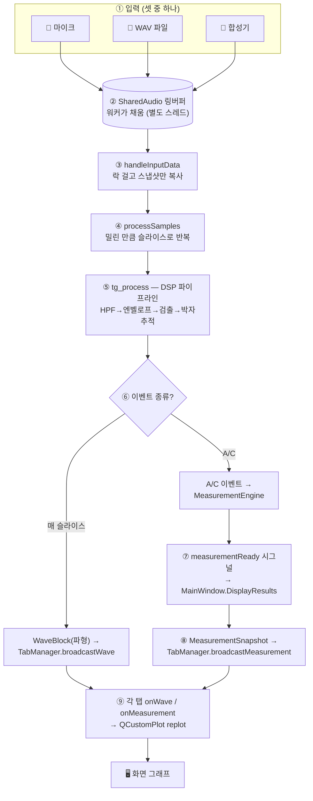
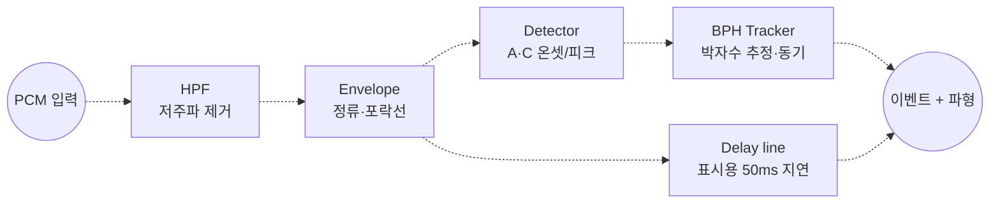
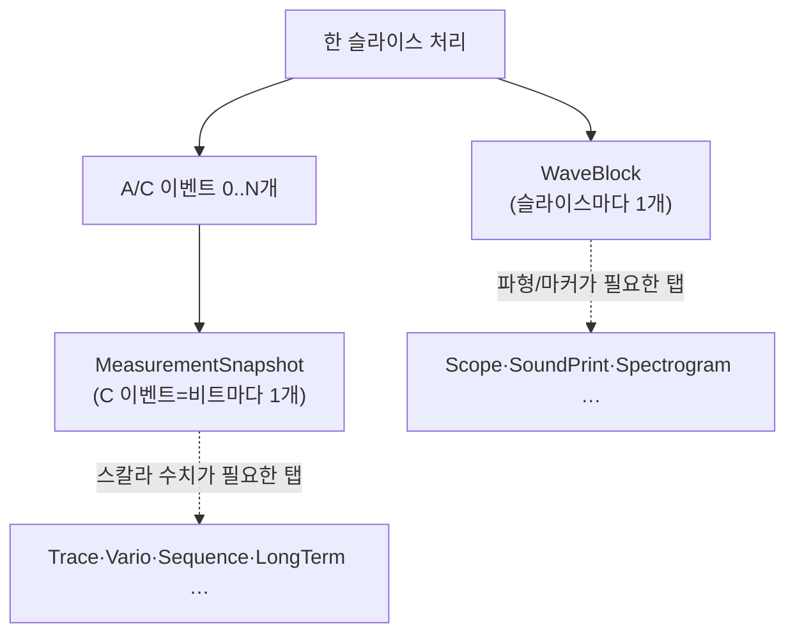
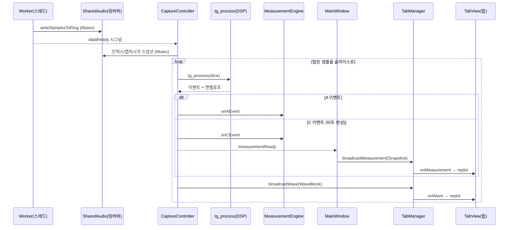
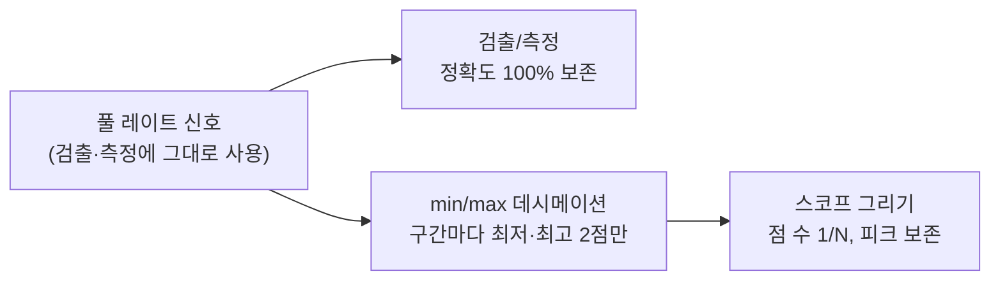
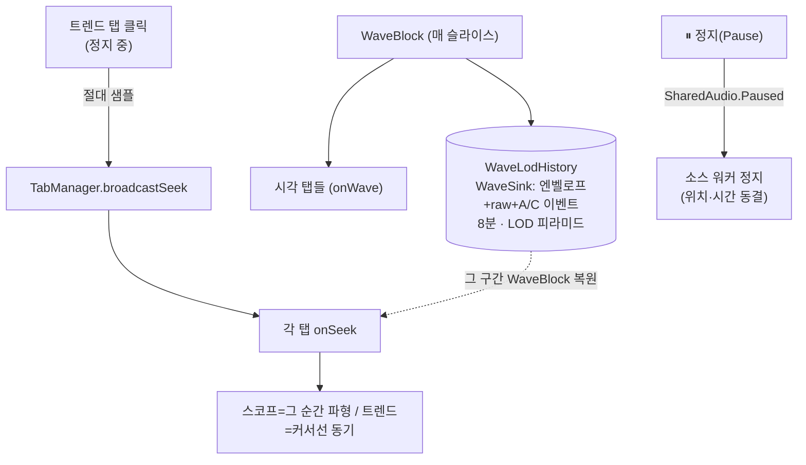

# 신호 → 그래프: 데이터가 흐르는 길

> "마이크에 들어온 소리가 어떻게 화면의 그래프가 되는가?"
> 이 문서는 그 전 과정을 **누구나 따라갈 수 있도록** 단계별 그림과 함께 설명한다.

관련: [아키텍처](ARCHITECTURE.md) · [성능 측정](PERFORMANCE.md) · [문서 인덱스](README.md)

---

## 1. 한눈에 보는 전체 흐름

소리(또는 파일/시뮬)가 들어와 → 링버퍼에 쌓이고 → 메인 스레드가 꺼내서 DSP로 처리하고 →
A(언락)·C(드롭) 이벤트를 찾아 → 측정값과 파형을 모든 탭에 뿌려 → 그래프가 갱신된다.

> ②는 **오디오 워커 스레드**, ③~⑨는 **메인 스레드**에서 일어난다. 둘을 잇는 게 링버퍼다.

---

## 2. DSP 파이프라인 (⑤의 내부)

`tg_process()` 는 입력 PCM을 받아 직렬 필터들을 통과시킨다. 각 단계는 독립적이라
교체·계측이 쉽다(파이프-필터 패턴).

- **HPF**: 마이크 험·저주파 잡음 제거.
- **Envelope**: 충격음의 에너지 포락선을 만들어 검출을 쉽게.
- **Detector**: 포락선에서 A(언락) / C(드롭) 순간을 찾음 (서브샘플 정밀도).
- **BPH Tracker**: 비트 간격으로 시계의 BPH(시간당 비트수)를 추정·동기.
- **Delay line**: 화면에 그릴 파형은 이벤트와 정렬되도록 ~50ms 지연시켜 내보냄.
  (검출은 지연 없는 포락선으로 하므로 타이밍 정확도는 보존된다.)

---

## 3. 두 갈래 데이터: 파형 vs 측정값

⑥에서 흐름이 둘로 갈라진다. 이 둘은 **독립 스트림**이고 1:1이 아니다.

| | `WaveBlock` | `MeasurementSnapshot` |
|---|---|---|
| 빈도 | **슬라이스(≈오디오 청크)마다** | **비트(C 이벤트)마다** |
| 내용 | 엔벨로프 파형, A/C 마커 위치, 원신호 | 보율(s/d), 비트오차(ms), 진폭(°), rate 시리즈 |
| 받는 탭 | 파형/스코프 계열 (`onWave`) | 수치/추세 계열 (`onMeasurement`) |

> 한 `WaveBlock` 안에 이벤트가 없을 수도, 여러 개 있을 수도 있다 → 그래서 두 스트림의
> 개수가 다르다. 탭은 자기에게 필요한 쪽만 구현한다(둘 다 쓰는 탭도 있음).

---

## 4. 시퀀스 — 한 오디오 블록이 처리되는 순간

- 워커는 **시그널**로 메인 스레드를 깨우고(큐 연결), 실제 처리는 메인 스레드에서.
- `measurementReady` 는 **비트가 완성될 때만**(C 이벤트) 나가 저빈도 → UI 갱신 부하↓.
- 파형 브로드캐스트는 **매 슬라이스** → 스코프가 부드럽게 흐른다.

---

## 5. 고샘플레이트에서도 안 멈추는 이유 (데시메이션)

스코프는 샘플 1개당 점 1개를 그린다. 384kHz × 10초 = **384만 점**이면 QCustomPlot 렌더가
사실상 멈춘다. 해결책은 **"검출은 풀 레이트, 그리기만 축소"**:

- `decim = max(1, sampleRate/48000)` (48k→1, 384k→8).
- 한 구간(decim 샘플)에서 **최저·최고 2점만** 찍어 점 수를 줄이되 **날카로운 피크는 보존**.
- x축은 실제 샘플 인덱스라 A/C 마커 정렬도 유지. 48kHz(decim=1)는 원래 동작과 동일.
- 보관은 점 개수가 아니라 **시간 폭(최근 10초)** 으로 잘라 고레이트에서도 점 수가 바운드.

이것은 성능 전술 **"이벤트율 관리(Manage event rate)"** 의 적용이다
([ARCHITECTURE.md §6.3](ARCHITECTURE.md)).

---

## 6. 탭 카탈로그 (요약)

13개 탭은 받는 데이터에 따라 세 부류다.

| 부류 | 입력 | 개수 | 예시 |
|---|---|---|---|
| 수치/추세 | `onMeasurement` 만 | 4 | Trace Display, Vario Stability, Sequence, Long-Term Performance |
| 파형/스코프 | `onWave` 만 | 1 | Spectrogram |
| 혼합 | 둘 다 | 8 | Rate/Scope, Sound Print, Beat-Error Trace, Escapement Analyzer, Waveform Compare, Beat-Noise Scope, Sync-Sweep, Filter Views |

> `onWave` 받는 탭 = 9(파형전용 1 + 혼합 8), `onMeasurement` 받는 탭 = 12(측정전용 4 + 혼합 8).
> 그 중 **자기 `WaveBuffer` 링(0.5~2s)을 가진 탭은 스코프 6개**(Escapement·Filter·Waveform·
> SyncSweep·BeatNoise·Spectrogram). Rate/Scope·SoundPrint·BeatError 는 파형을 받지만 각각
> plot·사운드이미지·이벤트로 따로 보관한다.

새 탭 추가 = `TabView` 상속 클래스 1개 + `MainWindow::RegisterDisplayTabs` 에 등록 1줄.
코어/기존 탭은 건드리지 않는다(개방-폐쇄 원칙).

---

## 7. 일시정지 · 8분 스크롤백 · 교차탭 Seek

위 라이브 흐름과 **나란히**, 들어온 모든 파형을 중앙에 8분 쌓아 두었다가 정지 후 과거를
되짚어 본다. 추가는 무침습이다 — 같은 `broadcastWave` 가 시각 탭과 **이력 버퍼**를 함께 먹인다.

핵심 세 가지:

1. **중앙 이력(WaveLodHistory)** — `TabView` 가 아니라 좁은 `WaveSink`(onWave 1개)로 등록된
   비시각 구독자. 정지와 무관하게 엔벨로프·원신호·A/C 이벤트를 **절대 샘플 좌표**로 8분 누적하고,
   빠른 줌아웃을 위해 min/max **LOD 피라미드**를 같이 만든다.
   (메모리: 엔벨로프 L0 ~92 + raw ~92 + LOD ~26 ≈ **210 MB** @48 kHz — raw 무손실 보관, A안)
2. **전체 정지(full-stop)** — 정지하면 `SharedAudio.Paused` 로 **소스 워커 자체를 멈춘다**.
   playback/sim 은 위치를 보존하고 live 는 캡처분을 버린다. 시간·인덱스가 안 흘러 **resume 시
   정확히 이어진다**(비트 번호·트렌드에 갭 없음 = "비디오 일시정지").
3. **교차탭 Seek** — 정지 중 아무 시계열 탭의 한 점을 클릭하면 그 시점의 절대 샘플을 emit →
   `broadcastSeek`(정지 중에만) 가 전 탭에 전파. 순간 파형 탭은 이력에서 그 구간을 **복원(replay)**
   해 그리고, 트렌드 탭은 커서선만 그 시점으로 옮긴다. 하단 스코프는 드래그로 8분을 스크롤백한다.

> 좌표는 `totalSamples`·이벤트 `sample_index`·`processed_pcm_start_sample` 이 같은 절대 입력샘플
> 도메인이라 탭 간 커서·replay 가 한 점으로 정렬된다. 구조·연결자 속성은
> [ARCHITECTURE.md §5.1](ARCHITECTURE.md) · [CC_VIEW.md 그림 4](CC_VIEW.md) 참고.
