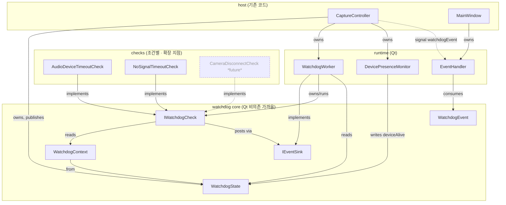
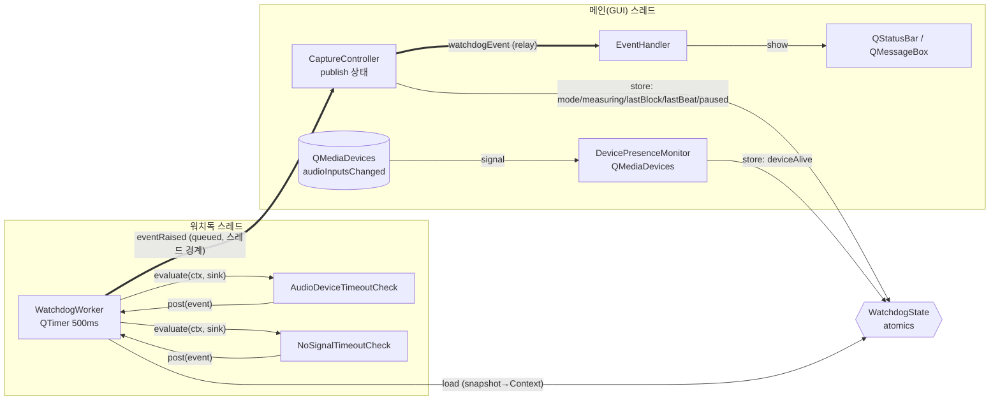
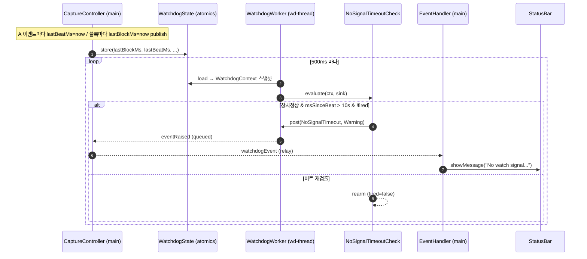
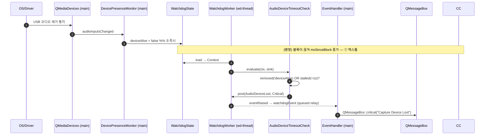

# 워치독 · 이벤트 · 알림 (Watchdog / Event / Notification)

> 측정 중 비정상 상황을 감시(watchdog)해 이벤트를 발생시키고, 사용자에게 알림(Notification)을 띄우는 cross-cutting 서브시스템.
> SOLID 원칙으로 설계해 **새 이벤트가 파일 1개 + 등록 1줄로 추가**되도록 했다.
> 코드: `src/engine/watchdog/` · 배선: `CaptureController` / `MainWindow`.

관련: [RISK-19](../README.md#risk-19) (마이크 분리 감지), [QAS-07](../Requirements/quality-attribute-requirements.md#qas-07--graceful-degradation-and-fault-feedback) (장애 피드백), [QAS-11](../Requirements/quality-attribute-requirements.md#qas-11--microphone-disconnect-user-notification) (마이크 분리 알림 ≤1s), [ADR-002](../ADRs/ADR-002-Adopt%20a%20watchdog%20(timeout)%20for%20microphone-disconnect%20detection.md) (워치독 채택).

---

## 1. 목적과 초기 이벤트

워치독은 측정 파이프라인을 횡단 관찰하며 아래 두 상황을 감지해 알림을 띄운다. (이후 이벤트는 쉽게 추가되도록 설계 — §6)

| 이벤트 | 조건 (Live 측정 중) | severity | 알림 방식 |
|---|---|---|---|
| **AudioDeviceLost** | 측정 장치(USB 오디오) 분리 또는 무응답 | Critical | 모달 `QMessageBox` |
| **NoSignalTimeout** | 장치 정상인데 시계 신호(비트)가 10초 이상 미검출 | Warning | 상태바 메시지 |
| *CameraDisconnect* | (확장 지점 — 카메라 모듈 생기면 사용) | Critical | 모달 |

severity 별 분기는 EventHandler가 담당하며, **이벤트 타입으로 분기하지 않는다**(이벤트가 severity/메시지를 스스로 서술 → OCP).

---

## 2. 구성요소와 책임 (SRP)

| 구성요소 | 책임 | 비고 |
|---|---|---|
| `WatchdogEvent` | 이벤트 값 객체(id·severity·title·message·ts) | 스스로 서술 → 핸들러 무분기 |
| `IWatchdogCheck` | 조건 1개 판정(순수) | 구현 = 이벤트 1종 |
| `WatchdogContext` | 매 틱 읽기전용 상태 스냅샷 | Check 입력(DIP) |
| `IEventSink` | 이벤트 게시 경계 | Check→핸들러 디커플(DIP) |
| `WatchdogState` | 원자적 공유 상태 | 메인 publish / 워치독 read |
| `WatchdogWorker` | 주기 틱·Check 순회·이벤트 릴레이 | 워치독 스레드, IEventSink 구현 |
| `DevicePresenceMonitor` | ② 장치 열거 변화→`deviceAlive` | 메인 스레드, QMediaDevices |
| `EventHandler` | 이벤트→알림 표시(severity 분기) | GUI 스레드 |

검출 조건 객체(Check):
- `AudioDeviceTimeoutCheck` — ①블록 타임아웃 + ②`deviceAlive` 를 **단일 지점**에서 판정(중복 알림 방지).
- `NoSignalTimeoutCheck` — 장치 정상(블록 도착) 전제 하 비트 부재 10초.

---

## 3. Module View (정적 구성 · 의존 방향)

> 의존은 **추상(인터페이스) 방향으로만** 흐른다. Check·Worker 는 UI/엔진을 모른다(DIP). 새 Check 추가가 기존 코드를 건드리지 않는다(OCP).



핵심: `checks` 박스에 객체를 추가해도 화살표 방향이 그대로 — 의존은 항상 `IWatchdogCheck`/`IEventSink`/`WatchdogContext`(추상)로만 향한다.

---

## 4. C&C View ①  — 런타임 구성요소와 연결 (스레드 경계 포함)

> 컴포넌트(런타임 객체)와 커넥터(signal/slot, atomic 공유, 함수호출). **스레드 경계**가 핵심: 워치독은 자기 스레드, 알림은 GUI 스레드, 둘은 큐드 시그널로만 연결.



커넥터 요약:
- **atomic 공유**(`WatchdogState`): 메인이 store, 워치독이 load — 잠금 없음.
- **큐드 시그널**(`eventRaised`→`watchdogEvent`): 워치독 스레드 → 메인 스레드 안전 마샬링.
- **함수 호출**(`evaluate`/`post`): 워치독 스레드 내부.

---

## 5. C&C View ②  — 시퀀스 다이어그램

### 5-1. 정상 틱 + NoSignal(10초 무신호) 발생



### 5-2. USB(오디오 장치) 분리 — ②즉시감지 + ①백스톱



①과 ②가 **같은 AudioDeviceLost 이벤트**로 합쳐지므로 알림은 1회만 뜬다(중복 방지). 표시 지연은 최대 1틱(≤500ms).

---

## 6. 확장 방법 — 새 이벤트 추가 (OCP)

예: 카메라 분리(`CameraDisconnect`).

1. **상태 공급**: 카메라 모듈이 `WatchdogState` 에 liveness publish (예: `cameraPresent`, `lastCameraFrameMs`) — 오디오가 `lastBlockMs` 를 publish 하듯이. `WatchdogContext` 에 같은 필드 노출(가산적 변경).
2. **Check 파일 1개** 추가: `checks/CameraDisconnectCheck.{h,cpp}` — `IWatchdogCheck` 구현, 조건 충족 시 `sink.post({CameraDisconnect, Critical, ...})`.
3. **등록 1줄**: `CaptureController::startWatchdog()` 에 `mWatchdogWorker->addCheck(std::make_unique<CameraDisconnectCheck>());`.

**불변(무수정)**: `WatchdogWorker`(체크 순회만), `EventHandler`(severity 분기만), 기존 Check. → 변경이 신규 파일 + 1줄에 격리(ADR-003 registerTab 과 동일 철학).

---

## 7. 설계 결정 / 제약

- **cross-cutting & 항상 가동**: 워치독 스레드는 `CaptureController` 수명 내내 1개 가동. 세션 시작/정지는 스레드 churn 없이 `WatchdogState.measuring/mode` 갱신으로만 표현 → start/stop 경쟁 제거. 비측정 시 Check 들이 즉시 no-op.
- **시계**: PERF_NOW()는 PERF 비활성 시 0 → 제품 기능에 부적합. 워치독은 항상 동작하는 `std::chrono::steady_clock`(`wdNowMs`) 사용.
- **USB 감지 계층 방어(①+②)**: ②`QMediaDevices`(즉시·정밀·portable, 분리만) + ①블록 타임아웃(원인 불문 백스톱 — 행/프리즈/케이블). 둘을 `AudioDeviceTimeoutCheck` 단일 지점에서 OR 판정 → 중복 알림 없음.
- **스레드 안전**: 공유 상태는 전부 `std::atomic` 스칼라(잠금 없음). 알림 표시는 큐드 시그널로 GUI 스레드에서만.
- **스팸 방지(latch/rearm)**: 각 Check 는 에피소드당 1회만 발생(`mFired`), 조건 해소 시 재무장.
- **정지(pause) 처리**: 전체 정지 시 블록이 안 와도 `paused` 게이트로 오탐 방지. resume 시 `lastBlock/lastBeat` 를 now 로 리셋해 정지 동안의 공백으로 인한 즉시 오탐 차단.
- **Live 전용**: 두 초기 Check 는 `mode==Live` 게이트. Playback/Sim 에서는 무동작.
- **비트=신호**: "시계 신호 검출"의 기준은 A 이벤트(escapement unlock). 10초간 A 이벤트 부재 = 신호 미검출/미동기로 간주.

---

## 8. 파일 맵

```
src/engine/watchdog/
  WatchdogEvent.h            이벤트 값 객체(+ Q_DECLARE_METATYPE)
  IEventSink.h               이벤트 게시 경계(DIP)
  IWatchdogCheck.h           조건 인터페이스(SRP/OCP)
  WatchdogContext.h          읽기전용 상태 스냅샷
  WatchdogState.h            원자적 공유 상태(+ CaptureMode)
  WatchdogClock.h            단조 시계 wdNowMs()
  WatchdogWorker.{h,cpp}     스레드 워커(QTimer·Check 순회·IEventSink·eventRaised)
  DevicePresenceMonitor.{h,cpp}  ② QMediaDevices → deviceAlive
  EventHandler.{h,cpp}       severity 별 알림 표시(GUI)
  checks/
    AudioDeviceTimeoutCheck.{h,cpp}  ①+② 장치 분리/무응답 → Critical
    NoSignalTimeoutCheck.{h,cpp}     10초 무신호 → Warning

배선:
  CaptureController  — WatchdogState publish, 워치독/Presence 소유, watchdogEvent 릴레이
  MainWindow         — EventHandler 생성, watchdogEvent → onEvent 연결
  CMakeLists.txt     — 소스 + include 경로(src/engine/watchdog[/checks])
```

---

## 9. 요약

- **cross-cutting 워치독 스레드**가 500ms마다 상태 스냅샷을 만들어 **조건 객체(Check)** 들에 평가를 위임하고, Check 가 만든 **자기서술 이벤트**를 **EventHandler** 가 severity별로 알림 표시한다.
- **SOLID**: SRP(구성요소 책임 분리) · OCP(새 이벤트=파일1+1줄) · DIP(추상 의존) · ISP(좁은 IEventSink/IWatchdogCheck).
- 초기 이벤트 2종(장치 분리=Critical/모달, 10초 무신호=Warning/상태바), 카메라는 확장 지점으로 문서화.
